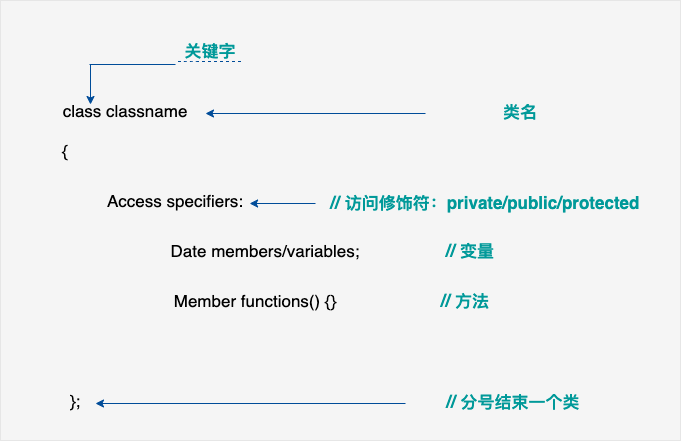

# C++复习特性关键点快速总结

***

## C++类的定义

> 

***

## 访问数据成员

> 类的对象的公共数据成员可以使用直接成员访问运算符==.==来访问。
>
> 为了更好地理解这些概念，可以尝试下面的实例：
>
> ```c++
> #include <iostream>
>  
> using namespace std;
>  
> class Box
> {
>    public:
>       double length;   // 长度
>       double breadth;  // 宽度
>       double height;   // 高度
>       // 成员函数声明
>       double get(void);
>       void set( double len, double bre, double hei );
> };
> // 成员函数定义
> double Box::get(void)
> {
>     return length * breadth * height;
> }
>  
> void Box::set( double len, double bre, double hei)
> {
>     length = len;
>     breadth = bre;
>     height = hei;
> }
> int main( )
> {
>    Box Box1;        // 声明 Box1，类型为 Box
>    Box Box2;        // 声明 Box2，类型为 Box
>    Box Box3;        // 声明 Box3，类型为 Box
>    double volume = 0.0;     // 用于存储体积
>  
>    // box 1 详述
>    Box1.height = 5.0; 
>    Box1.length = 6.0; 
>    Box1.breadth = 7.0;
>  
>    // box 2 详述
>    Box2.height = 10.0;
>    Box2.length = 12.0;
>    Box2.breadth = 13.0;
>  
>    // box 1 的体积
>    volume = Box1.height * Box1.length * Box1.breadth;
>    cout << "Box1 的体积：" << volume <<endl;
>  
>    // box 2 的体积
>    volume = Box2.height * Box2.length * Box2.breadth;
>    cout << "Box2 的体积：" << volume <<endl;
>  
>  
>    // box 3 详述
>    Box3.set(16.0, 8.0, 12.0); 
>    volume = Box3.get(); 
>    cout << "Box3 的体积：" << volume <<endl;
>    return 0;
> }
> ```
>
> 当上面的代码被编译和执行时，它会产生下列结果：
>
> ```c++
> Box1 的体积：210
> Box2 的体积：1560
> Box3 的体积：1536
> ```

***

## C++继承

> 面向对象程序设计中最重要的一个概念是继承。继承允许我们依据另一个类来定义一个类，这使得创建和维护一个应用程序变得更容易。这样做，也达到了重用代码功能和提高执行效率的效果。
>
> 当创建一个类时，您不需要重新编写新的数据成员和成员函数，只需指定新建的类继承了一个已有的类的成员即可。这个已有的类称为==**基类**==，新建的类称为==**派生类**==。
>
> 继承代表了 **is a** 关系。例如，哺乳动物是动物，狗是哺乳动物，因此，狗是动物，等等。
>
> 
>
> 代码如下：
>
> ```c++
> // 基类
> class Animal {
>     // eat() 函数
>     // sleep() 函数
> };
> 
> 
> //派生类
> class Dog : public Animal {
>     // bark() 函数
> };
> ```

***

## 基类&派生类

>一个类可以派生自多个类，这意味着，它可以从多个基类继承数据和函数。定义一个派生类，我们使用一个类派生列表来指定基类。类派生列表以一个或多个基类命名，形式如下：
>
>```c++
>class derived-class: access-specifier base-class
>```
>
>其中，访问修饰符 access-specifier 是 **public、protected** 或 **private** 其中的一个，base-class 是之前定义过的某个类的名称。如果未使用访问修饰符 access-specifier，则默认为 private。
>
>假设有一个基类 **Shape**，**Rectangle** 是它的派生类，如下所示：
>
>```c++
>#include <iostream>
> 
>using namespace std;
> 
>// 基类
>class Shape 
>{
>   public:
>      void setWidth(int w)
>      {
>         width = w;
>      }
>      void setHeight(int h)
>      {
>         height = h;
>      }
>   protected:
>      int width;
>      int height;
>};
> 
>// 派生类
>class Rectangle: public Shape
>{
>   public:
>      int getArea()
>      { 
>         return (width * height); 
>      }
>};
> 
>int main(void)
>{
>   Rectangle Rect;
> 
>   Rect.setWidth(5);
>   Rect.setHeight(7);
> 
>   // 输出对象的面积
>   cout << "Total area: " << Rect.getArea() << endl;
> 
>   return 0;
>}
>```
>
>当上面的代码被编译和执行时，它会产生下列结果：
>
>```c++
>Total area: 35
>```

***

## 访问控制和继承

>派生类可以访问基类中所有的非私有成员。因此基类成员如果不想被派生类的成员函数访问，则应在基类中声明为 private。
>
>我们可以根据访问权限总结出不同的访问类型，如下所示：
>
>| 访问     | public | protected | private |
>| -------- | ------ | --------- | ------- |
>| 同一个类 | yes    | yes       | yes     |
>| 派生类   | yes    | yes       | no      |
>| 外部的类 | yes    | no        | no      |

***

## 继承类型

> 当一个类派生自基类，该基类可以被继承为 **public、protected** 或 **private** 几种类型。继承类型是通过上面讲解的访问修饰符 access-specifier 来指定的。
>
> 我们几乎不使用 **protected** 或 **private** 继承，通常使用 **public** 继承。当使用不同类型的继承时，遵循以下几个规则：
>
> * **公有继承（public）：**当一个类派生自**公有**基类时，基类的**公有**成员也是派生类的**公有**成员，基类的**保护**成员也是派生类的**保护**成员，基类的**私有**成员不能直接被派生类访问，但是可以通过调用基类的**公有**和**保护**成员来访问。
> * **保护继承（protected）：** 当一个类派生自**保护**基类时，基类的**公有**和**保护**成员将成为派生类的**保护**成员。
> * **私有继承（private）：**当一个类派生自**私有**基类时，基类的**公有**和**保护**成员将成为派生类的**私有**成员。

## 多继承

>多继承即一个子类可以有多个父类，它继承了多个父类的特性。
>
>C++ 类可以从多个类继承成员，语法如下：
>
>```c++
>class <派生类名>:<继承方式1><基类名1>,<继承方式2><基类名2>,…
>{
><派生类类体>
>};
>```
>
>其中，访问修饰符继承方式是 **public、protected** 或 **private** 其中的一个，用来修饰每个基类，各个基类之间用逗号分隔，如上所示。现在让我们一起看看下面的实例：
>
>```c++
>#include <iostream>
> 
>using namespace std;
> 
>// 基类 Shape
>class Shape 
>{
>   public:
>      void setWidth(int w)
>      {
>         width = w;
>      }
>      void setHeight(int h)
>      {
>         height = h;
>      }
>   protected:
>      int width;
>      int height;
>};
> 
>// 基类 PaintCost
>class PaintCost 
>{
>   public:
>      int getCost(int area)
>      {
>         return area * 70;
>      }
>};
> 
>// 派生类
>class Rectangle: public Shape, public PaintCost
>{
>   public:
>      int getArea()
>      { 
>         return (width * height); 
>      }
>};
> 
>int main(void)
>{
>   Rectangle Rect;
>   int area;
> 
>   Rect.setWidth(5);
>   Rect.setHeight(7);
> 
>   area = Rect.getArea();
>   
>   // 输出对象的面积
>   cout << "Total area: " << Rect.getArea() << endl;
> 
>   // 输出总花费
>   cout << "Total paint cost: $" << Rect.getCost(area) << endl;
> 
>   return 0;
>}
>```
>
>当上面的代码被编译和执行时，它会产生下列结果：
>
>```c++
>Total area: 35
>Total paint cost: $2450
>```

***

## C++重载运算符和重载函数

> C++ 允许在同一作用域中的某个**函数**和**运算符**指定多个定义，分别称为**函数重载**和**运算符重载**。
>
> 重载声明是指一个与之前已经在该作用域内声明过的函数或方法具有相同名称的声明，但是它们的参数列表和定义（实现）不相同。
>
> 当您调用一个**重载函数**或**重载运算符**时，编译器通过把您所使用的参数类型与定义中的参数类型进行比较，决定选用最合适的定义。选择最合适的重载函数或重载运算符的过程，称为**重载决策**。

***

## C++ 中的函数重载

> 在同一个作用域内，可以声明几个功能类似的同名函数，但是这些同名函数的形式参数（指参数的个数、类型或者顺序）必须不同。您不能仅通过返回类型的不同来重载函数。
>
> 下面的实例中，同名函数 **print()** 被用于输出不同的数据类型：
>
> ```c++
> #include <iostream>
> using namespace std;
>  
> class printData
> {
>    public:
>       void print(int i) {
>         cout << "整数为: " << i << endl;
>       }
>  
>       void print(double  f) {
>         cout << "浮点数为: " << f << endl;
>       }
>  
>       void print(char c[]) {
>         cout << "字符串为: " << c << endl;
>       }
> };
>  
> int main(void)
> {
>    printData pd;
>  
>    // 输出整数
>    pd.print(5);
>    // 输出浮点数
>    pd.print(500.263);
>    // 输出字符串
>    char c[] = "Hello C++";
>    pd.print(c);
>  
>    return 0;
> }
> ```
>
> 当上面的代码被编译和执行时，它会产生下列结果：
>
> ```c++
> 整数为: 5
> 浮点数为: 500.263
> 字符串为: Hello C++
> ```

## C++中的运算符重载

> 您可以重定义或重载大部分 C++ 内置的运算符。这样，您就能使用自定义类型的运算符。
>
> 重载的运算符是带有特殊名称的函数，函数名是由关键字 operator 和其后要重载的运算符符号构成的。与其他函数一样，重载运算符有一个返回类型和一个参数列表。
>
> ```c++
> Box operator+(const Box&);
> ```
>
> 下面的实例使用成员函数演示了运算符重载的概念。在这里，对象作为参数进行传递，对象的属性使用 **this** 运算符进行访问，如下所示：
>
> ```c++
> #include <iostream>
> using namespace std;
>  
> class Box
> {
>    public:
>  
>       double getVolume(void)
>       {
>          return length * breadth * height;
>       }
>       void setLength( double len )
>       {
>           length = len;
>       }
>  
>       void setBreadth( double bre )
>       {
>           breadth = bre;
>       }
>  
>       void setHeight( double hei )
>       {
>           height = hei;
>       }
>       // 重载 + 运算符，用于把两个 Box 对象相加
>       Box operator+(const Box& b)
>       {
>          Box box;
>          box.length = this->length + b.length;
>          box.breadth = this->breadth + b.breadth;
>          box.height = this->height + b.height;
>          return box;
>       }
>    private:
>       double length;      // 长度
>       double breadth;     // 宽度
>       double height;      // 高度
> };
> // 程序的主函数
> int main( )
> {
>    Box Box1;                // 声明 Box1，类型为 Box
>    Box Box2;                // 声明 Box2，类型为 Box
>    Box Box3;                // 声明 Box3，类型为 Box
>    double volume = 0.0;     // 把体积存储在该变量中
>  
>    // Box1 详述
>    Box1.setLength(6.0); 
>    Box1.setBreadth(7.0); 
>    Box1.setHeight(5.0);
>  
>    // Box2 详述
>    Box2.setLength(12.0); 
>    Box2.setBreadth(13.0); 
>    Box2.setHeight(10.0);
>  
>    // Box1 的体积
>    volume = Box1.getVolume();
>    cout << "Volume of Box1 : " << volume <<endl;
>  
>    // Box2 的体积
>    volume = Box2.getVolume();
>    cout << "Volume of Box2 : " << volume <<endl;
>  
>    // 把两个对象相加，得到 Box3
>    Box3 = Box1 + Box2;
>  
>    // Box3 的体积
>    volume = Box3.getVolume();
>    cout << "Volume of Box3 : " << volume <<endl;
>  
>    return 0;
> }
> ```
>
> 当上面的代码被编译和执行时，它会产生下列结果：
>
> ```c++
> Volume of Box1 : 210
> Volume of Box2 : 1560
> Volume of Box3 : 5400
> ```

---

## 可重载运算符/不可重载运算符

>### 下面是可重载运算符/不可重载运算符
>
>下面是可重载的运算符列表：
>
>| 双目算术运算符 | + (加)，-(减)，*(乘)，/(除)，% (取模)                        |
>| -------------- | ------------------------------------------------------------ |
>| 关系运算符     | ==(等于)，!= (不等于)，< (小于)，> (大于)，<=(小于等于)，>=(大于等于) |
>| 逻辑运算符     | \|\|(逻辑或)，&&(逻辑与)，!(逻辑非)                          |
>| 单目运算符     | + (正)，-(负)，*(指针)，&(取地址)                            |
>| 自增自减运算符 | ++(自增)，--(自减)                                           |
>| 位运算符       | \| (按位或)，& (按位与)，~(按位取反)，^(按位异或),，<< (左移)，>>(右移) |
>| 赋值运算符     | =, +=, -=, *=, /= , % = , &=, \|=, ^=, <<=, >>=              |
>| 空间申请与释放 | new, delete, new[ ] , delete[]                               |
>| 其他运算符     | **()**(函数调用)，**->**(成员访问)，**,**(逗号)，**[]**(下标) |
>
>下面是不可重载的运算符列表：
>
>- **.**：成员访问运算符
>- **.\***, **->\***：成员指针访问运算符
>- **::**：域运算符
>- **sizeof**：长度运算符
>- **?:**：条件运算符
>- **#**： 预处理符号

---

## 运算符重载实例

>下面提供了各种运算符重载的实例，帮助您更好地理解重载的概念。
>
>| 序号 | 运算符和实例                                                 |
>| :--- | :----------------------------------------------------------- |
>| 1    | [一元运算符重载](https://www.runoob.com/cplusplus/unary-operators-overloading.html) |
>| 2    | [二元运算符重载](https://www.runoob.com/cplusplus/binary-operators-overloading.html) |
>| 3    | [关系运算符重载](https://www.runoob.com/cplusplus/relational-operators-overloading.html) |
>| 4    | [输入/输出运算符重载](https://www.runoob.com/cplusplus/input-output-operators-overloading.html) |
>| 5    | [++ 和 -- 运算符重载](https://www.runoob.com/cplusplus/increment-decrement-operators-overloading.html) |
>| 6    | [赋值运算符重载](https://www.runoob.com/cplusplus/assignment-operators-overloading.html) |
>| 7    | [函数调用运算符 () 重载](https://www.runoob.com/cplusplus/function-call-operator-overloading.html) |
>| 8    | [下标运算符 [\] 重载](https://www.runoob.com/cplusplus/subscripting-operator-overloading.html) |
>| 9    | [类成员访问运算符 -> 重载](https://www.runoob.com/cplusplus/class-member-access-operator-overloading.html) |

