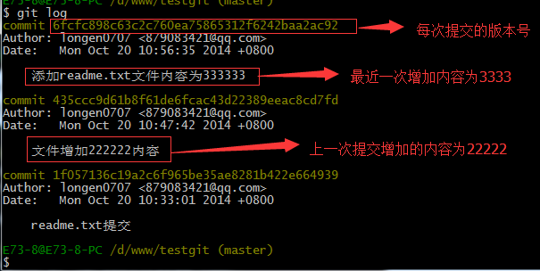
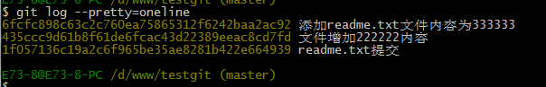

## 理解工作区和暂存区的区别？


工作区：就是你在电脑上看到的目录，比如目录下testgit里的文件(.git隐藏目录版本库除外)。或者以后需要再新建的目录文件等等都属于工作区范畴。
版本库(Repository)：工作区有一个隐藏目录.git,这个不属于工作区，这是版本库。其中版本库里面存了很多东西，其中最重要的就是stage(暂存区)，还有Git为我们自动创建了第一个分支master,以及指向master的一个指针HEAD。

使用Git提交文件到版本库有两步：

第一步：是使用 git add 把文件添加进去，实际上就是把文件添加到暂存区。

第二步：使用git commit提交更改，实际上就是把暂存区的所有内容提交到当前分支上。


## 常用指令

### 设置git用户名和邮箱标识

```sh
git config --global user.name "用户名"
```

```sh
git config --global user.email "你所想绑定的邮箱"
```


### 查看当前git用户信息 

```sh
git config user.name  #查看用户名称 
git config user.email #查看用户邮箱
```


### 初始化仓库

```shell
git init
```

### 增加文件到暂存区

```shell
git add 文件.后缀
```

```sh
git add .  #指的当前目前下所有文件
```


### 把文件提交到本地仓库

```sh
git commit -m "这里填写本次提交的注释"
```


### 查看是否还有文件未提交

```sh
git status
```


### 查看文件对比上次提交修改了什么内容

```sh
git diff 文件
```


### 查看commit日志

```sh
git log
```




git log命令显示从最近到最远的显示日志，我们可以看到最近三次提交，最近的一次是,增加内容为333333.上一次是添加内容222222，第一次默认是 111111.如果嫌上面显示的信息太多的话，我们可以使用命令 git log –pretty=oneline 演示如下：





### commit版本回退

#### 回退前几个版本

```sh
git reset --hard HEAD^
```

如果是退回到上上个版本那么只需要多加个^即可,其他也依次类推，比如：

```sh
git reset --hard HEAD^^
```

当然，如果回退的版本太多的话，可以这么写：

```sh
git reset --hard HEAD~100  #这里表示回退到前100个版本
```


#### 按照版本号回退

```sh
git reset --hard 版本号 #注意这里版本号可以不用写全，可以只写前面7个或以上，反正不会和其他版本产生歧义就行
```

有2种情况，如下：

1.readme.txt自动修改后，还没有放到暂存区，使用 撤销修改就回到和版本库一模一样的状态。
2.另外一种是readme.txt已经放入暂存区了，接着又作了修改，撤销修改就回到添加暂存区后的状态。


### 撤销修改和删除文件操作

```sh
git checkout -- 文件名称
```


### 绑定远程仓库

第一步：

``` sh
ssh-keygen -t rsa -C "对应你的账号邮箱"
```

创建好之后可以去C盘下的User目录对应用户账号的.ssh里面看到相应创建

其中

> id_ras是私钥，这玩意不泄露出去
>
> id_ras.pub是公钥，可以放心告诉其他任何人

第二步：登录github,打开” settings”中的SSH Keys页面，然后点击“Add SSH Key”,填上任意title，在Key文本框里黏贴id_rsa.pub文件的内容。


### 取消绑定远程仓库

```sh
git remote remove origin #这个origin是绑定时候的仓库标签别名
```


### 创建分支并进入

```sh
git checkout -b dev #这里指的是创建一个名为dev的分支
```

> git checkout 命令加上 –b参数表示创建并切换，相当于如下2条命令
>
> git branch dev
>
> git checkout dev


### 查看当前分支

```
git branch
```


### 合并分支

第一步：

比如这里切换到master分支

```sh
git branch master
```

第二步:

```sh
git merge dev
```

> git merge命令用于合并指定分支到当前分支上
>
> 合并之后，我们可以看到，和dev分支最新提交的是完全一样的。
>
> 合并完成之后，我们可以接着删除dev分支了，操作如下：
>
> ```sh
> git branch -d dev #删除dev分支
> git branch #查看当前分支
> ```
>
> 

### 修改分支名称（重命名分支名称）

```sh
git branch -m oldName newName
```


### 删除分支

1、删除本地分支

```sh
git branch -d <localBranchName> #localBranchName就是本地分支的名称
```


2、删除远程分支

```sh
git push -u origin -d <branchName>  #<branchName>就是分支的名称
```

> 其中==-d==是==-delete==的缩写


### Git 拉取远程分支代码并合并到本地分支步骤

```shell
git remote -v #查看远程
#获取远程指定分支到本地临时新建的分支
#获取远程master的分支的代码到临时新建的temp
git fetch origin master:temp
#查看版本差异
#查看temp分支与当前分支的差异
git diff temp
#将临时分支temp合并到当前分支
git merge temp
#删除本地临时分支
git branch -d temp
```

#### 不在本地新建分支版本：

```shell
#查看远程
git remote -v
#获取远程分支到本地
#获取远程的master分支
git fetch origin master
#查看版本差异
#查看远程master分支与本地master分支的差别
git log -p master..origin/master
#合并到本地分支
git merge origin/master
```

#### 他奶奶的直接拉取合并（不推荐用，万一出岔子自己负责）

```shell
#查看远程分支
git remtoe -v
#拉取合并到本地分支,因为pull实际上就是fetch和merge的结合体
#拉取远程master分支合并到当前分支
git pull origin master
```


## 如果遇到大文件想要删除，或者想删除所有commit中的指定文件

[Git无法上传删除 Commit里面有大文件_git 删除commit的大文件-CSDN博客](https://blog.csdn.net/LoveFHM/article/details/131563696)