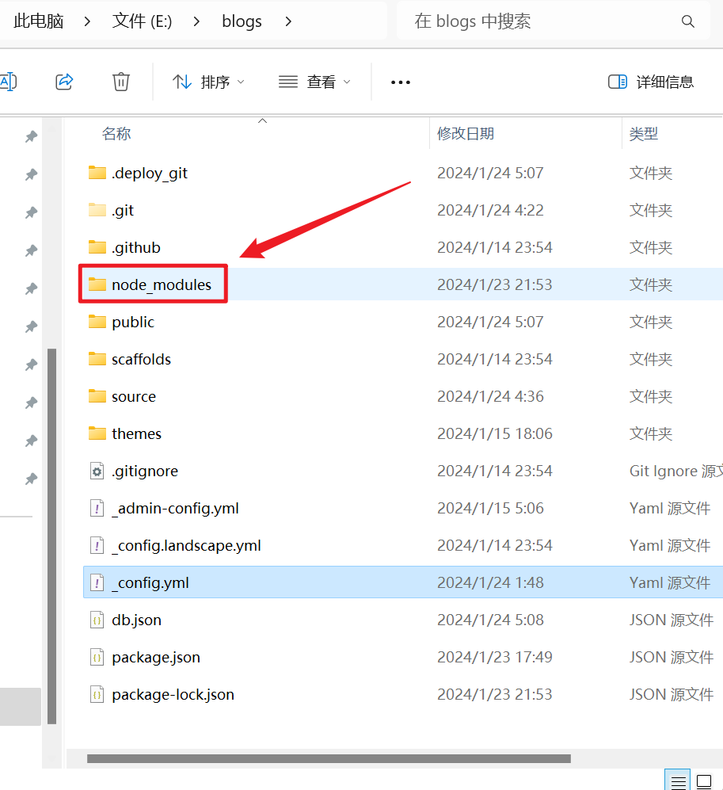

# 解决Hexo+Typora无法同时显示相对路径图片问题

---


## 一、设置Typora

---

设置如下图：


## 二、安装和简单魔改hexo-asset-image插件

在hexo项目根目录使用指令安装`hexo-asset-images`插件

```shell
npm hexo-asset-images --save
```

或者：

```shell
npm install https://github.com/CodeFalling/hexo-asset-image --save
```

然后设置hexo项目根目录`_config.yml`配置:


然后设置`_config.yml`中的`post_asset_folder`配置属性为true


这是正常的配置流程，但是！！！！！！！！！！！！！！！！！！

==注：==这里`hexo-asset-images`有个bug，就是你打包笔记之后会发现他会直接把你的对应相对路径的图片文件夹名称给忽略掉。

比如，我写一个笔记，Test.md，然后我在里面粘贴了一张`xxx.png`图片，那么通过我之前Typora的设置，那么他会自动在与笔记文件同级目录下新建一个与文件名称相同的目录并在这个目录下再新建一个images文件夹（也就是Test/images/xxx.png)然后会自动把我刚才复制的图片自动复制存到这个目录下面，并且这个md的引用路径也是相对于这个图片的相对路径。但是我们在编译的时候这个插件会忽略掉这个`Test`路径变成类似于`images\xxx.png`的路径，而且我们md内的引用路径并没有变，路径引用任然是`Test/images/xxx.png`所以，当我们用网站打开时任然无法查看（不得不说，这插件设计的确实太不合理了）。


所以，为了解决这个问题，只能改插件的源码。


首先找到 `/node_modules/hexo-asset-image/index.js` 这个文件：



然后将它的内容替换为如下内容：

```js
'use strict';
var cheerio = require('cheerio');
     
// http://stackoverflow.com/questions/14480345/how-to-get-the-nth-occurrence-in-a-string
function getPosition(str, m, i) {
  return str.split(m, i).join(m).length;
}
     
var version = String(hexo.version).split('.');
hexo.extend.filter.register('after_post_render', function(data){
  var config = hexo.config;
  if(config.post_asset_folder){
       var link = data.permalink;
   if(version.length > 0 && Number(version[0]) == 3)
      var beginPos = getPosition(link, '/', 1) + 1;
   else
      var beginPos = getPosition(link, '/', 3) + 1;
   // In hexo 3.1.1, the permalink of "about" page is like ".../about/index.html".
   var endPos = link.lastIndexOf('/') + 1;
    link = link.substring(beginPos, endPos);
     
    var toprocess = ['excerpt', 'more', 'content'];
    for(var i = 0; i < toprocess.length; i++){
      var key = toprocess[i];
      
      var $ = cheerio.load(data[key], {
        ignoreWhitespace: false,
        xmlMode: false,
        lowerCaseTags: false,
        decodeEntities: false
      });
     
      $('img').each(function(){
       if ($(this).attr('src')){
           // For windows style path, we replace '\' to '/'.
           var src = $(this).attr('src').replace('\\', '/');
           if(!/http[s]*.*|\/\/.*/.test(src) &&
              !/^\s*\//.test(src)) {
             // For "about" page, the first part of "src" can't be removed.
             // In addition, to support multi-level local directory.
             var linkArray = link.split('/').filter(function(elem){
               return elem != '';
             });
             var srcArray = src.split('/').filter(function(elem){
               return elem != '' && elem != '.';
             });
             if(srcArray.length > 1)
               srcArray.shift();
             src = srcArray.join('/');
             $(this).attr('src', config.root + link + src);
             console.info&&console.info("update link as:-->"+config.root + link + src);
           }
       }else{
           console.info&&console.info("no src attr, skipped...");
           console.info&&console.info($(this));
       }
      });
      data[key] = $.html();
    }
  }
});
```

如果没效果的话可以试试下面另一个改版：

```js
'use strict';
var cheerio = require('cheerio');
     
// http://stackoverflow.com/questions/14480345/how-to-get-the-nth-occurrence-in-a-string
function getPosition(str, m, i) {
  return str.split(m, i).join(m).length;
}
     
var version = String(hexo.version).split('.');
hexo.extend.filter.register('after_post_render', function(data){
  var config = hexo.config;
  if(config.post_asset_folder){
       var link = data.permalink;
       console.info("debugTest-> "+link)
   if(version.length > 0 && Number(version[0]) == 3)
      var beginPos = getPosition(link, '/', 1) + 1;
   else
      var beginPos = getPosition(link, '/', 3) + 1;
   // In hexo 3.1.1, the permalink of "about" page is like ".../about/index.html".
   var endPos = link.lastIndexOf('/') + 1;
    link = link.substring(beginPos, endPos);
     
    var toprocess = ['excerpt', 'more', 'content'];
    for(var i = 0; i < toprocess.length; i++){
      var key = toprocess[i];
      
      var $ = cheerio.load(data[key], {
        ignoreWhitespace: false,
        xmlMode: false,
        lowerCaseTags: false,
        decodeEntities: false
      });
     
      $('img').each(function(){
       if ($(this).attr('src')){
           // For windows style path, we replace '\' to '/'.
           var src = $(this).attr('src').replace('\\', '/');
          //  console.info(src);
           
           var srcSplit=src.split('/images/');
          if(srcSplit.length<1) return; //如果图片文件长度不符合规范则直接return

          //判断是否为本地src资源
          if(srcSplit[srcSplit.length-1].includes(config.url.replaceAll("http://","").replaceAll("https://",""))){
            $(this).attr('src', "/"+config.root + srcSplit[srcSplit.length-1].replaceAll("http://","").replaceAll("https://",""));
            console.info&&console.info("update link as:-->"+"/"+srcSplit[srcSplit.length-1].replaceAll("http://","").replaceAll("https://",""));
          }else{
            $(this).attr('src', config.root + link +"images/"+ srcSplit[srcSplit.length-1]);
            console.info&&console.info("update link as:-->"+config.root + link +"images/"+ srcSplit[srcSplit.length-1]);
          }
       }else{
           console.info&&console.info("no src attr, skipped...");
           console.info&&console.info($(this));
       }
      });
      data[key] = $.html();
    }
  }
});
```


然后就可以解决无法同时在 Typora 和 Web 上看到图片的问题了。
