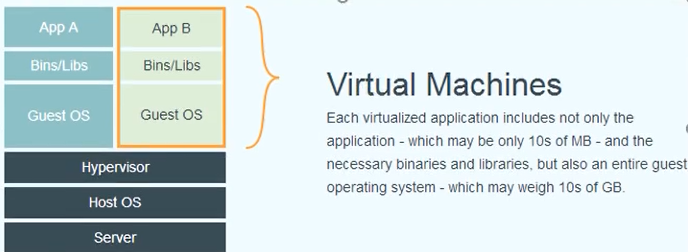
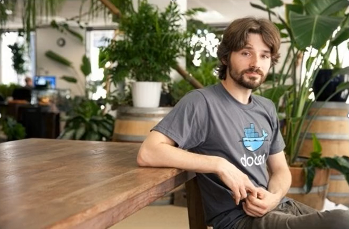
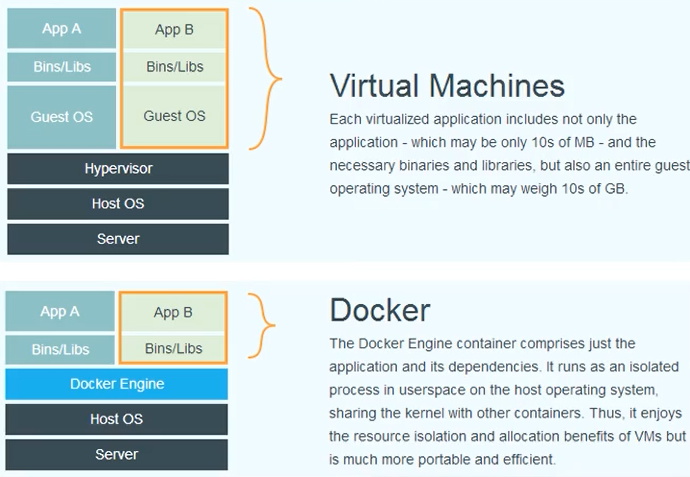
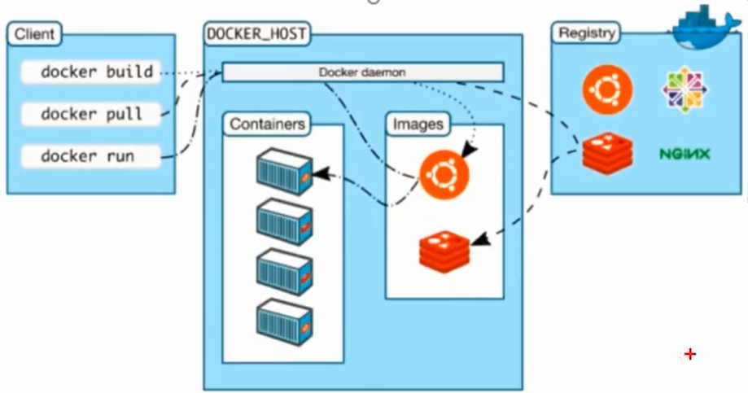
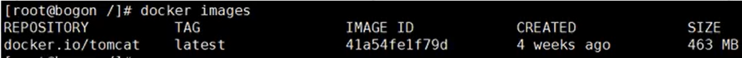
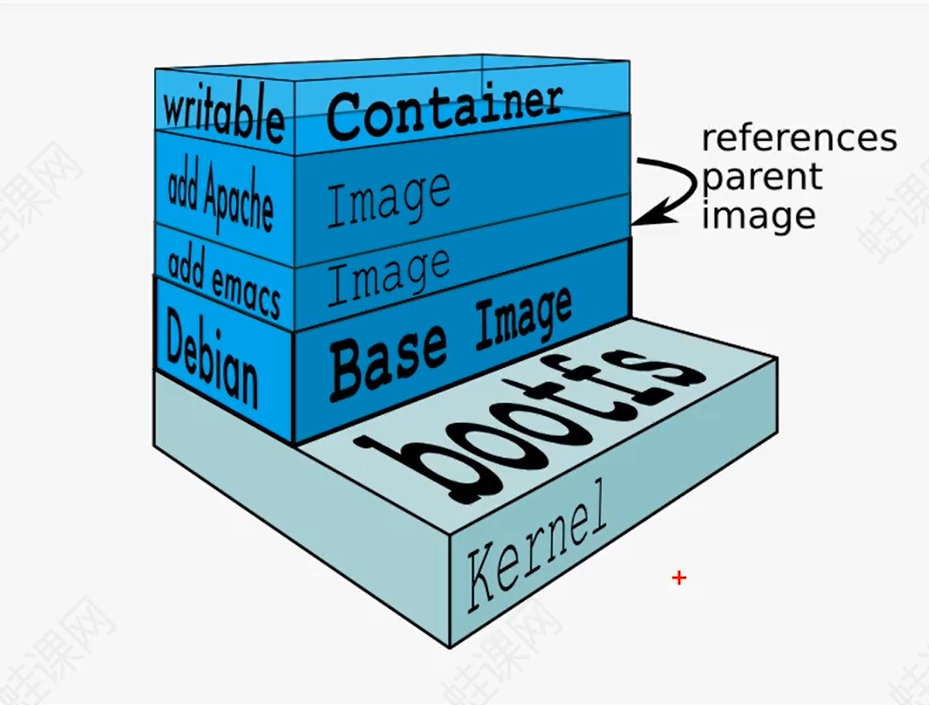

# 第一章 Docker概述

---


## 1.1虚拟化技术发展史

---

在虚拟化技术出现之前，如果我们想搭建一台服务器，我们需要做如下的工作：

* 购买一台硬件服务器；
* 在硬件服务器上安装配置操作系统；
* 在操作系统之上配置应用运行环境；
* 部署并运行应用；

这种方式的缺点就是：

* 部署应用非常慢；
* 需要花费的成本非常高（时间成本、服务器成本）；
* 应用迁移麻烦；要将应用迁移，又得重复部署应用的过程：购买服务器->安装操作系统os->配置运行环境->部署应用

所以，为了解决这个问题，后续出现 了虚拟化技术。


## 1.2 虚拟化技术是什么？

---

虚拟化（英文：Virtualization）是一种计算机资源管理技术，是将计算机的各种硬件资源，比如服务器、网络、CPU、内存及存储等，予以抽象和转换后呈现出一套新的硬件资源环境，在这一套新的硬件环境下可以安装我们的操作系统，部署我们的应用运行环境等，它打破计算机硬件资源不可切割的障碍，使我们可以比原本的计算机硬件资源结构更好的方式来组合应用这些资源。


## 1.3  虚拟化技术的分类

虚拟化一般分为：

硬件虚拟化（hardware-level-virtualization）

操作系统级虚拟化（os-level-virtualization）


硬件级虚拟化  是运行在硬件上的虚拟化技术，它的核心技术是Hypervisor，Hypervisor是一种运行在基础物理服务器硬件之上的软件层，可以虚拟化硬件资源，例如cpu、硬盘、内存资源等。然后我们可以通过在虚拟化出来的资源之上安装操作系统，这也就是所谓的虚拟机。像VMWare，VirtualBox等都是使用该技术，我们经常使用的桌面版的虚拟机VMWare就是采用这种虚拟化技术。

如下图所示：



通过Hypervisor层，我们可以创建不同的虚拟机，并且每个虚拟机都是分离、独立的，这样一来，我们就可以在一台硬件服务器和本地操作系统之上虚拟化出多个服务器，用来部署我们的应用；


## 1.4 虚拟化技术的优缺点

### 虚拟化技术的优点：

一台物理服务器可以虚拟化出多个虚拟的服务器，让计算机资源得以充分利用；


### 虚拟化技术的缺点：

1、每创建一个虚拟机的时候，都会创建一个操作系统，这个操作系统会占用很多资源，这样无疑大大添加了资源的消耗，当安装的虚拟机越多，资源消耗就越多。

2、环境兼容问题，开发时的环境运行正常，部署到虚拟化环境测试则可能发生错误；


## 1.5 容器技术的发展

基于硬件级虚拟化技术的缺点和不足，后学又发展出来了另一种虚拟化技术，即操作系统级虚拟化技术；

操作系统级虚拟化 是运行在操作系统之上的虚拟化技术，它模拟的是运行在一个操作系统上的多个不同进程，并将其封装在一个密闭的容器里面，该技术也称为容器化技术。

在容器化技术领域，Docker是目前最流行的一种实现。Docker发布于2013年，Docker基于LXC技术，LXC是Linux平台上的容器化技术实现。

注：LXC是Linux Container的简写，它是一种内核虚拟化技术，可以提供轻量级的虚拟化，以便隔离进程的资源，它与宿主机使用同一个内核，性能损耗小，这种技术是Linux提供的，但是直到Docker出世，该技术才被发挥出来。


## 1.6 Docker的发展历史 

2010年，几个年轻人创业公司，起名为dotCloud，并且还获得了创业孵化器Y Combinator的支持，虽然dotCloud期间获得过一些融资，但随着IT巨头（微软、谷歌、亚马逊等）也杀入PaaS平台，dotCloud举步维艰。

2013年，dotCloud创始人，28岁的Solomon Hykes做了一个艰难的决定：将dotCloud的核心引擎开源，这项引擎技术能够将Linux容器中的应用代码打包，轻松的在服务器之间迁移。

然而这个基于LXC（Linux Container）技术的核心管理引擎开源后，让全世界的技术人员感到惊艳，感叹这一切太方便了......。也正是dotCloud的创始人这个艰难的孤注一掷的决定让所有的IT巨头们也为之一颤。



Docker创始人Solomon Hykes（Docker之父）


从2013年Docker开源开始，Docker技术风靡全球，于是dotCloud公司决定将Docker作为主要业务进行发展，并把公司改名为DockerInc，全身心投入到Docker的开发中，并于2014年8月，Docker宣布把PaaS（Platform as a Service，平台及服务）业务dotCloud出售给位于德国柏林的同样专注于即服务业务的提供商cloudControl，从此Docker可以轻装上阵，专注于Docker的研发。

从2013年2月决定开源，到2013年3月20日发布Docker 0.1，只用了一个月时间。当前Docker的最新版本是18.03；

Docker迅速成长，在2014年6月9日，Docker团队宣布Docker1.0,1.0版本标志着Docker平台已经足够成熟，并可以被应用到生产产品中（还提供了一些需要付费的支持选项）。

一年的时间，使一个围绕着Docker的小型初创企业生态体系逐渐形成。Docker先后赢得了Google、微软、Amazon、VMware等IT巨头的青睐，他们纷纷表示将保证自己平台与Docker容器技术的兼容性。

2016年2月29日，CloudControl公司在其官方微博中宣告即将破产，隶属于cloudControl公司的dotCloud也宣布将于2月29日关闭服务。作为Docker的前身，DotCloud目睹Docker的成长，成为云平台的一颗新星，而自己却力不从心，Docker的繁荣间接地导致Docker的前身dotCloud在PaaS平台的衰败，兴衰成败，令人唏嘘不已，这也许是颠覆式创新的经典案例。


## 1.7 Docker是什么

1、Docker是一个开源的应用容器引擎，它基于Google公司推出的Go语言实现，项目代码托管在GitHub上进行维护；

https://github.com/docker/docker-ce

2、Docker技术让开发者可以打包他们的应用以及依赖包到一个可移植的容器中，打包好的容器可以发布到任何流行的Linux服务器上运行，这样就可以解决开发环境与运维环境不一致的问题，所以容器化技术解决了开发和运维之间的矛盾，让开发专注于开发，让运维专注于运维，不要被环境问题所打扰；

3、Docker彻底释放了虚拟化的威力，极大降低了计算机资源供应的成本，Docker重新定义了程序开发测试、交付和部署过程，Docker提出了“构建一次，到处运行”的概念，让应用的开发、测试、部署和分发都变得前所未有的高效和轻松！

4、Docker是一种轻量级的操作系统虚拟化解决方案，Docker的基础是Linux容器（LXC）技术，在LXC的基础上Docker进行了进一步的封装，让用户不需要去关心容器的管理，使得操作更为简便。用户操作Docker的容器就像操作一个快速轻量级的虚拟机一样简单；Docker自开源后受到广泛的关注，Docker最早是基于Ubuntu开发的，但后续CnetOS、Debian、Fedora等主流的Linux操作系统都支持Docker；


### 总结：

简单地说，Docker是对软件和其依赖环境的标准化打包，应用之间相互隔离，共享一个OS Kernel（解决了资源浪费的问题），可以运行在很多主流操作系统上；

但是也需要澄清一下，Docker本身不是容器，Docker只是管理容器的引擎。


## 1.8 容器和虚拟机的区别

容器是将代码和环境的关系打包在一起的一个集合，而虚拟机是在物理层面上，分出来的一个操作系统；

多个容器可以运行在同一台物理服务器上，并共享一个操作系统的内核资源。多个虚拟机也可以运行在同一台机器上，但每个虚拟机都需要一个完整的操作系统；

下图比较了Docker和传统虚拟化方式的不同之处：



可见容器时在本地操作系统层面上实现虚拟化，直接复用本地主机的操作系统，不需要单独安装操作系统，而传统的虚拟化技术方式则需要单独安装每个虚拟机的操作系统。

| 特性       | 容器               | 虚拟机                 |
| ---------- | ------------------ | ---------------------- |
| 启动       | 秒级               | 分钟级                 |
| 硬盘控件   | 一般为几十MB       | 一般为10GB             |
| 性能       | 接近原生           | 弱于原生               |
| 系统支持量 | 单机支持上千个容器 | 一般几十个             |
| 操作系统   | 与宿主机共享OS     | 宿主机OS上运行虚拟机OS |


## 1.9为什么使用Docker

作为一种新兴的虚拟化技术，Docker跟传统的虚拟化方式相比具有众多的优势。

1、Docker容器的启动可以在秒级实现，这相比传统方式要快得多。

2、Docker对系统资源的利用率很高，一台主机上可以同时运行数千个Docker容器。

3、容器除了运行其中的应用外，基本不消耗额外的系统资源，使得应用的性能很高。传统虚拟机方式运行方式运行10个完全不同的应用可能我们会起10个虚拟机来部署，而Docker只需要启动10个隔离的应用即可。

4、Docker可以更快速的交付和部署，大量地节约开发、测试、部署的时间，对开发者和运维人员来说，最希望的就是一次创建或配置，可以在任意地方正常运行。

5、更高效的虚拟化，Docker容器的运行不需要额外的Hypervisor支持，它是内核级的虚拟化，因此可以实现更高的性能和效率。

6、更轻松的迁移和扩展，Docker容器几乎可以在任意的平台上运行，包括物理机、虚拟机、公有云、私有云、个人电脑、服务器等，这种兼容性可以让用户轻松地把一个应用程序从一个平台直接迁移到另一个平台。


# 第二章 Docker环境搭建

---


## 2.1 Docker的版本

---

Docker从2013年3月20日发布Docker0.1，到现在已经发布了多个版本，从2017年3月开始docker在原来的基础上分为两个分支版本：Docker CE 和Docker EE。

Docker CE即社区免费版，可永久免费使用；

Docker EE 即企业版，功能更全，更强调安全，但需要付费使用；

本课程介绍Docker CE版本，目前Docker版本为18.03

Docker 官方网站：https://www.docker.com/


## 2.2 Docker的安装

首先，我们知道Docker并不是容器，它是一个管理容器的引擎。

我们课程采用的Linux版本是CentOS7，学习Docker也更推荐在Linux环境下使用；

Docker支持CentOS及以后的 版本；

CentOS7系统可以直接通过yum进行安装：

### 安装前可以查看一下系统是否已经安装了Docker：

```shell
yum list installed | grep docker
```

### 安装：

```shell
yum install docker -y
```

### 查看Docker版本（可用于查看是否安装成功）:

```shell
docker -version (docker version,docker -v)
```

### 卸载：

```shell
yum remove docker -v
```


## 2.3 Docker服务启动

---

安装之后Docker服务；

启动：systemctl start docker 或者  service docker start

停止：systemctl stop docker 或者 service docker stop

重启： systemctl restart docker 或者 service docker restart

检查docker进程的运行状态：

systemctl status docker 或者 service docker status

查看docker进程：ps -ef | grep docker


## 2.4 Docker服务

---

docker info 查看docker系统信息

docker 查看所有的帮助信息

docker commond -help 查看某个commond命令的帮助信息。


## 2.5 Docker使用初体验

---


## 2.5.1 Docker的运行机制

---

我们知道Docker并不是容器，而只是一个管理容器的引擎；

Docker的底层运行原理：

Docker服务启动->下载镜像->启动该镜像得到一个容器->容器里面运行着我们想要的程序；




## 2.5.2 第一个Docker容器

根据Docker的运行机制，我们将按照如下步骤运行第一个Docker容器；

1、将Docker服务启动；

2、下载一个镜像，Docker运行一个容器前需要本地存在有对应的镜像，如果镜像不存在本地，Docker会从镜像仓库下载（默认是Docker Hub公共注册服务器中的仓库https://hub.docker.com）。

从docker hub官网搜索要使用的镜像，比如docker search tomcat进行搜索，然后下载所需要的镜像：

### 下载镜像：

```shell
docker pull tomcat
```

### 运行镜像（前台运行）：

```shell
docker run tomcat
```

### 要后台运行，加参数 -d：

```shell
docker run -d tomcat
```

### 运行时并映射到对应Linux端口（前面为Linux端口，后面为镜像端口）

```shell
docker run -d -p 8080:8080 tomcat
```


显示本地已有的镜像：docker images



在列出信息中，可以看到几个字段信息

REPOSITORY：来自于 哪个仓库，比如 docker.io/tomcat

TAG：镜像的标记，比如latest

IMAGE ID：镜像的ID号（唯一）

CRATED：创建时间

SIZE：镜像大小

3、启动下载下来的镜像得到一个容器：


## 2.5.3 进入Docker容器

---

进入容器：docker exec -it cef0d139bfd6 bash

其中i表示交互式的，也就是保持标准输入流打开；

t表示虚拟控制台，分配到一个虚拟控制台；

退出容器：exit


## 2.5.4 客户机访问容器

---

从客户机上访问容器，需要有端口映射，docker容器默认采用桥接模式与宿主机通信，需要将宿主机的ip端口映射到容器的ip端口上；

停止容器：docker stop 容器ID/名称

启动容器：docker run -d -p 8080:8080 docker.io/tomcat 或者 41a54fe1f79d

# 第三章 Docker核心组件

---


## 3.1 Docker 架构

---

Docker使用客户端-服务器（C/S）架构模式，使用远程 API 来管理和创建Docker容器。


Docker容器通过Docker镜像来创建。

镜像与容器的关系类似于面向对象编程中的类与对象的关系。

| Docker | 面向对象 |
| ------ | -------- |
| 镜像   | 类       |
| 容器   | 对象     |


## 3.2 Docker 核心要素

---

Docker包括三个核心要素

镜像（Image）、容器（Container）、仓库（Repository）

理解了这三个概念，就了解了Docker的整个 生命周期。

Docker的运行离不开以上核心几个组件的支持，Docker的成功也是拜这几个组件所赐。

有人会误以为，Docker就是容器，但Docker不是容器，而是管理容器的引擎。


## 3.3 镜像

---

Docker镜像就是一个只读的模板，可以用来创建Docker容器。

例如：一个镜像可以包含一个完整的CentOS操作系统环境，里面仅安装了MySql或用户需要的其它应用程序。

Docker提供了一个非常简单的机制来创建镜像或者更新现有的镜像，用户甚至可以直接从其他人那里下载一个已经做好的镜像来直接使用。


## 3.3.2 镜像的组成结构

---

镜像是由许多层的文件系统叠加构成的，最下面是一个引导文件系统bootfs，第二层是一个root文件系统rootfs，root文件系统通常是某种操作系统，比如centos、Ubuntu，在root文件系统之上又有很多层文件系统，这些文件系统叠加在一起，构成docker中的镜像；




## 3.3.3 镜像的日常操作

---

1、下载镜像，比如下载redis镜像：docker pull redis:latest

redis是查询到的镜像名称，latest是镜像的标签tag

安装一个镜像有两种方式，一种格式从官方镜像仓库下载，一种是自己通过dockerfile文件构建。

如果有官方镜像，我们就不必自己用dockerfile文件构建了，除非官方没有才会自己去dockerfile文件构建；

2、列出已经下载的镜像：docker images，或者 docker images redis

3、运行镜像：docker run -d redis 其中-d表示在后台运行

4、查看容器镜像的状态：docker ps

通过 docker exec | a8584016f9b6(镜像ID) bash 进入 reids容器

5、删除镜像 docker rmi redis:latest  注意是rmi，不是rm，rm是删除容器；

6、强制删除镜像 docker rmi -f redis:latest

7、查看本地所有的镜像 docker images


## 3.4 容器

---


## 3.4.1容器的最基本概念

---

容器是从镜像创建的运行实例。它可以被启动、停止、删除。每个容器都是相互隔离的、保证安全平台。可以把看做一个简易版的Linux环境，包括root用户权限、进程控件、用户空间和网络空间和运行在其中的应用程序。

Docker利用容器来运行引用，镜像是只读的 ，容器在启动的时候创建一层可写层作为最上层。  


## 3.4.2 容器的日常操作

启动容器有两种方式，一种是基于镜像创建一个容器并启动，另一个是将在终止状态的容器重新启动。

通过镜像启动容器：docker run -d redis

查看运行中的容器：docker ps

查看所有的容器：docker ps -a

停止容器：docker stop 容器id或容器名称

开启容器：docker start 容器id或容器名称

因为Docker的容器实在太轻量级了，很多时候用户都是随时删除和新创建容器。

删除容器：docker rm 容器id或容器名称

删除容器时，容器必须是停止状态，否则会报错；

进入容器：docker exec -it 容器id或容器名称 bash

停止容器：docker stop 容器id或容器名称

已经停止的容器，我们可以使用命令docker start 来启动。

开启容器：docker start 容器id或容器名称

还可以使用 docker inspect + 容器id或容器名称 查看容器的更多信息；

停用全部运行中的容器：docker stop $(docker ps -q)

删除全部容器：docker rm $(docker ps -aq)

一条命令实现停用并删除容器：

docker stop \$(docker ps -q) & docker rm -f $(docker ps -aq)


## 3.5 仓库

---


## 3.5.1 仓库的基本概念

仓库是集中存放镜像文件的场所，有时候会把仓库和仓库注册服务器（Registry）看做同一事务，并不严格区分。实际上，仓库注册服务器上往往存放着多个仓库，每个仓库中又包含了多个镜像，每个镜像有不同的标签（tag）；

仓库分为公开仓库（Public）和私有仓库（Private）两种形式；

最大的公开仓库是Docker Hub（https://hub.docker.com/)，存放了数量庞大的镜像供用户下载 ；

当然，用户也可以在本地网络内创建一个私有仓库；

当用户创建了一个自己的镜像之后就可以使用push命令将它上传到共有或者私有仓库，这样下次在另外一台机器上使用这个镜像时候，只需要从仓库上pull下来即可；

注：Docker仓库的概念跟Git类似，注册服务器也类似于GitHub这样的托管服务；


## 3.5.2 仓库的日常操作

---

用户可通过docker search 命令来查找官方仓库中的镜像：

```shell
docker search rabbitmq
```

可以看到返回了很多包含关键字的镜像，其中包括镜像名称、描述、星级（表示该镜像的受欢迎程度）、是否官方创建、是否自动创建；官方的镜像说明是官方项目组创建和维护的，automated 资源允许用户验证镜像的来源的内容；

根据是否是官方提供，可将镜像资源分为两类；

一种是类似centos这样的基础镜像，被称为基础或根镜像。这些基础镜像是由Docker公司创建、验证、支持、提供。这样的镜像往往使用单个单词作为名字；

还有一种类型，比如tianon/centos镜像，它是由Docker的用户创建并维护的，往往带有用户名称前缀。可以通过前缀user_name/ 来指定使用某个用户提供的镜像，比如tianon用户；

并利用docker pull命令来将它下载到本地：

```shell
docker pull rabbitmq
docker pull centos
```


# 第四章 Docker使用示例

---


## 4.1 Docker安装MySQL

---

### 下载MySQL镜像：

```shell
docker pull mysql:latest （安装的是最新的mysql8.0）

docker run -p 3306:3306 -e MYSQL_DATABASE=workdb -e MYSQL_ROOT_PASSWORD=123456 -d mysql:latest
```

其中-e是指定环境变量

### 进入容器：

```shell
docker exec -it 3e8bf7392b4e bash
```


### 登录MySQL：

```shell
mysql -u root -p
```


#### 修改密码：

```shell
ALTER USER 'root'@'localhost' IDENTIFIED BY '123456';
```


### 授权远程登录访问：

```shell
CREATE USER 'wkcto'@'%' IDENTIFIED WITH mysql_native_password BY '123456';
GRANT ALL PRIVILEGES ON *.* TO  'wkcto'@'%';
```


## 4.2 Docker安装Nginx

---

### 下载Nginx镜像：

```shell
docker pull nginx
docker run -p 80:80 -d nginx
```

### 进入容器：

```shell
docker exec -it 3e8bf7392b4e bash
```

### 浏览器访问Nginx：

http://192.168.80.201:80

### Nginx部署静态网站：

将Linux的文件拷贝到docker容器某个目录下：

docker cp root/test.html bf8a58328e18:/usr/share/nginx/html


## 4.3 Docker安装Zookeeper

---


### 下载Zookeepe镜像：

```shell
docker pull zookeeper
docker run -p 2181:2181 -d zookeeper
```

### 进入容器：

```shell
docker exec -it 3e8bf7392b4e bash
```


## 4.4 Docker 安装 ActiveMQ

---

### 下载ActiveMQ镜像：

```shell
docker pull webcenter/activemq
docker run -p 2181:2181 -d activemq
```


### 进入容器 ：

```shell
docker exec -it 3e8bg7392b4e bash
```


# 第五章 Docker 自定义镜像

---


## 5.1 认识 Dockerfile 文件

---

Dockerfile用于构建Docker镜像，Dockerfile文件是由一行行命令语句组成，基于这些命令既可以构建一个镜像，

比如下面就是一个Dockerfile文件样例：

```dockerfile
FROM XXX/jdk:8

MAINTAINER docker_user

ENV JAVA_HOME /usr/local/java

ADD apache-tomcat-8.0.32.tar.gz /usr/local/

RUN mv apache-tomcat-8.0.32 tomcat8

EXPOSE 8080

RUN chmod u+x /usr/local/tomcat/bin/*.sh

CMD /usr/local/tomcat8/bin/catalina.sh start
```


## 5.2 Dockerfile 的基本结构

---

一般的，Dockerfile分为四部分：

基础镜像信息；

维护者信息；

镜像操作指令；

容器启动时执行指令；


## 5.3 Dockerfile 指令

---

### FROM

格式为 FROM  <images> 或 FROM <images>:<tag>

Dockerfile 文件的第一条指令必须为FROM指令。并且，如果在同一个Dockerfile中创建多个镜像时，可以使用多个FROM指令（每个镜像一次）；


### MAINTAINER

格式为 MAINTAINER <name>，指定维护者信息；


### ENV

格式为 ENV <key> <value>，指定一个环境变量，会被后续RUN指令使用，并在容器运行时保持；


### ADD

格式为 ADD <src> <dest>；

复制指定的<src>到容器中的<dest>；


### EXPOSE

格式为 EXPOSE <port> [<port>...]

告诉Docker服务端容器暴露的端口号，供互联系统使用，在启动容器时需要通过 -p 映射端口，Docker主机会自动分配一个端口转发到指定的端口；


### WORKDIR

WORKDIR 目录

切换工作目录，没有则创建


### VOLUME

格式为 ["Linux中的目录，注意一定要绝对路径","对应容器中的路径"]

作用为创建一个匿名数据卷挂载点，就是映射linux的路径到容器路径使其共享可直接访问对应路径中的资源。（比如容器内生成的日志可以存放到对应挂载路径，这样即是容器退出其对应的日志文件还在）


### RUN

格式为 RUN <command>

RUN 指令将在当前镜像基础上执行指定命令，并提交为新的镜像，

当命令较长时可以使用  \ 来换行；


### CMD

指定启动容器时执行的命令，每个Dockerfile 只能有一条CMD命令。

如果指定了多条命令，只有最后一条会被执行。

如果用户启动容器时指定了运行的命令，则会覆盖掉CMD指定的命令。


## 5.4 Dockerfile自定义镜像

---


## 5.4.1 Dockerfile自定义JDK镜像

---

```dockerfile
FROM centos:latest
MAINTAINER test
ADD jdk-8u271-linux-x64.tar.gz /usr/local
ENV JAVA_HOME /usr/local/jdk1.8.0_271
ENV CLASSPATH $JAVA_HOME/lib/dt.jar:$JAVA_HOME/lib/tools.jar
ENV PATH $PATH:$JAVA_HOME/bin
CMD java -version
```

构建镜像：

```shell
docker build -t test_jdk1.8.0_271 .
```

运行镜像：

```shell
docker run -d 86ff367d5f1e
```


## 5.1.2 自定义Tomcat镜像

---

定义Dockerfile文件：

```dockerfile
FROM test_jdk1.8.0_271
MAINTAINER test
ADD apache-tomcat-8.5.24.tar.gz/usr/local/
ENV CATALINA_HOME /usr/local/apache-tomcat-8.5.24
ENV PATH $PATH:$CATALINA_HOME/lib:$CATALINA_HOME/bin
EXPOSE 8080
CMD /usr/local/apache-tomcat-8.5.24/bin/catalina.sh run
```

构建镜像：

```shell
docker build -t test-tomcat-8.5.24 . #构建镜像，并且标签名称为test-tomcat-8.5.24
```

运行镜像：

```shell
docker run -d -p 8080:8080 ab41b5f48256
```


## 5.4.3 自定义MySQL镜像

---

定义Dockerfile文件：

```dockerfile
FROM centos:centos6
MAINTAINER test
RUN yum install -y mysql-server mysql
RUN /etc/init.d/mysqld start &&\
mysql -e "grant all privileges on *.* to 'root'@'%'identified by '123456' WITH GRANT OPTION ;"&&\
mysql -e "grant all privileges on *.* to 'root'@'localhost' identified by '123456' WITH GRANT OPTION ;"&&\
mysql -uroot -p123456 -e "show databases;"
EXPOSE 3306
CMD /usr/bin/mysqld_safe
```

构建镜像：

```shell
docker build -t test-mysql . #构建镜像，并且标签名称为test-mysql,这里的.代表的是Dockerfile所在路径为当前同级目录下
```

运行镜像：

```shell
docker run -d -p 3306:3306 09ce279d92df
```


## 5.4.4 自定义Redis镜像

---

 

## 5.4.5 使用URL的Dockerfile创建镜像

```shell
docker build github.com/creack/docker-firefox
```


## 5.4.6 Docker Build相关参数说明

**docker build** 命令用于使用 Dockerfile 创建镜像。

### 语法

```shell
docker build [OPTIONS] PATH | URL | -
```

OPTIONS说明：

- **--build-arg=[] :**设置镜像创建时的变量；
- **--cpu-shares :**设置 cpu 使用权重；
- **--cpu-period :**限制 CPU CFS周期；
- **--cpu-quota :**限制 CPU CFS配额；
- **--cpuset-cpus :**指定使用的CPU id；
- **--cpuset-mems :**指定使用的内存 id；
- **--disable-content-trust :**忽略校验，默认开启；
- **-f :**指定要使用的Dockerfile路径；
- **--force-rm :**设置镜像过程中删除中间容器；
- **--isolation :**使用容器隔离技术；
- **--label=[] :**设置镜像使用的元数据；
- **-m :**设置内存最大值；
- **--memory-swap :**设置Swap的最大值为内存+swap，"-1"表示不限swap；
- **--no-cache :**创建镜像的过程不使用缓存；
- **--pull :**尝试去更新镜像的新版本；
- **--quiet, -q :**安静模式，成功后只输出镜像 ID；
- **--rm :**设置镜像成功后删除中间容器；
- **--shm-size :**设置/dev/shm的大小，默认值是64M；
- **--ulimit :**Ulimit配置。
- **--squash :**将 Dockerfile 中所有的操作压缩为一层。
- **--tag, -t:** 镜像的名字及标签，通常 name:tag 或者 name 格式；可以在一次构建中为一个镜像设置多个标签。
- **--network:** 默认 default。在构建期间设置RUN指令的网络模式

### 实例

使用当前目录的 Dockerfile 创建镜像，标签为 runoob/ubuntu:v1。

```shell
docker build -t runoob/ubuntu:v1 .  #这里
```

使用URL **github.com/creack/docker-firefox** 的 Dockerfile 创建镜像。

```shell
docker build github.com/creack/docker-firefox
```

也可以通过 -f Dockerfile 文件的位置：

```shell
docker build -f /path/to/a/Dockerfile .
```

在 Docker 守护进程执行 Dockerfile 中的指令前，首先会对 Dockerfile 进行语法检查，有语法错误时会返回：

```shell
docker build -t test/myapp .
Sending build context to Docker daemon 2.048 kB
Error response from daemon: Unknown instruction: RUNCMD
```
