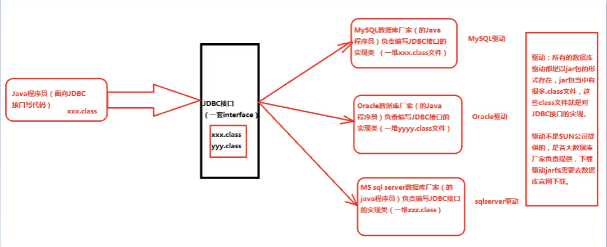

# JDBC学习笔记

***

## 1.JDBC是什么？

> Java DataBase Connectivity（Java语言连接数据库）

***

## 2.JDBC的本质是什么？

> JDBC是SUN公司制定的一套接口（interface）
>
> java.sql.*;（这个软件包下有很多接口）
>
> 接口都有调用者和实现者。
>
> 面向接口调用、面向接口写实现类，这都属于面向接口编程。
>
> 为什么要面向接口编程？
>
> 解耦合：降低程序的耦合度，提高程序的扩展能力。
>
> 多态机制就是非常典型的：面向抽象编程。(不要面向具体编程)

### 建议：

```java
Animal a = new Cat();
Animal a = new Dog();
//喂养的方法
public void feed(Animal a){//面向父类幸型编程。
    
    
}
//不建议：
Dog d  = new Dog();
Cat c = new Cat();
```

### 思考：为什么SUN制定一套JDBC接口呢？

> 因为每一个数据库的底层实现原理都不一样。
>
> Oracle数据库有自己的原理。
>
> MySQL数据库也有自己的原理。
>
> MS SqlServer数据库也有自己的原理。
>
> **...**
>
> 每一个数据库产品都有自己独特的实现原理。

> 


> 比如以下是SUN公司需要解决的驱动问题：
>
> ```java
> //比如：如果是MySQL数据库厂家负责编写JDBC接口的实现类
> /*
> MySQL的数据库厂家 负责编写JDBC接口的实现类
> */
> 
> public class MySQL implements JDBC{
>  public void getConnection(){
>     System.out.println("连接MySQL数据库成功！");
> }
> //实现类呗称为驱动。（MySQL驱动）
> //xxx.jar  当中有很多.class,都是对JDBC接口进行的实现。
> }
> ```

> Java程序员角色：
>
> ```java
> /*
> Java程序员角色。
> 不需要关心具体是哪个品牌的数据库，只需要面向JDBC接口写代码。
> 面向接口编程，面向抽象编程，不要面向具体编程。
> */
> public class JavaProgrammer{
>     public static void main(String[] args){
>         //JDBC jdbc = new MySQL();
>         //同时创建对象可以通过反射来机制实现。
>         Class c = Class.forName("MySQL");
>         JDBC jdbc = (JDBC)c.newInstance();
>         
>         //以下代码都是面向接口调用方法，不需要修改
>         jdbc.getConnection();
>     }
> }
> ```
>
> 

JDBC的本质到底是什么？

> 就是一套接口。


## 3.JDBC开发前的准备工作

> 先从官网下载对应的驱动jar包，让后将其配置到环境变量classpath当中。
>
> 以上的配置是针对于文本编辑器的方式开发，使用IDEA工具的时候，不需要配置以上的环境变量。

## 4.JDBC编程六步（需要背会）

### 第一步：

   注册驱动（告诉Java程序，即将要连接的是哪个品牌的数      据库）

### 第二步：

   获取连接（表示JVM的进程和数据库进程之间的通道打开了，这属于进程之间的通信，重量级的，使用完之后一定要关闭通道。）

### 第三步：

   获取数据库操作对象（专门执行sql语句的对象）

### 第四步：

   执行SQL语句（DQL，DML...）

### 第五步：

   处理查询结果集（只有当第四步执行的是select语句的时候，才有这第五步处理查询结果集。）

### 第六步：

   释放资源（使用完资源之后一定要关闭资源。Java和数据库属于进程间的通信，开启之后一定要关闭。）

###   实例：

   ``` java
   import java.sql.*;
   import java.util.ResourceBundle;
     
   public class ServerDAO {
     
       Connection conn = null;
       Statement stamt = null;
       ResultSet rs = null;
       public ServerDAO()
       {
   
   
           ResourceBundle bundle = ResourceBundle.getBundle("jdbc");
           String driver = bundle.getString("driver");
           String url = bundle.getString("url");
           String user = bundle.getString("user");
           String password = bundle.getString("password");
           //System.out.println(driver);
       
           try {
       
               //注册驱动
               Class.forName(driver);
               //获取数据库连接
               conn = DriverManager.getConnection(url,user,password);
               //获取数据库操作对象
               stamt  = conn.createStatement();
               System.out.println("服务器连接成功");
       
               //数据库语句
               String sql = "SELECT userName \"用户姓名\" FROM users";
       
               //查询使用exeuteQuery
               rs = stamt.executeQuery(sql);
               //增删改使用exeuteUpdate
       
           }   catch (ClassNotFoundException e) {
               e.printStackTrace();
           } catch (SQLException e) {
               e.printStackTrace();
           } finally {
               try {
                   if(stamt!=null)
                       stamt.close();
                   if(conn!=null)
                       conn.close();
                   if( rs != null )
                       rs.close();
               } catch (SQLException e) {
                   e.printStackTrace();
               }
           }
       
       }
   
   
   }
   
   ```

   

#### 数据库查询：

```java
//返回的是一个查询集
ResultSet rs = (Statement).executeQuery("查询语句");
```

#### 数据库的增删改：

```java
//返回的int是有效改的数据条数
int num = (Statement).executeUpdate("增删改语句");
```

数据库操作的软件能使用：Navicat

数据库表的设计一般使用软件：PowerDesigner

#### 数据库的安全：

> ## 注意SQL注入（安全隐患）
>
> 解决安全隐患的方法：使用将Statement接口替换成Statement的子接口PreparedStatement（获取预编译的数据库操作对象）
>
> PreparedStatement在预编译期会进行一个安全检查所以相比Statement更安全。
>
> 并且，PrepaStatement的运行效率也比Statement高！！！
>
> Statement是编译一次运行一次，PreparedStatement是预编译一次可以按模板运行N次。
>
> 但是statement并不是一无用处，有些业务需要SQL注入的那么就需要Statement了，因为PrepareSta无法胜任其注入功能（比如表的数据排序语句）。
>
> 实例：
>
> ```java
> import java.sql.*;
> import java.util.ResourceBundle;
> 
> public class ServerDAO {
> 
>  Connection conn = null;
>  PreparedStatement ps = null;
>  ResultSet rs = null;
>  public ServerDAO()
>  {
> 
> 
>      ResourceBundle bundle = ResourceBundle.getBundle("jdbc");
>      String driver = bundle.getString("driver");
>      String url = bundle.getString("url");
>      String user = bundle.getString("user");
>      String password = bundle.getString("password");
>      //System.out.println(driver);
> 
>      try {
> 
>          //注册驱动
>          Class.forName(driver);
>          //获取数据库连接
>          conn = DriverManager.getConnection(url,user,password);
>          System.out.println("服务器连接成功");
> 
>           //数据库语句
>          //SQL语句的框子，其中一个？，表示一个占位符，一个？将来接受一个“值”，注意：占位符不能使用单引号括起来否则会当成字符串
>          String sql = "SELECT * FROM users where userName = ?";
> 
>          //获取数据库预编译操作对象
>          //程序执行到此处，会发送sql语句框子给DBMS，然后DBMS进行sql语句的预先编译
>          ps = conn.prepareStatement(sql);
>          //给占位符？传值（第一个问号下标是1，第二个问号下标是2，JDBC中所有下标从1开始）
>          ps.setString(1，);
>          //查询使用exeuteQuery
>          rs = ps.executeQuery();
>          //增删改使用exeuteUpdate
> 
>      }   catch (ClassNotFoundException e) {
>          e.printStackTrace();
>      } catch (SQLException e) {
>          e.printStackTrace();
>      } finally {
>          try {
>              if(stamt!=null)
>                  stamt.close();
>              if(conn!=null)
>                  conn.close();
>              if( rs != null )
>                  rs.close();
>          } catch (SQLException e) {
>              e.printStackTrace();
>          }
>      }
> 
>  }
> 
> 
> }
> 
> ```

## 5.实践中函数的使用

### 如何获取查询后的数据？

> 通过学习我们知道查询时使用的是executerQuery()，而这个类有一个方法是next()，这个next()便可以遍历所有所查询到的数据，同时配合getString()【()里面可以是对应标签序号数字或者直接标签的名字也行】或者getInt()等这一些函数便可以得到相应的数据。


## 6.优化

### 1.如何提高数据库的指令运行速度？

#### 与服务器的交互大多数或者说最耗时的阶段便是与数据库建立连接的阶段，即Connection阶段。

> * 解决方案：
>
>   使用数据库连接池技术，既在开始启动服务器时就开始初始化并提前建立好与数据库足够多的连接，这些连接将会存到“池”里面，这里的“池”可以使用HashMap集合来代替。

