# Java之Servlet学习

---
流程图：

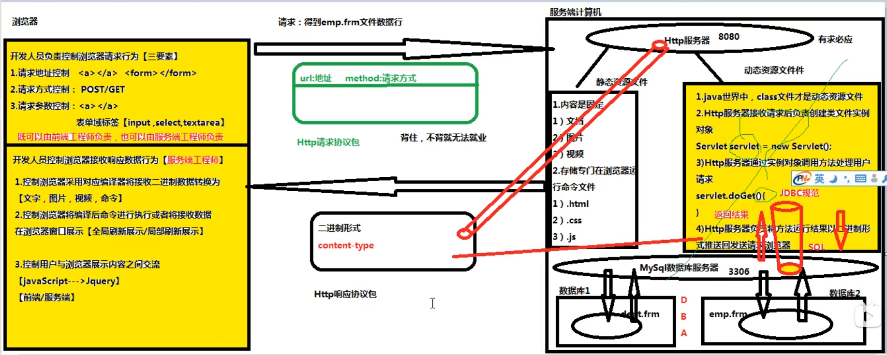

## **一、Servlet规范介绍：**

### **1.servlet规范来自于JAVAEE规范中的一种**

### **2.作用：**

- 在servlet规范中，指定【动态资源文件】开发步骤

- 在servlet规范中，指定Http服务器调用动态资源文件规则

- 在servlet规范中，指定Http服务器管理动态资源文件实例对象规则

注：第一个是给人看的，后两个是给Http服务器看的

---

## **二、Servlet接口实现类：**

### 1.Servlet接口来自于Servlet规范下一个接口，这个接口存在Http服务器提供Jar包

### 2.Tomcat服务器下lib文件夹中有一个servlet-api.jar存放Servlet接口（javax.servlet.Servlet)

### 3.Servlet规范中任务，Http服务器能调用的【动态资源文件】必须是一个Servlet接口实现类

> 列子：
>
> ```java
> class Student{
>     //不是动态资源文件，Tomcat无权调用
> }
> class Teacher implements Servlet{
>     //合法动态资源文件，Tomcat有权调用
>     Servlet obj = new Teacher();
>     obj.doGet();
> }
> ```
>
> 

### Tomcat根据Servlet规范调用Servlet接口实现类规则：

* Tomcat有权创建Servlet接口实现实例对象

  ```java
  Servlet oneServlet = new OneServlet();
  ```

- Tomcat根据实例对象调用service方法处理当前请求

  ```java
  oneServlet.service()
  ```

  

---

## **三、Servlet接口实现类开发步骤：**

### 第一步：创建一个Java类让它继承于HttpServlet父类，使之成为一个Servlet接口实现类

> servlet接口类待实现的接口方法有：
>
> - init
> - getServlet
> - getServletConfig
> - getServletInfo
> - destory
> - service

### 第二步：重写HttpServlet父类两个方法。doGet或者doPost

> 浏览器-----get----》 oneServlet.doGet()
>
> 浏览器-----post---》 oneServlet.doPost()
>
> post可以使用getParameter("key")获取请求体参数对应值


### 第三步：将Servlet接口实现类信息【注册】到Tomcat服务器

【网站】----->【web】--->【WEB-INF】--->web.xml

> ```html
> <!--将Servlet接口实现类类路径地址交给Tomcat-->
> <servlet>
> <servlet-name>mm</servlet-name><!--申明一个变量存储servlet接口实现类类路径-->
> <servlet-class>com.bjpowernode.controller.oneServlet</servlet-class><!--申明servlet接口-->
> </servlet>
> ```

> ```java
> Tomcat String mm = "com.bjpowernode.controller.oneServlet";
> ```

> ```html
> <!--为了降低用户访问Servlet接口实现类难度，需要设置简短请求别名-->
> <servlet-mapping>
>     <servlet-name>mm</servlet-name>
>     <url-pattern>/one</url-pattern><!--设置简短请求别名，别名在书写时必须以"/"为开头-->
> </servlet-mapping>
> ```
>
> 如果现在浏览器向Tomcat索要OneServlet时地址
>
> http://localhost:8080/myWeb/one
>
> 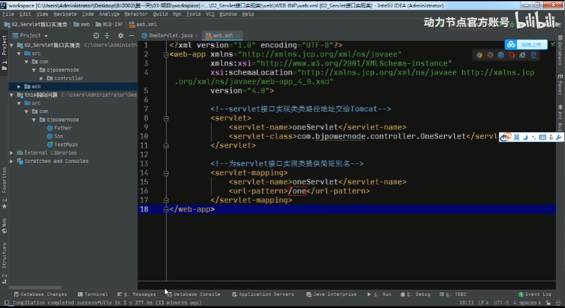

---

## **四、Servlet对象生命周期：**

### 1.网站中所有的Servlet接口实现类的实例对象，只能由Http服务器负责创建。开发人员不能手动创建Servlet接口实现类的实例

### 2.在默认的情况下，Http服务器接收到对于当前Servlet接口实现类第一次请求时自动创建这个Servlet接口实现类的实例对象

在手动配置情况下，要求Http服务器在启动时自动创建某个Servlet接口实现类的实例对象

```xml
<servlet>
    <servlet-name>mm</servlet-name><!--声明一个变量存储servlet接口实现类类路径-->
    <servlet-class>com.bjpowernode.controller.OneServlet</servlet-class>
    <load-on-startup>30</load-on-startup><!--填写一个大于0的整数-->
</servlet>
```

### 3.在Http服务器运行期间，一个Servlet接口实现类只能被创建出一个实例对象

### 4.在Http服务器关闭时刻，自动将网站中所有的Servlet对象进行销毁

## 五、HttpServletResponse接口

### 1.介绍:

* HttpServletResponse接口来自于Servlet规范中，在Tomcat中存在servlet-api.jar
* HttpServletResponse接口实现类由Http服务器负责提供
* HttpServletResponse接口负责将doGet/doPost方法执行结果写入到【响应体】交给浏览器
* 开发人员习惯于将HttpServletResponse接口修饰的对象成为【响应对象】

### 2.主要功能：

* 将执行结果以二进制形式写入到【响应体】
* 可以设置响应头中[content-type]属性值，从而控制浏览器使用对应编译器将响应体二进制数据编译为【文字，图片，视频，命令】
* 设置响应头【location】属性，将一个请求地址赋值给location从而控制浏览器向指定服务器发送请求

> **注：**在doGet和doPost等请求接口实现类中HttpServletResponse对应的形参可以获取到输出流，可以是用时write和print方法进行输出，但是一般都使用print。我们在进行输出传递时一般会先使用content-type，在Java中即setContentType定义好输出给浏览器的信息时什么类型（注意要在获取输出流之前定义），默认为text类型。
>
> Java后端可以通过下面方法来远程控制浏览器请求行为【请求地址，请求方式，请求参数】，即设置响应头中的【location】属性
>
> ```java
> 输出流.sendRedirect(地址)
> ```

---

## **六、HttpServletRequest接口**

1.介绍：

- HttpServletRequest接口来自于Servlet规范中，在Tomcat中存在的servlet-api.jar
- HttpServletRequest接口实现类由Http服务器负责提供
- HttpServletRequest接口负责在doGet/doPost方法运行时读取Http请求协议包中信息
- 开发人员习惯于将HttpServletRequest接口修饰的对象成为【请求对象】

2.作用：

* 可以读取Http请求协议包中【请求行】信息
* 可以读取保存在Http请求协议包中【请求头】或者【请求体】中请求参数信息
* 可以代替浏览器向Http服务器申请资源文件调用

> ```java
> //1.通过请求对象(request)，读取【请求行】中【url】信息
> String url = request.getRequestURL().toString();
> //2.通过请求对象(request)，读取【请求行】中【method】信息
> String method = request.getMethod();
> 
> //3.通过请求对象(request)，读取【请求行】中uri信息
> /*
> URI：资源文件精准定位地址，在请求行中并没有URI这个属性。
> 实际上是从URL中截取一个字符串，这个字符串格式"/网站名/资源文件名"
> URI用于让Http服务器对被访问的资源文件进行定位
> */
> String uri = request.getRequestURI(); //substring
> 
> 
> System.out.println("URL"+url);
> System.out.println("method"+method);
> System.out.println("URI"+uri);
> ```
>
> **注：**
>
> * 浏览器以GET方式发送请求，请求参数保存在【请求头】，在Http请求协议包到达Http服务器之后，第一件事就是进行解码。请求头二进制内容由Tomcat负责解码，Tomcat9.0默认使用【UTF-8】字符集，可以解释一切国家文字
> * 浏览器以POST方式发送请求，请求参数保存在【请求体】，在Http请求协议包Http服务器之后，第一件事就是进行解码。请求体二进制内容由当前请求对象(request)负责解码。request默认使用[ISO-8859-1]字符集，一个东欧语系字符集，此时如果请求体参数内容是中文，将无法解码只能得到乱码
>
> 解决方案：
>
> >在Post请求方式下，在读取请求体内容之前，应该通知请求对象使用UTF-8字符集对请求体内容进行一次重新解码
> >
> >```java
> >//通知请求对象(request)，使用utf-8字符集对请求体二进制内容进行一次重新解码
> >request.setCharacterEncoding("utf-8");
> >```

---

## **七、请求对象和响应对象生命周期**

1.在Http服务器接收到浏览器发送的【Http请求协议包】之后，自动为当前的【Http请求协议包】生成一个【请求对象】和一个【响应对象】

2.在Http服务器调用doGet/doPost方法时，负责将【请求对象】和【响应对象】作为实参传递到方法，确保doGet/doPost正确执行

3.在Http服务器准备推送Http响应协议包之前，负责将本次请求关联的【请求对象】和【响应对象】销毁

> 即：【请求对象】和【响应对象】生命周期贯穿一次请求的处理过程中
>
> ​       【请求对象】和【响应对象】相当于用户在服务端的代言人

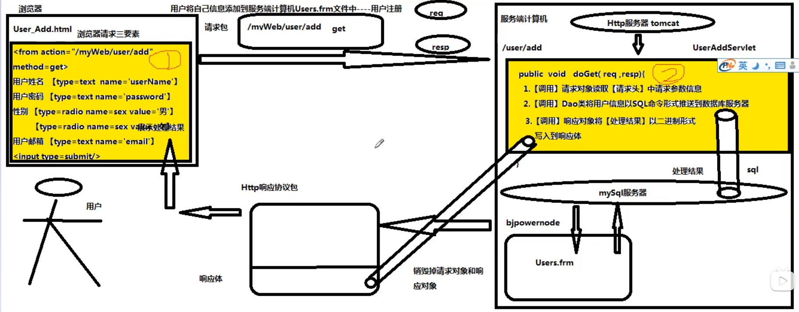

上图涉及到数据库操作，其中DAO是自己所写的一个数据库操作封装类，其主要是分层思想，详情下图：

> 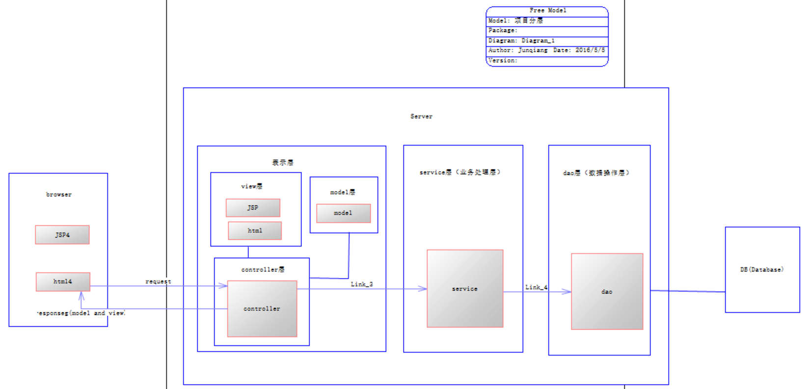

默认欢迎资源文件：

> 用户发送了一个针对某个网站的【默认请求】时，此时由Http服务器自动从当前网站返回的资源文件
>
> 正常请求：http://localhost:8080/myWeb/index.html
>
> 默认请求：http://localhost:8080/myWeb

Tomcat对于默认欢迎资源文件定位规则：

> 1.规则位置：Tomcat安装位置/conf/web.xml
>
> 2.规则命令：
>
> ```xml
> <welcome-file-list>
>     <welcome-file>index.htl</welcome-file>
>     <welcome-file>index.htm</welcome-file>
>     <welcome-file>index.jsp</welcome-file>
> </welcome-file-list>
> ```
>

设置当前网站的默认欢迎资源文件规则

> 1.规则位置：网站/web/WEB-INF/web.xml
>
> 2.规则命令：<welcome-file-list>
>
> 网站设置自定义默认文件定位规则，此时Tomcat自带定位规则将失效
>
> Servlet作为定义为默认文件时开头的“/”记得抹掉

***

## 八、Http状态码

>1.介绍：
>
>* 由三位数字组成的一个符号。
>
>* Http服务器在推送响应包之前，根据本次请求处理情况将Http状态码写入到响应包中【状态行】上
>
>* 如果Http服务器针对本次请求，返回了对应的资源文件。
>
> 通过Http状态码通知浏览器应该如何处理这个结果。
>
>* 通过Http状态码向浏览器解释不能提供服务的原因
>
>2.分类：
>
>* 组成 100-599；分为5个大类
>
>* 1XX：
>
> ​		最有特征 100：通知浏览器本次返回的资源文件并不是一个独立		的资源文件，需要浏览器在接受响应包之后，，继续向Http服务		器所要依赖的其他资源文件
>
> 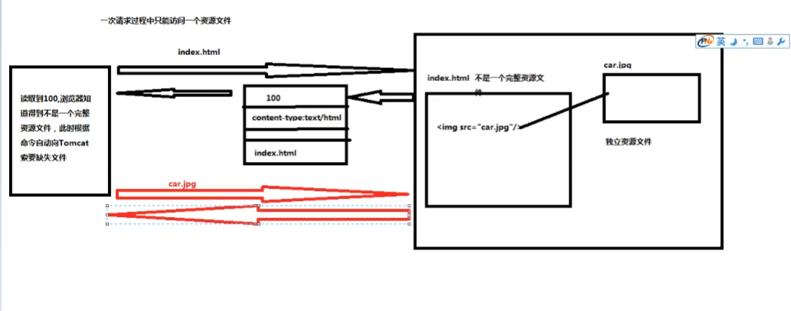
>
>* 2XX：
>
> ​		最有特征200，通知浏览器本次返回的资源文件是一个完整独立资源文件，浏览器在接收到之后不需要索要其他关联文件。
>
>* 3XX：
>
> ​		最有特征302，通知浏览器本次返回的不是一个资源文件内容而是一个资源文件地址，需要浏览器根据这个地址自动发起请求来索要这个资源文件。
>
> response.sendRedirect("资源文件地址")写入到响应头中的location中，而这个行为会导致Tomcat将302状态码写入到状态行。
>
>* 4XX：
>
> > 404：通知浏览器，由于在服务端没有定位到被访问的资源文件因此无法提供帮助。
> >
> > 405：通知浏览器，在服务端中已经定位到被访问的资源文件（Servlet），但是这个Servlet对于浏览器所采用的请求方式不能处理（就比如只写了doPost没有写doGet）
>
>* 5XX:
>
>  > 500：通知浏览器，在服务端已经定位到被访问的资源文件（Servlet）这个Servlet可以接收浏览器采用请求方式，但是Servlet在处理请求期间，由于Java异常导致处理失败。

***

## 九、多个Servlet之间调用规则：

> 1.前提条件：
>
> * 某些来自浏览器发送请求，往往需要服务端中多个Servlet协同处理。但是浏览器一次只能访问一个Servlet，导致用户需要手动通过浏览器发起多次请求才能得到服务。这样增加用户获得服务难度，导致用户放弃访问当前网站。
>
> 2.提高用户使用感受规则：
>
> * 无论本次请求涉及到多少个Servlet，用户只需要【手动】通知浏览器发起一次请求即可。
>
> 3.多个Servlet之间调用规则：
>
> * 重定向解决方案
> * 请求转发解决方案

***

## 十、重定向解决方案：

> 1.工作原理：用户第一次通过【手动方式】通知浏览器访问OneServlet。oneServlet工作完毕后，将TwoServlet地址写入到响应头location属性中，导致Tomcat将302状态码写入到状态行。在浏览器接受到响应包之后，会读取到302状态。此时浏览器自动根据响应头location属性地址发起第二次请求，访问TwoServlet去完成请求中剩余任务
>
> 2.实现命令：
>
> response.sendRedirect("请求地址")
>
> 将地址写入到响应包中相应头中location属性
>
> 3.特征：
>
> * 请求地址：
>
>   既可以把当前网站内部的资源文件地址发送给浏览器（/网站名/资源名）
>
>   也可以把其他 网站资源文件地址发送给浏览器（http://ip地址:端口号/网站名/资源文件）
>
> * 请求次数：
>
>   浏览器至少发送两次请求，但是只有一次请求是用户手动发送。
>
>   后续请求都是浏览器自动发送的。
>
> * 请求方式：
>
>   重定向解决方案中，通过地址栏通知浏览器发起下一次请求，因此通过重定向解决方案调用的资源文件接收的请求方式一定是【GET】
>
> 4.缺点：
>
> * 重定向解决方案需要在浏览器与服务器之间进行多次往返，大量时间消耗在往返次数上，增加用户等待服务时间。

***

## 十一、请求转发解决方案：

> 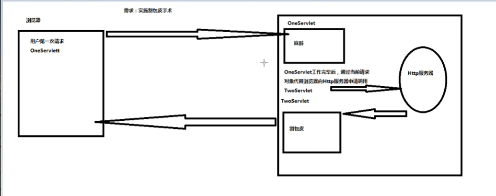
>
> 1.原理：用户第一次通过手动方式要求浏览器访问OneServlet。OneServler工作完毕后，通过当前的请求对象代替浏览器向Tomcat发送请求，申明调用TwoServlet。Tomcat在接收到这个请求后，自动调用TwoServlet来完成剩余任务。
>
> 2.实现命令：请求对象代替浏览器向Tomcat发送请求
>
> ```java
> //1.通过当前请求对象生成资源文件申请报告对象
> RequestDispatcher report = request.getRequestDispatcher("/资源文件名");//一定要以"/"为开头，且不要写网站名！！！
> //2.将报告对象发送给Tomcat
> report.forward(当前请求对象，当前相应对象)
> ```
>
> 4.优点：
>
> * 无论本次请求涉及到多少个Servlet，用户只需要手动通过浏览器发送一次请求
> * Servlet之间调用发生在服务端计算机上，节省服务端与浏览器之间往返次数增加处理服务速度
>
> 4.特征：
>
> * 请求次数：
>
>   在请求转发过程中，浏览器只发送一次请求
>
> * 请求地址：
>
>   只能向Tomcat服务器申请调用当前网站下资源文件地址
>
>   request.getRequestDispathcer("/资源文件名")//不要写网站名
>
> * 请求方式：
>
>   在请求转发过程中，浏览器只发送了一个Http请求协议包。
>
>   参与本次请求的所有Servlet共享同一个请求协议包，因此这个Servlet接受的请求方式与浏览器发送的请求方式保持一直

***

## 十二、多个Servlet之间数据共享实现方案：

1.数据共享：OneServlet工作完毕后，将产生数据交给TwoServlet来使用

2.Servlet规范中提供四个数据共享方案：

* ServletContext接口
* Cookie类
* HttpSession接口
* HttpServletRequest接口

***

## 十三、ServletContext接口：

### 1.介绍：

> 1.来自于Servlet规范中一个接口。在Tomcat中锤子servlet-api.jar在Tomcat中负责提供这个接口实现类
>
> 2.如果两个Servlet来自于同一个网站。彼此之间通过网站的ServletContext实例对象实现数据共享
>
> 3.开发人员习惯于将ServletContext对象称为【全局作用域对象】

### 2.工作原理：

> 每一个网站都存在一个全局作用域对象。
>
> 这个全局作用域对象【相当于】一个Map。
>
> 在这个网站中OneServlet可以将一个数据存入到全局作用域对象，当前网站中其他Servlet此时都可以从全局作用域对象得到这个数据进行使用

### 3.全局作用域对象生命周期

> * 在Http服务器启动过程中，自动为当前网站在内存中创建一个全局作用域对象
> * 在Http服务器运行期间时，一个网站只有一个全局作用域对象
> * 在Http服务器运行期间，全局作用域对象一直出于存活状态
> * 在Http服务器准备关闭时，负责将当前网站中全局作用域对象进行销毁处理
>
> #### 全局作用域对象生命周期贯穿网站整个运行期间

### 4.命令实现：【同一个网站】oneServlet将数据共享给TwoSerlet

```java
OneServlet{
    public void doGet(HttpServletRequest request,HttpServletResponse response){
        //1.通过【请求对象】向Tomcat索要当前网站中【全局作用域对象】
        ServletContext application = request.getServletContext();
        //2.将数据添加到全局作用域对象作为【共享数据】
        application.setAttribute("key1",数据);
    }
}
```

```java
TwoServlet{
    public void doGet(HttpServletRequest request,HttpServletResponse response){
        //1.通过【请求对象】向Tomcat索要当前网站中【全局作用域对象】
        ServletContext application = request.getServletContext();
        //2.从全局作用域对象得到指定关键字对应数据
        Object 数据 = application.getAttribute("key1");
        
    }
}
```

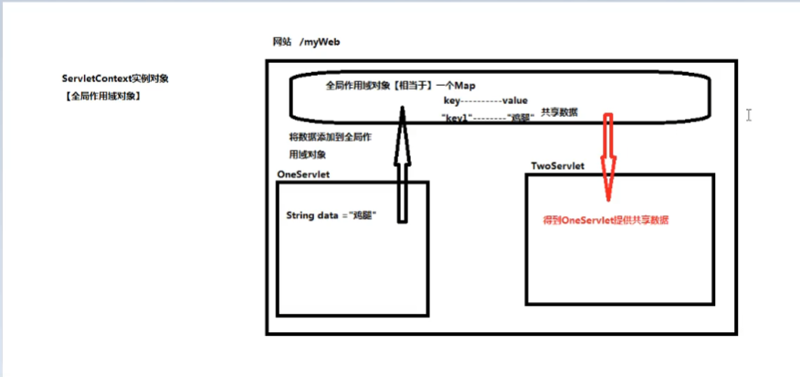

***

## 十四、Cookie

### 1.介绍：

> * Cookie来自于Servlet规范中一个工具类，存在于Tomcat提供servlet-api.jar中
> * 如果两个Servlet来自于同一个网站 ，并且为同一个浏览器/用户提供服务，此时借助于Cookie对象进行数据共享
> * Cookie一般来存放当前用户的私人数据，在共享数据的过程中提高服务质量
> * 在现实生活场景中，Cookie相当于用户在服务端得到的【会员卡】

### 2.原理：

> 用户通过浏览器第一次向MyWeb网站发送请求申请OneServlet。
>
> OneServlet在运行期间创建一个Cookie存储与当前用户相关数据
>
> OneServlet工作完毕后，【将Cookie写入到响应头】交还给当前浏览器。
>
> 浏览器收到响应响应包之后，将Cookie存储在浏览器的缓存
>
> 一段时间之后，用户通过【同一个浏览器】再次向【myWeb网站】发送请求申请TwoServlet时。【浏览器需要无条件的将myWeb网站之前推送过来的Cookie，写入到请求头】发送过去
>
> 此时TwoServlet在运行时，就可以通过读取请求头中cookie中信息，得到OneServlet提供的共享数据
>
> 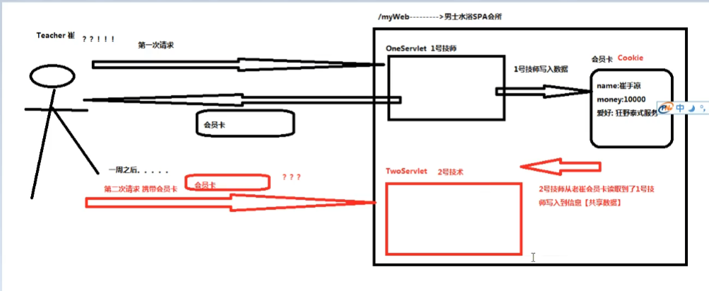

### 3.实现命令：同一个网站OneServlet与TwoServlet借助于Cookie实现数据共享

> ```java
> OneServlet{
>     public void doGet(HttpServletRequest , HttpServletResponse resp)
>         //1.创建一个cookie对象，保存共享数据（当前用户数据）
>         Cookie card = new Cookie();
>     /*
>     cookie相当于一个键值对
>     一个cookie中只能存放一个键值对
>     这个键值对的key与value只能是String
>     键值对中key不能是中文
>     */
>     
>     //2.【发卡】将cookie写入到响应头，交给浏览器
>     resp.addCookie(card);
>     resp.addCookie(card1);
> }
> ```
>
> 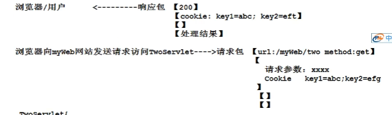
> ```java
> TwoServlet{
>     public void doGet( HttpServletRequest request,HttpServletResponse resp)
>     {
>         //1.调用请求对象从请求头得到浏览器返回的Cookie
>         Cookie cookieArray[] = request.getCookies();
>         //2.循环遍历数据得到每一个cookie的key与value
>         for(Cookie card : cook ){
>             card.getName();//读取key “key1”
>             card.getValue();//读取value “abc”
>             //提供较好的服务。。。。。。。。。
>         }
>         
>     }
> }
> ```
>
> 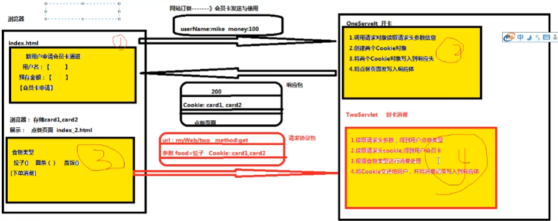
>

### 4.Cookie销毁时机：

> 1.在默认情况下，Cookie对象存放在浏览器的缓存中。因此只要浏览器关闭，Cookie对象就被销毁掉
>
> 2.在手动设置情况下，可以要求浏览器将接收的Cookie存放在客户端计算机上硬盘上，同时需要指定Cookie在硬盘上存活时间。在存活时间范围内，关闭浏览器关闭客户端计算机，关闭服务器，都不会导致Cookie被销毁。在存活事件到达时，Cookie自动从硬盘上被删除
>
> cookie.setMaxAge(60);//cookie在硬盘上存活1分钟

***

## 十五、HttpSession接口：

### 1.介绍：

 * HttpSession接口来自于Servlet规范下一个接口。存在于Tomcat中servlet-api.jar

   其实现类由Http服务器提供。Tomcat提供实现类存在于servlet-api.jar

 * 如果两个Servlet来自于同一个网站，并且为同一个浏览器/用户提供服务，此时借助于HttpSession对象进行数据共享

 * 开发人员习惯于将HttpSession接口修饰对象称为【会话作用域对象】

###  2.HttpSession与Cookie区别：【面试题】

 * #### 存储位置：一个在天上，一个在地上

   > Cookie：存放在客户端计算机（浏览器内存/硬盘）
   >
   > HttpSession：存放在服务端计算机内存

 * #### 数据类型：

   > Cookie对象存储共享数据类型只能是String
   >
   > HttpSession对象可以存储任意类型的共享数据Object

 * #### 数据数量：

   > 一个Cookie对象只能存储一个共享数据
   >
   > HttpSession使用map集合存储共享数据，所以可以存储任意数量共享数据

 * #### 参照物：

   > Cookie相当于客户在服务端【会员卡】
   >
   > HttpSession相当于客户在服务端【私人保险柜】 

### 3.命令实现：

 > 同一个网站(myWeb)下OneServlet将数据传递给TwoServlet
 >
 > ```java
 > OneServlet{
 > public void doGet(HttpServletRequest request,HttpServletResponse response){
 > //1.调用请求对象向Tomcat索要当前用户在服务端的私人储物柜
 > HttpSession session = request.getSession();
 > //设置session的存活时间为10秒    
 > session.setMaxInactiveInterval(10);
 > //2.将数据添加到用户私人储物柜
 > session.setAttribute("key1",共享数据);
 > }
 > }
 > ```
 > 浏览器访问/myWeb中TwoServlet
 >
 > ```java
 > TwoServlet{
 > public void doGet(HttpServletRequest request,HttpServletResponse response){
 > //1.调用请求对象向Tomcat索要当前用户在服务端的四人储物柜
 > HttpSession session = request.getSession();
 > //2.从会话作用域对象得到OneServlet提供的共享数据
 > Object 共享数据 = session.getAttribute("key1");
 > }
 > }
 > ```

### 4.HttpSession与用户关联的原理图：

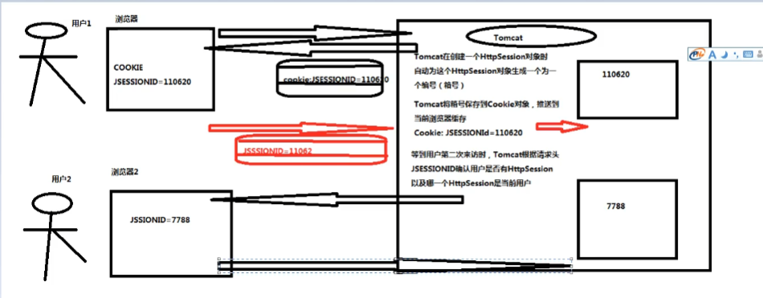

### 5.HttpSession实现购物车原理图：

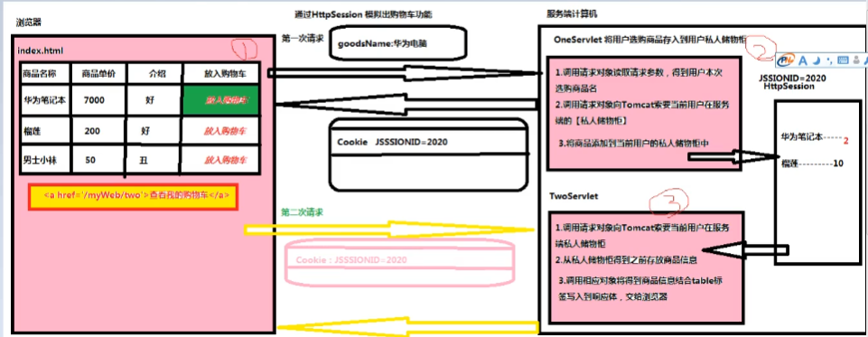

### 6.getSession()与getSession(false)区别：
> * #### getSession()：
>
>   如果当前用户在服务端已经拥有了自己的私人储物柜，要求Tomcat将这个私人储物柜进行返回，如果当前用户在服务端尚未拥有自己的私人储物柜则要求Tomcat为当前用户创建一个全新的私人储物柜。
>
> * #### getSession(false)：
>
>   如果当前用户在服务端已经拥有了自己的私人储物柜，要求Tomcat将这个私人储物柜进行返回。如果当前用户在服务端尚未拥有自己的私人储物柜则此时Tomcat将返回null且***不会***创建一个新的私人储物柜。

###  7.HttpSession销毁时机：

> * 用户与HttpSession关联时使用的Cookie只能存放在***浏览器缓存***中。
> * 在浏览器关闭时，意味着用户与他的HttpSession关系呗切断。
> * 由于Tomcat无法检测浏览器何时关闭，因此在浏览器关闭时并不会导致Tomcat将浏览器关联的HttpSession进行销毁
> * 为了解决这个问题，Tomcat为每一个HttpSession对象设置【空闲时间】，这个空闲时间默认30分钟，如果当前HttpSession对象空闲时间达到30分钟则此时Tomcat认为用户已经放弃了自己的HttpSession，此时Tomcat就会销毁掉这个HttpSession。

### 8.HttpSession空闲时间手动设置：

> 在当前网站/web/WEB-INF/web.xml
>
> ```xml
> <session-config>
>     <!--当前网站中每一个session最大空闲时间为5分钟-->
>     <session-timeout>5</session-timeout>
> </session-config>
> ```

***

## 十六、HttpServletRequest接口实现数据共享：

### 1.介绍：

> * 如果在同一个网站中，如果两个Servlet之间通过【请求转发】方式进行调用，彼此之间共享同一个请求协议包。而一个请求协议包只对应一个请求对象，因此servlet之间共享同一个请求对象，此时可以利用这个请求对象在两个Servlet之间实现数据共享。
> * 在请求对象实现Servlet之间数据共享功能时，开发人员将请求对象成为【请求作用域对象】

### 2.命令实现：

> OneServlet通过请求转发申请调用TwoServlet时，需要给TwoServlet提供共享数据
>
> ```java
> OneServlet{
>     public void doGet(HttpServletRequest req,HttpServletResponse response){
>         //1.将数据添加到【请求作用域对象】中attribute属性
>         req.setAttribute("key1",数据);//数据类型可以是任意类型Object
>         //2.向Tomcat申请调用TwoServlet
>         req.getRequestDispatcher("/two").forward(req,response);
>     }
> } 
> ```
>
> ```java
> TwoServlet{
>     public void doGet(HttpServletRequest req,HttpServletResponse response){
>     
>         //从当前请求对象得到OneServlet写入到共享数据
>         Object 数据 = req.getAttribute("key1");
>     
>     }
> }
> ```
>
> 

***

## 十七、Servlet规范扩展----------监听器接口

###  1.介绍：

> * 一组来自于Servlet规范下接口，共有8个接口。在Tomcat存在servlet-api.jar包
> * 监听器接口需要由开发人员亲自实现，Http服务器提供jar包并没有对应的实现类
> * 监听器接口用于监控【作用域对象生命周期变化时刻】以及【作用域对象共享数据变化时刻】

###  2.作用域对象：

> * 在Servlet规范中，认为在服务端内存中可以在某些条件下为两个Servlet之间提供数据共享方案的对象，被称为【作用域对象】
>
> * Servlet规范下作用域对象：
>
>   ServletContext：全局作用域对象
>
>   HttpSession：会话作用域对象
>
>   HttpServletRequest：请求作用域对象

### 3.监听器接口实现接口实现类开发规范：三步

> * 根据监听的实际情况，选择对应监听器接口进行实现
> * 重写监听器接口声明【监听事件处理方法】
> * 在web.xml文件将监听器接口实现类注册到Http服务器
>
> 重写监听接口：
>
> 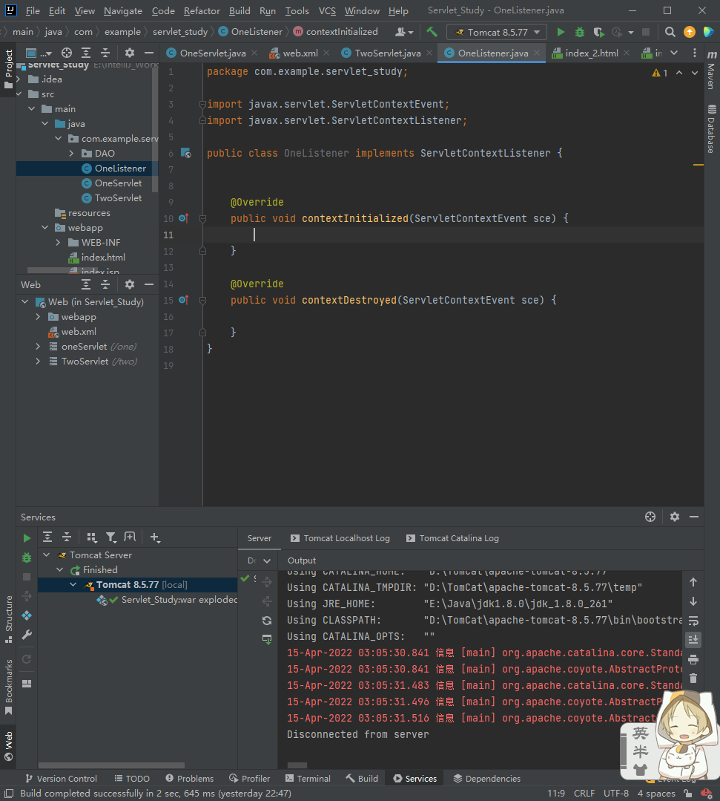
>
> 在Tomcat中注册监听接口实现类：
>
> 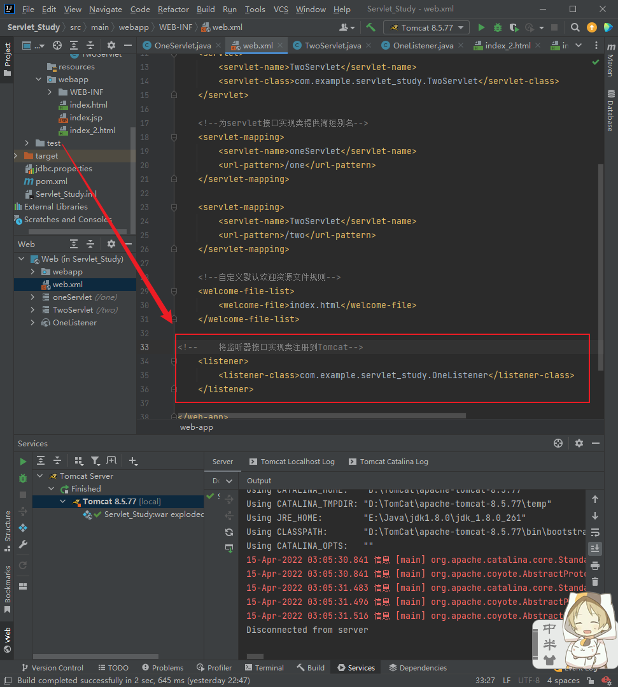


### 4.ServletContextListener接口：

> * 作用：
>
>   通过这个接口合法的检测全局作用域对象被初始化时刻以及被销毁时刻
>
> * 监听事件处理方法：
>
>   public void contextInitlized()：在全局作用域对象被Http服务器初始化被调用
>
>   public void contextDestory()：在全局作用域对象被Http服务器销毁时候触发调用

### 5.ServletContextAttributeListener接口：

> * 作用：
>
>   通过这个接口合法的检测全局作用域对象共享数据变化时刻
>
> * 监听事件处理方法：
>
>   public void contextAdd()：在全局作用域对象添加共享数据
>
>   public void contextReplaced()：在全局作用域对象更新共享数据
>
>   public void contextRemove()：在全局作用域对象删除共享数据
>
> 重写接口：
>
> 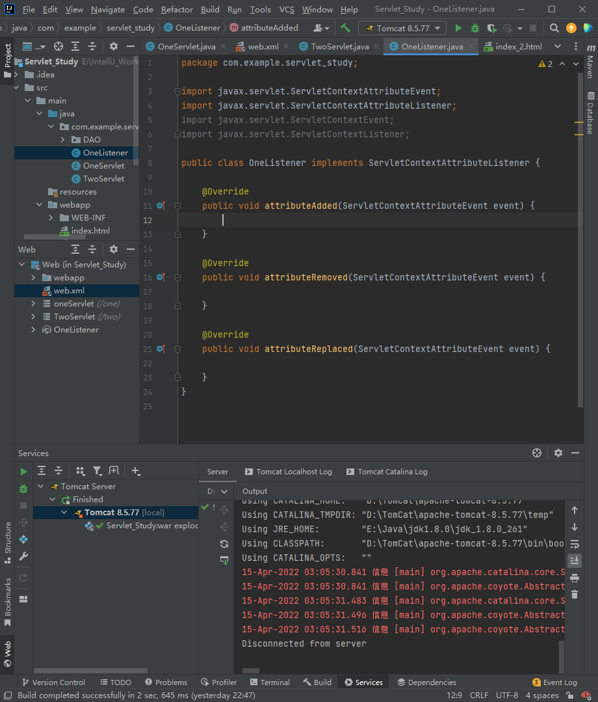
>
> 注册监听接口实现类：
>
> 

### 6.全局作用域对象共享数据变化时刻：

> ```java
> ServletContext application = request.getServletContext();
> application.setAttribute("key1",100);//新增共享数据
> application.setAttribute("key1",200);//更新共享数据
> application.removeAttribute("key1");//删除共享数据
> ```
>

### 7.服务器与数据库之间通信的优化：

在网站后端中，数据库的操作其获取连接数据库耗时长（Connection），所以可以在服务器启动的时候就创建一个连接池。

***

## 十八、Servlet规范扩展---------Filter接口（过滤器接口）

### 1.介绍：

> * 来自于Servlet规范下接口，在Tomcat中存在于servlet-api.jar包
> * Filter接口实现类由开发人员负责提供，Http服务器不负责任提供
> * Filter接口在Http服务器调用资源文件之前，对Http服务器进行拦截

### 2.具体作用：

> * 拦截Http服务器，帮助Http服务器检测当前请求合法性
> * 拦截Http服务器，对当前请求进行增强操作

### 3.Filter接口实现类开发步骤：三步

> * 创建一个Java类实现Filter接口
> * 重写Filter接口中doFilter方法
> * web.xml将过滤器接口实现类注册到Http服务器

### 4.Filter基础使用例子

> 使用：
>
> 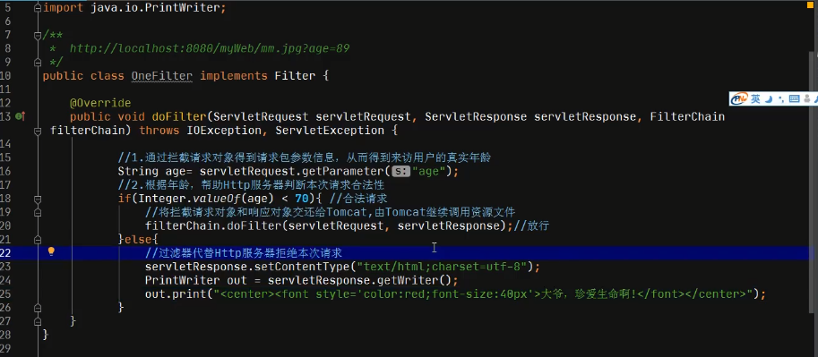
>
> 在web.xml注册：
>
> 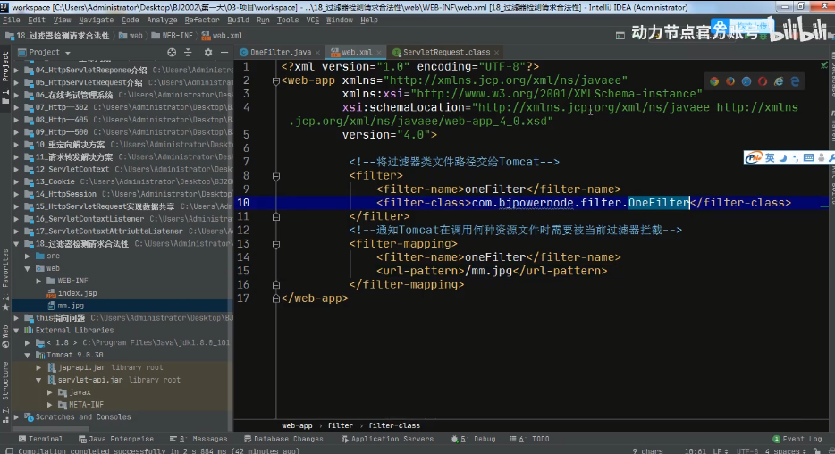

### 5.Filter拦截地址格式：

> * 命令格式：
>
>   ```xml
>   <filter-mappint>
>       <filter-mapping>oneFilter</filter-mapping>
>       <url-pattern>拦截地址</url-pattern>
>   </filter-mappint>
>   ```
>
> * 命令作用：
>
>   拦截地址通知Tomcat在调用何种资源文件之前需要调用OneFilter过滤进行拦截
>
> * 要求Tomcat在调用某一个具体文件之前，来调用OneFilter拦截，例：
>
>   <url-pattern>/img/mm.jpg</url-pattern>
>
> * 要求Tomcat在调用某一个文件夹下所有的资源文件之前，来调用OneFilter拦截，例：
>
>   <url-pattern>/img/*</url-pattern>
>
> * 要求Tomcat在调用任意文件夹下某种类型文件之前，来调用OneFilter拦截，例：
>
>   <url-pattern>*.jpg</url-pattern>
>
> * 要求Tomcat在调用网站中任意文件时，来调用OneFilter拦截，例：
>
>   <url-pattern>/*<url-pattern>

### 6.拦截恶意访问流程图：

> 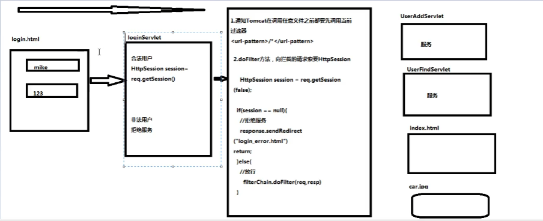

互联网通信流程图：

> 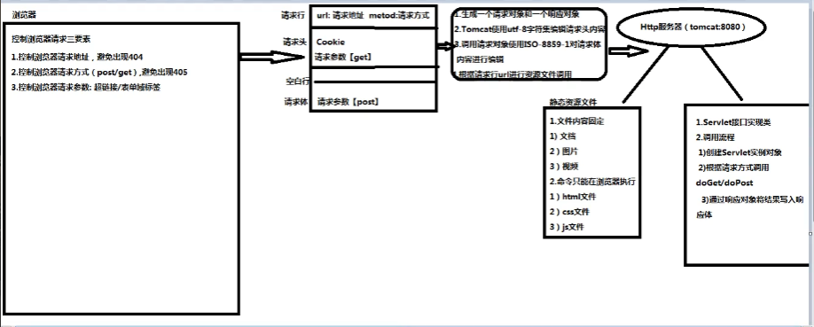
