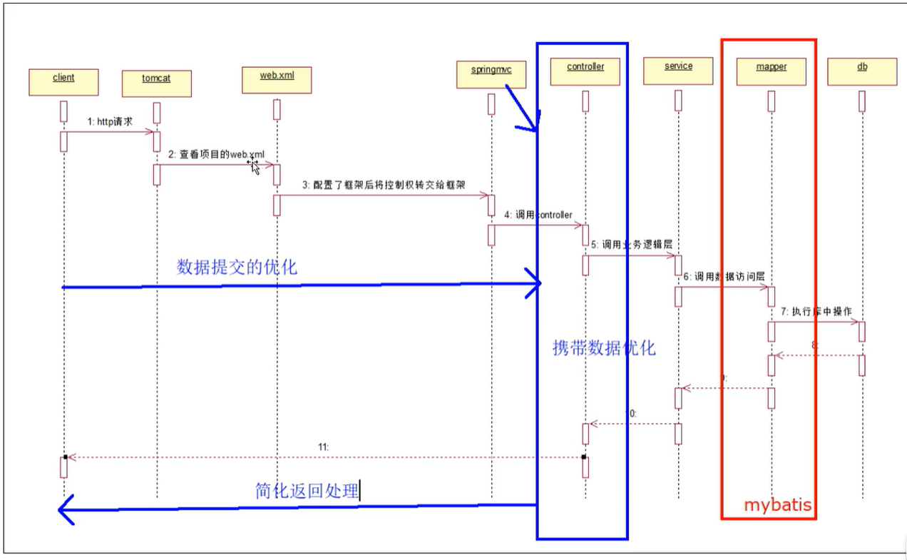
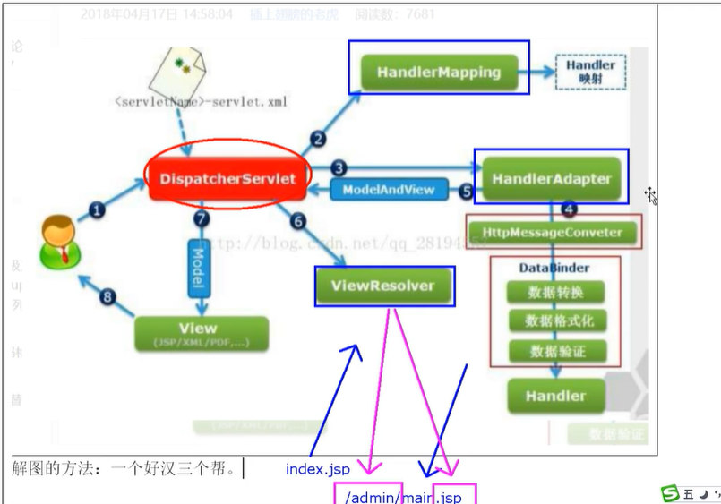
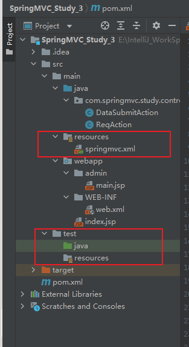
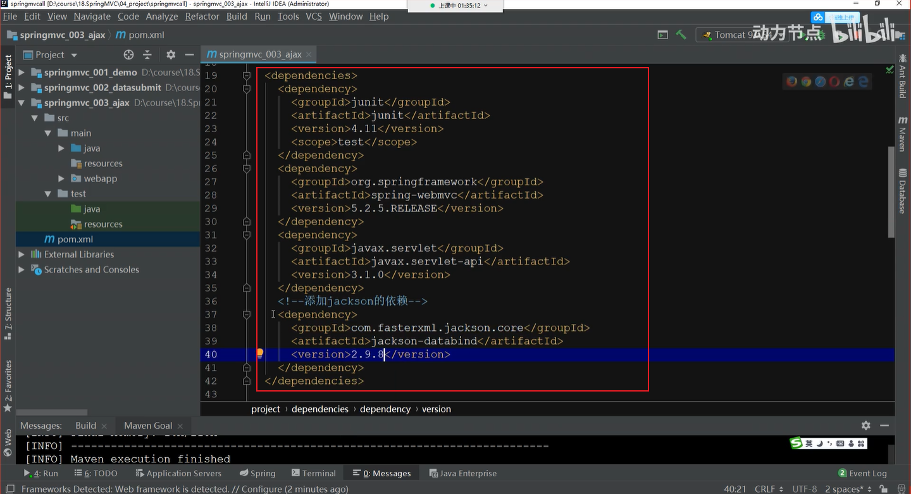
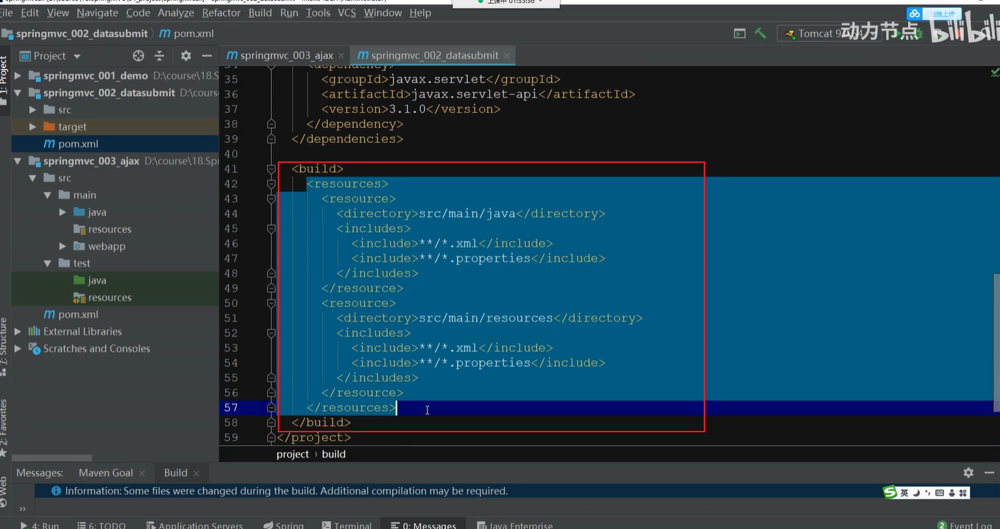
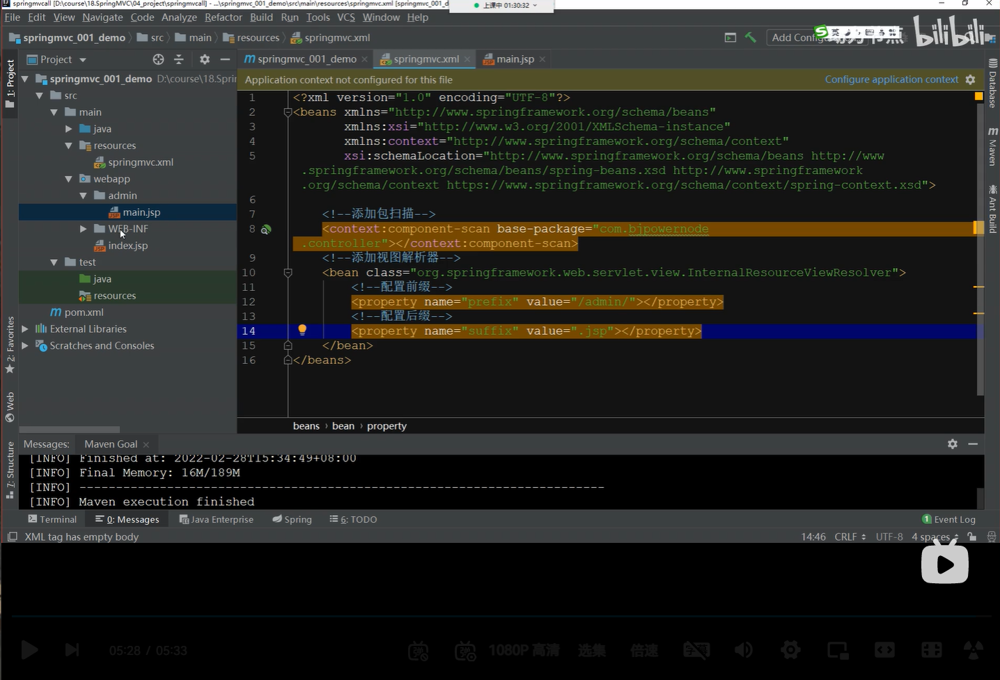
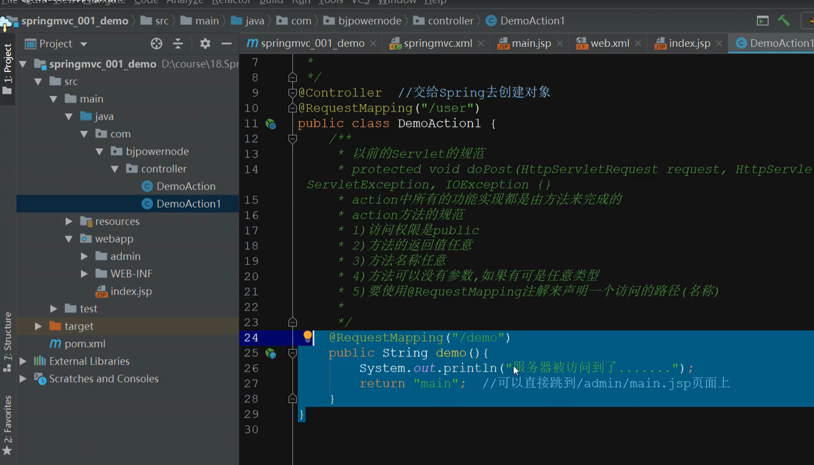
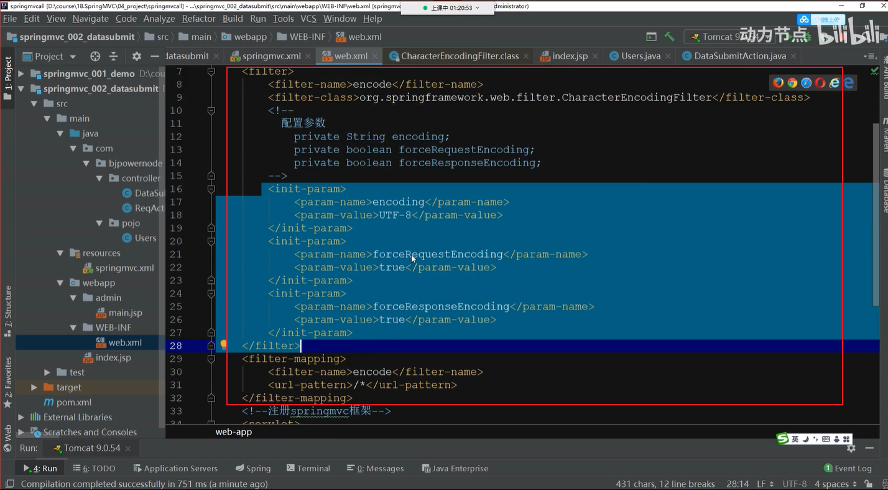
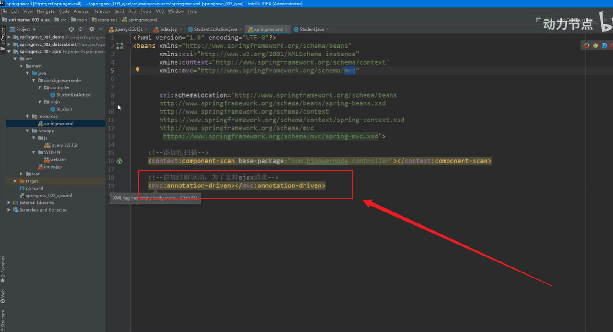
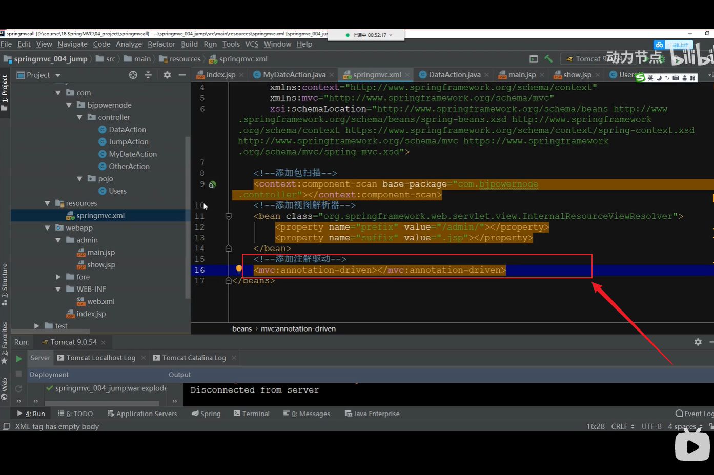

# SpringMVC简介

## 1.SpringMVC概述

> SpringMVC是一种基于Java的实现MVC设计模型的请求驱动类型的轻量级Web框架，属于SpringFrameWork的后续产品，已经融合在Spring Web Flow中。
>
> SpringMVC已经成为目前最主流的MVC框架之一，并且随着Spring3.0的发布，全面超越Struts2，成为最优秀的MVC框架。它通过一套注解，让一个简单的Java类成为处理请求的控制器，而无需实现任何接口。同时它还支持RESTful编程风格的请求。

### 1.1.基于MVC架构

> 基于MVC架构，功能分工明确。解耦合。
>
> M：Modle（模型）
>
> V：View（视图）
>
> C：Controller（控制器）

### 1.2.容易理解，上手快，使用简单

> 就可以开发一个注解的SpringMVC项目，SpringMVC也是轻量级的，jar很小。不依赖的特定的接口和类。

###  1.3.作为Spring框架一部分，能够使用Spring的IOC和AOP

> 方便整合Strtus，MyBatis，Hiberate，JPA等其他框架。

## 2.什么是SpringMVC

> 他是基于MVC开发模式的架构，用来优化控制器，它是Spring家族的一员，它也具备IOC和AOP。

## 3.什么是MVC

> 它是一种开发模式，它是模型视图控制器的简称，所有的web应用都是基于MVC开发。
>
> M：模型层，宝行实体类，业务逻辑层，数据访问层。
>
> V：视图层，html，JavaScript，Vue等都是视图层，用来显现数据
>
> C：控制器，它是用来接收客户端的请求，并返回响应到客户端的组件，Servlet就是组件。

## 4.SSM架构

### 1.Spring框架作用

> 整合SpringMVC和MyBatis，解耦合

### 2.SpringMVC框架作用

> 优化控制器，比如Servlet、action

### 3.MyBatis框架作用

> 优化数据访问层，比如优化JDBC数据库连接，并且有自带的数据库连接池

## 5.SSH架构

> Spring
>
> Struts2
>
> Hibernate

## 6.SpringMVC框架的优点

* 轻量级，基于MVC的架构
* 易于上手，容易理解，功能强大
* 它具备IOC和AOP
* 完全基于注解开发



> 请求（client）经过顺序：
>
> client——》tomcat——》web.xml——》springmvc——》controller——》service——》mapper——》db

### 6.2.SpringMVC执行的流程

> 

## 7.基于注解的SpringMVC框架开发的步骤

* 新建项目，选择webapp模板。

* 修改目录，添加缺失的test，java，resources（两套），并修改目录属性

  > 

* 修改pom.xml文件，添加SpringMVC的依赖，添加Servlet的依赖

  > 
  >
  > 

* 添加SpringMVC.xml配置文件，指定包扫描（因为要基于注解开发），添加视图解析器。

  >

* 删除web.xml文件，新建web.xml

* 在web.xml文件中注册SpringMVC框架（所有的web请求都是基于servlet的）

  > ```xml
  > <?xml version="1.0" encoding="UTF-8"?>
  > <web-app xmlns="http://xmlns.jcp.org/xml/ns/javaee"
  >          xmlns:xsi="http://www.w3.org/2001/XMLSchema-instance"
  >          xsi:schemaLocation="http://xmlns.jcp.org/xml/ns/javaee http://xmlns,jcp.org/xml/ns/javaee/web-app_4_0.xsd"
  >          version="4.0">
  >    <!--注册SpringMVC框架-->
  >     <servlet>
  >     	<servlet-name>springmvc</servlet-name>
  >         <servlet-class>org.springframework.web.servlet.DispatcherServlet</servlet-class>
  >         <init-param>
  >         	<param-name>contextConfigLocation</param-name>
  >             <param-value>classpath:springmvc.xml</param-value>
  >         </init-param>
  >     </servlet>
  >     <servlet-mapping>
  >     	<servlet-name>springmvc</servlet-name>
  >         <!--
  > 		指定拦截什么样的请求
  > 		http://localhost:8080/one
  > 		http://localhost:8080/index.jsp
  > 		http://localhost:8080/demo.action
  >      	<a href="${pageContext.request.contextPath}/demo.action">发访问服务器</a>
  > 		-->
  >         <url-pattern>*.action</url-pattern>
  >     </servlet-mapping>
  >     
  > </web-app>
  > 
  > ```
  >
  > 

* 在webapp目录下新建admin目录，在admin目录下新建main.jsp页面，删除index.jsp页面，并新建，发送请求给服务器

* 开发控制器（Servlet），它是一个普通的类。

  > ```java
  > @Controller //交给Spring去创建
  > public class DemoAction{
  >     /**
  >     以前的Servlet的规范
  >     protected void doPost(HttpServletRequest request, HttpServletResponse response) throws ServletException,IOException {}
  >     action中所有的功能实现都是由方法来完成的
  >     action方法的规范
  >     1)访问权限是public
  >     2)方法的返回值任意
  >     3)方法名称任意
  >     4)方法可以没有参数，如果有可是任意类型
  >     5)要使用@RequestMapping注解来申明一个访问的路径（名称）*/
  >     
  >     @RequestMapping("/demo")
  >     public String demo(){
  >         System.out.println("服务器被访问到了");
  >         return "main";  //可以直接跳到/admin/main.jsp页面上
  >     }
  >     
  > }
  > ```
  >
  > 

* 添加tomcat进行测试功能

## 8.分析web请求

### 1.web请求执行的流程

>​                                               核心处理器
>
>index.jsp<------------------->DispatcherServlet<--------------------->SpringMVC的处理器是一个普通的方法
>
>one.jsp<------------------->DispatcherServlet<--------------------->SpringMVC的处理器是一个普通的方法
>
>DispatcherServlet要在web.xml文件中注册才可用。

## 5.@RequestMapping注解详解

* 此注解就是来映射服务器访问的路径。

* 此注解可加在方法上，是为此方法注册一个可以访问的名称（路径）

> ```java
  @RequestMapping("/demo")
  public String demo(){
      System.out.println("服务器被访问到了......");
      return "main"; //可以直接跳到/admin/main.jsp页面上
  }
  <a href="${pageContext.request.contextPath}/demo.action">服务器访问</a>
  ```

* 此注解可以加在类上，相当于是包名（虚拟路径） ,区分不同类中相同的action的名称

  >
  >
  >那么如果想要访问这个demo的路径将会变为.../user/demo........

* 此注解可区分get请求和post请求

> ```java
> @Controller
> public class ReqAction {
> 
>  @RequestMapping(value = "/req",method = RequestMethod.GET)
>  public String req(){
> 
>      System.out.println("我是处理get请求的......");
>      return "main";
>  }
> 
>  @RequestMapping(value = "/req" , method = RequestMethod.POST)
>  public String req1(){
>      System.out.println("我是处理post请求的......");
>      return "main";
>  }
> 
> }
> ```
>
> 带参数的post请求：
>
> ```java
> @RequestMapping("/one")
> public String one(String mynme,int age/*自动注入，并且类型转换*/){
>     System.out.println("myname="+myname+",age="+(age+100));
>     return "main";
> }
> 
> 
> /*
> 对象封装提交数据
> 	在提交请求中，保证请求参数的名称与实体类中成员变量的名称一致，则可以自动创建对象，则可以自动提交数据，自动类型转换，自动封装数据到对象中。
> 	实体类中：
> 	public class Users{
> 		private String name;
> 		private int age;
> 		......
> 	}
> 	页面：
> 	<form action="${pageContext.request.contextPath}/two.action" method="post">
> 		姓名：<input name="name"><br>
> 		年龄：<input name="age"><br>
> 		<input type="submit" value="提交">
> 	</form>
> */
> action:
> @RequestMapping("/two")
> public String two(Users u/*这是一个自定义的实体类，前端的参数会根据类中属性变量名注入进去*/){
>     System.out.println(u);
>     return "main";
> }
> 
> //动态占位符解析
> /*
> 仅限于超链接或地址栏提交数据。它是一杠一值，一杠一个大括号，使用注解@PathVariable来解析。
> 
> */
> @RequestMapping("/three/{name}/{age}")
> public String three(
>     @PathVariable  ==>专门解析路径中的请求参数
>     String name,
>     @PathVariable
>     int age){
>     System.out.println("myname="+myname+",age="+(age+100));
>     return "main";
> }
> 
> /*
> 4)映射名称不一致
> 	提交请求参数与action方法的形参的名称不一致，使用注解@RequestParam来解析
> 	姓名：<input name="name"><br>
> 	年龄：<input name="age"><br>
> */
> 
> 
> @RequestMapping("/four")
> public string four(
>     @RequestParam("uname") ==>专门用来解决名称不一致的问题
>     String name, 
>     @RequestParam("uage")
>     int age){
>     
>     return "main";
> }
> 
> /*
> 5)手工提取数据
> */
> @RequestMapping("/five")
> public String five(HttpServletRequest request){
>     String name = request.getParameter("name");
>     int age = Integer.parseInt(request.getParameter("age"));
>     
>     return "main";
> }
> 
> ```

### 中文乱码解决方法

​	配置过滤器：

> 

## 8.action方法的返回值

1. String：客户端资源的地址，自动凭借前缀和后缀。还可以屏蔽自动拼接字符串，可以指定返回的路径。
2. Object：返回JSON格式的对象。自动将对象或集合转为JSON。使用的Jackson工具进行转换，必须要添加Jackson依赖。一般用于Ajax请求。
3. void：无返回值，一般用于Ajax请求。
4. 基本数据类型，用于Ajax请求。
5. ModelAndView：返回数据和视图对象，现在用的很少。

## 9.完成Ajax请求访问服务器，返回学生集合。

1. 添加Jackson依赖
2. 在webapp目录下新建js目录，添加jQuery函数库
3. 在index.jsp页面上导入函数库
4. 在action上添加注解@ResponseBody，用来处理Ajax请求
5. 在springmvc.xml文件中添加注解驱动<mvc:annotationdriven />，它用来解析@ResponseBody注解

==因为是处理的是Ajax请求，所以不用添加视图解析器==

>Java代码：
>
>```java
>@Controller
>public class StudentListAction{
>    @RequestMapping("/list")
>    @ResponseBody  //解析Ajax请求，必须要在springmvc.xml文件中添加注解驱动
>    public List<Student> list(){
>        List<Student> list = new Student("张三",23);
>        Student stu1 = new Student("张三",23);
>        Student stu2 = new Student("李四",24);
>        Student stu3 = new Student("王五",25);
>        list.add(stu1);
>        list.add(stu2);
>        list.add(stu3);
>        
>        return list;
>        
>    }
>}
>```
>
>注意在springmvc配置文件当中添加注解驱动
>
>

## 10.请求跳转


> JumpAction.java：
>
> ```java
> 
> 
> 
> @RequestMapping("/one")
> public String one(){
> 
>  System.out.println("这是请求转发页面跳转......");
>  return "main"; //默认是请求转发，使用视图解析器凭借前缀后缀进行页面跳转
> }
> 
> @RequestMapping("/two")
> public String two(){
>  System.out.println("这是请求转发action跳转......");
>     //forward:	这组字符串可以屏蔽前缀和后缀的拼接，实现请求转发跳转。
>  return "forward:/other.action"  //默认是请求转发，使用视图解析器拼接前缀后缀进行页面跳转
> }
> 
> @RequestMapping("/three")
> public String three(){
>     System.out.println("这是重定向页面......");
>     //redirect:	这组字符串可以屏蔽前缀和后缀的拼接，实现重定向跳转。
>     return "redirect:/admin/main.jsp";
> }
> 
> @RequestMapping("/four")
> public String four(){
>     System.out.println("这是重定向action......");
>      //redirect:	这组字符串可以屏蔽前缀和后缀的拼接，实现重定向跳转。
>     return "redirect:/other.action";
> }
> 
> ```
>
> OtherAction.java：
>
> ```java
> ```
>
> 


## 11.SpringMVC默认的参数类型

不需要去创建，直接拿来使用即可

1. HttpServletRequest
2. HttpServletResponse
3. HttpSession
4. Model
5. Map
6. ModelMap

注意：Map,Model,ModelMap和request一样，都使用请求作用域进行传递，所以服务端的跳转必须是请求转发

DataAction.java

> ```java
> @RequestMapping("/data")
> public String data(HttpServletRequest request,
>                   HttpServletResponse response,
>                   HttpSession session,
>                   Model model,
>                   Map map,
>                   ModelMap modelMap){
>     //做一个数据，传到.jsp页面上
>     Users u = new Users("张三",22);
>     request,setAttribute("requestUsers",u);
>     session.setAttribute("sessionUsres",u);
>     model.addAttribute("modelUsers",u);
>     map.put("mapUsers",u);
>     modelMap.addAttribute("modelMaoUsers",u);
>         return "main";
> }
> ```

## 12.日期处理

### 1. 日期的提交处理

#### A. 单个日期处理

   要使用注解@DateTimeFormat，此注解必须搭配springmvc.xml文件中的<mvc:annotationdriven标签 >

   > ```java
   > @Controller
   > public class MyDateAction{
   >     
   >     SimpleDateFormat sf = new SimpleDateFormat("yyyy-MM-dd");
   >     
   >     @RequestMapping("/mydate")   
   >     public String mydate(
   > 		@DateTimeFormat(pattern="yyyy-MM-dd")
   > 		Date mydate){
   >         System.out.println(mydate);
   >         System.out.println(sf.format(mydate);
   >         return "show";
   >     }
   >     
   >     
   > }
   > ```
   >
   > ==一定要记得添加注解驱动！！！！==
   >
   > 

#### B. 类中全局日期处理

注册一个注解，用来解析本类中所有的日期类型，自动转换。

> ```java
> @Controller
> public class MyDateAction{
> 
>  SimpleDateFormat sf = new SimpleDateFormat("yyyy-MM-dd");
> 
>     //注册一个全局的日期处理注解，全局日期处理可以不用注册驱动
>     @InitBinder
>     public void initBinder(WebDataBinder dataBinder){
>         dataBinder.registerCustomEditor(Date.class,new CustomDateEditor(sf.true));
>     }
>     
>  @RequestMapping("/mydate")   
>  public String mydate(
> 		@DateTimeFormat(pattern="yyyy-MM-dd")
> 		Date mydate){
>      System.out.println(mydate);
>      System.out.println(sf.format(mydate);
>      return "show";
>  }
> 
> 
> }
> ```

## 13.<mvc:annotation-driven />标签的使用

​		<mvc:annotation-driven />会自动注册两个bean，分别为

DefaultAnnotationHandlerMapping和AnnotationMethodHandlerAdapter。是springmvc为@controller分发请求所必须的。除了注册了这两个bean，还提供了很多支持。

1. 支持使用ConversionService实例对表单参数进行类型转换；
2. 支持使用@NumberFormat、@DateTimeFormat；
3. 注解完成数据类型的格式化；
4. 支持使用@RequestBody和@ResponseBody注解；
5. 静态资源的分流也使用这个标签；

### 13.1.资源在WEB-INF目录下

​	此目录下的动态资源，不可直接访问，只能通过请求转发的方式进行

## 14.SpringMVC的拦截器

​	针对请求和响应进行额外的处理，在请求和响应的过程中添加预处理，后处理和最终处理。

拦截器执行原理：

> 

15.拦截器执行的时机

1. preHandle()：在请求被处理之前进行操作，预处理。
2. postHandle()：在请求被处理之后，但结果还没有渲染前进行操作，可以改变响应结果，后处理。
3. afterCompletion：所有的请求响应结束后执行善后工作，清理对象，关闭资源。

16.拦截器实现的两种方式

1. 继承HandlerInterceptorAdapter的父类
2. 实现HandlerInterceptor接口，实现的接口，推荐使用实现接口的方式。

17.拦截器实现的步骤

1. 改造登录方法，在session中存储用户信息，用于进行权限验证。

2. 开发拦截器的功能，实现HandlerInterceptor接口，重写preHandle()方法

   > ```java
   > public class Loginlnterceptor implements HandlerInterceptor {
   > 
   > 
   >     @Override
   >     public boolean preHandle(HttpServletRequest request, HttpServletResponse response, Object handler) throws Exception {
   > 
   > 
   >         if( request.getSession().getAttribute("users") == null ) {
   > //            此时就是没有登录，打回到登录页面
   >             request.setAttribute("msg","您还没有登录，请先去登录！");
   >             request.getRequestDispatcher("/WEB-INF/jsp/login.jsp").forward(request,response);
   >             return false;
   >         }
   > 
   > 
   >         return true;//放行
   >     }
   > 
   >     @Override
   >     public void postHandle(HttpServletRequest request, HttpServletResponse response, Object handler, ModelAndView modelAndView) throws Exception {
   >         HandlerInterceptor.super.postHandle(request, response, handler, modelAndView);
   >     }
   > 
   >     @Override
   >     public void afterCompletion(HttpServletRequest request, HttpServletResponse response, Object handler, Exception ex) throws Exception {
   >         HandlerInterceptor.super.afterCompletion(request, response, handler, ex);
   >     }
   > }
   > 
   > ```
   >
   > 

3. 在springmvc.xml文件中注册拦截器

> ```java
> 
> <!--    注册拦截器-->
>     <mvc:interceptors>
>         <mvc:interceptor>
> <!--            映射要拦截的请求-->
>             <mvc:mapping path="/**"/>
> <!--            设置放行的请求-->
>             <mvc:exclude-mapping path="/showLogin"/>
>             <mvc:exclude-mapping path="/login"/>
> <!--            配置具体的拦截器实现功能的类-->
>             <bean class="com.springmvc.study.interceptor.Loginlnterceptor"></bean>
>         </mvc:interceptor>
>     </mvc:interceptors>
> 
> ```
>
> 


18.SSM整合的步骤

1. 建库，建表
2. 新建Maven项目，选择webapp模板
3. 修改目录
4. 修改pom.xml文件（使用老师提供）
5. 添加jdbc.properties属性文件
6. 添加SqlMapConfig.xml文件（使用模板）
7. 添加applicationContext_mapper.xml文件（数据访问层的核心配置文件）
8. 添加applicationContext_service.xml文件（业务逻辑层的核心配置文件）
9. 添加springmvc.xml文件
10. 删除web.xml文件，新建，改名，设置中文编码，并注册springmvc框架，并注册Spring框架
11. 新建实体类user
12. 新建UserMapper.java接口
13. 新建UserMapper.xml实现增删改更查所有功能
14. 新建service接口和实现类
15. 新建测试类，完成所有功能的测试
16. 新建控制器，完成所有功能
17. 浏览器测试功能

@CrossOrigin  //在服务器端支持跨域访问

什么是跨域：

> 跨域有多种，一种是跨端口访问，一种是跨IP地址访问，还有一种是跨服务器访问。

@RestController  //如果本类中全部都是ajax请求，则使用此注解，方法上的@ResponseBody可不写


Element UI

node.js：v12.16.2

Vue

## 6.五种数据提交方式的优化

* 散提交数据
