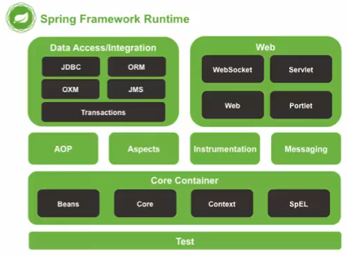
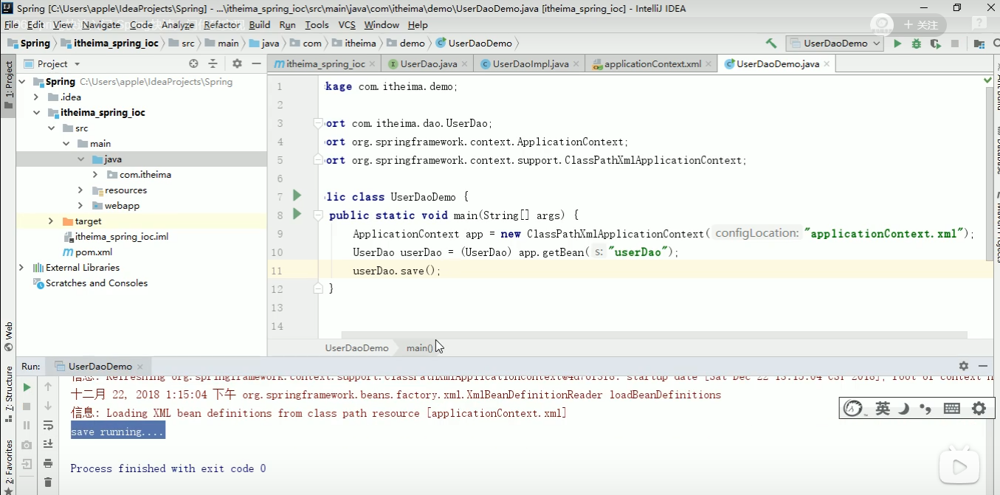

# Java之Spring框架学习笔记

## 一、介绍：

### 1.1.Spring是什么

> Spring是分层的JavaSE/EE应用full-stack轻量级开源框架，以IOC（Inverse Of Control：反转控制）和AOP（Aspect Oriented Programming：面向切面编程）为内核。
>
> 提供了展现层SpringMVC和持久层SpringJDBCTemplate以及业务层事务管理等众多的企业级应用技术，还能整合开源世界众多著名的第三方框架和类库，逐渐成为使用最多的JavaEE企业应用开源框架。

### 1.2.Spring的优势

#### 1)方便解耦，简化开发

> 通过Spring提供的IOC容器，开源将对象间的依赖关系交由Spring进行控制，避免硬编码所造成的多度耦合。
>
> 用户也不必再为单例模式类、属性文件解析等这些很底层的需求编写代码，开源更专注于上层的应用。

#### 2)AOP编程的支持

> 通过Spring的AOP功能，方便进行面向切面编程，许多不容易用传统OOP实现的功能开源通过AOP轻松实现。

#### 3)声明式事务的支持

> 可以将我们从单调烦闷的事务管理代码中解脱出来，通过声明式灵活的进行事务管理，提高开发效率和质量。

#### 4)方便程序的测试

> 可以用非容器依赖的编程方式进行几乎所有的测试工作，测试不再是昂贵的操作，而是随手可做的事情。

#### 5)方便集成各种优秀框架

> Spring对各种优秀框架（Struts、Hibemate、Hessian、Quartz等）的支持。

#### 6)降低JavaEE API的使用难度

> Spring对JavaEE API（JDBC、JavaMail、远程调用等）进行了薄薄的封装层，使这些API的使用难度大为降低。

#### 7)Java源码是经典学习范例

> Spring的源代码设计精妙、结构清晰、匠心独用，处处体现着大师对Java设计模式灵活运用以及对Java技术的高深造诣。它的源代码无意是Java技术的最佳实践的范例。

### 1.3.Spring的体系结构

> 
>
> 

## 二、Spring快速入门

### 2.1.Spring程序开发步骤

#### 1.导入Spring开发的基本包坐标：

> 

#### 2.编写Dao接口和实现类

> 
>
> 

#### 3.创建Spring核心配置文件

> 

#### 4.创建Spring配置文件中配置UserDaoImpI

> 

#### 5.使用Spring的API获得Bean实例

> 

### 2.2.知识要点：Spring的开发步骤

> 1.导入坐标
>
> 2.创建Bean
>
> 3.创建applicationContext.xml
>
> 4.在配置文件中进行配置
>
> 5.创建ApplicationContext对象getBean

## 三、Spring配置文件

### 3.1.Bean标签基本配置

> 用于配置对象交由Spring来创建。
>
> 默认情况下它调用的是类中的无参构造函数，如果没有无参构造函数则不能创建成功。
>
> 基本属性：
>
> * id：Bean实例在Spring容器中的唯一标识
> * class：Bean的全限定名称

### 3.2.Bean标签范围配置

#### 1)scope：指对象的作用范围，取值如下：

> 


#### 2)当scope的取值为singleton时：

> Bean的实例化个数：1个
>
> Bean的实例化时机：当Spring核心文件被加载时，实例化配置的Bean实例
>
> Bean的生命周期：
>
> * 对象创建：当应用加载，创建容器时，对象就被创建了
> * 对象运行：只要容器在，对象一直活着
> * 对象销毁：当应用卸载，销毁容器时，对象就被销毁了

#### 3)当scope的取值为prototype时：

> Bean的实例化个数：多个
>
> Bean的实例化时机：当调用getBean()方法时实例化Bean
>
> * 对象创建：当使用对象，创建新的对象实例
> * 对象运行：只要对象在使用中，就一直活着
> * 对象销毁：当对象长时间不用时，被Java的垃圾回收器回收了

即：

singleton：在ApplicationContext的时候就会创建对象，并且只会是一个对象，当使用getBean的时候引用的也是同一个对象。

prototype：在ApplicationContext的时候并不会创建对象，只会在getBean的时候进行创建，并且每个getBean都会新生成一个对象。

 ### 3.3.Bean生命周期配置

> * init-method：指定类中的初始化方法名称
> * destroy-method：指定类中销毁方法名称

### 3.4.Bean实例化三种方式

> * 无参构造方法实例化
> * 工厂静态方法实例化
> * 工厂实例方法实例化

### 3.5.Bean的依赖注入分析

### 3.6.Bean的依赖注入概念

> 依赖注入（Dependency Injection）：它是Spring框架核心IOC的具体实现。
>
> 在编写程序时，通过控制反转，把对象的创建交给了Spring，但是代码中不可能出现没有依赖的情况。
> 
> IOC解耦只是降低他们的依赖关系，但不会消除。例如：业务层仍会调用持久层的方法。
>
> 那这种业务层和持久层的依赖关系，在使用Spring之后，就让Spring来维护了。
> 
> 简单的说，就是坐等框架把持久层对象传入业务层，而不用我们自己去获取。

### 3.7.Bean的依赖注入方式

#### 怎么将UserDao怎样注入到UserService内部呢？

* 构造方法
* set方法

#### 1)有参构造注入

> 

#### 2)set方法注入

P命名空间注入本质也是set方法注入，但比起上述的set方法注入更加方便，主要体现在配置文件中，如下：

> 首先需要引入P命名空间：
>
> ```xml
> xmlns:p="http://www.springframework.org/schema/p"
> ```
>
> 其次，需要修改注入方式：
>
> ```xml
> <bean id="userService" class="com.itheima.service.impl.UserServiceImpl" p:userDao-ref="userDao"/>
> ```
>
> 

### 3.8.Bean的依赖注入的数据类型

上面的操作，都是注入的引用Bean，除了对象的引用考科一注入，普通数据类型，集合等都可以在容器中进行注入。

#### 注入数据的三种数据类型

* 普通数据类型
* 引用数据类型
* 集合数据类型

> 普通属性的注入：
>
> 
>
> List类型注入：
>
> Map类型注入：

### 3.9.引入其他配置文件（分模块开发）

实际开发中，Spring的配置内容非常多，这就导致Spring配置很繁杂且体积很大，所以，可以将部分配置拆解到其他配置文件中，而在Spring主配置文件通过import标签进行加载。

```xml
<import resource="applicationContext-xxx.xml"/>
```

### 4.0.知识要点：Spring的重点配置

> ```xml
> <bean>标签
>     id属性:在容器中Bean实例的唯一标识，不允许重复
>     class属性:要实例化的Bean的全限定名
>     scope属性:Bean的作用范围，常用是SingLeton（默认）和prototype
>    <property>标签:属性注入
>         name属性:属性名称
>         value属性:注入的普通属性值
>         ref属性:注入的对象引用值
>         <list>标签
>         <map>标签
>             <entry>标签:这个是map使用的
>         <properties>标签
>             <props>这个是Properties使用的标签
>                 <prop>props内的一个标签
>    <constructor-arg>标签
> <import>标签:导入其他的Spring的分文件
> ```
>
> 