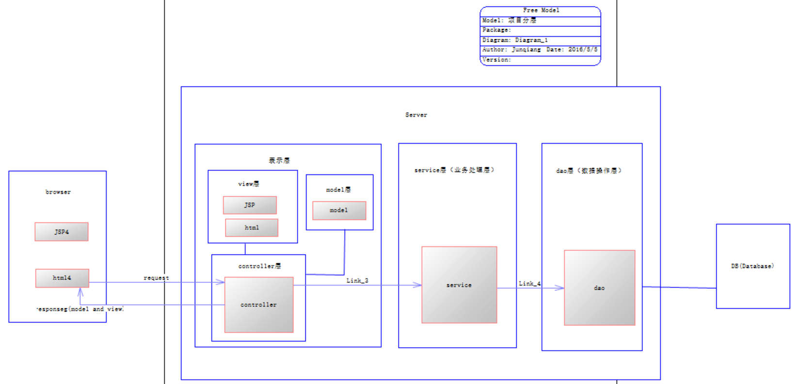

# Java分层思想

***

结构图：

从最常规的分层结构来说，系统层次从上到下依次为：

* 表现层/UI层/界面层：主要是客户端的现实。
* 服务层/业务层：直接为客户端提供的服务或功能。也是系统所能对外提供的功能。
* 领域层：系统内的领域活动。
* DAO层：数据访问对象，通过领域实体对象来操作数据库。

其中有些知道原则（精华）：

1、上层总是依赖其下层，依赖关系不跨层。

2、表现层除外，同一层之间方法不允许相互调用。这是实际开发中一些开发者容易范的错误！如果真是同一层之间存在方法调用，需要注意，这些调用都是一些上层不可见方法，比如一些工具方法等。

3、一切从服务层出发，从系统需要提供的功能进行分析，确定Service接口中的方法。而不是从数据库的表出发，创建DAO，再创Domain，然后Service，这实际上是对系统分层的误解。

4、系统最核心的设计就是将系统中的实体划分为领域模型。在此基础上设计数据的DAO层，并将这些活动暴露给服务层，服务层的实现依赖于领域活动。

5、每个接口的职责范围明确有界。

**service**是业务层 

**action**层即作为控制器

**DAO (Data Access Object)** 数据访问

**1.JAVA中Action层, Service层 ，modle层 和 Dao层的功能区分？（下面所描述的service层就是biz）** 

首先这是现在最基本的分层方式，结合了SSH架构。modle层就是对应的数据库表的实体类。

Dao层是使用了Hibernate连接数据库、操作数据库（增删改查）。

Service（biz）层：引用对应的Dao数据库操作，在这里可以编写自己需要的代码（比如简单的判断）。

Action层：引用对应的Service（biz）层，在这里结合Struts的配置文件，跳转到指定的页面，当然也能接受页面传递的请求数据，也可以做些计算处理。

以上的Hibernate，Struts，都需要注入到Spring的配置文件中，Spring把这些联系起来，成为一个整体。

其他答案： 

　　一般java都是三层架构 数据访问层（dao） 业务逻辑层（biz 或者services） 界面层（ui） 

action 是业务层的一部分，是一个管理器 （总开关）（作用是取掉转）（取出前台界面的数据，调用biz方法，转发到下一个action或者页面）  

模型成（model）一般是实体对象(把现实的的事物变成java中的对象)作用是一暂时存储数据方便持久化（存入数据库或者写入文件）而是 作为一个包裹封装一些数据来在不同的层以及各种java对象中使用  

dao是数据访问层 就是用来访问数据库实现数据的持久化（把内存中的数据永久保存到硬盘中 其他答案： Action是一个控制器 Dao主要做数据库的交互工作 Modle 是模型 存放你的实体类 Biz 做相应的业务逻辑处理  

**2.java中dao层和biz层的区别是什么？ 
**

首先解释面上意思，service是业务层，dao是数据访问层。 

　　呵呵，这个问题我曾经也有过，记得以前刚学编程的时候，都是在service里直接调用dao，service里面就new一个dao类对象，调用，其他有意义的事没做，也不明白有这个有什么用，参加工作久了以后就会知道，业务才是工作中的重中之重。 

　　我们都知道，标准主流现在的编程方式都是采用MVC综合设计模式，MVC本身不属于设计模式的一种，它描述的是一种结构，最终目的达到解耦，解耦说的意思是你更改某一层代码，不会影响我其他层代码，如果你会像spring这样的框架，你会了解面向接口编程，表示层调用控制层，控制层调用业务层，业务层调用数据访问层。初期也许都是new对象去调用下一层，比如你在业务层new一个DAO类的对象，调用DAO类方法访问数据库，这样写是不对的，因为在业务层中是不应该含有具体对象，最多只能有引用，如果有具体对象存在，就耦合了。当那个对象不存在，我还要修改业务的代码，这不符合逻辑。好比主板上内存坏了，我换内存，没必要连主板一起换。我不用知道内存是哪家生产，不用知道多大容量，只要是内存都可以插上这个接口使用。这就是MVC的意义。 接下来说你感觉service的意义，其实因为你现在做东西分层次不是那么严格，在一个你们做东西业务本身也少，举个最简单的例子，你做一个分页的功能，数据1000条，你20条在一个页，你可以把这个功能写成工具类封装起来，然后在业务层里调用这个封装的方法，这才是业务里真正干得事，只要没访问数据库的，都要在业务里写。 

　　再有不明白的追问，这是经验问题，呵呵，其实以后你就会懂。只是刚开始写的代码都是有个请求，我就去数据库取，业务几乎没有。 

其他优秀答案： 比说你现在用的是SSH框架，做一个用户模块： 

 (1)、假设现在你做这个功能会用到user表和权限表，那么你前台的页面访问action，action再去调用用户模块service，用户模块service判断你是操作user表还是权限表，如果你操作的是user表则service的实现类就去调用userDAO。如果是操作的是权限表则调用权限的DAO 

 (2)、也就是说DAO一定是和数据库的每张表一一对应，而service则不是。明白的没？其实你一个项目一个service和一个DAO其实也一样可以操作数据库，
只不过那要是表非常多，出问题了，那找起来多麻烦，而且太乱了 

 (3)、好处就是你的整个项目非常系统化，和数据库的表能一致，而且功能模块化，这样以后维护或者改错比较容易，性能也高一些 
简单的说DAO层是跟数据库打交道的，service层是处理一些业务流程的， 至于你说的为什么要用service层封装，我认为：一般来说，某一个程序的有些业务流程需要连接数据库，有些不需要与数据库打交道而直接是一些业务处理，这样就需要我们整合起来到service中去，这样可以起到一个更好的开发与维护的作用，同时也是MVC设计模式中model层功能的体现 

**3.java中的action是什么，DAO又是什么？** 

Action类 是[获得Form表单数据，并处理逻辑的类] 

　　DAO(Data Access Object) 是一个接口实现[通过SessionFactory获得操作数据库的会话，并实现一些基本的删除 添加 修改数据，在servlet中更实际化业务操作] 

**4. 什么是Pojo类？ 
**

简单的Java对象（Plain Old Java Objects）实际就是普通JavaBeans,使用POJO名称是为了避免和EJB混淆起来, 而且简称比较直接. 其中有一些属性及其getter setter方法的类,有时可以作为value object或dto(Data Transform Object)来使用.当然,如果你有一个简单的运算属性也是可以的,但不允许有业务方法,也不能携带有connection之类的方法。 

**5.pojo类和vo类分别是什么** 

vo有两种说法,一个是viewObject,一个是valueObject..

　　就拿前者来说吧,它只负责封装页面传递过来的数据,这和PO有些不同..

　　就拿struts1来说,ActionForm就是一个典型的viewObject. 而valueObject是页面与页面之间的传递时保存值的对象....

　　总的来说,PO是最终传给BO以及BO传个DAO的东西,他很多情况下与我们真正的数据库表想对应.

　　而viewObject是一个页面上提交后的数据,不一定完全和PO的属性相同.... 

**pojo与DTO的区别**

ational Mapping（对象关系映射）的缩写。通俗点讲，就是将对象与关系数据库绑定，用对象来表示关系数据。

在O/R Mapping的世界里，有两个基本的也是重要的东东需要了解，即VO，PO。

 VO，值对象(Value Object)，PO，持久对象(Persisent Object)，它们是由一组属性和属性的get和set方法组成。从结构上看，它们并没有什么不同的地方。但从其意义和本质上来看是完全不同的。

1．VO是用new关键字创建，由GC回收的。 

 PO则是向数据库中添加新数据时创建，删除数据库中数据时削除的。并且它只能存活在一个数据库连接中，断开连接即被销毁。 

2．VO是值对象，精确点讲它是业务对象，是存活在业务层的，是业务逻辑使用的，它存活的目的就是为数据提供一个生存的地方。 

 PO则是有状态的，每个属性代表其当前的状态。它是物理数据的对象表示。使用它，可以使我们的程序与物理数据解耦，并且可以简化对象数据与物理数据之间的转换。

3．VO的属性是根据当前业务的不同而不同的，也就是说，它的每一个属性都一一对应当前业务逻辑所需要的数据的名称。 
 PO的属性是跟数据库表的字段一一对应的。

PO对象需要实现序列化接口。

\-------------------------------------------------

PO是持久化对象，它只是将物理数据实体的一种对象表示，为什么需要它？因为它可以简化我们对于物理实体的了解和耦合，简单地讲，可以简化对象的数据转换为物理数据的编程。VO是什么？它是值对象，准确地讲，它是业务对象，是生活在业务层的，是业务逻辑需要了解，需要使用的，再简单地讲，它是概念模型转换得到的。 

首先说PO和VO吧，它们的关系应该是相互独立的，一个VO可以只是PO的部分，也可以是多个PO构成，同样也可以等同于一个PO（当然我是指他们的属性）。正因为这样，PO独立出来，数据持久层也就独立出来了，它不会受到任何业务的干涉。又正因为这样，业务逻辑层也独立开来，它不会受到数据持久层的影响，业务层关心的只是业务逻辑的处理，至于怎么存怎么读交给别人吧！不过，另外一点，如果我们没有使用数据持久层，或者说没有使用hibernate，那么PO和VO也可以是同一个东西，虽然这并不好。 

\----------------------------------------------------

**java的(PO,VO,TO,BO,DAO,POJO)解释
**

**PO(persistant object) 持久对象** 

在o/r映射的时候出现的概念，如果没有o/r映射，没有这个概念存在了。通常对应数据模型(数据库),本身还有部分业务逻辑的处理。可以看成是与数据库中的表相映射的java对象。最简单的PO就是对应数据库中某个表中的一条记录，多个记录可以用PO的集合。PO中应该不包含任何对数据库的操作。 

**VO(value object) 值对象 
**

通常用于业务层之间的数据传递，和PO一样也是仅仅包含数据而已。但应是抽象出的业务对象,可以和表对应,也可以不,这根据业务的需要.个人觉得同DTO(数据传输对象),在web上传递。 

**TO(Transfer Object)，数据传输对象**

在应用程序不同tie(关系)之间传输的对象 

**BO(business object) 业务对象** 

从业务模型的角度看,见UML元件领域模型中的领域对象。封装业务逻辑的java对象,通过调用DAO方法,结合PO,VO进行业务操作。 

**POJO(plain ordinary java object) 简单无规则java对象**

纯的传统意义的java对象。就是说在一些Object/Relation Mapping工具中，能够做到维护数据库表记录的persisent object完全是一个符合Java Bean规范的纯Java对象，没有增加别的属性和方法。我的理解就是最基本的Java Bean，只有属性字段及setter和getter方法！。 

**DAO(data access object) 数据访问对象 
**

是一个sun的一个标准j2ee设计模式，这个模式中有个接口就是DAO，它负持久层的操作。为业务层提供接口。此对象用于访问数据库。通常和PO结合使用，DAO中包含了各种数据库的操作方法。通过它的方法,结合PO对数据库进行相关的操作。夹在业务逻辑与数据库资源中间。配合VO, 提供数据库的CRUD操作... 

**O/R Mapper 对象/关系 映射  
**

定义好所有的mapping之后，这个O/R Mapper可以帮我们做很多的工作。通过这些mappings,这个O/R Mapper可以生成所有的关于对象保存，删除，读取的SQL语句，我们不再需要写那么多行的DAL代码了。 

实体Model(实体模式) 

DAL(数据访问层) 

IDAL(接口层) 

DALFactory(类工厂) 

BLL(业务逻辑层) 

BOF   Business Object Framework    业务对象框架 

SOA   Service Orient Architecture   面向服务的设计 

EMF   Eclipse Model Framework     Eclipse建模框架

\----------------------------------------

PO：全称是persistant object持久对象，最形象的理解就是一个PO就是数据库中的一条记录。好处是可以把一条记录作为一个对象处理，可以方便的转为其它对象。

BO：全称是business object:业务对象。主要作用是把业务逻辑封装为一个对象。这个对象可以包括一个或多个其它的对象。
比如一个简历，有教育经历、工作经历、社会关系等等。

我们可以把教育经历对应一个PO，工作经历对应一个PO，社会关系对应一个PO。建立一个对应简历的BO对象处理简历，每个BO包含这些PO。这样处理业务逻辑时，我们就可以针对BO去处理。
VO ：

**value object值对象
**

**ViewObject表现层对象**

主要对应界面显示的数据对象。对于一个WEB页面，或者SWT、SWING的一个界面，用一个VO对象对应整个界面的值。
DTO ：

Data Transfer Object数据传输对象

主要用于远程调用等需要大量传输对象的地方。

比如我们一张表有100个字段，那么对应的PO就有100个属性。

但是我们界面上只要显示10个字段，客户端用WEB service来获取数据，没有必要把整个PO对象传递到客户端，这时我们就可以用只有这10个属性的DTO来传递结果到客户端，这样也不会暴露服务端表结构.到达客户端以后，如果用这个对象来对应界面显示，那此时它的身份就转为VO

**POJO ：
**

plain ordinary java object 简单java对象，个人感觉POJO是最常见最多变的对象，是一个中间对象，也是我们最常打交道的对象。

一个POJO持久化以后就是PO，直接用它传递、传递过程中就是DTO，直接用来对应表示层就是VO

**DAO：
**

**data access object数据访问对象**

这个大家最熟悉，和上面几个O区别最大，基本没有互相转化的可能性和必要。

主要用来封装对数据库的访问。通过它可以把POJO持久化为PO，用PO组装出来VO、DTO

\-----------------------------------------------------------------

**PO:persistant object持久对象**,可以看成是与数据库中的表相映射的java对象。最简单的PO就是对应数据库中某个表中的一条记录，多个记录可以用PO的集合。PO中应该不包含任何对数据库的操作.                                            

**VO:value object值对象。**通常用于业务层之间的数据传递，和PO一样也是仅仅包含数据而已。但应是抽象出的业务对象,可以和表对应,也可以不,这根据业务的需要.个人觉得同DTO(数据传输对象),在web上传递. 

**DAO:data access object数据访问对象**，此对象用于访问数据库。通常和PO结合使用，DAO中包含了各种数据库的操作方法。通过它的方法,结合PO对数据库进行相关的操作. 

**BO:business object业务对象**,封装业务逻辑的java对象,通过调用DAO方法,结合PO,VO进行业务操作; POJO:plain ordinary java object 简单无规则java对象,我个人觉得它和其他不是一个层面上的东西,VO和PO应该都属于它。

\---------------------------------------------

VO：值对象、视图对象

PO：持久对象

QO：查询对象

DAO：数据访问对象

DTO：数据传输对象

\----------------------------------------

struts 里的 ActionForm 就是个VO;

hibernate里的 实体bean就是个PO,也叫POJO;

hibernate里的Criteria 就相当于一个QO;

在使用hibernate的时候我们会定义一些查询的方法,这些方法写在接口里,可以有不同的实现类.而这个接口就可以说是个DAO.

个人认为QO和DTO差不多.

\----------------------------------------

PO或叫BO，与数据库最接近的一层，是ORM中的O，基本上是数据库字段对应BO中的一个属性，为了同步与安全性考虑，最好只给DAO或者Service调用，而不要用packcode,backingBean,或者BO调。

DAO，数据访问层，把VO，backingBean中的对象可以放入。。。。

DTO，很少用，基本放入到DAO中，只是起到过渡的作用。

QO，是把一些与持久性查询操作与语句放入。。

VO，V层中用到的基本元素与方法等放其中。如果要其调用BO，则要做BO转换VO，VO转换BO操作。VO的好处是其页面的元素属性多于BO，可起到很好的作用。。。。

\----------------------------------------

楼上的不对吧，PO是持久化对象。BO＝business object—业务对象。

PO可以严格对应数据库表，一张表对映一个PO。

BO则是业务逻辑处理对象，我的理解是它装满了业务逻辑的处理，在业务逻辑复杂的应用中有用。

VO：value object值对象、view object视图对象

PO：持久对象

QO：查询对象

DAO：数据访问对象——同时还有DAO模式

DTO：数据传输对象——同时还有DTO模式

**总结**

以上就是本文关于Java分层概念详解的全部内容.