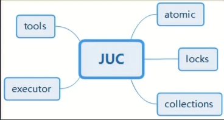
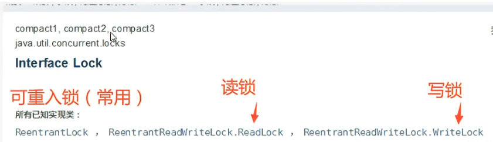
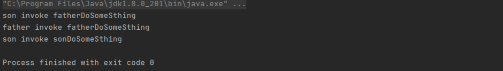

# Java并发编程

----


## 1、java-JUC快速入门

---

### 1.1、JUC是什么？

> JUC是java.util.concurrent包的简称，在Java5.0天加，目的就是为了更好的支持高并发任务。让开发者进行多线程编程时减少竞争条件和死锁的问题！

### 1.2、进程与线程的区别：

> 进程：一个运行中的程序的集合；一个进程往往可以包含多个线程，至少包含一个线程
>
> Java默认有几个线程？
>
> 答案为两个，一个main线程，一个gc线程
>
> 线程：线程（thread）是操作系统能够进行运算调度的最小单位。

### 1.3、并发与并行的区别：

> 并发（多线程操作同一个资源，交替执行）
>
> CPU一核，模拟出来多条线程，天下武功，唯快不破，快速交替。
>
> 并行（多个人一起行走，同时进行）
>
> CPU多核，多个线程同时进行；使用线程池操作

### 1.4、线程有六种状态：

```java
public enum State {
    //新生
    NEW,
    //运行
    RUNNABLE,
    //堵塞
    BLOCKED,
    //等待
    WAITING,
    //超时等待
    TIMED_WAITING,
    //终止
    TERMINATED
}
```

### 1.5、wait/sleep的区别：

> 1、来自不同的类：wait来自object类，sleep来自线程类
>
> 2、关于所的释放：wait会释放锁，sleep不会释放锁
>
> 3、使用的范围不同：wait必须在同步代码块中，sleep可以在热河地方睡眠

## 2、JUC的结构



> 1、tools（工具类）：又叫信号量三组工具类，包含有：
>
> 1）CountDownLatch（闭锁）是一个同步辅助类，在完成一组正在其他线程执行的操作之前，它允许一个或多个线程一直等待。
>
> 2）CyclicBarrier（栅栏）之所以叫barrier，是因为是一个同步辅助类，允许一组线程互相等待，直到到达某个公共屏障点，并且在释放等待线程后可重用。
>
> 3）Semaphore（信号量）是一个计数信号量，他的本质是一个”共享锁“。信号量维护了一个信号量许可集。线程可以通过调用acquire()来获取信号量的许可；当信号量中有可用的许可时，线程能获取该许可；否则线程必须等待，直到有可用的许可为止。线程可以通过release()来释放它所持有的信号量许可证。
>
> 2，executor(执行者)：是Java里面线程池的顶级接口，但它只是一个执行线程的工具，真正的线程池接口是ExecutorService，里面包含的类有：
>
> 1）ScheduledExecutorService 解决那些需要任务重复执行的问题
>
> 2）ScheduledThreadPoolExecutor 周期性任务调度的类实现
>
> 3，atomic(原子性包)：是JDK提供的一组原子操作类，
>
> 包含有AtomicBoolean、AtomicInteger、AtomicIntegerArray等原子变量类，他们的实现原理大多是持有它们各自的对应的类型变量value，而且被volatile关键字修饰了。这样来保证每次一个线程要使用它都会拿到最新的值。
>
> 4，locks（锁包）：是JDK提供的锁机制，相比synchronized关键字来进行同步锁，功能更加强大，它为锁提供了一个框架，该框架允许更灵活地使用锁包含的实现类有：
>
> 1）ReentrantLock 它是独占锁，是指只能被独自占领，即同一个时间点只能被一个线程锁获取到的锁。
>
> 2）ReentrantReadWriteLock 它包括子类ReadLock和WriteLock。ReadLock是共享锁，而WriteLock是独占锁。
>
> 3）LockSupport 它具备阻塞线程和解除阻塞线程的功能，并且不会引发死锁。
>
> 5，collections(集合类)：主要是提供线程安全的集合， 比如：
>
> 1）ArrayList对应的高并发类是CopyOnWriteArrayList，
>
> 2）HashSet对应的高并发类是 CopyOnWriteArraySet，
>
> 3）HashMap对应的高并发类是ConcurrentHashMap等等

下面具体来学习一下多线程创建及使用方法：

普通的线程代码，之前都是用thread或者runable接口的；

具体实现如下：

```java
public class demo01{
    public static void main(String[] args){
        ThreadDemo threadDemo = new ThreadDemo();
        threadDemo.start();
        new Thread(new ThreadDemo2()).start();
    }
}

class ThreadDemo extends Thread{
   @Override
   public void run(){
       System.out.println("普通线程已开启（继承Thread）");
   }
}

class ThreadDemo2 implements Runnable{
    @Override
    public void run(){
        System.out.println("普通线程已开启（实现Runnable接口）");
    }
}
```

程序运行结果：

> ```shell
> 普通线程已开启（继承Thread）
> 普通线程已开启（实现Runnbale接口）
> ```
>
> 

## 3、Lock锁（重点）

传统synchronized

synchronized是Java中的关键字，是一种同步锁。它修饰的对象有以下几种：

1. 修饰一个代码块，或修饰的代码块称为同步语句块，其作用的范围是大括号{}括起来的代码，作用的对象是调用这个代码块的对象；
2. 修饰一个方法，被修饰的方法称为同步方法，其作用的对象是调用这个方法的对象；
3. 修饰一个静态的方法，其作用的范围是整个静态方法，作用的对象是这个类的所有对象；
4. 修饰一个类，其作用的范围是synchronized后面括号括起来的部分，作用主要的对象是这个类的所有对象。

Lock接口

> 随着这种添加的灵活性，额外的责任。没有结构化锁定会删除使用synchronized方法和语句发生的锁的自动释放。在大多数情况下，应使用以下惯用语：
>
> ```java
> Lock l = ...  l.lock(); //加锁
> try{
>        // access the resource protected by this lock
> } finally {
>        l.unlock();  //解锁
> }
> ```
>
> 实现类
>
> 
>
> reentrantLock构造器
>
> ```java
> public ReentrantLock(){
>     sync = new NonfairSync(); //无参默认非公平锁
> }
> public ReentrantLock(boolean fair){
>     sync = fair ? new FairSync() : new NonfairSync(); //传参为true为公平锁
> }
> ```
>
> 公平锁：十分公平，可以先来后到，一定要排队
>
> 非公平锁：释放不公平，可以插队（默认）
>
> ```java
> public class SaleTicketDemo {
>        public static void main(String[] args){
>            Ticket ticket = new Ticket();
>         
>            new Thread(()->{for(int i =0 ; i < 40 ; ++i) ticket.sale();},"a").start();
>            new Thread(()->{for(int i =0 ; i < 40 ; ++i) ticket.sale();},"b").start();
>            new Thread(()->{for(int i =0 ; i < 40 ; ++i) ticket.sale();},"c").start();
>         
>        }
> }
> 
> class Ticket{
>        private int ticketNum = 30;
>        private Lock lock = new ReentrantLock();
>     
>        public void sale() {
>            lock.lock();
>            try {
>                if(this.ticketNum > 0) {
>                    System.out.println(Thread.currentThread().getName() + "购得第" + ticketNum-- + "张票, 剩余" + ticketNum + "张票");
>                }
>                Thread.sleep(10);
>            } catch (Exception e) {
>                e.printStackTrace();
>            } finally {
>                lock.unlock();
>            }
>        }
> }
> ```

### synchronized和lock锁的区别

1. synchronized内置的java 关键字，Lock是一个java类
2. synchronized无法判断获取锁的状态，Lock可以判断是否获取到了锁
3. synchronized会自动释放锁，Lock必须要手动释放锁！！如果不释放锁，会产生死锁
4. synchronized线程1（获得锁，阻塞），线程2（等待）；Lock锁就不一定会等待下去
5. synchronized可重入锁，不可以中断的，非公平的；Lock锁，可重入的，可以判断锁，非公平（可自己设置）
6. synchronized适合锁少量的代码同步问题，Lock适合锁大量的同步代码


### 什么是可重入的？

说明：所谓可重入就是说某个线程已经获得某个锁，可以再次获取锁而不会出现死锁。

synchronized是基于原子性的内部锁机制，是可重入的，因此在一个线程调用synchronized方法的同时在其方法体内部调用该对象另一个synchronized方法，也就是说一个线程得到一个对象锁后再次请求该对象锁，是允许的，这就是synchronized的可重入性。

下面给个代码示例：

```java
public class Son extends Father {

    public static void main(String[] args) {
        Son son = new Son();
        son.sonDoSomeSthing();
    }

    public synchronized void sonDoSomeSthing(){
        fatherDoSomeSthing();
        System.out.println("son invoke sonDoSomeSthing");
    }

    @Override
    public synchronized void fatherDoSomeSthing() {
        System.out.println("son invoke fatherDoSomeSthing");
        super.fatherDoSomeSthing();
    }
}

public class Father {

    public synchronized void fatherDoSomeSthing(){
        System.out.println("father invoke fatherDoSomeSthing");
    }
}
```

执行结果：



从上述代码示例可以看到调用的三个方法均得到了执行。当synchronized修饰普通方法时，使用的是对象锁，也就是Son对象。三个方法的锁都是Son对象。我们在子类中执行sonDoSomeSthing方法时，获取了Son对象锁，然后在sonDoSomeSthing时调用了重写父类的fatherDoSomeSthing方法，该方法的锁也是Son对象锁，然后在其中调用父类的fatherDoSomeSthing方法，该方法的锁也是Son对象锁。一个锁多次请求均调用成功，可见synchronized是可重入锁。

### synchronized可重入锁的实现原理：

synchronized底层是利用计算机系统mutex Lock实现的。每一个可重入锁都会关联一个线程ID和一个锁状态status。

当一个线程请求方法时，会去检查锁状态。

1. 如果锁状态是0，代表该锁没有被占用，使用CAS操作获取锁，将线程ID替换成自己的线程ID。
2. 如果锁状态不是0，代表有线程在访问该方法。此时，如果线程ID是自己的线程ID，如果是可重入锁，会将status自增1，然后获取到该锁，进而执行相应的方法；如果是非重入锁，就会进入阻塞队列等待。

在释放锁时，

1. 如果是可重入锁的，每一次退出方法，就会将status减1，直至status的值为0，最后释放该锁。
2. 如果非可重入锁的，线程退出方法，直接就会释放该锁。

### Condition准确的通知和唤醒线程

> Condition是一个接口，基本的方法就是await()和signal()方法；
>
> Condition依赖于Lock接口，生成一个Condition的基本代码是Lock.newCondition()
>
> 调用Condition的await()和signal()方法，都必须在lock保护之内，就是说必须在lock.lock()和lock.unlock之间才可以使用Condition中的await()对应Object的wait()；
>
> Condition中signal()对应Object的notify();
>
> Condition中signalAll()对应Object的notifyAll()。
>
> | 对比项                                               | Object Monitor Methods        | Condition                                                    |
> | ---------------------------------------------------- | ----------------------------- | ------------------------------------------------------------ |
> | 前置条件                                             | 获取对象的锁                  | 调用Lock.lock()获取锁<br>调用Lock.newCondition()获取Condition对象 |
> | 调用方法                                             | 直接调用<br>如：object.wait() | 直接调用<br>如：condition.awati()                            |
> | 等待队列个数                                         | 一个                          | 多个                                                         |
> | 当前线程释放锁并进入等待状态                         | 支持                          | 支持                                                         |
> | 当前线程释放锁并进入等待状态，在等待状态中不响应中断 | 不支持                        | 支持                                                         |
> | 当前线程释放锁并进入超时等待状态                     | 支持                          | 支持                                                         |
> | 当前线程释放锁并进入等待状态到将来的某个时间         | 不支持                        | 支持                                                         |
> | 唤醒等待队列中的一个线程                             | 支持                          | 支持                                                         |
> | 唤醒等待队列中的全部线程                             | 支持                          | 支持                                                         |

### Condition常见例子（生产者消费者模式（完成加一减一各一次操作）：

```java
import java.util.concurrent.locks.Condition;
import java.util.concurrent.locks.Lock;
import java.util.concurrent.locks.ReentrantLock;

public class PC {
    public static void main(String[] args) {
        a a = new a();
        new Thread(()->{
            for (int i =0;i<10;i++){
                a.increment();
            }
        },"A").start();
        new Thread(()->{
            for (int i =0;i<10;i++){
                a.decrease();
            }
        },"B").start();


    }

}
class  a{
    public int nummber=0;
    Lock lock = new ReentrantLock();
    Condition condition = lock.newCondition();
    public   void  increment(){
        lock.lock();
        try {
            while(nummber!=0){
                condition.await();
            }
            nummber++;
            System.out.println(Thread.currentThread().getName()+">>"+nummber);
            condition.signalAll();
        }
        catch (InterruptedException e) {
            e.printStackTrace();
        } finally {
            lock.unlock();
        }

    }
    public  void decrease(){
        lock.lock();
        try {
            while(nummber!=1){
                condition.await();
            }
            nummber--;
            System.out.println(Thread.currentThread().getName()+">>"+nummber);
            condition.signalAll();
        }
        catch (InterruptedException e) {
            e.printStackTrace();
        } finally {
            lock.unlock();
        }
    }
}
```

