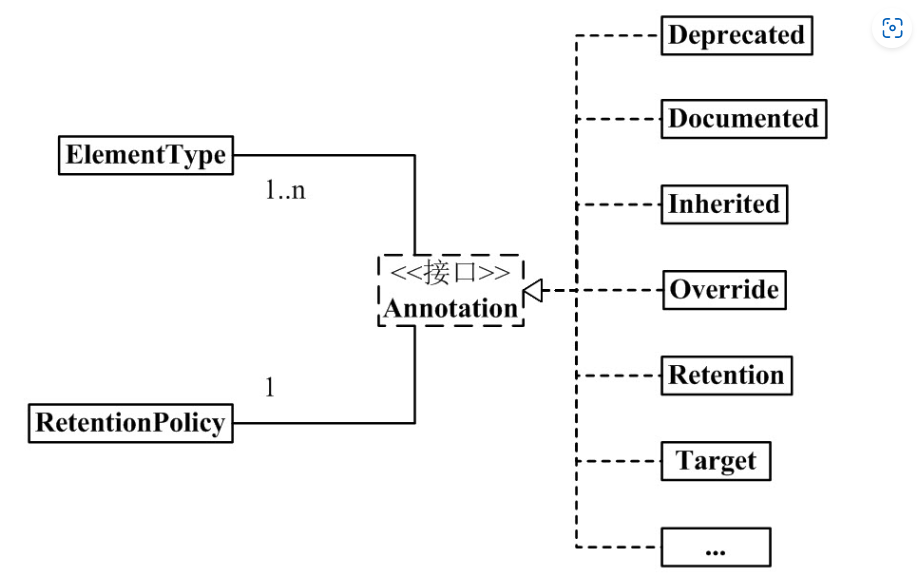
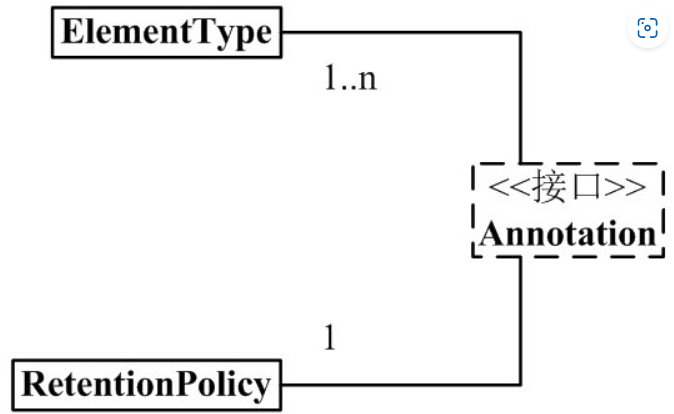
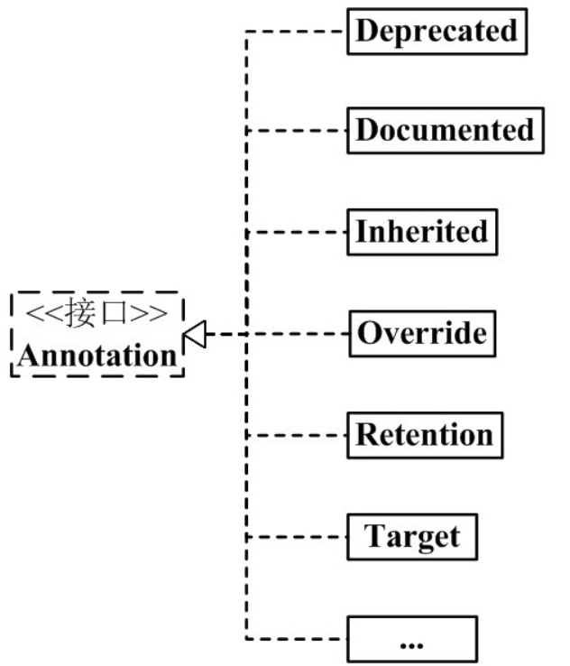

# Java注解编程及AOP编程

---

Java注解（Annotation）又称Java标注，是JDK5.0引入的一种注释机制。

Java语言中的类、方法、变量、参数和包等都可以被标注。和 Javadoc 不同，Java 标注可以通过反射获取标注内容。在编译器生成类文件时，标注可以被嵌入到字节码中。Java 虚拟机可以保留标注内容，在运行时可以获取到标注内容 。 当然它也支持自定义 Java 标注。

网上很多关于 Java Annotation 的文章，看得人眼花缭乱。Java Annotation 本来很简单的，结果说的人没说清楚；弄的看的人更加迷糊。

我按照自己的思路，对 Annotation 进行了整理。理解 Annotation 的关键，是理解 Annotation 的语法和用法，对这些内容，我都进行了详细说明；理解 Annotation 的语法和用法之后，再看 Annotation 的框架图，可能有更深刻体会。废话就说这么多，下面开始对 Annotation 进行说明。若您发现文章中存在错误或不足的地方，希望您能指出！


## 内置的注解

---

Java定义了一套注解，共有7个，3个在java.lang中，剩下4个在java.lang.annotation中。

### 作用在代码的注解是

* @Override：检查该方法是否是重写方法。如果发现其父类，或者是引用的接口中并没有该方法时，会报编译错误。
* @Deprecated：标记过时方法。如果使用该方法，会报编译警告。
* @SuppressWarnings：指示编译器去忽略注解中申明的警告。

### 作用在其他注解的注解（或者说 元注解）是

* Retention：标识这个注解怎么保存，是只在代码中，还是编入class文件中，或者是在运行时可以通过反射访问。
* @Documented：标记这些注解是否包含在用户文档中。
* Target：标记这个注解应该是那种Java成员。
* Inherited：标记这个注解是继承于哪个注解类（默认 注解并没有继承于任何子类）

### 从Java7开始，额外添加了3个注解

* @SafeVarargs：Java7开始支持，忽略任何使用参数为泛型变量的方法或构造函数调用产生的警告。
* @Functionallnterface：Java8开始支持，标识一个匿名函数或函数式接口。
* @Repeatable：Java8开始支持，标识某注解可以在同一个申明上使用多次。


## Annotation架构

---



从中，我们可以看出：

* 1个Annotation和1个RetentionPolicy关联。

  > 可以理解为：每1个Annotation对象，都会有唯一的RetentionPolicy属性。

* 1个Annotation和1~n个ElementType关联。

  > 可以理解为：对于每1个Annotation对象，可以有若干个ElementType属性。

* Annotation有许多实现类，包括：Deprecated，Documented，Inherited，Override等等。

  > Annotation的每个实现类，都“和1个RetentionPolicy关联”并且“和1~n个ElementType关联”。
  >
  > 下面，我先介绍框架图的左半边（如下图），即Annotation，RetentionP，ElementType；然后在就Annotation的实现类进行举例说明。
  >
  > 


## Annotation组成部分

---

Java Annotation的组成中，有3个非常重要的主干类。它们分别是：

Annotation.java：

```java
package java.lang.annotation;
public interface Annotation {
    boolean equals(Object obj);
    
    int hashCode();
    
    String toString();
    
    Class<? extends Annotation> annotationType();
}
```

ElementType.java：

```java
package java.lang.annotation;
public enum ElementType {
    TYPE, /*类、接口（包括注释类型）或枚举声明*/
    FIELD, /*字段声明（包括枚举常量）*/
    METHOD, /*方法声明*/
    PARAMETER, /*参数声明*/
    CONSTRUCTOR, /*构造方法声明*/
    LOCAL_VARIABLE, /*局部变量声明*/
    ANNOTATION_TYPE, /*注释类型申明*/
    PACKAGE /*包声明*/
}
```

RetentionPolicy.java：

```java
package java.lang.annotation;

public enum RetentionPolicy {
    SOURCE, /*Annotation信息仅存在于编译器处理期间，编译器处理完之后就没有该Annotation信息了*/
    CLASS, /*编译器Annotation存储于类对应de.class文件中。默认行为*/
    RUNTIME /*编译器将Annotation存储于class文件中，并且可由JVM读入*/
}
```

说明：

* Annotation就是个接口。

  > “每1个Annotation”都与“1个RetentionPolicy”关联，并且与 "1～n 个 ElementType" 关联。可以通俗的理解为：每 1 个 Annotation 对象，都会有唯一的 RetentionPolicy 属性；至于 ElementType 属性，则有 1~n 个。

* ElementType 是 Enum 枚举类型，它用来指定 Annotation 的类型。

  > "每 1 个 Annotation" 都与 "1～n 个 ElementType" 关联。当 Annotation 与某个 ElementType 关联时，就意味着：Annotation有了某种用途。例如，若一个 Annotation 对象是 METHOD 类型，则该 Annotation 只能用来修饰方法。

*  RetentionPolicy 是 Enum 枚举类型，它用来指定 Annotation 的策略。通俗点说，就是不同 RetentionPolicy 类型的 Annotation 的作用域不同。

  > "每 1 个 Annotation" 都与 "1 个 RetentionPolicy" 关联。
  >
  > * a) 若 Annotation 的类型为 SOURCE，则意味着：Annotation 仅存在于编译器处理期间，编译器处理完之后，该 Annotation 就没用了。 例如，" @Override" 标志就是一个 Annotation。当它修饰一个方法的时候，就意味着该方法覆盖父类的方法；并且在编译期间会进行语法检查！编译器处理完后，"@Override" 就没有任何作用了。
  > * b) 若 Annotation 的类型为 CLASS，则意味着：编译器将 Annotation 存储于类对应的 .class 文件中，它是 Annotation 的默认行为。
  > * c) 若 Annotation 的类型为 RUNTIME，则意味着：编译器将 Annotation 存储于 class 文件中，并且可由JVM读入。
  >
  > 这时，只需要记住"每 1 个 Annotation" 都与 "1 个 RetentionPolicy" 关联，并且与 "1～n 个 ElementType" 关联。学完后面的内容之后，再回头看这些内容，会更容易理解。


## java 自带的 Annotation

---

理解了上面的 3 个类的作用之后，我们接下来可以讲解 Annotation 实现类的语法定义了。

1）Annotation通用定义

```java
@Documented
@Target(ElementType.TYPE)
@Retention(RetentionPolicy.RUNTIME)
public @interface MyAnnotation1 {
    
}
```

说明：

上面的作用是定义一个 Annotation，它的名字是 MyAnnotation1。定义了 MyAnnotation1 之后，我们可以在代码中通过 "@MyAnnotation1" 来使用它。 其它的，@Documented, @Target, @Retention, @interface 都是来修饰 MyAnnotation1 的。下面分别说说它们的含义：

**(01) @interface**

使用 @interface 定义注解时，意味着它实现了 java.lang.annotation.Annotation 接口，即该注解就是一个Annotation。

定义 Annotation 时，@interface 是必须的。

注意：它和我们通常的 implemented 实现接口的方法不同。Annotation 接口的实现细节都由编译器完成。通过 @interface 定义注解后，该注解不能继承其他的注解或接口。

**(02) @Documented**

类和方法的 Annotation 在缺省情况下是不出现在 javadoc 中的。如果使用 @Documented 修饰该 Annotation，则表示它可以出现在 javadoc 中。

定义 Annotation 时，@Documented 可有可无；若没有定义，则 Annotation 不会出现在 javadoc 中。

**(03) @Target(ElementType.TYPE)**

前面我们说过，ElementType 是 Annotation 的类型属性。而 @Target 的作用，就是来指定 Annotation 的类型属性。

@Target(ElementType.TYPE) 的意思就是指定该 Annotation 的类型是 ElementType.TYPE。这就意味着，MyAnnotation1 是来修饰"类、接口（包括注释类型）或枚举声明"的注解。

定义 Annotation 时，@Target 可有可无。若有 @Target，则该 Annotation 只能用于它所指定的地方；若没有 @Target，则该 Annotation 可以用于任何地方。

**(04) @Retention(RetentionPolicy.RUNTIME)**

前面我们说过，RetentionPolicy 是 Annotation 的策略属性，而 @Retention 的作用，就是指定 Annotation 的策略属性。

@Retention(RetentionPolicy.RUNTIME) 的意思就是指定该 Annotation 的策略是 RetentionPolicy.RUNTIME。这就意味着，编译器会将该 Annotation 信息保留在 .class 文件中，并且能被虚拟机读取。

定义 Annotation 时，@Retention 可有可无。若没有 @Retention，则默认是 RetentionPolicy.CLASS。


### 2）java自带的Annotation

通过上面的示例，我们能理解：@interface 用来声明 Annotation，@Documented 用来表示该 Annotation 是否会出现在 javadoc 中， @Target 用来指定 Annotation 的类型，@Retention 用来指定 Annotation 的策略。

理解这一点之后，我们就很容易理解 java 中自带的 Annotation 的实现类，即 Annotation 架构图的右半边。如下图：



**java 常用的 Annotation：**

```
@Deprecated  -- @Deprecated 所标注内容，不再被建议使用。
@Override    -- @Override 只能标注方法，表示该方法覆盖父类中的方法。
@Documented  -- @Documented 所标注内容，可以出现在javadoc中。
@Inherited   -- @Inherited只能被用来标注“Annotation类型”，它所标注的Annotation具有继承性。
@Retention   -- @Retention只能被用来标注“Annotation类型”，而且它被用来指定Annotation的RetentionPolicy属性。
@Target      -- @Target只能被用来标注“Annotation类型”，而且它被用来指定Annotation的ElementType属性。
@SuppressWarnings -- @SuppressWarnings 所标注内容产生的警告，编译器会对这些警告保持静默。
```

由于 "@Deprecated 和 @Override" 类似，"@Documented, @Inherited, @Retention, @Target" 类似；下面，我们只对 @Deprecated, @Inherited, @SuppressWarnings 这 3 个 Annotation 进行说明。

**2.1) @Deprecated**

@Deprecated 的定义如下：

```
@Documented
@Retention(RetentionPolicy.RUNTIME)
public @interface Deprecated {
}
```

说明：

- (01) @interface -- 它的用来修饰 Deprecated，意味着 Deprecated 实现了 java.lang.annotation.Annotation 接口；即 Deprecated 就是一个注解。 (02) @Documented -- 它的作用是说明该注解能出现在 javadoc 中。
- (03) @Retention(RetentionPolicy.RUNTIME) -- 它的作用是指定 Deprecated 的策略是 RetentionPolicy.RUNTIME。这就意味着，编译器会将Deprecated 的信息保留在 .class 文件中，并且能被虚拟机读取。
- (04) @Deprecated 所标注内容，不再被建议使用。

例如，若某个方法被 @Deprecated 标注，则该方法不再被建议使用。如果有开发人员试图使用或重写被 @Deprecated 标示的方法，编译器会给相应的提示信息。示例如下:
