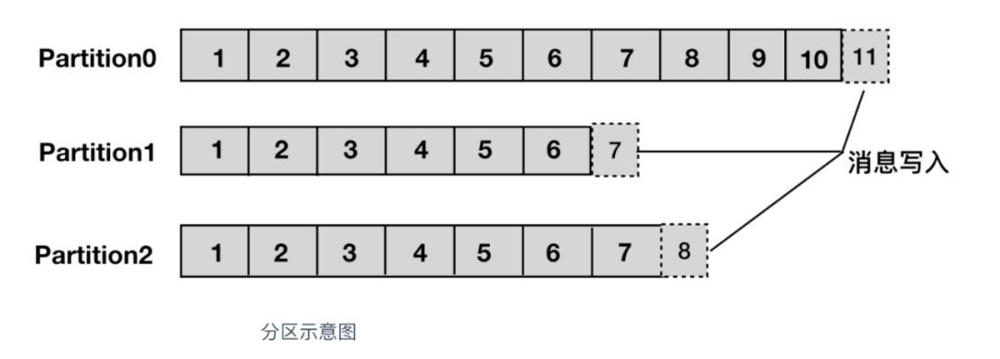
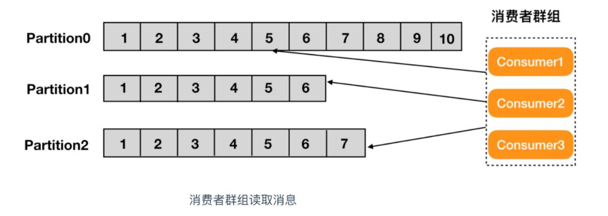
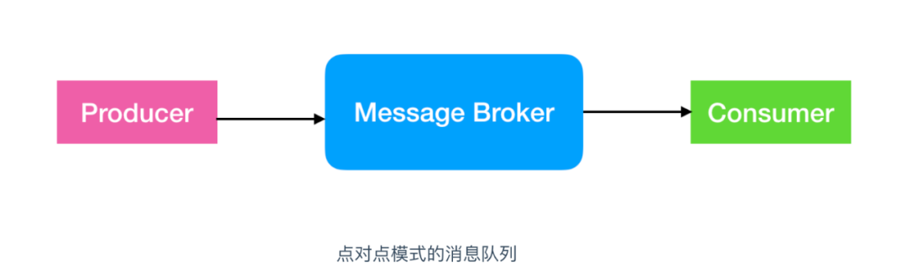
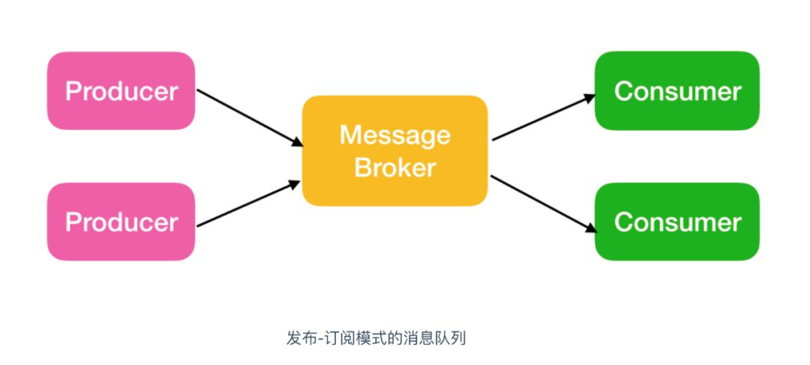
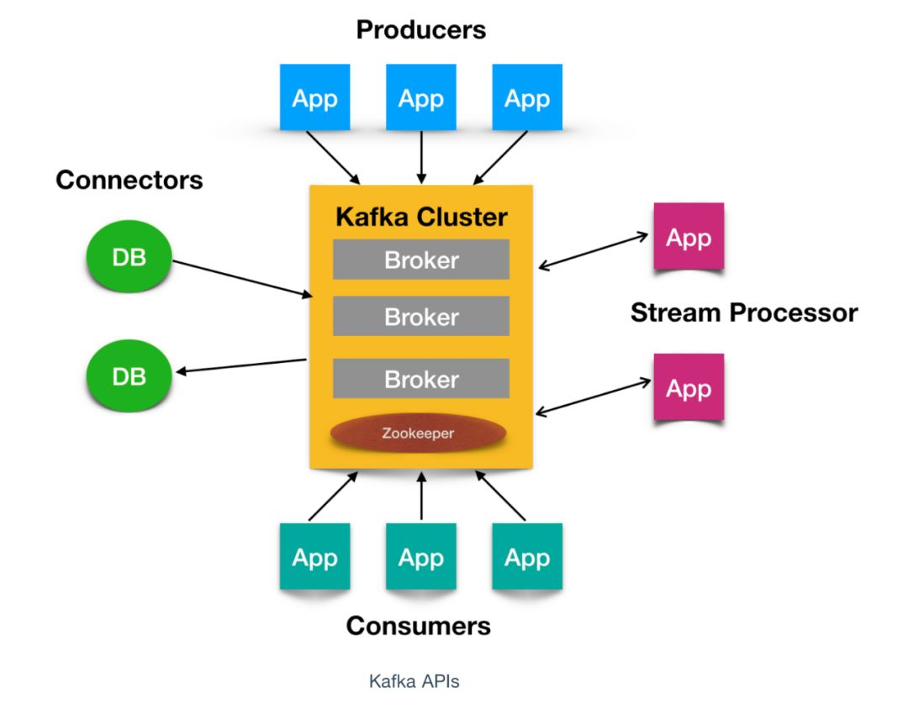

# Kafka使用

---

### **什么是 Kafka**

Kafka 是由 `Linkedin` 公司开发的，它是一个分布式的，支持多分区、多副本，基于 Zookeeper 的分布式消息流平台，它同时也是一款开源的**基于发布订阅模式的消息引擎系统**。

### **Kafka 的基本术语**

* 消息：Kafka 中的数据单元被称为`消息`，也被称为记录，可以把它看作数据库表中某一行的记录。

* 批次：为了提高效率， 消息会`分批次`写入 Kafka，批次就代指的是一组消息。

* 主题：消息的种类称为 `主题`（Topic）,可以说一个主题代表了一类消息。相当于是对消息进行分类。主题就像是数据库中的表。

* 分区：主题可以被分为若干个分区（partition），同一个主题中的分区可以不在一个机器上，有可能会部署在多个机器上，由此来实现 kafka 的`伸缩性`，单一主题中的分区有序，但是无法保证主题中所有的分区有序

  

* 生产者：向主题发布消息的客户端应用程序称为`生产者`（Producer），生产者用于持续不断的向某个主题发送消息。

* 消费者：订阅主题消息的客户端程序称为`消费者`（Consumer），消费者用于处理生产者产生的消息。

* 消费者群组：生产者与消费者的关系就如同餐厅中的厨师和顾客之间的关系一样，一个厨师对应多个顾客，也就是一个生产者对应多个消费者，`消费者群组`（Consumer Group）指的就是由一个或多个消费者组成的群体。

  

* 偏移量：`偏移量`（Consumer Offset）是一种元数据，它是一个不断递增的整数值，用来记录消费者发生重平衡时的位置，以便用来恢复数据。

* broker: 一个独立的 Kafka 服务器就被称为 `broker`，broker 接收来自生产者的消息，为消息设置偏移量，并提交消息到磁盘保存。

* broker 集群：broker 是`集群` 的组成部分，broker 集群由一个或多个 broker 组成，每个集群都有一个 broker 同时充当了`集群控制器`的角色（自动从集群的活跃成员中选举出来）。

* 副本：Kafka 中消息的备份又叫做 `副本`（Replica），副本的数量是可以配置的，Kafka 定义了两类副本：领导者副本（Leader Replica） 和 追随者副本（Follower Replica），前者对外提供服务，后者只是被动跟随。

* 重平衡：Rebalance。消费者组内某个消费者实例挂掉后，其他消费者实例自动重新分配订阅主题分区的过程。Rebalance 是 Kafka 消费者端实现高可用的重要手段。

### **Kafka 的特性（设计原则）**

- `高吞吐、低延迟`：kakfa 最大的特点就是收发消息非常快，kafka 每秒可以处理几十万条消息，它的最低延迟只有几毫秒。
- `高伸缩性`：每个主题(topic) 包含多个分区(partition)，主题中的分区可以分布在不同的主机(broker)中。
- `持久性、可靠性`：Kafka 能够允许数据的持久化存储，消息被持久化到磁盘，并支持[数据备份](https://cloud.tencent.com/solution/backup?from_column=20065&from=20065)防止数据丢失，Kafka 底层的数据存储是基于 Zookeeper 存储的，Zookeeper 我们知道它的数据能够持久存储。
- `容错性`：允许集群中的节点失败，某个节点宕机，Kafka 集群能够正常工作
- `高并发`：支持数千个客户端同时读写

### **Kafka 的使用场景**

- 活动跟踪：Kafka 可以用来跟踪用户行为，比如我们经常回去淘宝购物，你打开淘宝的那一刻，你的登陆信息，登陆次数都会作为消息传输到 Kafka ，当你浏览购物的时候，你的浏览信息，你的搜索指数，你的购物爱好都会作为一个个消息传递给 Kafka ，这样就可以生成报告，可以做智能推荐，购买喜好等。
- 传递消息：Kafka 另外一个基本用途是传递消息，应用程序向用户发送通知就是通过传递消息来实现的，这些应用组件可以生成消息，而不需要关心消息的格式，也不需要关心消息是如何发送的。
- 度量指标：Kafka也经常用来记录运营监控数据。包括收集各种分布式应用的数据，生产各种操作的集中反馈，比如报警和报告。
- 日志记录：Kafka 的基本概念来源于提交日志，比如我们可以把数据库的更新发送到 Kafka 上，用来记录数据库的更新时间，通过kafka以统一接口服务的方式开放给各种consumer，例如hadoop、Hbase、Solr等。
- 流式处理：流式处理是有一个能够提供多种应用程序的领域。
- 限流削峰：Kafka 多用于互联网领域某一时刻请求特别多的情况下，可以把请求写入Kafka 中，避免直接请求后端程序导致服务崩溃。

### **Kafka 的消息队列**

Kafka 的[消息队列](https://cloud.tencent.com/product/message-queue-catalog?from_column=20065&from=20065)一般分为两种模式：点对点模式和发布订阅模式

Kafka 是支持消费者群组的，也就是说 Kafka 中会有一个或者多个消费者，如果一个生产者生产的消息由一个消费者进行消费的话，那么这种模式就是点对点模式

如果一个生产者或者多个生产者产生的消息能够被多个消费者同时消费的情况，这样的消息队列成为发布订阅模式的消息队列

### **Kafka 系统架构**

如上图所示，一个典型的 Kafka 集群中包含若干Producer（可以是web前端产生的Page View，或者是服务器日志，系统CPU、Memory等），若干broker（Kafka支持水平扩展，一般broker数量越多，集群吞吐率越高），若干Consumer Group，以及一个Zookeeper集群。Kafka通过Zookeeper管理集群配置，选举leader，以及在Consumer Group发生变化时进行rebalance。Producer使用push模式将消息发布到broker，Consumer使用pull模式从broker订阅并消费消息。

### **核心 API**

Kafka 有四个核心API，它们分别是

- Producer API，它允许应用程序向一个或多个 topics 上发送消息记录
- Consumer API，允许应用程序订阅一个或多个 topics 并处理为其生成的记录流
- Streams API，它允许应用程序作为流处理器，从一个或多个主题中消费输入流并为其生成输出流，有效的将输入流转换为输出流。
- Connector API，它允许构建和运行将 Kafka 主题连接到现有应用程序或数据系统的可用生产者和消费者。例如，关系数据库的连接器可能会捕获对表的所有更改

### **Kafka 为何如此之快**

Kafka 实现了`零拷贝`原理来快速移动数据，避免了内核之间的切换。Kafka 可以将数据记录分批发送，从生产者到文件系统（Kafka 主题日志）到消费者，可以端到端的查看这些批次的数据。

批处理能够进行更有效的数据压缩并减少 I/O 延迟，Kafka 采取顺序写入磁盘的方式，避免了随机磁盘寻址的浪费，更多关于磁盘寻址的了解，请参阅 [**程序员需要了解的硬核知识之磁盘**](https://cloud.tencent.com/developer/tools/blog-entry?target=https%3A%2F%2Fmp.weixin.qq.com%2Fs%3F__biz%3DMzU2NDg0OTgyMA%3D%3D%26mid%3D2247484654%26idx%3D1%26sn%3D9b6f5aaad05a49416e8f30e6b86691ae%26chksm%3Dfc45f91dcb32700b683b9a13d0d94d261171d346333d73967a4d501de3ecc273d67e8251aeae%26token%3D674527772%26lang%3Dzh_CN%26scene%3D21%23wechat_redirect&objectId=1547380&objectType=1&isNewArticle=undefined) 。

总结一下其实就是四个要点

- 顺序读写
- 零拷贝
- 消息压缩
- 分批发送

### **Kafka 安装和重要配置**

Kafka 安装我在 Kafka 系列第一篇应该比较详细了，详情见[**带你涨姿势的认识一下kafka**](https://cloud.tencent.com/developer/tools/blog-entry?target=https%3A%2F%2Fmp.weixin.qq.com%2Fs%3F__biz%3DMzU2NDg0OTgyMA%3D%3D%26mid%3D2247484570%26idx%3D1%26sn%3D1ad1c96bc7d47b88e976cbd045baf7d7%26chksm%3Dfc45f969cb32707f882c52d7434b2c0bf2ccbbc2cd854e1dc5c203deb8ae9c1831cf216e8bad%26token%3D674527772%26lang%3Dzh_CN%26scene%3D21%23wechat_redirect&objectId=1547380&objectType=1&isNewArticle=undefined) 这篇文章。

那我们还是主要来说一下 Kafka 中的重要参数配置吧，这些参数对 Kafka 来说是非常重要的。

