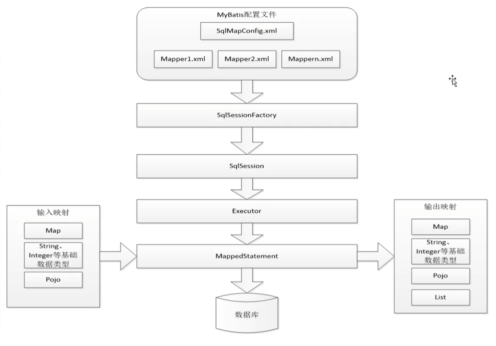
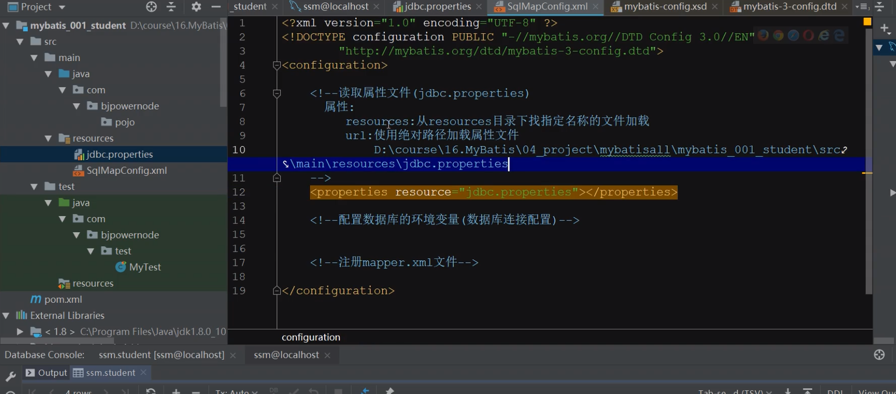
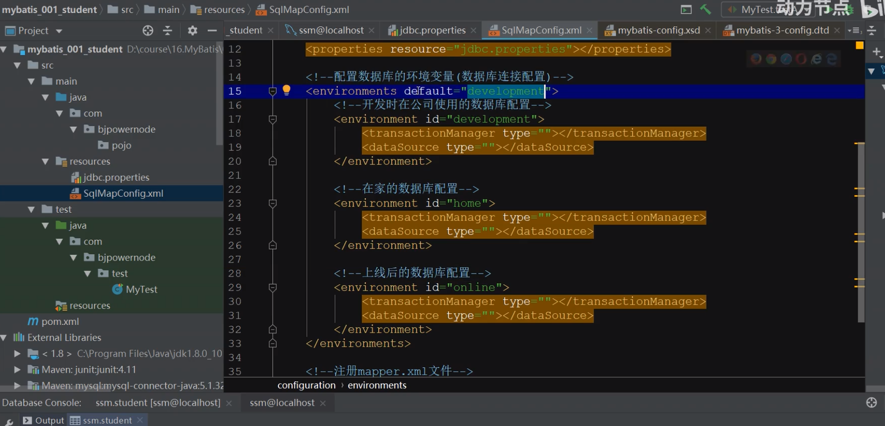
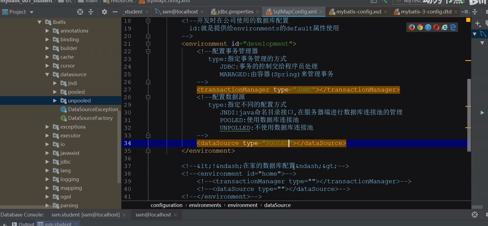
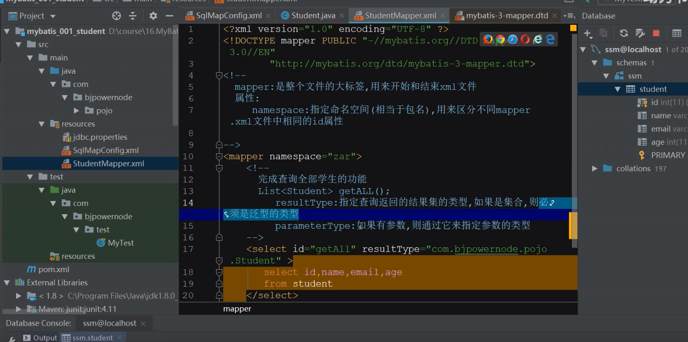
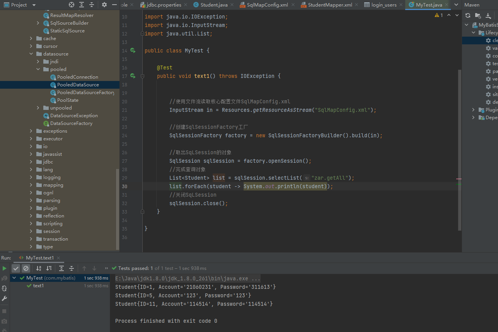
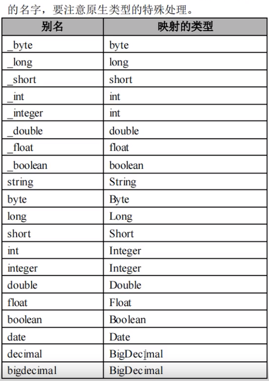
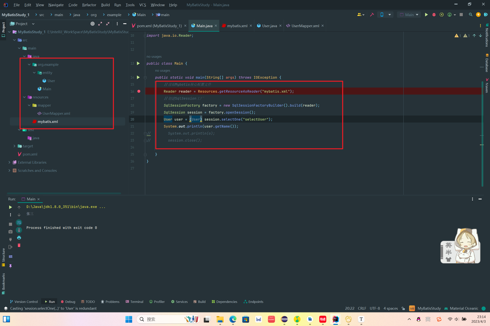

# MyBatis框架学习

## 1.常用的框架SSM：

> Spring：它是整合其它框架的框架，它的核心是IOC和AOP，它由20多个模块组成，在很多领域都提供了很好的解决方案，是一个大佬级别的存在。
>
> SpringMVC：它是Spring家族的一员，专门用来优化控制器（Servlet）的。提供了极简单数据提交，数据携带，页面跳转等功能。
>
> MyBatista：是持久层的一个框架，用来进行数据库访问的优化，专注于SQL语句，极大的简化了JDBC的访问。

## 2.什么是框架

> 它是一个半成品软件，将所有的公共的，重复的功能解决掉，帮助程序员快速高效的进行开发，它是可复用，可扩展的。
>
> 

## 3.什么是MyBatis框架

> MyBatis本是apache的一个开源框架iBatis，2010年这个项目由apache software foundation迁移到了Google code ， 并且改名为MyBatis。2013年11月迁移到Github，最新版本是MyBatis 3.5.7，其发布时间是2021年4月7日。
>
> MyBatis完成数据访问层的优化，它专注于sql语句，简化了过去JDBC繁琐的访问。

## 4.MyBatis框架解决的主要问题

> 减轻使用JDBC的复杂性，不用编写重复的创建Connection，Statement；不用编写关闭资源代码。直接使用Java对象，表示结果数据。让开发者专注SQL的处理。其他分心的工作由MyBatis代劳。

## 5.MyBatis可以完成：

> 注册数据库的驱动，例如：Class.forName("com.mysql.jdbc.Driver");
>
> 创建JDBC中必须使用的Connection，Statement，ResultSet对象
>
> 从xml中获取SQL，并执行SQL语句，把ResultSet结果转换Java对象
>
> ```java 
> List<Student> list  = new ArrayLsit<>();
> 
> ResultSet rs = state.executeQuery("select * from student");
> 
> while(rs.next){
> 
>     Student student - new Student();
>     student.setName(rs.getString("name"));
>     student.setAge(ts.getInt("age"));
>     list.add(student);
> 
> }
> ```
>
> 

## 6.MyBatis框架结构

> 

## 7.添加框架的步骤

### 1）添加依赖

### 2）添加配置文件

### 具体步骤：

> 1.新建库建表
>
> 2.新建maven项目，选quickstart模板
>
> 3.修改目录，添加缺失的目录，修改目录属性
>
> 4.修改pom.xml文件，添加MyBatis的依赖，添加Mysql的依赖
>
> 5.修改pom.xml文件，添加资源文件指定
>
> 6.在idea中添加数据库的可视化
>
> 7.添加jdbc.properties属性文件（数据库的配置）
>
> 8.添加SqlMapConfig.xml文件，MyBatis的核心配置文件
>
> 9.创建实体类Student，用来封装数据
>
> 10.添加完成学生表的增删改查的功能的StudentMapper.xml文件
>
> 11.创建测试类，进行功能测试

## 8.文件配置：

### 核心文件配置：

> 
>
> 
>
> default所对应值表示所引用的是哪个数据库配置
>
> 
>
> 其中<transactionManager>为配置事务管理器

### SQL操作

> 
>
> SQL操作时在另外一个xml文件单独写的

### 查询Java代码实例：

> 

### Java对应MyBatis的类型别名：

> 


<foreach>参数详解：
    collection：用来指定入参的类型，如果是List集合，则为list，如果是Map集合，则为map，如果是数组，则为array。

​	item：每次循环遍历出来的值或对象。（注意里面的值必须与#{}里面的值相同）

​	sepatator：多个值或对象或语句之间的分割符。

​	open：整个循环外面的前括号。

​	close：整个循环外面的后括号。


---

## 从这里截断


## 一、批量插入的的例子：

UsersMapper.java（接口）

```java
int insertBatch(List<Users> list);
```


UsersMapper.xml

```xml
<insert id="insertBatch">
	insert into users(username,birthday,sex,address) values
    <foreach collection="list" item="u" separator=",">
    	(#{u.userName},#{u.birthday},#{u.sex},#{u.address})
    </foreach>
</insert>
```


## 二、入参是map（重点掌握）

> 如果入参超过一个以上，使用map封装查询条件，更有语义，查询条件更明确

### 1.返回值是map(一条map)

如果返回的数据实体类无法包含，可以使用map返回多张表中的若干数据，返回后这些数据之间没有任何关系，就是object类型。返回的map的key就是列名或别名。

### 2.返回值是多行的map


### 3.查询表名与实体类属性名不一致解决方案

> sql语句中添加别名
>
> 使用resultMap：
>
> ```xml
> <!--
> property对应实体类属性的变量名
> column对应sql中所对应查询表名或者表明所对应的标签名
> 首先要key主键绑定，然后非主键的绑定
> --> 
> <resultMap id="bookmap" type="book">
> <!--        主键绑定-->
>         <id property="id" column="bookid"></id>
> 
> <!--        非主键绑定-->
>         <result property="name" column="bookname"></result>
>     </resultMap>
>     <select id="getAll" resultMap="bookmap">
>         select username,address
>         from users
>     </select>
> ```
>
> ```java
> @Test
> public void test_7(){
>      UsersMapper uMapper = sqlSession.getMapper(UsersMapper.class);
>     List<Book> list = uMapper.getAll();
>     list.forEach(book->System.out.println(book));
> }
> ```

## 三、表之间的关联关系

关联关系是有方向的。（电商项目不会使用关联关系，因为会大大拖慢速度）

* 一对多关联：一个老师可以教多个学生，多个学生只有一个老师来教，站在老师方，就是一对多关联。
* 多对一关联：一个老师可以教多个学生，多个学生只有一个老师来教，站在学生方，就是多对一关联。
* 一对一关联：一个老师辅导一个学生，一个学生只请教一个老师。学生和老师是一对一。
* 多对多关联：园区划线的车位和园区的每一辆车。任意一个车位可以停任意一辆车。任意一辆车可以停在任意一个车位上。 

### 1.一对多关联关系

> 客户和订单就是典型的一对多关联关系。
>
> 一个客户名下可以有多个订单。
>
> 客户表是一方，订单表是多方。


## Update表更新操作

---

## 1. update 标签
update 标签是用于定义更新 语句的.

### 1.1 常用属性

update 有几个常用的属性, 但是通常只需要设置id 即可.

* id: sql 片段在命名空间内的唯一标识. 和mapper 中方法名保持一致
* parameterType: 参数类型, 通常都可以省略.
* flushCache: 是否刷新(清空)一级缓存和二级缓存, 默认为true. 笔者尝试设置为false,并不生效. 所以使用默认即可.
* timeout: sql 执行超时时间, 默认未设置, 由数据库驱动决定.
* statementType: 执行sql时使用的statement类型, 默认为PREPARED. 可选值为:STATEMENT，PREPARED 或 CALLABLE 的一个

```xml
<update id="deleteAuthor" parameterType="domain.blog.Author" flushCache="true" statementType="PREPARED" timeout="20">
</update> 
```

### 1.2 返回值

- 我们知道, jdbc 执行更新语句时, 返回的是sql 执行影响的记录条数. Mybatis 可将此返回结果自动封装为int , long, boolean 以及其对应的包装类型.
- 对于不同的返回类型, sql 片段的写法是完全一致的

**Mapper中方法定义:**

```xml
// 返回值为空
void update(EmployeePO emp);

// 返回值为布尔类型
boolean update(EmployeePO emp);

// 返回值为删除的条数
long update(EmployeePO emp);
```

**sql 片段:**

```xml
<update id="update">
    update t_employee
    set id = #{id}, name = #{name}, sex=#{sex}, entryDate =#{entryDate}
    where id = #{id}
</update>
```

## 2. update 标签举例

### 2.1 sql 片段

```xml
<!-- 通过id 删除 -->
<update id="update">
    update t_employee
    set id = #{id}, name = #{name}, sex=#{sex}, entryDate =#{entryDate}
    where id = #{id}
</update>

<!-- 更新不为空的属性 -->
<update id="updateNotNull">
    update t_employee
    <set >
        <if test="name != null">
            name = #{name},
        </if>
        <if test="sex != null">
            sex = #{sex},
        </if>
        <if test="entryDate != null">
            entryDate = #{entryDate},
        </if>
    </set>
    where id = #{id}
</update>
```

### 2.2 mapper 文件

```xml
public interface EmployeeMapper {

    // 修改
    long update(EmployeePO employeePO);

    // 更新不为空的属性
    boolean updateNotNull(EmployeePO employeePO);
}
```

### 2.3 测试类

```xml
// 测试更新方法
@Test
public void update(){

    EmployeeMapper employeeMapper = SqlSessionUtil.getMapper(EmployeeMapper.class, true);

    EmployeePO employeePO = employeeMapper.findById(1L);

    employeePO.setName(employeePO.getId() + "_" + employeePO.getName());

    long flag = employeeMapper.update(employeePO);

    Assert.assertEquals(1L, flag);
}

// 测试更新方法
@Test
public void updateNotNull(){

    EmployeeMapper employeeMapper = SqlSessionUtil.getMapper(EmployeeMapper.class, true);

    EmployeePO employeePO = new EmployeePO(null, 26, "W",LocalDate.now());
    employeePO.setId(1L);

    employeeMapper.updateNotNull(employeePO);
}
```


##  MyBatis框架自动POJO的Bean注入规则：

1. 当POJO只有一个有参构造函数将会通过这个构造函数进行输入，否则将直接报错。
2. 当POJO没有任何手写的构造函数时MyBatis框架将会使用set注入。
3. 当有多个构造函数时且没有的无参构造那么MyBatis就只会从这些有参构造进行注入，如果没有一个能匹配的上的话就会报错，但是如果有手写了无参构造的话如果有参构造没有匹配的注入将会进行set注入避免报错。
   总结：从以上能够看出Mybatis结合Spring框架自动进行POJO注入时的优先顺序是：先构造，后set。


## Mapper的xml和Mapper的Java接口的关系

> 说明：Mapper的Java接口不是必须的，也可以不写Mapper对应的Java接口直接使用Mapper的xml，这里要注意的是单纯的使用MyBatis，Mapper的xml中的namespace和对应的sql的id都代表的是唯一id的意思没有其他关联的用途，除非设定绑定




## MyBatis中特殊符号转义符

### 1、转译特殊符号方式

注释：严格地讲，在 XML 中仅有字符 "<"和"&" 是非法的。省略号、引号和大于号是合法的，但是把它们替换为实体引用是个好的习惯。

| 符号     | 原符号 | 替换符号   |
| -------- | ------ | ---------- |
| 小于     | <      | \&lt;      |
| 小于等于 | <=     | \&lt;<=    |
| 大于     | >      | \&gt;      |
| 大于小于 | >=     | \&gt;=     |
| 不等于   | <>     | \&lt;\&gt; |
| 与       | &      | \&amp;     |
| 单引号   | ’      | \&apos;    |
| 双引号   | "      | \&quot;    |

* mapper文件写法：

  ```sql
  select * form tablenme t where t.code &lt;&gt; 1
  ```

### 2、使用 CDATA 区段

所有XML文档中的文本均会被解析器解析。只有CDATA区段（CDATA section）中的文本会被解析器忽略。

```sql
大于等于 <![CDATA[ >= ]]>  
小于等于 <![CDATA[ <= ]]> 
不等于<![CDATA[ <> ]]>
 
mapper文件写法： 
select t.* form tablenme t where t.code <![CDATA[<>]]> 1
```


## Where和if标签的使用

---

```xml
<select id="getPerson" resultType="com.lzj.bean.Employee">
    select * from tbl_employee
    <where>
        <!-- test：判断表达式（OGNL）
        遇见特殊符号应该去写转义字符：&&、''等字符
        -->
        <if test="id!=null">
            id=#{id}
        </if>
        <if test="lastName!=null and lastName!=''">
            and last_name like #{lastName}
        </if>
        <if test="email!=null and email.trim()!=''">
            and email=#{email}
        </if> 
        <!-- ognl会进行字符串与数字的转换判断  "0"==0 -->
        <if test="gender==0 or gender==1">
            and gender=#{gender}
        </if>
    </where>
 </select>
```

注意，`<if>`失败后， `<where>` 关键字只会去掉库表字段赋值前面的and，不会去掉语句后面的and关键字，即注意，`<where>` 只会去掉`<if>` 语句中的最开始的and关键字。所以下面的形式是不可取的

```xml
<select id="getPerson" resultType="com.lzj.bean.Employee">
    select * from tbl_employee
    <where>
        <if test="id!=null">
            id=#{id} and
        </if>
        <if test="lastName!=null and lastName!=''">
            last_name like #{lastName} and
        </if>
        <if test="email!=null and email.trim()!=''">
            email=#{email} and
        </if> 
        <if test="gender==0 or gender==1">
            gender=#{gender}
        </if>
    </where>
 </select>
```

