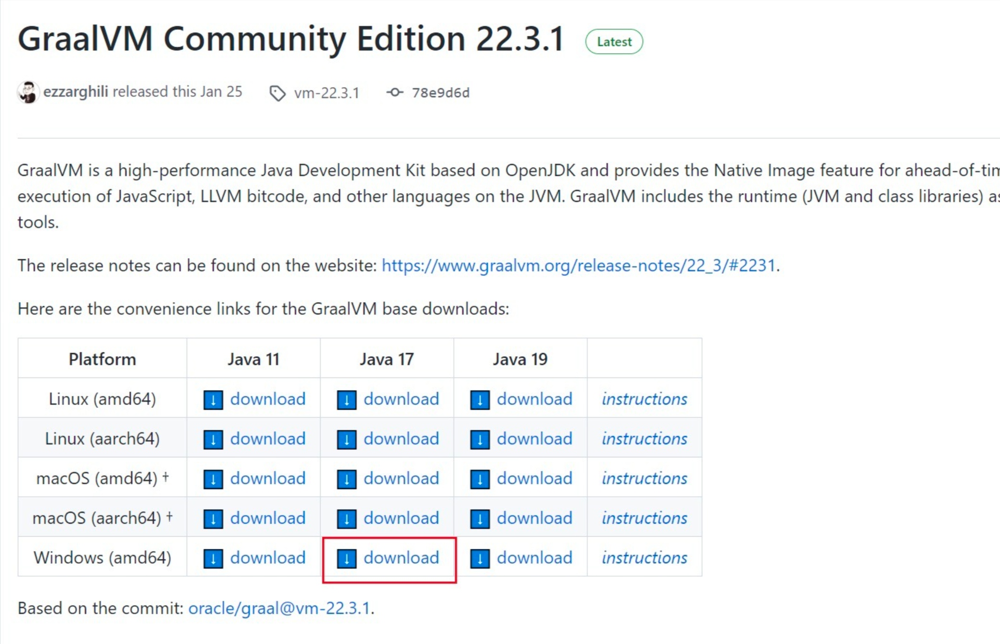
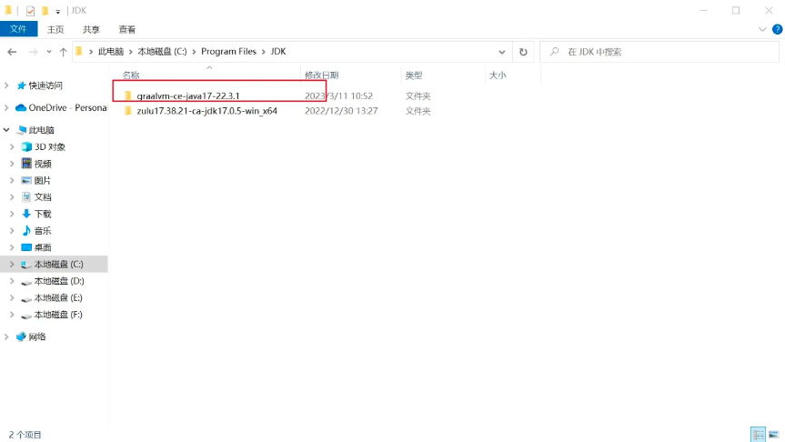
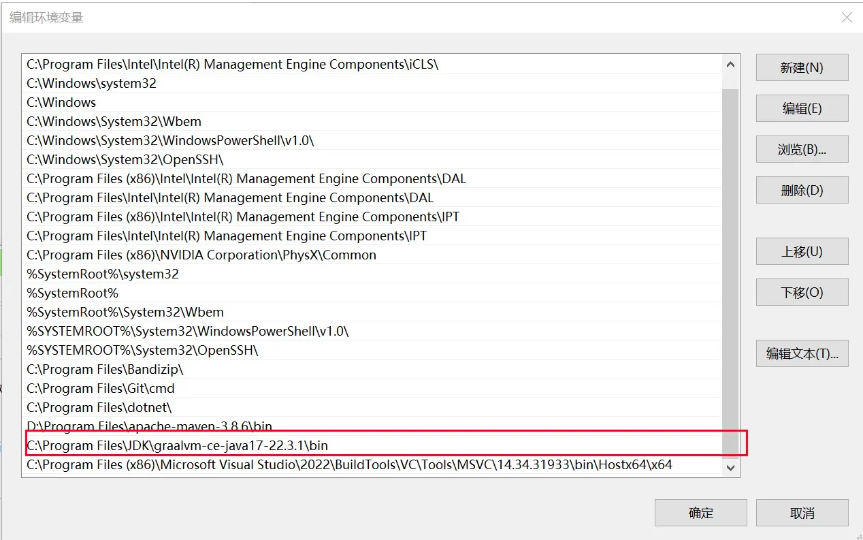
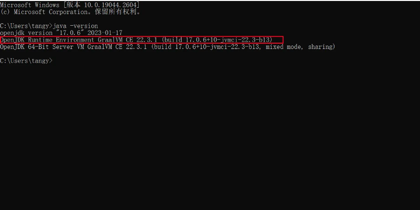
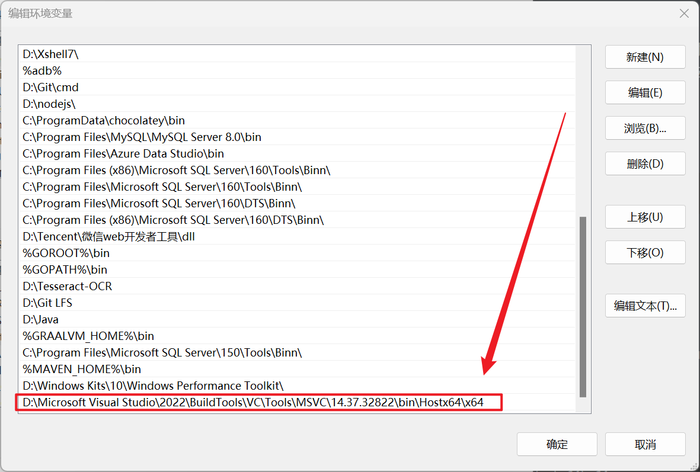
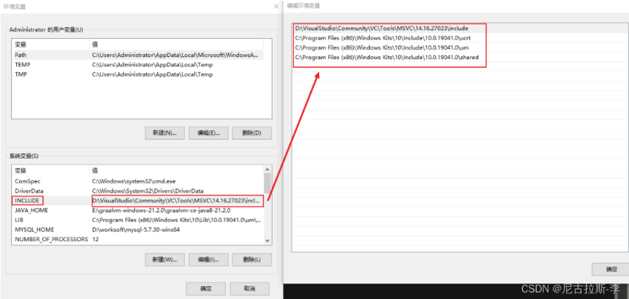
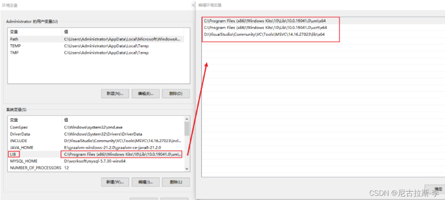

# Native-image技术与应用

---


## 1. 背景相关

---

作为一个程序员，总是会在工作的时候开发一些方便自己工作的程序，但是作为一个Java程序员，给自己或者朋友开发的办公小程序总是使用一个Jar包并不是一个很好的体验，主要是：

- 启动不方便
- 需要Java环境
- 有时候打出来的Jar比较大，不便于分享传输

但是现在有了GraalVM，让这些都不是问题了，直接生成可执行程序，丢哪哪就能用


## 2. GraalVM

---

GraalVM是一款高性能的虚拟机，它能够直接将Java程序编译成本地可执行文件，可以在不安装JVM的情况下运行程序。当然了它的特性远不止这些，比如支持多语言，更低的内存占用等等，但这些并不是这篇博客所涉及的，有兴趣可以去他们的[官网](https://www.graalvm.org/)里了解一下。


## 3.安装GraalVM JDK

---

下载界面：[https://github.com/graalvm/graalvm-ce-builds/releases/tag/vm-22.3.1](https://link.zhihu.com/?target=https%3A//github.com/graalvm/graalvm-ce-builds/releases/tag/vm-22.3.1)

这里用到的是Java 17版本：




下载完成之后，放入你本地的JDK目录，例如：



接着配置变量环境：



通过cmd测试一下看看是否配置环境成功：




## 安装native-image

> Native Image是**一种将Java代码提前编译为独立可执行文件的技术**，此刻执行文件包括应用程序类、依赖、运行时库以及JDK静态连接的本机代码。 Graalvm通过子模块SubstrateVM来支持Native Image，相比JVM其生成的程序具有更快的启动时间和更低的运行时开销。
>
> 需要在管理员模式下打开一个cmd窗口，然后执行：
>
> ```cmd
> gu install native-image
> ```


## 安装Visual studio

> 为了打包成exe可执行程序，这一步也是不可避免需要做的，这里推荐安装2019版本之后的，我安装的是visual studio 2022，下载地址：[https://visualstudio.microsoft.com](https://visualstudio.microsoft.com/zh-hans/vs/)


## 配置Cl.exe环境

>  安装完成以后我们还需要一些配置，不然直接进行打包会失败，这个要根据你VS安装的路径来，比如：
>
>  ```text
> D:\Microsoft Visual Studio\2022\BuildTools\VC\Tools\MSVC\14.34.31933\bin\Hostx64\x64
>  ```
>
>  
>


添加graal-sdk的maven依赖

> ```xml
> <dependency>
>     <groupId>org.graalvm.sdk</groupId>
>     <artifactId>graal-sdk</artifactId>
>     <version>21.3.0</version>
>     <scope>provided</scope>
> </dependency>
> ```

在打包成jar包之后你需要利用跟踪代理运行应用程序生成对应的配置文件：

> 执行此命令前注意你的idea配置的JDK也需要是GraalVM JDK
>
> ```bash
> java -agentlib:native-image-agent=config-output-dir=[项目路径]\src\main\resources\META-INF\native-image -jar [你的打包好的jar包路径]
> ```


## 解决找不到stdio.h等情况

---

> 如果出现没有stdio等库等原因可能是因为读取不到本地库文件导致，这个时候你只需要添加相应的库即可

配置环境变量。添加INCLUDE：

> 

添加LIB：

> 


## 推荐基础打包教程

[手把手将你的Java maven项目通过GraalVM打包成windows可执行程序 - 知乎 (zhihu.com)](https://zhuanlan.zhihu.com/p/613341871)


## 关于反射等问题

[graalvm 编译原生java 解决反射的问题 maven配置 - 方东信 - 博客园 (cnblogs.com)](https://www.cnblogs.com/cfas/p/16339789.html)


## agentlib指令使用

java -agentlib:native-image-agent=config-output-dir=E:\AAAA_CODE\new-eclipse-workspace\native-netty-log4j\src\main\resources\META-INF\native-image -jar E:\AAAA_CODE\new-eclipse-workspace\native-netty-log4j\target\native-image-js.jar