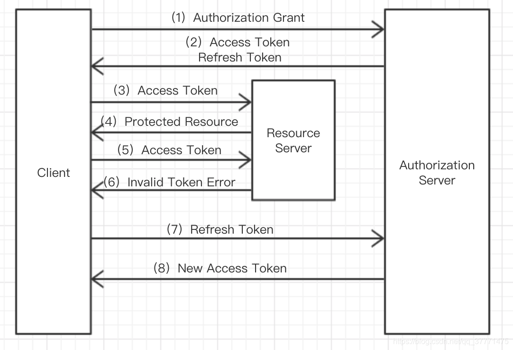
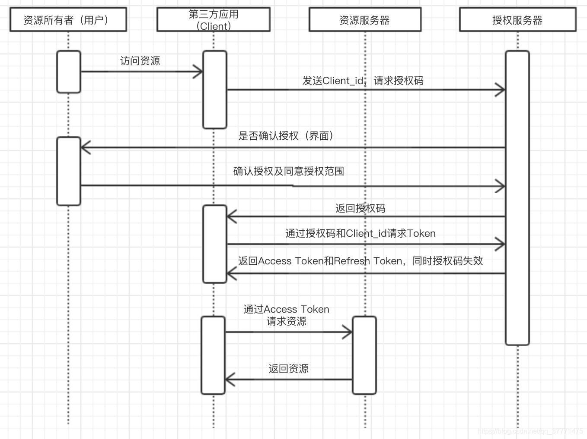
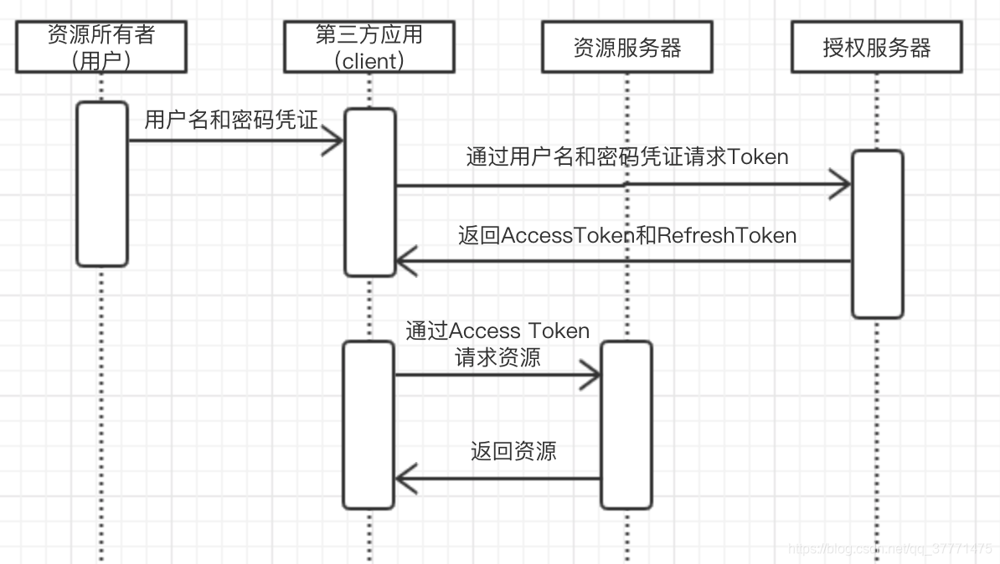
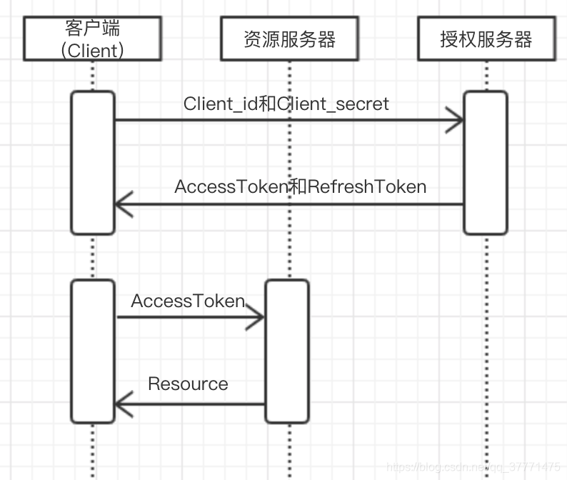

# OAuth2.0入门

---

### 说明：

OAuth全称为Open Authorization（开放授权）。OAuth协议为用户资源的授权提供了一个安全的、开放而又简易的标准。与以往的授权方式不同之处是OAuth的授权不会使第三方触及到用户的帐号信息（如用户名与密码），即第三方无需使用用户的用户名与密码就可以申请获得该用户资源的授权，因此OAUTH是安全的。

### 一、为什么需要OAuth2.0协议

​    简单来说就是当第三方应用需要用户保存在其他应用上的资源时，比如网易云音乐的第三方登录功能，需要获取用户在其他应用上的用户名和头像等信息，这时通过OAuth开放协议以一种安全的方式授权第三方应用去获取这些资源。

### 二、OAuth2.0 角色
Client：第三方应用，比如上面的网易云音乐
Resource Owner：资源所有者，即用户
Authorization Server：授权服务器，即提供第三方登录服务的服务器，如QQ
Resource Server：拥有资源信息的服务器，通常和授权服务器属于同一应用

### 三、Access Token 和 Refresh Token
Access Token是客户端访问资源服务器的令牌。通过这个令牌，客户端可以访问第三方应用上受保护的资源。但是Access Token有效期一般较短（这可以降低Acces Token泄漏而带来的风险），当Access Token过期时用户就需要频繁的授权客户端访问资源，这非常影响用户体验，因此引入Refresh Token来获取新的Access Token。

下面看看OAuth2.0的基本流程。

* 客户端请求获取访问令牌，并向授权服务器提供授权许可（这里有四种认证方式）
* 授权服务器对客户端身份进行认证，并校验授权许可，如果校验通过，则发放访问令牌和刷新令牌
* 客户端通过访问令牌（Access Token）访问受保护的资源
* 资源服务器校验访问令牌（Access Token），如果校验通过，则提供服务，返回资源
* 重复（3）和（4）直到访问令牌过期。如果客户端访问令牌（Access Token）已经过期，则认证服务器会返回InvalidTokenError异常（6），此时不能继续访问受保护的资源
* 当访问令牌（Access Token）失效以后，资源服务器返回一个无效令牌错误
* 客户端通过刷新令牌（Refresh Token）请求获取一个新的访问令牌
* 授权服务器对客户端进行身份认证并校验刷新令牌，如果校验通过，则发放新的访问令牌（并且，可以选择发放新的刷新令牌）
  

### 四、4种授权类型

​    为了获得访问令牌(Token)，客户端需要先从资源所有者(用户)那里获得授权。授权是以授权许可(Grant Type)的形式来表示的。OAuth定义了四种授权类型：

#### 1、授权码模式（Authorization Code Grant）

 当用户访问资源时，比如在网易云音乐中使用第三方登录功能，例如QQ登录，那么这里的资源就是用户的QQ昵称和头像等信息。此时第三方应用（网易云音乐）将发送请求到授权服务器（QQ）去获取授权，此时授权服务器（QQ）将返回一个界面给用户，用户需要登录到QQ，并同意授权网易云音乐获得某些信息（资源）。当用户同意授权后，授权服务器将返回一个授权码（Authorization Code）给第三方应用，此时第三方应用在通过client_id、client_secret（这是需要第三方应用在授权服务器去申请的）和授权码去获得Access Token和Refresh Token，此时授权码将失效。然后就是第三方应用通过Access Token去资源服务器请求资源了，资源服务器校验Access Token成功后将返回资源给第三方应用。

#### 2、隐式授权（Implicit Grant）

​       隐式授权又称简化授权模式，它和授权码模式类似，只不过少了获取授权码的步骤，是直接获取令牌token的，且没有Refresh Token，适用于公开的浏览器单页应用。因为令牌直接从授权服务器返回，所以没有安全保证，令牌容易因为被拦截窃听而泄露。

#### 3、密码模式（Resource Owner Password Credentials Grant）

首先资源所有者（用户）提供自己的用户名和密码给客户端（Client），然后客户端（Client）携带从用户那里获取的凭证去授权服务器请求Token， 授权服务器对客户端进行身份认证，并校验资源所有者的凭证，如果都校验通过，则发放Token。

适用范围：只适用于应用是受信任的场景。一个典型的例子是同一个企业内部的不同产品要使用本企业的 Oauth2.0 体系。在这种情况下，由于是同个企业，不需要向用户展示“xxx将获取以下权限”等字样并询问用户的授权意向，而只需进行用户的身份认证即可。这个时候，只需要用户输入凭证并直接传递给鉴权服务器进行授权即可。

#### 4、客户端授权模式（Client Credentials Grant）

客户端（Client）通过Client_id和Client_secret去授权服务器请求Token，授权服务器认证Client_id和Client_secret是否正确，若正确则发放Token给客户端（Client）。最后客户端通过AccessToken请求资源。

适用范围：只适用于应用是受信任的场景。
