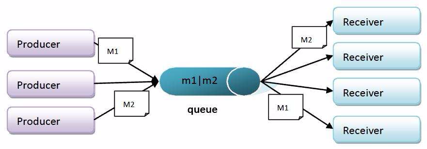
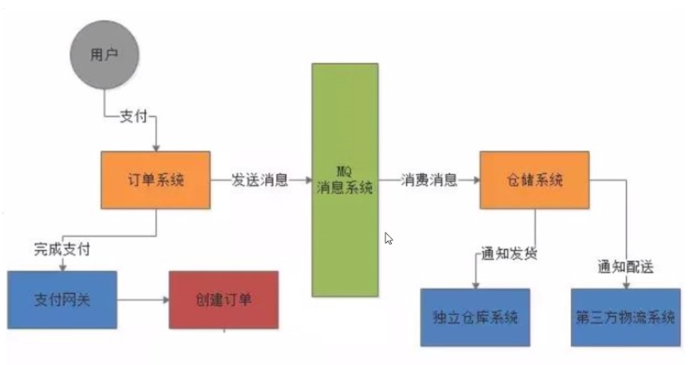
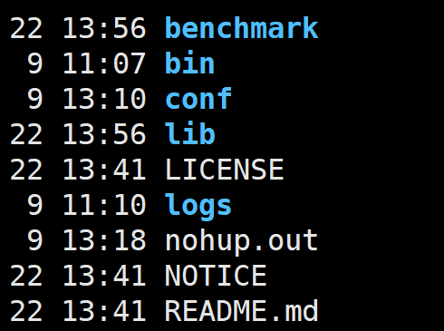
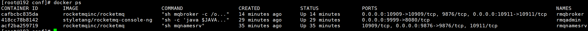

# RocketMQ学习

***

## 1.	定义

***

中间件（缓存中间件  redis memcache  数据库中间件 mycat  canal  消息中间件mq ）

面向消息的**中间件**(message-oriented middleware) MOM能够很好的解决以上的问题。

是指利用**高效可靠的消息传递机制进行与**平台无关（跨平台）的数据交流，并基于数据通信来进行分布式系统的集成。

通过提供**消息传递和消息排队模型**在分布式环境下提供应用解耦，弹性伸缩，冗余存储，流量削峰，异步通信，数据同步等

### 1.1	大致流程

发送者把消息发给消息服务器[MQ]，消息服务器把消息存放在若干**主题**中，在合适的时候，消息服务器会把消息转发给接受者。在这个过程中，发送和接受是异步的,也就是发送无需等待，发送者和接受者的生命周期也没有必然关系在发布pub/订阅sub模式下，也可以完成一对多的通信，可以让一个消息有多个接受者[微信订阅号就是这样的]



## 2.	为什么用MQ：

> 1，要做到系统解耦，当新的模块进来时，可以做到代码改动最小;  **能够解耦**
>
> 2，设置流程缓冲池，可以让后端系统按自身**吞吐**能力进行消费，不被冲垮; **能够削峰，限流**
>
> 3，强弱依赖梳理能把非关键调用链路的操作异步化并提升整体系统的吞吐能力;**能够异步**
>
>  
>
> **Mq的作用  削峰限流 异步 解耦合**


## 3.	现实中的业务

---




## 4.	常见的MQ产品：

> activeMQ：Java写的（jms协议），性能一般，出现早，功能单一，吞吐量低
>
> RabbitMQ：erlang（amqp协议），性能好，功能丰富，吞吐量一般
>
> RocketMQ：Java（阿里），性能好，功能最丰富，吞吐量高
>
> Kafka：scala写的，吞吐量大，功能单一，大数据领域

### 4.1	常见MQ产品比较：


## 5.	RocketMQ介绍：

> RocketMQ是阿里巴巴2016年MQ中间件，使用Java语言开发，RocketMQ是一款开源的分布式消息系统，基于高可用分布式集群技术，提供低延时的、高可靠的晓溪发布与订阅服务。同时广泛应用于多个领域，包括异步通讯解耦、企业解决方案、金融支付、电信、电子商务、快递物流、广告营销、社交、即时通信、移动应用、手游、视屏、物联网、车联网等

### 5.1	具有以下特点：

> 1、能够保证严格的消息顺序
>
> 2、提供丰富的消息拉取模式
>
> 3、高效的订阅者水平拓展能力
>
> 4、实时的信息订阅机制
>
> 5、亿级消息堆积能力

### 5.2	RocketMQ重要概念（重点）

> **Producer：消息的发送者，生产者；举例：发件人**
>
> **Consumer：消息接收者，消费者；举例：收件人**
>
> **Broker：暂存和传输消息**的通道**；举例：**快递
>
> **NameServer：管理Broker；举例：各个快递公司的管理机构 相当于broker的注册中心，保留了broker的信息**
>
> **Queue：队列，消息存放的位置，一个Broker中可以有多个队列**
>
> **Topic：主题，消息的分类**
>
> ProducerGroup：生产者组 
>
> ConsumerGroup：消费者组，多个消费者组可以同时消费一个主题的消息
>
> **消息发送的流程是，Producer询问NameServer，NameServer分配一个broker 然后Consumer也要询问NameServer，得到一个具体的broker，然后消费消息**


## 6.	生产和消费理解（重点）

***


## 7.	下载并配置rocketMQ

***

### 7.1	解压

```shell
unzip rocketmq-all-4.9.2-bin-release.zip
```

如果服务器没有unzip指令，就下载安装一个

```shell
yum install unzip
```

目录分析：



> benchmark：包含一些性能测试的脚本；
>
> bin：可执行文件目录；
>
> conf：配置文件目录
>
> lib：第三方依赖；
>
> LICENSE：授权信息；
>
> NOTICE：版本公告；

### 7.2	配置环境变量

```shell
vim /etc/profile
```

在文件末尾添加

```shell
export NAMESRV_ADDR=阿里云公网IP:9876
```

### 7.3	修改nameServer的运行脚本

进入bin目录下，修改runserver.sh文件，将71行和76行的Xms和Xmx等改下小一点

```shell
vim runserver.sh
```


保存退出

### 7.4	修改broker的运行脚本

进入bin目录下，修改runbroker.sh，修改67行


保存退出

### 7.5	修改broker的配置文件

进入conf目录下，修改broker.conf文件

```properties
brokerClusterName = DefaultCluster
brokerName = broker-a
brokerId = 0
deleteWhen = 04
fileReservedTime = 48
brokerRole = ASYNC_MASTER
flushDiskType = ASYNC_FLUSH
namesrvAddr=localhost:9876
autoCreateTopicEnable=true
brokerIP1=阿里云公网IP
```

添加参数解释

namesrvAddr：nameSrv地址可以写localhost因为nameSrv和broker在一个服务器

autoCreateTopicEnable：自动创建主题，不然需要手动创建出来

brokerIP1：broker也需要一个公网IP，如果不指定，那么是阿里云的内网地址，我们再本地无法连接使用

### 7.6	启动

首先在安装目录下创建一个logs文件夹，用于存放日志

mkdir logs


一次运行两条命令

启动nameSrv

```shell
nohup sh bin/mqnamesrv > ./logs/namesrv.log &
```

启动broker这里的-c是指定使用的配置文件

```shell
nohup sh bin/mqbroker -c conf/broker.conf > ./logs/broker.log &
```

查看启动结果


### 7.8	RocketMQ控制台的安装RockerMQ-Console

Rocketmq 控制台可以可视化MQ的消息发送！

旧版本源码是在rocketmq-external里的rocketmq-console，新版本已经单独拆分成dashboard

网址： https://github.com/apache/rocketmq-dashboard 

下载地址：

https://github.com/apache/rocketmq-dashboard/archive/refs/tags/rocketmq-dashboard-1.0.0.zip 

下载后解压出来，在跟目录下执行

```shell
mvn clean package -Dmaven.test.skip=true
```


将jar包上传到服务器上去

然后运行

```shell
nohup java -jar ./rocket-dashboard-1.0.0.jar rocketmq.config.namesrvAddr=127.0.0.1:9876 > ./rocketmq-4.9.3/logs/dashboard.log &
```

命令拓展：--server.port指定运的端口

 指定namesrv地址

```shell
--rocketmq.config.namesrvAddr=127.0.0.1:9876
```

访问：  [http://localhost:8001](http://localhost:8081) 

运行访问端口是8001，如果从官网拉下来打包的话，默认端口是8080


## 8	RocketMQ安装之docker

***

### 8.1	下载RocketMQ需要的镜像

```shell
docker pull rocketmqinc/rocketmq
```

```shell
docker pull styletang/rocketmq-console-ng
```

### 8.2	启动NameServer服务

#### 8.2.1	创建NameServer数据存储路径

````shell
mkdir -p /home/rocketmq/data/namesrv/logs /home/rocketmq/data/namesrv/store
````

#### 8.2.2	启动NameServer容器

```shell
docker run -d --name rmqnamesrv -p 9876:9876 -v /home/rocketmq/data/namesrv/logs:/root/logs -v /home/rocketmq/data/namesrv/store:/root/store -e "MAX_POSSIBLE_HEAP=100000000" rocketmqinc/rocketmq sh mqnamesrv
```

### 8.3	启动Broker服务

#### 8.3.1	创建Broker数据存储路径

```shell
mkdir -p /home/rocketmq/data/broker/logs /home/rocketmq/data/broker/store
```

#### 8.3.2	创建conf配置文件目录

```shell
mkdir /home/rocketmq/conf
```

#### 8.3.3	在配置文件目录下创建broker.conf配置文件

```properties
# 所属集群名称，如果节点较多可以配置多个
brokerClusterName = DefaultCluster
#broker名称，master和slave使用相同的名称，表明他们的主从关系
brokerName = broker-a
#0表示Master，大于0表示不同的slave
brokerId = 0
#表示几点做消息删除动作，默认是凌晨4点
deleteWhen = 04
#在磁盘上保留消息的时长，单位是小时
fileReservedTime = 48
#有三个值：SYNC_MASTER，ASYNC_MASTER，SLAVE；同步和异步表示Master和Slave之间同步数据的机制；
brokerRole = ASYNC_MASTER
#刷盘策略，取值为：ASYNC_FLUSH，SYNC_FLUSH表示同步刷盘和异步刷盘；SYNC_FLUSH消息写入磁盘后才返回成功状态，ASYNC_FLUSH不需要；
flushDiskType = ASYNC_FLUSH
# 设置broker节点所在服务器的ip地址
brokerIP1 = 你服务器外网ip
```

#### 8.3.4	启动Broker容器

```shell
docker run -d  --name rmqbroker --link rmqnamesrv:namesrv -p 10911:10911 -p 10909:10909 -v  /home/rocketmq/data/broker/logs:/root/logs -v /home/rocketmq/data/broker/store:/root/store -v /home/rocketmq/conf/broker.conf:/opt/rocketmq-4.4.0/conf/broker.conf --privileged=true -e "NAMESRV_ADDR=namesrv:9876" -e "MAX_POSSIBLE_HEAP=200000000" rocketmqinc/rocketmq sh mqbroker -c /opt/rocketmq-4.4.0/conf/broker.conf
```

### 8.4	启动控制台

```shell
docker run -d --name rmqadmin -e "JAVA_OPTS=-Drocketmq.namesrv.addr=你的外网地址:9876 \
-Dcom.rocketmq.sendMessageWithVIPChannel=false \
-Duser.timezone='Asia/Shanghai'" -v /etc/localtime:/etc/localtime -p 9999:8080 styletang/rocketmq-console-ng
```

### 8.5	正常启动后的docker ps



### 8.6	访问控制台

```shell
http://你的服务器外网ip:9999/
```


