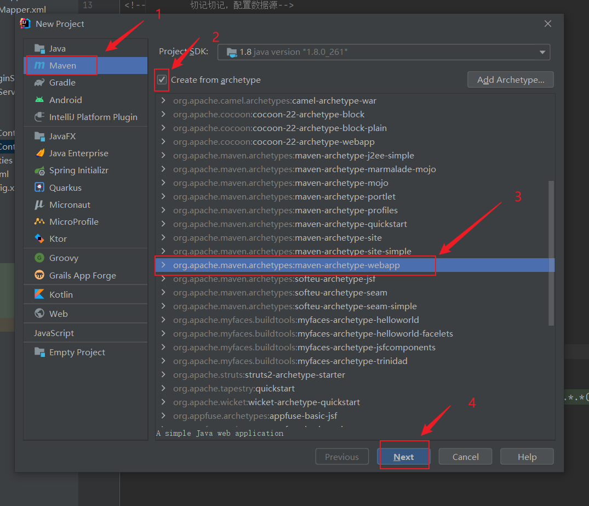
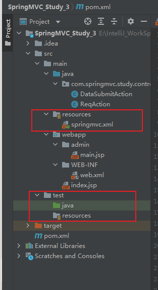
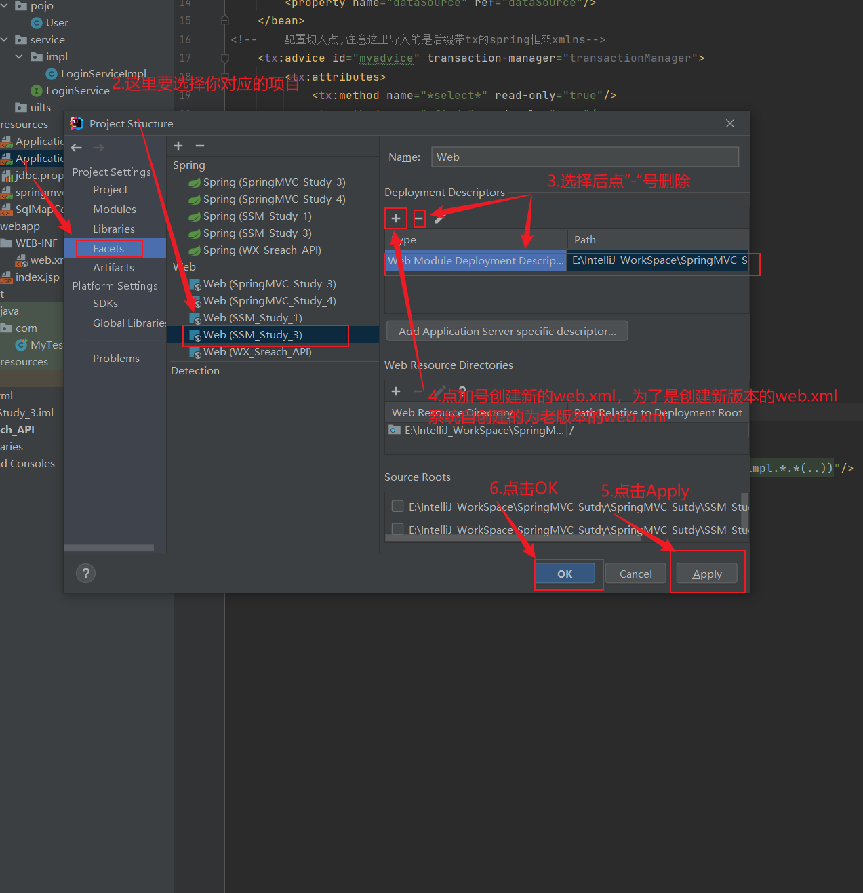
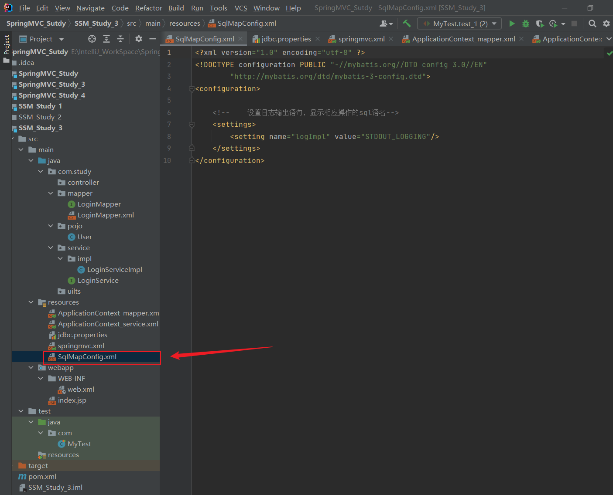
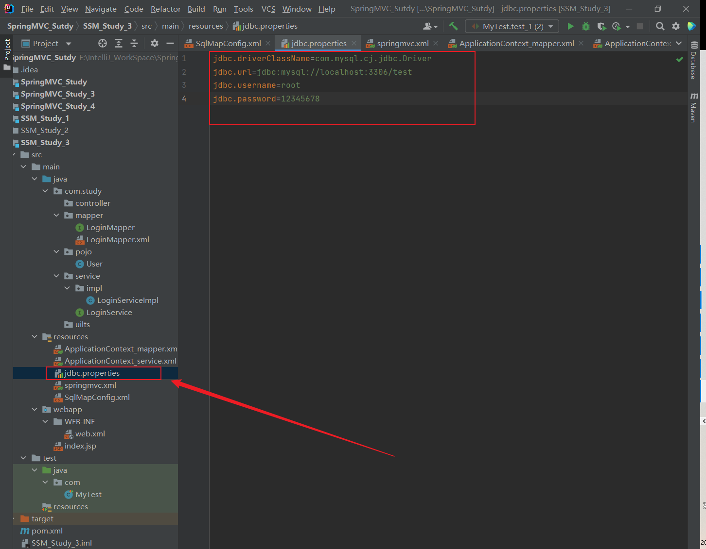
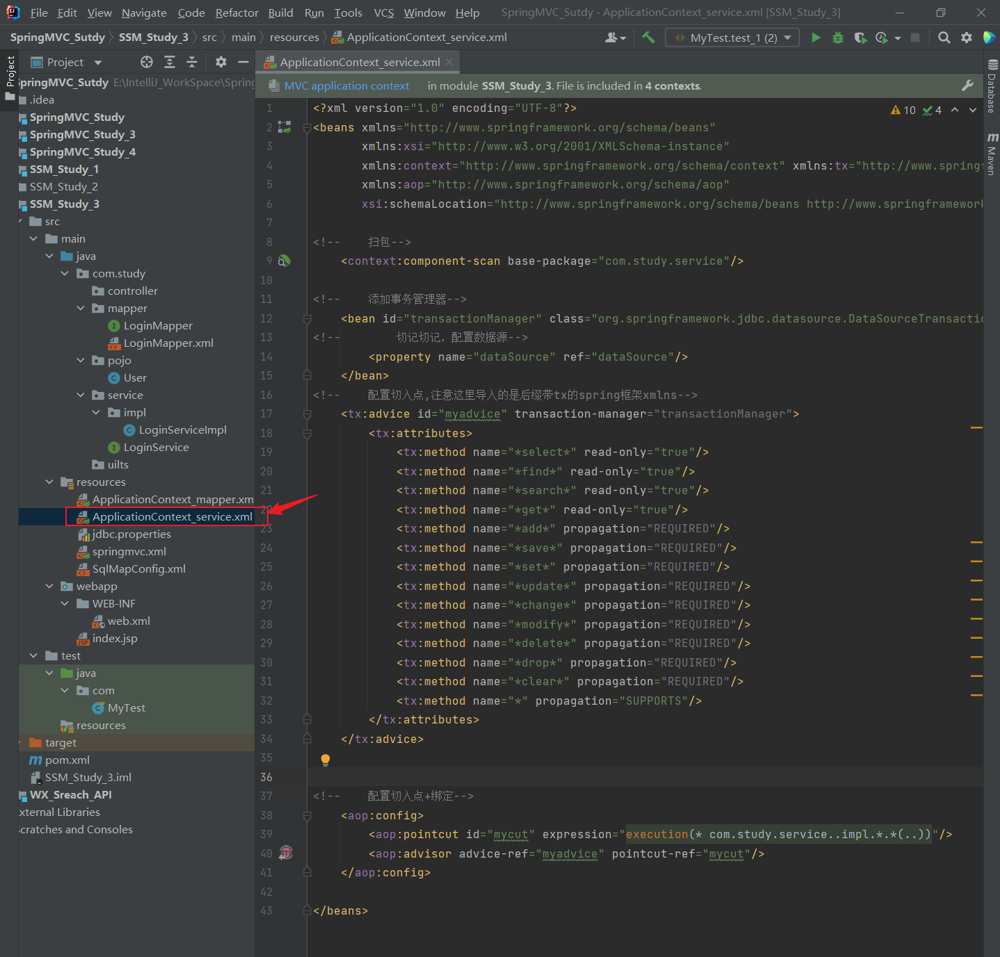
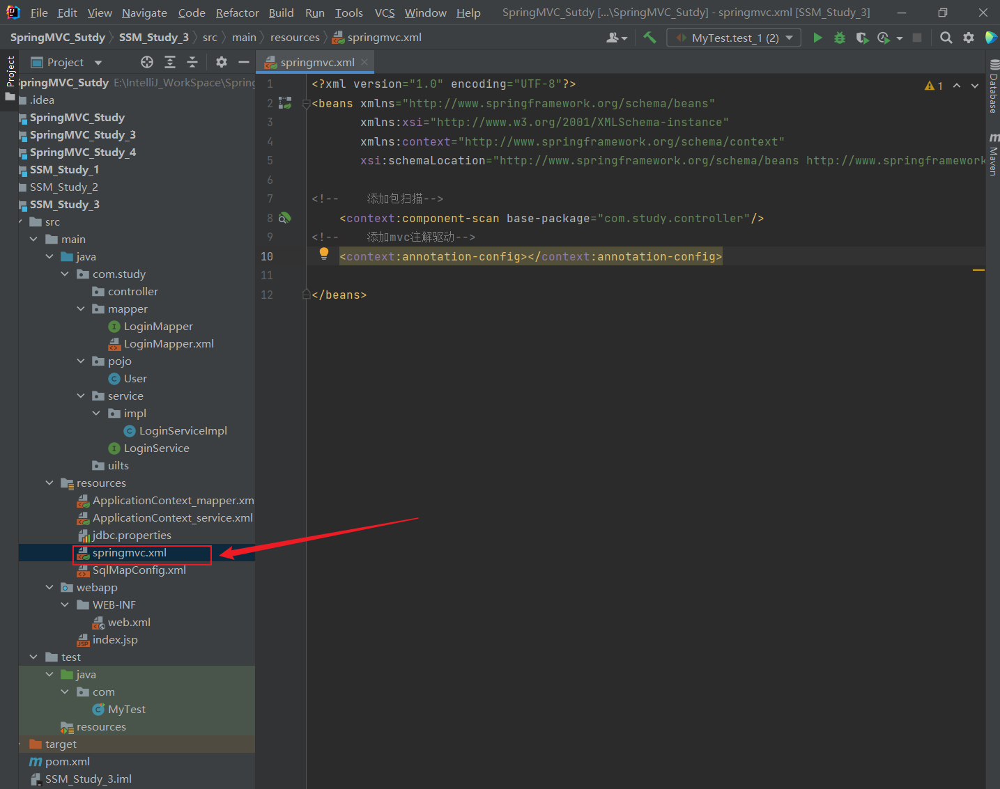
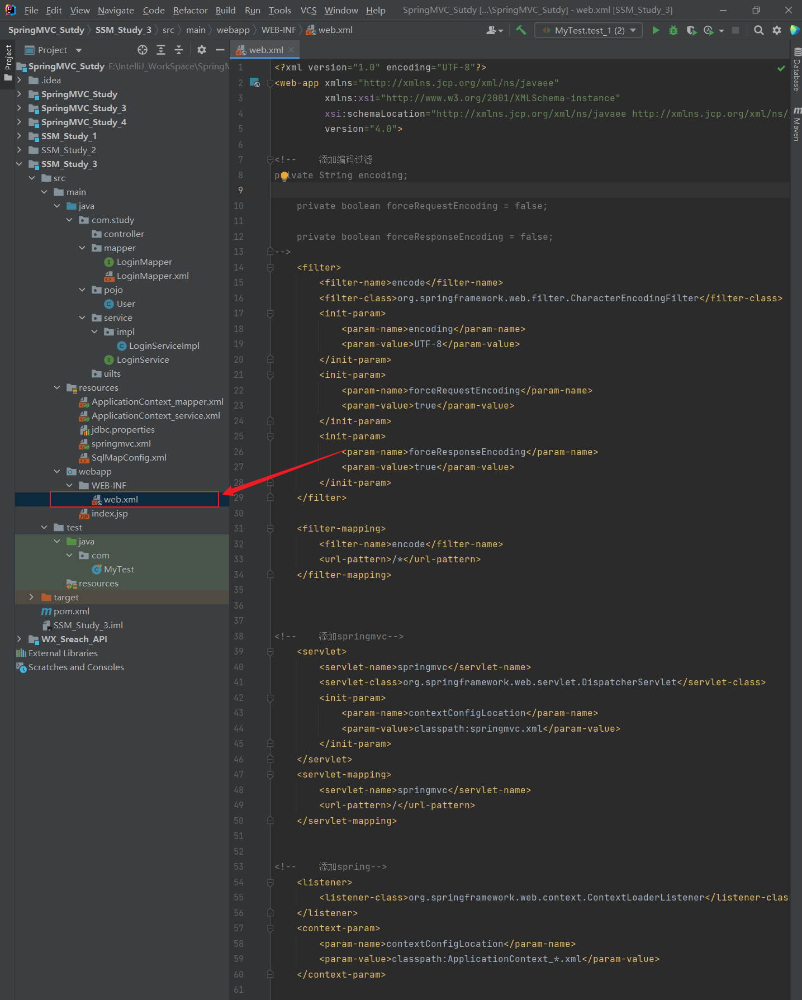

# SSM开发配置文档

---

## 一、开发步骤

> 1. 新建项目，选择webapp模板；
> 2. 修改目录，添加缺失的test，java，resources（两套），如果目录没有属性标识记得修改属性；
> 3. 修改pom.xml文件，添加Spring套件和MyBatis套件的依赖等等；
> 4. 删除系统自动创建的web.xml文件，新建web.xml；
> 5. 添加Sql语句的日志输出配置文件，例如：SqlMapConfig.xml；
> 5. 添加服务器连接配置，例如：jdbc.properties；
> 5. 添加数据访问层的配置（Mapper），例如：ApplicationContext_mapper.xml；
> 5. 添加业务逻辑层的配置（Service），例如：ApplicationContext_service.xml；
> 5. 添加SpringMVC的配置，指定包扫描（因为要基于注解开发），添加视图解析器(如果是基于ajax开发那么可以忽略这一步，如果jsp那么就需要)。例如：springmvc.xml；
> 6. 在web.xml文件中设定好字符过滤器来不让其出现乱码现象，注册Spring框架、SpringMVC框架（所有的web请求都是基于servlet的）。


### 1.新建项目，选择webapp模板

> 


### 2.修改目录，添加缺失的test，java，resources（两套），如果目录没有属性标识记得修改属性

> 

### 3.修改pom.xml文件，添加Spring套件和MyBatis套件的依赖等等

#### pom.xml文件模板：

> ```xml
> <?xml version="1.0" encoding="UTF-8"?>
> 
> <project xmlns="http://maven.apache.org/POM/4.0.0" xmlns:xsi="http://www.w3.org/2001/XMLSchema-instance"
>   xsi:schemaLocation="http://maven.apache.org/POM/4.0.0 http://maven.apache.org/xsd/maven-4.0.0.xsd">
>   <modelVersion>4.0.0</modelVersion>
> 
>   <groupId>org.example</groupId>
>   <artifactId>SSM_Study_1</artifactId>
>   <version>1.0-SNAPSHOT</version>
>   <packaging>war</packaging>
> 
> 
>   <properties>
>     <project.build.sourceEncoding>UTF-8</project.build.sourceEncoding>
>     <maven.compiler.source>1.8</maven.compiler.source>
>     <maven.compiler.target>1.8</maven.compiler.target>
> 
> <!--    junit版本管理，注意4.12或以上的版本才能接管spring-->
>     <junit.version>4.12</junit.version>
> <!--    sprin版本管理-->
>     <spring.version>5.2.5.RELEASE</spring.version>
> <!--    mybatis版本管理-->
>     <mybatis.version>3.5.6</mybatis.version>
> <!--mysql版本管理-->
>     <mysql.version>8.0.27</mysql.version>
> <!--    mybatis与spring整合的依赖-->
>     <mybatis.spring.version>1.3.1</mybatis.spring.version>
> <!--阿里的数据库连接池-->
>     <druid.version>1.1.12</druid.version>
> <!--    servlet版本管理-->
>     <servlet.version>2.5</servlet.version>
> <!-- jackson的依赖-->
>     <jackson.version>2.9.6</jackson.version>
> <!--    fastjson版本管理-->
>     <fastjson.version>1.2.59</fastjson.version>
> <!--      jackson依赖管理-->
>       <jackson.version>2.9.6</jackson.version>
> <!--      jsp相关版本管理-->
>       <jsp-api.version>2.0</jsp-api.version>
>   </properties>
> 
> 
> 
> 
> 
> 
>   <dependencies>
> 
> 
> 
> <!--    spring相关依赖-->
>     <dependency>
>       <groupId>org.springframework</groupId>
>       <artifactId>spring-context</artifactId>
>       <version>${spring.version}</version>
>     </dependency>
> 
>     <dependency>
>       <groupId>org.springframework</groupId>
>       <artifactId>spring-beans</artifactId>
>       <version>${spring.version}</version>
>     </dependency>
> 
>     <dependency>
>       <groupId>org.springframework</groupId>
>       <artifactId>spring-webmvc</artifactId>
>       <version>${spring.version}</version>
>     </dependency>
> 
>     <dependency>
>       <groupId>org.springframework</groupId>
>       <artifactId>spring-jdbc</artifactId>
>       <version>${spring.version}</version>
>     </dependency>
> 
> <!--    事务管理需要的spring-->
>     <dependency>
>       <groupId>org.springframework</groupId>
>       <artifactId>spring-aspects</artifactId>
>       <version>${spring.version}</version>
>     </dependency>
> <!--    邮件处理-->
>     <dependency>
>       <groupId>org.springframework</groupId>
>       <artifactId>spring-jms</artifactId>
>       <version>${spring.version}</version>
>     </dependency>
> 
> <!--    上下文关联处理-->
>     <dependency>
>       <groupId>org.springframework</groupId>
>       <artifactId>spring-context-support</artifactId>
>       <version>${spring.version}</version>
>     </dependency>
> 
> <!--    spring单元测试-->
>     <dependency>
>       <groupId>org.springframework</groupId>
>       <artifactId>spring-test</artifactId>
>       <version>${spring.version}</version>
>     </dependency>
> 
> 
> 
> 
>     <dependency>
>       <groupId>org.mybatis</groupId>
>       <artifactId>mybatis</artifactId>
>       <version>${mybatis.version}</version>
>     </dependency>
> <!--mybatis与spring整合的-->
>     <dependency>
>       <groupId>org.mybatis</groupId>
>       <artifactId>mybatis-spring</artifactId>
>       <version>1.3.2</version>
>     </dependency>
> 
> <!--    mybatis支持分页插件-->
>     <dependency>
>       <groupId>com.github.miemiedev</groupId>
>       <artifactId>mybatis-paginator</artifactId>
>       <version>1.2.15</version>
>     </dependency>
> 
> <!--    分页插件本身-->
>     <dependency>
>       <groupId>com.github.pagehelper</groupId>
>       <artifactId>pagehelper</artifactId>
>       <version>5.3.0</version>
>     </dependency>
> 
>     <dependency>
>       <groupId>mysql</groupId>
>       <artifactId>mysql-connector-java</artifactId>
>       <version>${mysql.version}</version>
>     </dependency>
> 
> 
>     <dependency>
>       <groupId>javax.servlet</groupId>
>       <artifactId>servlet-api</artifactId>
>       <version>${servlet.version}</version>
>     </dependency>
> 
> <!--    阿里巴巴的数据库连接池-->
>     <dependency>
>       <groupId>com.alibaba</groupId>
>       <artifactId>druid</artifactId>
>       <version>${druid.version}</version>
>     </dependency>
> 
> <!--    <dependency>-->
> <!--      <groupId>com.alibaba</groupId>-->
> <!--      <artifactId>fastjson</artifactId>-->
> <!--      <version>${fastjson.version}</version>-->
> <!--    </dependency>-->
> 
> 
> 
> 
>     <!--    单元测试依赖-->
>     <dependency>
>       <groupId>junit</groupId>
>       <artifactId>junit</artifactId>
>       <version>${junit.version}</version>
>       <scope>test</scope>
>     </dependency>
> 
> 
>       <dependency>
>           <groupId>jstl</groupId>
>           <artifactId>jstl</artifactId>
>           <version>1.2</version>
>       </dependency>
> 
>       <dependency>
>           <groupId>javax.servlet</groupId>
>           <artifactId>jsp-api</artifactId>
>           <scope>provided</scope>
>           <version>${jsp-api.version}</version>
>       </dependency>
> 
>       <dependency>
>           <groupId>javax.servlet</groupId>
>           <artifactId>javax.servlet-api</artifactId>
>           <version>4.0.1</version>
>           <scope>provided</scope><!--使用别人提供的-->
>       </dependency>
> 
>       <dependency>
>           <groupId>com.fasterxml.jackson.core</groupId>
>           <artifactId>jackson-databind</artifactId>
>           <version>${jackson.version}</version>
>       </dependency>
>       <dependency>
>           <groupId>com.fasterxml.jackson.core</groupId>
>           <artifactId>jackson-core</artifactId>
>           <version>${jackson.version}</version>
>       </dependency>
>       <dependency>
>           <groupId>com.fasterxml.jackson.core</groupId>
>           <artifactId>jackson-databind</artifactId>
>           <version>${jackson.version}</version>
>       </dependency>
>       <dependency>
>           <groupId>com.fasterxml.jackson.core</groupId>
>           <artifactId>jackson-annotations</artifactId>
>           <version>${jackson.version}</version>
>       </dependency>
> 
>       <dependency>
>           <groupId>org.slf4j</groupId>
>           <artifactId>slf4j-simple</artifactId>
>           <version>1.7.21</version>
>       </dependency>
> 
> 
> <!--      文件上传使用的依赖-->
>       <dependency>
>           <groupId>commons-io</groupId>
>           <artifactId>commons-io</artifactId>
>           <version>2.4</version>
>       </dependency>
> 
>       <dependency>
>           <groupId>commons-fileupload</groupId>
>           <artifactId>commons-fileupload</artifactId>
>           <version>1.3.1</version>
>       </dependency>
> 
> 
> 
> 
>   </dependencies>
> 
>   <build>
> 
> 
> <!--    识别所有配置文件-->
>     <resources>
>       <resource>
>         <directory>src/main/java</directory>
>         <includes>
>           <include>**/*.properties</include>
>           <include>**/*.xml</include>
>         </includes>
>         <filtering>false</filtering>
>       </resource>
> 
>       <resource>
>         <directory>src/main/resources</directory>
>         <includes>
>           <include>**/*.properties</include>
>           <include>**/*.xml</include>
>         </includes>
>         <filtering>false</filtering>
>       </resource>
> 
>     </resources>
>   </build>
> </project>
> 
> ```
>
> 

### 4.删除系统自动创建的web.xml文件，新建web.xml

> 


### 5.添加Sql语句的日志输出配置文件，例如：SqlMapConfig.xml

> 这里就直接使用模板自己原本配置的模板
>
> 
>
> SqlMapConfig.xml
>
> ```xml
> <?xml version="1.0" encoding="utf-8" ?>
> <!DOCTYPE configuration PUBLIC "-//mybatis.org//DTD config 3.0//EN"
>         "http://mybatis.org/dtd/mybatis-3-config.dtd">
> <configuration>
> 
>     <!--    设置日志输出语句，显示相应操作的sql语名-->
>     <settings>
>         <setting name="logImpl" value="STDOUT_LOGGING"/>
>     </settings>
> </configuration>
> ```
>
> 


### 6.添加服务器连接配置，例如：jdbc.properties

> 
>
> jdbc.properties
>
> ```properties
> jdbc.driverClassName=com.mysql.cj.jdbc.Driver
> jdbc.url=jdbc:mysql://localhost:3306/test
> jdbc.username=root
> jdbc.password=12345678
> ```


### 7. 添加数据访问层的配置（Mapper），例如：ApplicationContext_mapper.xml

> 
>
> ```xml
> <?xml version="1.0" encoding="UTF-8"?>
> <beans xmlns="http://www.springframework.org/schema/beans"
>        xmlns:xsi="http://www.w3.org/2001/XMLSchema-instance"
>        xmlns:context="http://www.springframework.org/schema/context"
>        xsi:schemaLocation="http://www.springframework.org/schema/beans http://www.springframework.org/schema/beans/spring-beans.xsd http://www.springframework.org/schema/context https://www.springframework.org/schema/context/spring-context.xsd">
> 
> <!--    读取属性文件-->
>     <context:property-placeholder location="classpath:jdbc.properties"/>
> 
> <!--    配置数据源-->
>     <bean id="dataSource" class="com.alibaba.druid.pool.DruidDataSource">
>         <property name="driverClassName" value="${jdbc.driverClassName}"/>
>         <property name="url" value="${jdbc.url}"/>
>         <property name="username" value="${jdbc.username}"/>
>         <property name="password" value="${jdbc.password}"/>
>     </bean>
> 
> <!--    配置SQLSessionFactoryBean-->
>     <bean class="org.mybatis.spring.SqlSessionFactoryBean">
> <!--        配置数据源-->
>         <property name="dataSource" ref="dataSource"/>
> <!--        配置SqlMapConfig.xml-->
>         <property name="configLocation" value="classpath:SqlMapConfig.xml"/>
> <!--        注册实体类-->
>         <property name="typeAliasesPackage" value="com.study.pojo"/>
>     </bean>
> 
> <!--    注册mapper-->
>     <bean class="org.mybatis.spring.mapper.MapperScannerConfigurer">
>         <property name="basePackage" value="com.study.mapper"/>
>     </bean>
> 
> 
> 
> </beans>
> ```
>
> 

### 8.添加业务逻辑层的配置（Service），例如：ApplicationContext_service.xml

>
>
>```xml
><?xml version="1.0" encoding="UTF-8"?>
><beans xmlns="http://www.springframework.org/schema/beans"
>       xmlns:xsi="http://www.w3.org/2001/XMLSchema-instance"
>       xmlns:context="http://www.springframework.org/schema/context" xmlns:tx="http://www.springframework.org/schema/tx"
>       xmlns:aop="http://www.springframework.org/schema/aop"
>       xsi:schemaLocation="http://www.springframework.org/schema/beans http://www.springframework.org/schema/beans/spring-beans.xsd http://www.springframework.org/schema/context https://www.springframework.org/schema/context/spring-context.xsd http://www.springframework.org/schema/tx http://www.springframework.org/schema/tx/spring-tx.xsd http://www.springframework.org/schema/aop https://www.springframework.org/schema/aop/spring-aop.xsd">
>
><!--    扫包-->
>    <context:component-scan base-package="com.study.service"/>
>
><!--    添加事务管理器-->
>    <bean id="transactionManager" class="org.springframework.jdbc.datasource.DataSourceTransactionManager">
><!--        切记切记，配置数据源-->
>        <property name="dataSource" ref="dataSource"/>
>    </bean>
><!--    配置切入点,注意这里导入的是后缀带tx的spring框架xmlns-->
>    <tx:advice id="myadvice" transaction-manager="transactionManager">
>        <tx:attributes>
>            <tx:method name="*select*" read-only="true"/>
>            <tx:method name="*find*" read-only="true"/>
>            <tx:method name="*search*" read-only="true"/>
>            <tx:method name="*get*" read-only="true"/>
>            <tx:method name="*add*" propagation="REQUIRED"/>
>            <tx:method name="*save*" propagation="REQUIRED"/>
>            <tx:method name="*set*" propagation="REQUIRED"/>
>            <tx:method name="*update*" propagation="REQUIRED"/>
>            <tx:method name="*change*" propagation="REQUIRED"/>
>            <tx:method name="*modify*" propagation="REQUIRED"/>
>            <tx:method name="*delete*" propagation="REQUIRED"/>
>            <tx:method name="*drop*" propagation="REQUIRED"/>
>            <tx:method name="*clear*" propagation="REQUIRED"/>
>            <tx:method name="*" propagation="SUPPORTS"/>
>        </tx:attributes>
>    </tx:advice>
>
>
><!--    配置切入点+绑定-->
>    <aop:config>
>        <aop:pointcut id="mycut" expression="execution(* com.study.service..impl.*.*(..))"/>
>        <aop:advisor advice-ref="myadvice" pointcut-ref="mycut"/>
>    </aop:config>
>
></beans>
>```
>
>

### 9.添加SpringMVC的配置，指定包扫描（因为要基于注解开发），添加视图解析器(如果是基于ajax开发那么可以忽略这一步，如果jsp那么就需要)。例如：springmvc.xml

> 
>
> ```xml
> <?xml version="1.0" encoding="UTF-8"?>
> <beans xmlns="http://www.springframework.org/schema/beans"
>        xmlns:xsi="http://www.w3.org/2001/XMLSchema-instance"
>        xmlns:context="http://www.springframework.org/schema/context"
>        xsi:schemaLocation="http://www.springframework.org/schema/beans http://www.springframework.org/schema/beans/spring-beans.xsd http://www.springframework.org/schema/context https://www.springframework.org/schema/context/spring-context.xsd">
> 
> <!--    添加包扫描-->
>     <context:component-scan base-package="com.study.controller"/>
> <!--    添加mvc注解驱动-->
>     <context:annotation-config></context:annotation-config>
> 
>    <!--这一步根据情况来，如果不是jsp开发可以把这个视图解析器给忽略掉--> 
>     <!--    添加视图解析器-->
>     <bean class="org.springframework.web.servlet.view.InternalResourceViewResolver">
>         <property name="prefix" value="/admin/"></property>
>         <property name="suffix" value=".jsp"></property>
>     </bean>
>     
>     
> </beans>
> ```
>
> 

### 10.在web.xml文件中设定好字符过滤器来不让其出现乱码现象，注册Spring框架、SpringMVC框架（所有的web请求都是基于servlet的）

> 
>
> ```xml
> <?xml version="1.0" encoding="UTF-8"?>
> <web-app xmlns="http://xmlns.jcp.org/xml/ns/javaee"
>          xmlns:xsi="http://www.w3.org/2001/XMLSchema-instance"
>          xsi:schemaLocation="http://xmlns.jcp.org/xml/ns/javaee http://xmlns.jcp.org/xml/ns/javaee/web-app_4_0.xsd"
>          version="4.0">
> 
> <!--    添加编码过滤
> private String encoding;
> 
> 	private boolean forceRequestEncoding = false;
> 
> 	private boolean forceResponseEncoding = false;
> -->
>     <filter>
>         <filter-name>encode</filter-name>
>         <filter-class>org.springframework.web.filter.CharacterEncodingFilter</filter-class>
>         <init-param>
>             <param-name>encoding</param-name>
>             <param-value>UTF-8</param-value>
>         </init-param>
>         <init-param>
>             <param-name>forceRequestEncoding</param-name>
>             <param-value>true</param-value>
>         </init-param>
>         <init-param>
>             <param-name>forceResponseEncoding</param-name>
>             <param-value>true</param-value>
>         </init-param>
>     </filter>
> 
>     <filter-mapping>
>         <filter-name>encode</filter-name>
>         <url-pattern>/*</url-pattern>
>     </filter-mapping>
> 
> 
> 
> <!--    添加springmvc-->
>     <servlet>
>         <servlet-name>springmvc</servlet-name>
>         <servlet-class>org.springframework.web.servlet.DispatcherServlet</servlet-class>
>         <init-param>
>             <param-name>contextConfigLocation</param-name>
>             <param-value>classpath:springmvc.xml</param-value>
>         </init-param>
>     </servlet>
>     <servlet-mapping>
>         <servlet-name>springmvc</servlet-name>
>         <url-pattern>/</url-pattern>
>     </servlet-mapping>
> 
> 
> <!--    添加spring-->
>     <listener>
>         <listener-class>org.springframework.web.context.ContextLoaderListener</listener-class>
>     </listener>
>     <context-param>
>         <param-name>contextConfigLocation</param-name>
>         <param-value>classpath:ApplicationContext_*.xml</param-value>
>     </context-param>
> 
> </web-app>
> ```
>
> 


## 二、开发注意事项

### POJO实体类开发注意事项：

#### 1. 自动注入时，如果有主键的的注入那么POJO中构造体中参数的主键注入形参必须与SQL语句中主键所在位置相同不然就会报错。

   例如：

   > ```xml
   >  <sql id="allColumns">
   >         user_id<!--这个是主键-->,user_name,user_sex,user_age,user_uid,user_password
   >     </sql>
   > 
   >     <sql id="testColumns">
   >         user_name,user_sex,user_age,user_uid,user_password
   >     </sql>
   > 
   > 
   > <!--
   > User login(
   >             @Param("userAccount")
   >             String userAccount,
   >             @Param("userPassword")
   >             String userPassword
   >     );
   > -->
   >     <select id="login" resultType="user">
   >         select <include refid="allColumns"/>
   >         from user
   >         <choose>
   >             <when test="userAccount!=null and userAccount!='' and userPassword!=null and userPassword!=''">
   >                 where user_uid=#{userAccount} and user_password=#{userPassword}
   >             </when>
   >             <otherwise>
   >                 where false
   >             </otherwise>
   >         </choose>
   >     </select>
   > ```
   >
   > ```java
   > public User(Integer userId/*这个是主键*/,String userName, String userSex, Integer userAge, String userUid, String userPassword) {
   >     this.userName = userName;
   >     this.userSex = userSex;
   >     this.userAge = userAge;
   >     this.userUid = userUid;
   >     this.userPassword = userPassword;
   >     this.userId = userId;
   >   }
   > ```
   >
   > 再比如：
   >
   > ```xml
   >  <sql id="allColumns">
   >         user_name,user_sex,user_age,user_id<!--这个是主键-->,user_uid,user_password
   >     </sql>
   > 
   >     <sql id="testColumns">
   >         user_name,user_sex,user_age,user_uid,user_password
   >     </sql>
   > 
   > 
   > <!--
   > User login(
   >             @Param("userAccount")
   >             String userAccount,
   >             @Param("userPassword")
   >             String userPassword
   >     );
   > -->
   >     <select id="login" resultType="user">
   >         select <include refid="allColumns"/>
   >         from user
   >         <choose>
   >             <when test="userAccount!=null and userAccount!='' and userPassword!=null and userPassword!=''">
   >                 where user_uid=#{userAccount} and user_password=#{userPassword}
   >             </when>
   >             <otherwise>
   >                 where false
   >             </otherwise>
   >         </choose>
   >     </select>
   > ```
   >
   > ```java
   > public User(String userName, String userSex, Integer userAge, Integer userId/*这个是主键*/,String userUid, String userPassword) {
   >     this.userName = userName;
   >     this.userSex = userSex;
   >     this.userAge = userAge;
   >     this.userUid = userUid;
   >     this.userPassword = userPassword;
   >     this.userId = userId;
   >   }
   > ```
   >
   > 

 