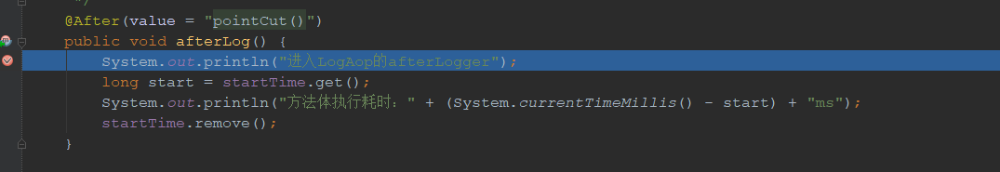

# SpringBoot中AOP编程

## 一、AOP是什么

AOP：Aspect Oriented Programming，翻译过来就是“面相切面编程”，它是对面相对象的一种补充和完善。

AOP的使用场景：

* 数据源切换
* 事务管理
* 权限控制
* 日志打印

根据其使用场景我能知道起始AOP的实现很像我们现实中需要对业务代码部分进行切入业务实现逻辑。

它有以下特点：

* 侵入性小，几乎可以不改动原来逻辑的情况下把新的逻辑加入业务。
* 实现方便，使用几个注解就可以实现，使系统更容易拓展。
* 更好的复用代码，比如事务日志打印，简单逻辑适合所有情况。


## 二、AOP中注解的含义

`@Aspect`：切面。表示一个横切进业务的一个对象。他里面包含切入点（Pointcut）和Advice（通知）。

`@Pointcut`：切入点。表示需要切入的位置，比如某些类或者某些方法，也就是先定一个范围。

`@Before`：Advice（通知）的一种，切入点的方法体执行之前执行。

`@Around`：Advice（通知）的一种，环绕切入点执行也就是把切入点包裹起来执行。
`@After`：Advice（通知）的一种，在切入点正常运行结束后执行。
`@AfterReturning`：Advice（通知）的一种，在切入点正常运行结束后执行，异常则不执行
`@AfterThrowing`：Advice（通知）的一种，在切入点运行异常时执行。


## 三、Pointcut切入点的语法

```java
    /**
     * 1、使用within表达式匹配
     * 下面示例表示匹配com.leo.controller包下所有的类的方法
     */
    @Pointcut("within(com.leo.controller..*)")
    public void pointcutWithin(){

    }

    /**
     * 2、this匹配目标指定的方法，此处就是HelloController的方法
     */
    @Pointcut("this(com.leo.controller.HelloController)")
    public void pointcutThis(){

    }

    /**
     * 3、target匹配实现UserInfoService接口的目标对象
     */
    @Pointcut("target(com.leo.service.UserInfoService)")
    public void pointcutTarge(){

    }

    /**
     * 4、bean匹配所有以Service结尾的bean里面的方法，
     * 注意：使用自动注入的时候默认实现类首字母小写为bean的id
     */
    @Pointcut("bean(*ServiceImpl)")
    public void pointcutBean(){

    }

    /**
     * 5、args匹配第一个入参是String类型的方法
     */
    @Pointcut("args(String, ..)")
    public void pointcutArgs(){

    }

    /**
     * 6、@annotation匹配是@Controller类型的方法
     */
    @Pointcut("@annotation(org.springframework.stereotype.Controller)")
    public void pointcutAnnocation(){

    }
    /**
     * 7、@within匹配@Controller注解下的方法，要求注解的@Controller级别为@Retention(RetentionPolicy.CLASS)
     */
    @Pointcut("@within(org.springframework.stereotype.Controller)")
    public void pointcutWithinAnno(){

    }
    /**
     * 8、@target匹配的是@Controller的类下面的方法，要求注解的@Controller级别为@Retention(RetentionPolicy.RUNTIME)
     */
    @Pointcut("@target(org.springframework.stereotype.Controller)")
    public void pointcutTargetAnno(){

    }
    /**
     * 9、@args匹配参数中标注为@Sevice的注解的方法
     */
    @Pointcut("@args(org.springframework.stereotype.Service)")
    public void pointcutArgsAnno(){

    }


    /**
     * 10、使用excution表达式
     * execution(
     *  modifier-pattern?           //用于匹配public、private等访问修饰符
     *  ret-type-pattern            //用于匹配返回值类型，不可省略
     *  declaring-type-pattern?     //用于匹配包类型
     *  name-pattern(param-pattern) //用于匹配类中的方法，不可省略
     *  throws-pattern?             //用于匹配抛出异常的方法
     * )
     *
     * 下面的表达式解释为：匹配com.leo.controller.HelloController类中以hello开头的修饰符为public返回类型任意的方法
     */
    @Pointcut(value = "execution(public * com.leo.controller.HelloController.hello*(..))")
    public void pointCut() {

    }

```

**需要注意：上面的匹配的类型中支持或(||)与(&&)非(!)运算。**


## 四、AOP代码实现

首先配置`pom.xml`进行注解jar包的支持

```xml
        <!-- aop aspect注解导包-->
        <dependency>
            <groupId>org.aspectj</groupId>
            <artifactId>aspectjrt</artifactId>
            <version>1.8.9</version>
        </dependency>
        <dependency>
            <groupId>org.aspectj</groupId>
            <artifactId>aspectjweaver</artifactId>
            <version>1.8.9</version>
        </dependency>

```

然后在配置文件中启动注解支持，例如我的是`myspringmvc-servlet.xml`文件，这里需要注意的是注解要跟配置文件在一块，举个例子：如果需要切入`Controller`的配置就需要在`myspringmvc-servlet.xml`中添加，如果是切入应用的配置如`Service`则需要在`applicationContext.xml`中添加。

```xml
    <!-- 开启Aop注解 -->
    <aop:aspectj-autoproxy  proxy-target-class="true"></aop:aspectj-autoproxy>

```


AOP核心代码如下：

```java
    ThreadLocal<Long> startTime = new ThreadLocal<>();
    /**
     * 10、使用excution表达式
     * execution(
     *  modifier-pattern?           //用于匹配public、private等访问修饰符
     *  ret-type-pattern            //用于匹配返回值类型，不可省略
     *  declaring-type-pattern?     //用于匹配包类型
     *  name-pattern(param-pattern) //用于匹配类中的方法，不可省略
     *  throws-pattern?             //用于匹配抛出异常的方法
     * )
     *
     * 下面的表达式解释为：匹配com.leo.controller.HelloController类中以hello开头的修饰符为public返回类型任意的方法
     */
    @Pointcut(value = "execution(public * com.leo.controller.HelloController.hello*(..))")
    public void pointCut() {

    }
    
    /**
     * 在方法执行之前执行
     *
     * @param joinPoint
     */
    @Before(value = "pointCut()")
    public void beforeLog(JoinPoint joinPoint) {
        System.out.println("进入LogAop的beforeLogger");
        startTime.set(System.currentTimeMillis());
    }

    /**
     * 在进入类之前执行，然后返回pjp.proceed()之前执行before，再执行方法体，在到after
     *
     * @param
     */
    @Around(value = "pointCut()")
    public Object aroundLog(ProceedingJoinPoint pjp) throws Throwable {
        System.out.println("进入LogAop的aroundLogger");
        return pjp.proceed();
    }

    /**
     * 在方法执行返回之后执行
     */
    @After(value = "pointCut()")
    public void afterLog() {
        System.out.println("进入LogAop的afterLogger");
        long start = startTime.get();
        System.out.println("方法体执行耗时：" + (System.currentTimeMillis() - start) + "ms");
        startTime.remove();
    }

    /**
     * 在返回之后执行
     * @param o
     */
    @AfterReturning(value = "pointCut()",returning = "o")
    public void afterRunningLog(Object o){
        System.out.println("进入LogAop的afterRunningLog");
        System.out.println(o.getClass());
    }

    /**
     * 在产生异常时执行
     */
    @AfterThrowing(value = "pointCut()")
    public void afterThrowingLog(){
        System.out.println("进入LogAop的afterThrowingLog");
    }

```


执行顺序：

* 先进入`@Around`


* 执行完`pjp.proceed()`之后，开始进入`@Before方法`


* 执行完`@Before`中的方法后进入主方法


* 执行完主方法体，又回到了`@Around`的返回值


* 然后开始执行`@After`中内容


* 最后到了`@AfterReturning`方法体中


**所以，正常的执行顺序是：@Around ->@Before->主方法体->@Around中pjp.proceed()->@After->@AfterReturning**


如果存下异常那执行顺序是什么呢？以下模拟了一个异常。

* 首先进入了`@Around`的方法


* 进入了`@After`的方法



* 最后进入了`@AfterThrowing`的方法


**因此如果异常在Around中pjp.proceed()之前，则执行顺序为：**`@Around -> @After -> @AfterThrowing`

**同理，如果异常在Around中pjp.proceed()之后，则执行顺序为：**`@Around ->@Before->主方法体->@Around中pjp.proceed()->@After->@AfterThrowing`