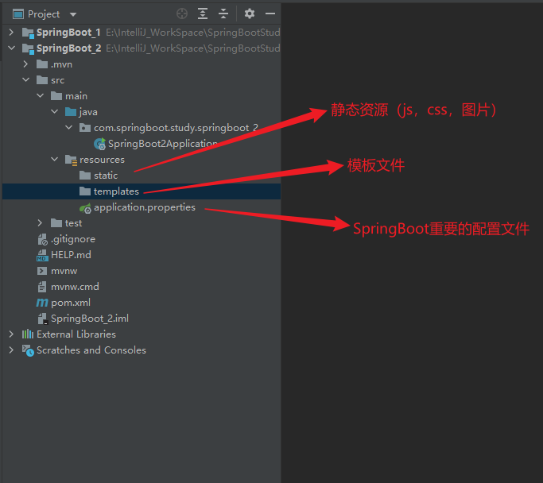

# SpringBoot

---

## 第一章

---

1. 为什么要使用SpringBoot

   因为Spring，SpringMVC需要使用的大量的配置文件（xml文件）

   还需要配置各种对象，把使用的对象放入到spring容器中才能使用对象

   需要了解其他框架配置规则。

2. SpringBoot就相当于不需要配置文件的Spring+SpringMVC。常用的框架和第三方库都已经配置好了。

   拿来就可以使用 了。

3. SpringBoot开发效率高，使用方便多了。

### 1.1什么是JavaConfig

---

> JavaConfig：是Spring提供的试音Java类配置容器。配置SpringIOC容器的纯Java方法。在这个Java类这可以创建Java对象，把对象放入Spring容器中（注入到容器）

优点：

> 1. 可以使用面向对象的方式，一个配置类可以继承配置类，可以重写方法
> 2. 避免繁琐的xml配置

使用两个注解：

1. @Configuration：放在一个类的上面，表示这个类是作为配置文件使用的。
2. @Bean：申明对象，把对象注入到容器中

> MyTest.java
>
> ```java
> package com.study.config;
> 
> import com.study.vo.Student;
> import org.springframework.context.annotation.Bean;
> import org.springframework.context.annotation.Configuration;
> 
> /**
>  * Configuration:表示当前类是作为配置文件使用的。就是用来配置容器的
>  * 位置：在类的上面
>  * SpringConfig这个类相当于beans.xml
>  */
> @Configuration
> public class SpringConfig {
> 
>     /**
>      * 创建方法，方法的返回值是对象。在方法的上面加入@Bean
>      * 方法的返回值独享就注入到容器中
>      * @Bean：把独享注入到Spring容器中。作用相当于<bean>
>      *     位置：方法的上面
>      *
>      *     说明：@Bean，不指定对象的名称，默认是方法名是  id
>      */
>     @Bean
>     public Student createStudent(){
>         Student s1 = new Student();
>         s1.setName("张三");
>         s1.setAge(26);
>         s1.setSex("男");
>         return s1;
>     }
> 
> 
>     /**
>      * 指定对象在容器中的名称（指定<bean></bean>的id属性）
>      * @Bean的name属性，指定对象的名称（id）
>      */
>     @Bean(name = "lisiStudent")
>     public Student makeStudent(){
>         Student s1 = new Student();
>         s1.setName("李四");
>         s1.setAge(22);
>         s1.setSex("男");
>         return s1;
>     }
> 
> 
> }
> 
> ```
>
> SpringConfig.java
>
> ```java
> package com.study.config;
> 
> import com.study.vo.Student;
> import org.springframework.context.annotation.Bean;
> import org.springframework.context.annotation.Configuration;
> 
> /**
>  * Configuration:表示当前类是作为配置文件使用的。就是用来配置容器的
>  * 位置：在类的上面
>  * SpringConfig这个类相当于beans.xml
>  */
> @Configuration
> public class SpringConfig {
> 
>     /**
>      * 创建方法，方法的返回值是对象。在方法的上面加入@Bean
>      * 方法的返回值独享就注入到容器中
>      * @Bean：把独享注入到Spring容器中。作用相当于<bean>
>      *     位置：方法的上面
>      *
>      *     说明：@Bean，不指定对象的名称，默认是方法名是  id
>      */
>     @Bean
>     public Student createStudent(){
>         Student s1 = new Student();
>         s1.setName("张三");
>         s1.setAge(26);
>         s1.setSex("男");
>         return s1;
>     }
> 
> 
>     /**
>      * 指定对象在容器中的名称（指定<bean></bean>的id属性）
>      * @Bean的name属性，指定对象的名称（id）
>      */
>     @Bean(name = "lisiStudent")
>     public Student makeStudent(){
>         Student s1 = new Student();
>         s1.setName("李四");
>         s1.setAge(22);
>         s1.setSex("男");
>         return s1;
>     }
> 
> 
> }
> 
> ```

### 1.2@ImporResource

***

@ImportResource作用导入其他的xml配置文件，等于在xml

```xml
<import resources="其他配置文件"/>
```

例如：

```java
@Configuration
@ImportResource(value = "classpath:applicationContext.xml")
public class SpringConfig {
//......
}
```

### 1.3@PropertyResource

---

@PropertyResource:读取properties属性配置文件。使用属性配置文件可以实现外部化配置，

在程序代码之外提供数据。

步骤：

1. 在resources目录下，创建properties文件，使用k=v的格式提供数据
2. 在PropertyResource指定properties文件的位置
3. 使用@Value(value="${key}")

```java
@Configuration
@ImportResource(value = "classpath:applicationContext.xml")
@PropertySource(value = "classpath:config.properties")
@ComponentScan(basePackages = "com.study.vo")
public class SpringConfig {
//......
}
```

## 第二章

---

### 2.1介绍

---

SpringBoot是Spring中的一个成员，可以简化Spring，SpringMVC的使用。他的核心还是IOC容器。

特点：

* Create stand-alone Spring applications

  创建Spring应用

* Embed Tomcat,Jetty or Undertow directly (no need to deploy WAR files)

  内嵌的tomcat，jetty，Undertow

* Provide opinionated 'starter' dependencies to simplify your build configuration

  提供了starter起步依赖，简化应用的配置。

  比如使用MyBatis框架，需要在Spring项目中，配置MyBatis的对象SqlSessionFactory，Dao的代理对象

  在SpringBoot项目中，在pom.xml里加入，加入一个mybatis-spring-boot-starter依赖

* Automatically configure Spring and 3rd party libraries whenever possible

  尽可能去配置spring的第三方库。叫做自动配置（就是把Spring中的，第三方库中的对象都创建好，翻到容器中，开发人员可以直接使用）

* Provide production-ready features such as metrics,health checks,and externalized configuration

  提供了健康检查，统计，外观化配置

* Absolutely no code generation and no requirement for XML configuration

  不用生成代码，不适用xml，做配置

### 2.2创建Spring Boot项目

---

#### 2.2.1第一种方式，使用Spring提供的初始化器，就是向导创建SpringBoot应用

使用的地址：https://start.spring.io

如果国外的下载慢或者下载不了可以改成镜像下载：https://start.springboot.io

SpringBoot项目的结构：

> 

### 2.3 注解使用

---

```java
@SpringBootApplication
复合注解：由
    @SpringBootConfiguration
    @EnableAutoConfiguration
    @ComponentScan
    
    
    1.@SpringBootConfiguration
    @Configuration
    @Indexed
public @interface SpringBootConfiguration {
    @AliasFor(
        annotation = Configuration.class
    )
    boolean proxyBeanMethods() default true;
}


说明：使用了@SpringBootConfiguration注解标注的类，可以作为配置文件使用的，
    可以使用Bean申明对象，注入到容器
```

2.@EnableAutoConfiguration

启用自动配置，把java对象配置好，注入到Spring容器中。例如可以把mybatis的对象创建好，放入到容器中

3.@ComponentScan

```java
@ComponentScan 扫描器，找到注解，根据注解的功能创建对象，给属性赋值等等。
    默认扫描的包：@ComponentScan所在的类所在的包和子包。
```

### 2.4SpringBoot的配置文件

---

配置文件名称：application

扩展名有：properties(k=v)；yml(k: v)

使用application.properties，application.yml


例1：application.properties设置 端口和上下文

```xml
#设置端口号
server.port=8081
#设置访问应用上下文路径，contextpath
server.servlet.context-path=/myboot
```

例2：application.yml

```yaml
server:
  port: 8083
  servlet:
    context-path: /myboot2
```

#### @PropetySource注解（加载外部配置文件以及解决SpringBoot默认读取不了外部配置文件问题）

1. PropertySource不仅支持加载类路径下的文件，还支持加载本地磁盘上的文件。

   ```java
   /**
    * 用户···实体————读取本地磁盘上的配置文件
    * * @Component  将本来标识为一个 Spring 组件，因为只有是容器中的组件，容器才会为 @ConfigurationProperties 提供此注入功能
    * * @PropertySource 指明加载类路径下的哪个配置文件来注入值，既可以是类路径下，也可以上磁盘上
    * * @ConfigurationProperties 表示 告诉 SpringBoot 将本类中的所有属性和配置文件中相关的配置进行绑定；
    * * * prefix = "user1" 表示 将配置文件中 key 为 user 的下面所有的属性与本类属性进行一一映射注入值，如果配置文件中-
    * * * 不存在 "user1" 的 key，则不会为 POJO 注入值，属性值仍然为默认值
    * <p>
    * 磁盘路径可以是相对路径，绝对路径，也可以通过系统属性值指定变量
    * * 相对路径，文件在应用根目录下：@PropertySource(value = {"file:userDisk.properties"})
    * * 相对路径，文件在应用根目录下：@PropertySource(value = {"file:./userDisk.properties"})
    * * 绝对路径，在指定的路径下：@PropertySource(value = {"file:D:\\project\\IDEA_project\\yuanyuan\\userDisk.properties"})
    * * 通过系统属性值指定变量：@PropertySource(value = {"file:${user.dir}/userDisk.properties"})
    * * * user.dir：用户的当前工作目录
    *
    * @author wangmaoxiong
    * Created by Administrator on 2018/7/11 0011.
    */
   @Component
   @PropertySource(value = {"file:${user.dir}/userDisk.properties"})
   @ConfigurationProperties(prefix = "user2")
   public class UserDisk {
       private Integer id;
       private String lastName;
       private Integer age;
       private Date birthday;
       private List<String> colorList;
       private Map<String, String> cityMap;
       private Dog dog;
   ```

2. PropertySource注解读取不了外部yml配置文件问题以及解决方案

   PropertySource默认只解析properties配置文件解析不了yml的外部配置文件，如果要读取则必须要重写配置读取配置文件的接口

   

   解决方案：

   如果要解析yml文件，需要指定factory只需要实现org.springframework.core下的 PropertySourceFactory 接口就OK了。

   YamlPropertySourceFactory.java

   ```java
   
   import org.springframework.beans.factory.config.YamlPropertiesFactoryBean;
   import org.springframework.core.env.PropertiesPropertySource;
   import org.springframework.core.env.PropertySource;
   import org.springframework.core.io.support.EncodedResource;
   import org.springframework.core.io.support.PropertySourceFactory;
   
   import java.io.IOException;
   import java.util.Properties;
   
   public class YamlPropertySourceFactory implements PropertySourceFactory {
   
       @Override
       public PropertySource<?> createPropertySource(String name, EncodedResource resource) throws IOException {
           YamlPropertiesFactoryBean factory = new YamlPropertiesFactoryBean();
           factory.setResources(resource.getResource());
           factory.afterPropertiesSet();
           Properties ymlProperties = factory.getObject();
           String propertyName = name != null ? name : resource.getResource().getFilename();
           return new PropertiesPropertySource(propertyName,ymlProperties);
       }
   }
   
   ```

   然后在我们的application启动类上添加@propertySources注解引入我们的外部文件：

   ```java
   @PropertySources({
           @PropertySource("file:config/jdbc-db.properties"),
           @PropertySource(value = "file:config/redis.yml",factory = YamlPropertySourceFactory.class)
   })
   ```

   

   

   

#### @ImportResource导入Spring配置文件

   1、@ImportResource 注 解用来导入 Spring 的配置文件，如核心配置文件 "beans.xml"，从而让配置文件里面的内容生效；

   2、如果应用中仍然想采用以前 xml 文件的配置方式，如 "beans.xml" ，则使用 “@ImportResource” 注解轻松搞定。

   3、将 @ImportResource 标注在一个配置类上，通常直接放置在应用启动类上，和 @SpringBootApplication 一起即可。

   ```java
   
   import org.springframework.boot.SpringApplication;
   import org.springframework.boot.autoconfigure.SpringBootApplication;
   import org.springframework.context.annotation.ImportResource;
   /**
    * 应用启动类
    *
    * @ImportResource 必须放置在配置类上，通常放在启动类即可，用 value 指明导入类路径下的那个 Spring 配置文件
    */
   @ImportResource(value = {"classpath:beans.xml"})
   @SpringBootApplication
   public class CocoApplication {
       public static void main(String[] args) {
           SpringApplication.run(CocoApplication.class, args);
       }
   }
   ```

   4、然后就可以在类路径下提供原始的 beans.xml 配置文件：

   ```xml
   <?xml version="1.0" encoding="UTF-8"?>
   <beans xmlns="http://www.springframework.org/schema/beans"
          xmlns:xsi="http://www.w3.org/2001/XMLSchema-instance"
          xsi:schemaLocation="http://www.springframework.org/schema/beans http://www.springframework.org/schema/beans/spring-beans.xsd">
   
   <!-- 放入到Sping容器中，这是以前Spring的内容，不再累述-->
   <bean id="userService" class="com.lct.service.UserService"/></beans>
   ```

   5、启动应用控制台会打印：loading XML bean definitions from class path resource [beans. xml] 表示加载成功。

### 2.5多环境配置

---

有开发环境，测试环境，上线的环境。

每个环境有不同的配置信息，例如端口，上下文件，数据库url，用户名，密码等等


使用多环境配置文件，可以方便的切换不同的配置。

使用方式：创建多个配置文件，名称规则：application-环境mingcheng.properties(yml)


创建开发环境的配置文件：application-dev.properties(application-dev.yml)

创建测试者使用的配置：application-test.properties

application.yml 示例：
注意：配置多环境yml 文件必须是application开头文件

```yaml
spring:
	profiles:
	 	active: @spring.profiles.active@
```


### 2.6

---

### 2.7使用Jsp

SpringBoot不推荐使用jsp，而是使用模板技术代替jsp


使用jsp需要配置：

1. 加入一个处理jsp的依赖。负责编译jsp文件

   ```xml
   <dependency>
       <groupId>org.apache.tomcat.embed</groupId>
       <artifactId>tomcat-embed-jasper</artifactId>
   </dependency>
   ```

2. 如果需要使用servlet，jsp的功能

   如：servlet的依赖、jsp的依赖、jstl的依赖。

3. 创建一个存放jsp的目录，一般叫做webapp

   index.jsp

4. 需要在pox.xml指定jsp文件编译后的存放目录。

   META-INF/resources

5. 创建Controller，访问jsp

6. 在application.propertis文件中配置视图解析器

### 2.8使用容器

---

你想通过代码，从容器中获取对象。

通过SpringApplication.run(Application.class,args);返回值获取容器。

```java
 public static ConfigurableApplicationContext run(Class<?> primarySource, String... args) {
        return run(new Class[]{primarySource}, args);
    }

ConfigurableApplicationContext：接口，是ApplicationContext的子接口
    public interface ConfigurableApplicationContext extends ApplicationContext, Lifecycle, Closeable
```

CommandLineRunner接口

​	开发中可能会有这样的情景。需要在容器启动后执行一些内容。比如读取配置文件，数据库连接之类的。SpringBoot给我们提供了两个接口来帮助我们实现这种需求。这两个接口分别是CommandLineRunner和ApplicationRunner。他们的实行时机为容器启动完成的时候。这两个接口中有一个run方法，我们只需要实现这个方法计科。这两个接口的不同之处在于：ApplicationRunner中run方法的参数为ApplicationArguments，而CommandLineRunner接口中run方法的参数为String数组

### 2.9ComnandLineRunner接口、ApplicationRunner接口

---

这个两个接口都有一个run方法，执行时间在容器(SpringApplication.run(...))对象创建好后，自动执行run()方法。

可以完成自定义的在容器对象创建好的一些操作。

```java
@FunctionalTnterface
public interface CommandLineRunner{
    void run(String... args) throws Exception;
}


@FunctionalInterface
public interface Application{
    void run(ApplicationArguments args) throws Exception;
}
```

## 第三章

---

讲三个内容：拦截器，Servlet，Filter

### 3.1 拦截器

---

拦截器是SpringMVC中一种对象，能拦截对Controller的请求。

拦截器框架中有系统的拦截器，还可以自定义拦截器。实现对请求预先处理。


实现自定义拦截器：

1. 创建类实现SpringMVC框架的HandlerInterceptor接口

```java
public interface HandlerInterceptor {
    default boolean preHandle(HttpServletRequest request, HttpServletResponse response, Object handler) throws Exception {
        return true;
    }

    default void postHandle(HttpServletRequest request, HttpServletResponse response, Object handler, @Nullable ModelAndView modelAndView) throws Exception {
    }

    default void afterCompletion(HttpServletRequest request, HttpServletResponse response, Object handler, @Nullable Exception ex) throws Exception {
    }
}
```

2. 需在SpringMVC的配置文件中，申明拦截器

```xml
   <mvc:interceptors>
   	<mvc:interceptor>
       	<mvc:path="url"/>
           <bean class="拦截器类全限定名称"/>
       </mvc:interceptor>
   </mvc:interceptors>
```

   SpringBoot中注册拦截器：

```java
@Configuration
public class MyAppConfig implements WebMvcConfigurer {


    //添加拦截器对象，注入到容器中
    @Override
    public void addInterceptors(InterceptorRegistry registry) {
        //创建拦截器对象
        HandlerInterceptor interceptor = new LoginInterceptor();
        //指定拦截的请求uri地址
        String path[] = {"/user/**"};
        //指定不拦截的地址
        String excludePath[] = {"/user/login"};
        registry.addInterceptor(interceptor).addPathPatterns(path).excludePathPatterns(excludePath);


    }
}

```

HandlerInterceptor.java

```java
public class HandlerInteerceptor implements HandlerInterceptor {

    @Override
    public boolean preHandle(HttpServletRequest request,
                             HttpServletResponse response,
                             Object handler) throws Exception {

        return false;

    }
}

```


### 3.2 Servlet

---

在SpringBoot框架中使用Servlet对象。

使用步骤：

1. 创建Servlet类。创建类继承HttpServlet
2. 注册Servlet，让框架能找到Servlet


例子：

1. 创建自定义的Servlet

   ```java
   //创建Servlet类
   public class Myservlet extends HttpServlet{
       @Override
       protected void doGet(HttpServletRequest req, HttpServletResponse resp) throws ServletException, IOException {
           doPost(req,resp);
       }
       
       
       @Override
       protected void doPost(HttpServletRequest req,HttpServletResponse resp) throws ServletException, IOException {
           //使用HttpServletResponse输出数据，应答结果
           resp.setContentType("text/html;charset=utf-8");
           PrintWriter out = resp.getWriter();
           out.println("===执行的是Servlet===");
           out.flush();
           out.close();
       }
       
   }
   ```

2. 注册Servlet

   ```java
   @Configuration
   public class WebApplictionConfig {
       
       //定义方法，注册Servlet对象
       @Bean
       public ServletRegistrationBean servletRegistrationBean(){
           
           //public ServletRegistrationBean(T servlet, String... urlMapping)
           //第一个参数是 Servlet对象，第二个是url地址
           
           //ServletRegistrationBean bean = 
           		//new ServletRegistrationBean( new MyServlet(),"/myservlet");
           
           ServletRegistrationBean bean = new ServletRegistrationBean();
           bean.setServlet(new MyServlet());
           bean.addUrlMappings("/login","/test");   //<url-pattern>
           
           return bean;
           
       }
   }
   ```

   

### 3.3过滤器Filter

---

Filter是Servlet规范中的过滤器，可以处理请求，对请求的参数，属性进行调整，常常在过滤器中处理字符编码在框架中使用过滤器：

1. 创建自定义过滤器
2. 注册Filter过滤器对象

例子：

```java
//自定义过滤器
public class MyFilter implements Filter {


    @Override
    public void doFilter(ServletRequest servletRequest, ServletResponse servletResponse, FilterChain filterChain) throws IOException, ServletException {
        System.out.println("执行了MyFilter，doFilter");
        filterChain.doFilter(servletRequest,servletResponse);
    }

}

```

注册Filter：

```java
@Configuration
public class WebApplicationConfig {

    @Bean
    public FilterRegistrationBean filterRegistrationBean(){
        FilterRegistrationBean bean = new FilterRegistrationBean();

        bean.setFilter(new MyFilter());
        bean.addUrlPatterns("/user/*");

        return bean;

    }

}
```

### 3.4字符集过滤器

---

CharacterEncodingFilter：解决post请求中乱码问题

在SpringMVC框架，在web.xml注册过滤器。配置他的属性。

第一种方式：

使用步骤：

1. 配置字符集过滤器

   ```java
   @Configuration
   public class WebSystemConfig {
   
       //注册Servlet
       @Bean
       public ServletRegistrationBean servletRegistrationBean(){
           MyServlet myServlet = new MyServlet();
           ServletRegistrationBean reg = new ServletRegistrationBean(myServlet,"/myservlet");
           return reg;
       }
   
   
       //注册Filter
       @Bean
       public FilterRegistrationBean filterRegistrationBean(){
           FilterRegistrationBean reg = new FilterRegistrationBean();
           //使用框架中的过滤器类
           CharacterEncodingFilter filter = new CharacterEncodingFilter();
           filter.setEncoding("utf-8");
   
           //指定request，response都使用encoding的值
           filter.setForceEncoding(true);
   
           reg.setFilter(filter);
   
           reg.addUrlPatterns("/*");
   
           return reg;
   
       }
   
   
   
   }
   ```

2. 修改application.properties文件，让自定义的过滤器起作用

   ```properties
   #SpringBoot中默认已经配置了CharacterEncodingFilter。编码默认ISO-8859-1
   #设置enabled=false 作用是关闭系统中配置好的过滤器，使用自定义的CharacterEncodingFilter
   server.servlet.encoding.enabled=false
   ```

第二种方式：

修改application.properties文件

```properties
#让系统的CharacterEncodingFilter生效
server.servlet.encoding.enabled=true
#指定使用编码的方式
server.servlet.encoding.charset=utf-8
#强制request，response都使用charset属性的值
server.servlet.encoding.force=true
```

## 第四章

---

### 使用MyBatis框架操作数据，在SpringBoot框架集成MyBatis

使用步骤：

1. mybatis起步依赖：完成mybatis对象自动配置，对象放在容器中

2. pom.xml指定把src/main/java目录中的xml文件包含到classpath中

3. 创建实体类Student

4. 创建Dao接口StudentMapper（StudentDao），创建一个查询学生的方法

5. 创建Mapper（Dao）接口对应的Mapper文件，xml文件，写sql语句

6. 创建Service层对象，创建StudentService接口和他的实现类。去dao对象的方法。完成数据库的操作

7. 创建Controller对象，访问Service。

8. 写application.properties文件

   配置数据库的连接信息。

### 第一种方式：@Mapper

@Mapper：放在dao接口的上面，每一个接口都需要使用这个注解

```java
/**
 * 告诉MyBatis这是dao接口，创建此接口的代理对象。
 */

@Mapper
public interface UserMapper {

    User selectById(@Param("userId") Integer id);


}
```

### 第二种方式 @MapperScan

```java
@SpringBootApplication
@MapperScan(basePackages = "com.study4.springboot_4.mapper")
public class SpringBoot4Application {
}
```

### 第三种方式：Mapper文件和Dao接口分开管理

现在Mapper文件放在resources目录下

1. 在resources目录中创建子目录（自定义的），例如mapper
2. 把mapper文件放到mapper目录中
3. 在application.properties文件中，指定mapper文件的目录

```properties
#指定mapper文件的位置
mybatis.mapper-locations=classpath:mapper/*.xml
#mybatis日志输出
mybatis.configuration.log-impl=org.apache.ibatis.logging.stdout.StdOutImpl
```

4. 在pom.xml中指定把resources目录中

```xml
<resource>
    <directory>src/main/resources</directory>
    <includes>
        <include>**/*.properties</include>
        <include>**/*.xml</include>
    </includes>
</resource>
```

### 第四个 事务

Spring框架中的事务：

1. 管理事务的对象：事务管理器（接口，接口有很多的实现类）

   例如：使用JDBC或MyBatis访问数据库，使用的事务管理器：DataSourceTransactionManager

2. 声明式事务：在xml配置文件或者使用注解说明事务控制的内容

   控制事务：隔离级别，传播行为，超时时间

3. 事务处理方式：

   1) spring框架中的@Transactional
   2) aspectj框架可以在xml配置文件中，声明事务控制的内容

SpringBoot中使用事务：上面的两种方式都可以。

1. 在业务方法的上面加入@Transactional，加入注解后，方法有事务功能了。
2. 明确的在主启动类的上面，加入@EnableTransactionManager

例子：

```java
/**
* @Transactional：表示方法的有事务支持
* 		默认：使用库的隔离级别，REQUIRED 传播行为；超时时间 -1
* 		抛出运行时异常，回滚事务
*/
@Transactional
@Override
public int addUser(User user) {
    System.out.println("业务方法addUser");
    int rows = userMapper.insert(user);
    System.out.println("执行sql语句");
    //抛出一个运行时异常，目的是回滚事务
    //int m = 10/0;
    return rows;
}
```


### MyBatis代码自动生成插件

```xml
<!--            mybatis代码自动生成插件-->
            <plugin>
                <groupId>org.mybatis.generator</groupId>
                <artifactId>mybatis-generator-maven-plugin</artifactId>
                <version>1.3.6</version>
                <configuration>
<!--                    配置文件的位置:在项目的根目录下，和src是平级的-->
                    <configurationFile>GeneratorMapper.xml</configurationFile>
                    <verbose>true</verbose>
                    <overwrite>true</overwrite>
                </configuration>
            </plugin>
```

## 第五章 接口架构风格——RESTful

---

[API](https://baike.baidu.com/item/API/10154)之主要目的是提供应用程序与开发人员以访问一组例程的能力，而又无需访问[源码](https://baike.baidu.com/item/源码/344212)，或理解内部工作机制的细节。提供API所定义的功能的软件称作此API的实现。API是一种[接口](https://baike.baidu.com/item/接口/15422203)，故而是一种[抽象](https://baike.baidu.com/item/抽象/82058)。

**应用程序接口**（[英语](https://baike.baidu.com/item/英语/109997)：**A**pplication **P**rogramming **I**nterface，简称：**API**），又称为**应用编程接口**，就是[软件](https://baike.baidu.com/item/软件)系统不同组成部分衔接的约定。由于近年来软件的规模日益庞大，常常需要把复杂的系统划分成小的组成部分，编程接口的设计十分重要。程序设计的实践中，编程接口的设计首先要使软件系统的职责得到合理划分。良好的[接口](https://baike.baidu.com/item/接口/2886384)设计可以降低系统各部分的相互依赖，提高组成单元的[内聚性](https://baike.baidu.com/item/内聚性/4973441)，降低组成单元间的[耦合](https://baike.baidu.com/item/耦合/2821124)程度，从而提高系统的维护性和扩展性。


接口（API）：可以指访问Servlet，controller的url，调用其他程序的 函数

架构风格：api组织方式（样子）

就是一个传统的：http://localhost:9001/study/addUser?name=白姬&age=12

​							在地址上提供了访问的资源名称addUser，在其后使用了get方式传递参数。

RESTful架构风格

1. REST（中文：表现层状态转移）

   REST（英文：Representational State Transfer，简称REST）

   一种互联网软件架构设计的风格，但它并不是标准，它只是提出了一组客户端和服务端交互时的架构历年和设计原则，基于这种理念和原则设计的接口可以更简洁，更有层次，REST这个词，是Roy Fielding在他2000年的博士论文中提出的。

   ​		任何的技术都可以实现这种理念，如果一个架构符合REST原则，就称它为RESTFul架构

   ​		比如我们要访问一个http接口：http://localhost:8080/boot/order?id=1021&status=1

   ​		采用RESTFul风格则http地址为：http://localhost:8080/boot/order/1021/1

​		表现层状态转移：

​				表现层就是视图层，显示资源的，通过视图页面，jsp等等显示操作资源的结果。

​				状态：资源变化

​				转移：资源可以变化的。资源能创建，new状态，资源创建后可以查询资源，能看到资源的内容，这个资源内容，可以被修改，修改后资源和之前的不一样。

1. REST中的要素：

   用REST表示资源和对资源的操作。在互联网中，表示一个资源或者一个操作。

   资源使用url表示的，在互联网，使用的图片，视屏，文本，网页等等都是资源。

   资源是用名词表示。 


​		对资源：

​				查询资源：看，通过url找到资源。

​				创建资源：添加资源

​				更新资源：更新资源，编辑

​				删除资源：去除


​		资源使用url表示，通过名词表示资源。

​			在url中使用名词表示资源，以及访问资源的信息，在url中，使用“/”分隔资源的信息

​			http://localhost:8080/myboot/student/1001

​		使用http中的动作（请求方式），表示对资源的操作（CURD）

​			       GET：查询资源

​							http://localhost:8080/myboot/student/1001

​							http://localhost:8080/myboot/student/1001/1

​							处理多个资源：使用复数形式

​							http://localhost:8080/myboot/students/1001/1002

​		    	POST：创建资源 --sql insert

​							http://localhost:8080/myboot/student

​							在post请求中传递数据

```xml
<form action="http://localhost:8080/myboot/student" method="post">
    姓名：<input type="test" name="name"/>
    年龄：<input type="text" name="age"/>
</form>
```

​			       PUT：更新资源 --sql update

```xml
<form action="http://localhost:8080/myboot/student/1" method="post">
    姓名：<input type="test" name="name"/>
    年龄：<input type="text" name="age"/>
    	 <input type="hidden" name="_method" value="PUT"/>
</form>
```


​			DELETE：删除资源 --sql delete

```xml
<a href="http://localhost:8080/myboot/student/1">删除1的数据</a>
```

需要的分页，排序等参数，依然放在url的后面，例如：

http://localhost:8080/myboot/student?page=1&pageSize=20


3. 一句话说明REST：

   使用url表示资源，使用http动作操作资源。

4. 注解

   @PathVariable：从url中获取数据

   @GetMapping：支持的get请求方式，等同于@RequestMapping(method=RequestMethod.GET)

   @PostMapping：支持post请求方式，等同于@RequestMapping(method=RequestMethod.POST)

   @PutMapping：支持put请求方式，等同于@RequestMapping(method=RequestMethod.PUT)

   @DeleteMapping：支持delete请求方式，等同于@RequestMapping(method=RequestMethod.DELETE)


​		@RestController：复合注解，是@Controller和@ResponseBody组合。

​					在类的上面使用@RestController，表示当前类者的所有方法都加入了@ResponseBody 

5. Postman：测试工具

   是哟Postman：可以测试get，post，put，delete等请求

## 常见问题解决

---

### 1. Mapper.xml中出现多嵌套类的注入解决

```xml
 <resultMap id="usermap" type="com.xiaobei.xiaobei_server.pojo.User">
        <id property="id" column="id"/>
        <result property="userName" column="user_name"/>
        <result property="userAccount" column="user_account"/>
        <result property="userPassword" column="user_password"/>
        <result property="health_startTime" column="health_startTime"/>
        <result property="health_endTime" column="health_endTime"/>
        <result property="health_playTime" column="health_playTime"/>
        <association property="playCardMessage" javaType="com.xiaobei.xiaobei_server.pojo.PlayCardMessage" resultMap="playCardMessage"/>
    </resultMap>


<resultMap id="playCardMessage" type="com.xiaobei.xiaobei_server.pojo.PlayCardMessage">
        <result property="temperature" column="health_temperature"/>
        <result property="coordinates" column="health_coordinates" />
        <result property="location" column="health_location"/>
        <result property="healthState" column="health_healthState"/>
        <result property="dangerousRegion" column="health_dangerousRegion"/>
        <result property="dangerousRegionRemark" column="health_dangerousRegionRemark"/>
        <result property="contactSituation" column="health_contactSituation"/>
        <result property="goOut" column="health_goOut"/>
        <result property="goOutRemark" column="health_goOutRemark"/>
        <result property="remark" column="health_remark"/>
        <result property="familySituation" column="health_familySituation"/>
    </resultMap>
```

定义好之后然后使用resultMap定义返回值就行，==不管数组还是单个对象的返回都用resultMap==，因为这里有多重嵌套的类。


### 2. 各种注入类注解使用规范

---

#### @Controller 控制器（注入服务）
> 用于标注控制层，相当于struts中的action层

#### @Service 服务（注入dao）

> 用于标注服务层，主要用来进行业务的逻辑处理

#### @Repository（实现dao访问）

> 用于标注数据访问层，也可以说用于标注数据访问组件，即DAO组件

#### @Component （把普通pojo实例化到spring容器中，相当于配置文件中的 ）

> 泛指各种组件，就是说当我们的类不属于各种归类的时候（不属于@Controller、@Services等的时候），我们就可以使用@Component来标注这个类。Component注解也会当做配置类，但是并不会为其生成CGLIB代理Class，所以在生成Driver对象时和生成Car对象时调用car()方法执行了两次new操作，所以是不同的对象。当时Configuration注解时，生成当前对象的子类Class，并对方法拦截，第二次调用car()方法时直接从BeanFactory之中获取对象，所以得到的是同一个对象。
> 一般用@Configguration是更优的


### 3. 前端传入时如何获取以及格式化问题

#### 1.问题描述
#### 1.数据库里的日期为date类型，java如何进行接收？
#### 2.前端传过来的时间，后端如何接收？
#### 3.后端如何将时间存入数据库？
#### 4.写入数据库的时间会比传入的时间提前一天？

#### 2.解决方法
#### 2.1两个注解解决接收问题

```java
    @DateTimeFormat(pattern = "yyyy-MM-dd")
    @JsonFormat(pattern="yyyy-MM-dd",timezone="GMT+8")
    private Date award_date;//这里是你自己的时间类型的字段，在它上面加上这两个注解即可
```


* @DateTimeFormat入参注解；格式化接收前端的时间字符串为正确格式
*  @JsonFormat出参注解；格式化从数据库库里面查询出来的时间为正确格式
*  pattern参数可以自由定制。
*  timezone参数用于调整时区
#### 2.2一个参数解决时间提前问题
  这只要是由于时区的问题，所以时间上面会提前8小时，自己把它加上去就好了。可以直接在连接数据库的语句后面添加参数serverTimezone=GMT%2B8
  我这里加载在末尾，拼接完整的如下所示：

    url: jdbc:mysql://127.0.0.1:3308/stusystem?characterEncoding=utf8&allowMultiQueries=true&useSSL=false&serverTimezone=GMT%2B8

参数里的GMT%2B8实际上就是GMT+8,只不过在拼接的时候得用%2B才行。

#### 注入注解使用问题

---

注意：在使用对应的类的时候不能使用new的形式创建，否则对应类内部的注入注解将会全部失效。


## 常见SpringBoot配置

***

```yaml
spring:
  application:
    name: security6 #配置应用名称
  datasource:
    url: jdbc:mysql://localhost:3306/security6?useUnicode=true&characterEncoding=UTF-8 #配置数据源url
    driver-class-name: com.mysql.cj.jdbc.Driver #配置数据源的数据库驱动
    username: root #数据库的账号
    password: 12345678 #数据库的密码
server:
  port: 8080 #服务器的端口
  tomcat: #Tomcat相关配置
    max-connections: 8192 #最大连接数
    accept-count: 100 #等待队列长度
    threads:
      max: 500 #最大工作线程数
      min-spare: 10 #最小空闲线程数

```

### 针对4C8G的Tomcat配置，可以参考建议值：

```yaml
tomcat:
accept-count: 1000
max-connections: 10000
max-threads: 800
min-spare-threads: 100
```


