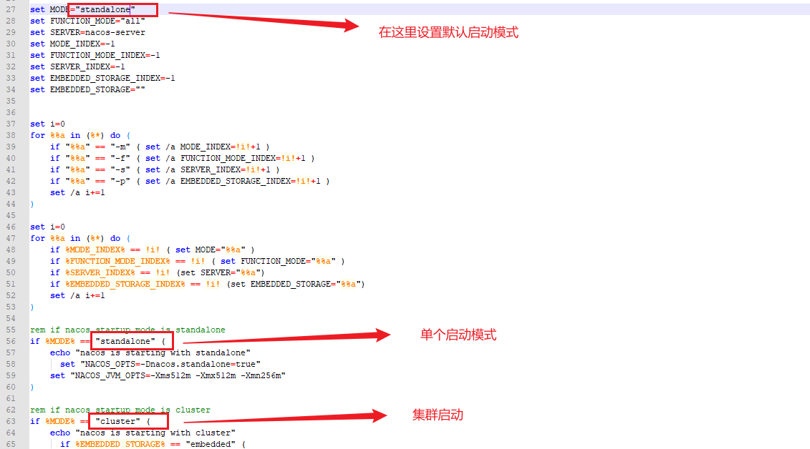

# SpringCloud学习笔记

---

## 1.Spring Cloud Eureka简介

注册发现中心

Eureka来源于古希腊词汇，意为“发现了”。在软件领域，Eureka是Netflix在线影片公司开源的一个服务注册与发现的 组件，和其他Netflix公司的服务组件（例如负载均衡、熔断器、网关等）一起，被Spring Cloud社区整合为 Spring Cloud Netflix模块。

Eureka是Netflix贡献给Spring Cloud的一个框架！Netflix给Spring Cloud贡献了很多框架，后面我们会学习到！

## 2.Spring Cloud Eureka和Zookeeper的区别

### 2.1什么是CAP原则（面试）

> 在分布式 微服务里面CAP定理
>
> 问：为什么zookeeper不适合做注册中心？
>
> CAP原则又称CAP定理，指的是在一个分布式系统中，
>
> 一致性（Consistency）：三个机器中数据中一致的
>
> 可用性（Availability）：当有一个节点挂掉了整个集群可以继续对外提供服务
>
> 分区容错性（Partition tolerance） （这个特性是不可避免的）：由于机房或者分区等原因会导致各个机器中的数据短暂不一致
>
> CAP原则指的是，这三个要素最多只能同时实现两点，不可能三者兼顾。
>
> CP、AP
>
> zk遵循CP原则
>
> eureka注重AP高可用
>
> eureka默认端口号为8761

@EnableEurekaServer注解：开启eureka的注册中心的功能（在SpringBoot启动函数上面添加）


DS replicas：集群相关信息

Indtances currently registered with Eureka：当前在eureka里面注册哪些实例 真实的例子 具体的东西 class new Object

Status：实例 的状态和ID

## SpringCloud中的常用配置

> 


## 集群的深入理解

> 如果是主从模式 主机该怎么选择？
>
> 如果是主从模式 数据是怎么同步的？  

分布式数据一致性协议： Paxos raft


## Eureka概念的理解

---

### 服务的注册

> 当项目启动时（eureka的客户端——，就会向eureka-server发送自己的元数据（原始数据）（运行的ip，端口port，健康的状态监控等，因为使用的是http/Restful请求风格），eureka-server会在自己内部保留这些元数据（内存中）。（有一个服务列表）（restful风格，以http动词的请求方式，完成对url资源的操作）

### 服务的续约

> 项目启动成功了，除了向eureka-server注册自己成功，还会定时的向eureka-server汇报自己，心跳，表示自己还活着。（修改一个时间）

### 服务的下线（主动下线）

> 当项目关闭时，会给eureka-server报告，说明自己要下机了。

服务的剔除（被动下线，主动剔除）

> 当项目超过了指定时间没有向eureka-server汇报自己，那么eureka0server就会认为此节点死掉了，会把它剔除掉，也不会放流量和请求到此节点 了。


## Eureka运作原理的特点

> Eureka-server对外提供的是restful风格的服务
>
> 以http动词的形式对url资源进行操作 get、post、put、delete
>
> http服务+特定的请求方式url地址
>
> 只要利用这些restful我们就能对项目实现注册和发现
>
> 只不过，eureka已经帮我们使用java语言写了client，让我们的项目只要依赖client就能实现注册和发现！
>
> 只要你会发起Http请求，那你就有可能自己实现服务的注册和发现。不管你是什么语言！


## Eureka的yml配置文件：

---

```yaml
server:
	port: 8761  #eureka的默认端口8761
spring:
	application:
		name: eureka-server #应用名称 不要使用特殊字符（必须要写应用名称）

eureka: #eureka的配置分为三类 sever client 实例的 eureka-server既是服务端有事客户端
	server:
		eviction-interval-timer-in-ms: 10000 #服务端间隔多少毫秒做定期删除的操作
		renewal-percent-threshold: 0.85  #续约百分比 超过85%的应用没有和你续约 那么eureka会保护服务 不会剔除
	instance: #实例的配置
		instance-id: ${eureka.instance.hostname}:${spring.application.name}:${server.port} 
		hostname: locahost #主机名称或者服务的ip
		prefer-ip-address: true # 以ip的形式显示具体的服务信息
		lease-renerwal-interval-in-seconds: 5 #服务实例的续约的时间间隔
	client:
		service-url:
			defaultZone: http://localhost:8761/eureka,...(可以注册多个，用“,”隔开)
		register-with-eureka: false  #先将server自己注册自己的开关（目前为关掉，默认为true  ）
		fetch-registry: true #要不要去注册中心里获取其他服务地址
		
```

### yml使用技巧：

>  比如defaulZone里面
>
> ```yaml
> #如果EUREKA_SERVER_URL能获取到值就采用这个，否则就使用“:”后面的默认设定
> defaultZone: ${EUREKA_SERVER_URL:http://localhost:8761}
> ```
>
> 


## Spring Cloud Ribbon

### Ribbon概述

> Spring Cloud Ribbon 是一个基于HTTP和TCP的客户端负载均衡工具，它基于Netflix Ribbon实现。通过Spring Cloud的封装，可以让我们轻松地将面向服务的REST模板请求自动转换成客户端负载均衡的服务调用。轮询hash权重...
>
> 简单的说Ribbon就是netfix公司的一个开源项目，主要功能是提供客户端负载均衡算法和服务 调用。Ribbon客户端组件提供了一套完善的配置项，比如连接超时，重试等。
>
> 在Spring Cloud构建的微服务系统中，Ribbon作为服务 消费者的 负载均衡器，有两种使用方式，一种是和RestTemplate相结合，另一种是和OpenFeign相结合。OpenFeign已经默认集成了Ribbon，关于OpenFeign的内容将会在下一章进行详细讲解。Ribbon有很多子模块，但很多模块没有用于生产环境！

```yaml
ribbon:
	eager-load:
		enabled: true #ribbon 借助eureka拉取服务列表
	eureka:
		enabled: true
	http:  #  我们使用ribbon 用的restTemplate发请求 java.net.HttpUrlConnection 发的请求  很方便  但是它不支持连接池
		client: false  #发请求的工具很多 httpClient 它支持连接池 效率好 如果你想改请求的工具 记得加上这个依赖即可
	okhttp: # 这个也是请求工具 移动端用的比较多 轻量 的请求
		enabled: false
```


## 负载均衡

> 负载均衡，英文名称为Load Balance（LB）http://  lb://（负载均衡协议），其含义就是指将负载（工作任务）进行平衡、分摊到多个操作单元上进行运行，例如Web服务器、企业核心应用服务器和 其它主要任务服务器等，从而协同完成工作任务。
>
> 负载均衡构建在原有网络结构之上，它提供了一种透明且廉价有效的方法扩展服务器和网络设备的带宽、加强网络数据处理能力、增加吞吐量、提高网络的可用性和灵活性。

### @LoadBalanced注解(如果加了Eureka组件就户需要单独导入Ribbon了，Eureka自带)

> 使用这个注解加在RestTemplate();那么RestTemplate的 操作都会由ribbon来 操作
>
> ```java
> @Bean
>  @LoadBalanced
>  public RestTemplate restTemplate(){
>      return new RestTemplate();
>  }
> ```
>
> ```
> 思考ribbon是这么将http://provider/hello 路径请求成功的
> http://127.0.0.1:8080/hello
> 1.拦截这个请求
> 2.截取主机名称
> 3.借助eureka来做服务发现list<>
> 4.通过负载均衡算法 拿到一个服务ip port
> 5.reConstructURL
> 6.发起请求
> ```
> 只要你给restTemplate加了ribbon的注解 项目中这个对象发起的请求 都会走ribbon的代理
>
> 如果你想使用原生的restTemplate 就需要重新创建一个对象

### 按什么顺序启动服务好

> 
>
> 最好先启动服务，再启动注册中心，然后再启动客户端（consumer）
>
> 因为consumer会每隔一段时间拉取注册中心的服务列表，而注册中心一下不会更列表，如果先启动consumer那么就会一开始拉取不到后面的服务（因为服务未开启注册中心的列表中没有任何服务）

## Feign(里面默认自带了Ribbon！！！不用导)

Feign是申明性（注解）Web服务客户端。它使编写Web服务客户端更加容易。要使用Feign，请创建一个接口并对其进行注解。它具有可插入注解支持，包括Feign注解和JAX-RS注解。Feign还致辞可插拔编码器和解码器。Spring Cloud添加了对SpringMVC注解的支持，并支持使用HttpMessageConverters，SpringWeb中默认使用的注解。SpringCloud集成了Ribbon和Eureka以及SpringCloud LoadBalancer，以在使用Feign时提供负载平衡的http客户端。

Feign是一个*远程*调用的组件（接口，注解）http调用的

Feign集成了Ribbon Ribbon里面集成了eureka

#### Feign中yml配置

> ```yaml
> # feign只是帮你封装了远程调用的功能  底层还是ribbon  所以我们需要去修改ribbon的时间
> ribbon:
>   ReadTimeout: 3000 # 给3s超时时间
>   ConnectTimeout: 3000 # 链接服务的超时时间
> ```
>
> 

### Feign调用参数处理（开发重点）

#### 说在前面

> Feign传参确保消费者和提供者的参数列表一致 包括返回值 方法签名要一致
>
> 1.通过URL传参数，GET请求，参数列表使用@PathVariable("")
>
> 2.如果GET请求 ，每个继承参数必须加@RequestParam("")
>
> 3.如果是POST请求，而且是对象集合等参数，必须加@RequestBody或者@RequestParam

## Feign日志打印

> 在SpringBoot启动中添加打印日志输出Bean
>
> ```java
> 
> @SpringBootApplication
> @EnableEurekaClient
> @EnableFeignClients  //开启feign的客户端功能 才可以帮助我们发起调用
> public class Study41Application {
> 
>  public static void main(String[] args) {
>      SpringApplication.run(Study41Application.class, args);
>  }
> 
> 
>  /**
>      * 打印feign日志信息 级别
>      * @return
>      */
>     @Bean
>     public Logger.Level level(){
> 
>         return Logger.Level.FULL;
>     }
> 
> 
> }
> ```
>
> 在yaml文件中配置：
> ```yaml
> logging:
>   level:
>     com.study4_1.study4_1.feign.UserOrderFeign: debug  #我需要打印这个接口下面的日志
>     
>     
>     
> ```

## Spring Cloud Hystrix

什么叫服务雪崩：

> 在一个分布式的系统中如果A服务请求B服务B可能要调用C服务，这个过程叫做链式调用
>
> ABC是三个不同的Tomcat。
>
> 1.用户去请求A服务，A的tomcat会分配一个线程支持用户的访问
>
> A发现需要完成用户的操作，需要去调用B
>
> 2.A去请求B，B的tomcat也会分配一个线程支持A的访问。B发现需要完成A的操作需要调用C。
>
> 3.B去调用C，但是C宕机了，B并不知道还是一如既往的去访问C。导致A和B的线程都没有回收，此时有大量请求进入A服务或者B服务。AB会报错503 Service Unavailable。
>
> 在分布式的链路中只要有一个服务宕机那么就可能导致一整个服务链瘫痪
>
> 服务雪崩的核心本质是什么？
>
> 线程没有及时回收
>
> 熔断，熔断！
>
> 直接return，业务是不能完成。但是可以缓解服务器压力
>
> 1.调整等待时间这样可以缓解压力，但是很有局限性不灵活，有的服务可能需要多的时间去执行
>
> 2.在上游服务中直到下一个服务的状态如果是ok的 就正常访问，如果是宕机了，那么就return。这样就可以缓解服务雪崩。
>
> 我们可以容忍服务挂掉，我们需要做对应的调整，我们可以设置一个被选方案（备胎）

熔断器，也叫断路器！（正常情况下 断路器是关的 只有出了问题才打开）用来保护微服务不雪崩的方法。思想和我们上面画的拦截器一样。

Hystrix是Netfix公司开源的一个项目，它提供了熔断器功能，能够阻止分布式系统中出现联动故障。Hystrix是通过隔离服务的访问点阻止联动故障的，并提供了故障的解决方案，从而提高了整个分布式系统的弹性。微博 弹性云扩容 Docker K8s

## Hystrix快速入门

设置拦截器：


### 如何开启Hystrix：

> 2.0版本前只要导入Hystrix然后在yml用如下配置就行
>
> ```yaml
> feign:
>   hystrix:
>     enabled: true
> ```
>
> 但是超过2.0后此yaml配置改为了：
>
> ```yaml
> feign:
>   circuitbreaker:
>     enabled: true
> ```
>
> 然后注意在SpringBoot启动类中加入：
>
> ```java
> @EnableHystrix启动注解
> ```
>
> 

## Hystrix常用yaml配置：

```yaml
hystrix:
	command:  #default是全局控制，也可以换成单个方法控制，把default换成方法名即可
		circuitBreaker:
			enabled: true  #开启断路器
			requestVolumeThreshold: 3 #失败次数(阈值) 10次
			sleepWindowInMilliseconds: 20000 #窗口时间
			errorThesholdPerventage: 60 #失败率
		execution:
			isolation:
				Strategy: thread #隔离方式thread线程隔离集合 和SEMAPHORE信号量隔离级别
				thread:
					timeoutInMilliseconds: 3000 #调用超时时长
		fallback:
			isolation:
				semaphore:
					maxConcurrentRequests: 1000 #信号量隔离级别最大并发数
ribbon:
	ReadTiemout: 5000 #要结合feign的底层ribbon调用的时长
	ConnectTimeout: 5000
	
#隔离方法 两种隔离方式 thread线程池 按照group(10个线程)划分服务提供者，用户请求的线程和做远程的线程不一样
#好处 当B服务调用失败了 或者请求B服务的量太大了 不会对C服务造成影响 用户访问比较大的情况下使用比较好 异步的方式
# 缺点 线程间开销大，对机器性能影响
# 应用场景 调用第三方服务 并发量大的情况下
# SEMAPHORE 信号量隔离 每次请求进来 有一个原子计数器 做请求次数的++ 当请求完成以后 --
```

hystrix本质是代理的feign的请求才能完成熔断的效果

## 链路追踪的由来

> 在微服务框架中，一个由客户端发起的请求在后端系统中会经过多个不同的服务节点调用来协同生产最后的请求结果，每一个请求都会开成一条复杂的分布式服务调用链路，链路中的任何一环出现高延时或错误都会引导起整个请求最后的失败。（不建议微服务中链路调用超过3次）

## 分布式链路调用的监控

> sleuth+zipkin(zipkin就是一个可视化的监控控制台)
>
> Zipkin是Twitter的一个开源项目，允许开发者收集Twitter各个服务上的监控数据，并提供查询接口。
>
> 该系统让开发者可通过一个Web前端轻松的收集和分析数据，例如用户每次请求服务的处理时间等 可方便的监测系统中存在的瓶颈

## Zipkin(可视化平台)

> SpringCloud从F版以后已经不需要自己构建Zipkon server了，只需要调用jar包即可
>
> https://dl.bintray.com/openzipkin/maven/io/zipkin/java/zipkon-server/
>
> https://dl.bintray.com/openzipkin/maven/io/zipkin/java/zipkon-server/2.12.9/


## Sleuth快速入门

eureka-server

consumer-user-service

provider-order-service

### 1.添加依赖

consumer-user-service和provider-order-service都要加

```xml
        <dependency>
            <groupId>org.springframework.cloud</groupId>
            <artifactId>spring-cloud-starter-zipkin</artifactId>
        </dependency>
```

### 2.修改配置文件

consumer-user-service和provider-order-service都要该配置文件

```yaml
spring:
	zipkin:
		base-url: http://localhost:9411
	sleuth:
		sampler:
			probability: 1  #配置采样率 默认的采样比例为：0.1 即10%，所设置的值介于0到1之间，1则表示全部采集
			rate: 10 #为了使用速率限制采样器，选择每秒间隔接受的 trace量，最小数字为0，最大值为2,147,483,647（int）默认为10。
```


## Admin监控

---

导包之后记得在SpringBoot启动上面加上注解：

```java
@EnableAdminServer
//要配合EnableEurekaClient使用，因为要EnableClient拉取EnableServer(注册端)的服务列表
```

监控端需要加入的依赖：

> ```xml
> <dependency>
>     <groupId>de.codecentric</groupId>
>     <artifactId>spring-boot-admin-starter-server</artifactId>
> </dependency>
> ```

监控端如果想监控自己实际详细内容yml配置

> ```yaml
> management:
>   endpoints:
>     web:
>       exposure:
>         include: '*'   #暴露所有的监控端点（就是暴露Admin的所有详细的内容），如果一个服务需要被将空 那么就要将自身的一些情况（一些信息接口）暴露出去
> ```
>
> 

被监控端需要加入actuator依赖（不加的监控端点显示离线监控，但是能知道端点存活）：

> ```xml
> <!--        暴露自身检查端点 endpoints-->
>         <dependency>
>             <groupId>org.springframework.boot</groupId>
>             <artifactId>spring-boot-starter-actuator</artifactId>
>         </dependency>
> ```

想要被监控端展示实际详细内容yml配置：

> ```yaml
> management:
>   endpoints:
>     web:
>       exposure:
>         include: '*'   #暴露所有的监控端点（就是暴露Admin的所有详细的内容），如果一个服务需要被将空 那么就要将自身的一些情况（一些信息接口）暴露出去
> ```
>
> 


## Spring Cloud Gateway(网关)

---

先说什么是海关？

你出国或者回国都得经过海关才能进出自己的国家否则不准，网关也是这个意思。


网关可以承担的作用： 

1.路由转发

2.安全控制 保护每个服务 不需要将每个服务暴露出去

3.负载均衡


### 什么是网关

网关是微服务最边缘的服务，直接暴露给用户，用来做用户和微服务的桥梁

1.没有网关：客户端直接访问我们的微服务，会需要在客户端配置很多的ip：port，如果user-servie并发比较大，则无法完成负载均衡

2.有网关：客户访问网关，网关来访问微服务，（网关可以和注册中心整合，通过服务名称找到目标的ip：port）这样只需要使用服务名称即可访问微服务，可以实现负载均衡 ，可以实现token拦截，权限验证，限流等操作


### 你们项目里面 用的什么网关？ gateway(SpringCloud官方网关)  zuul

他是Spring Cloud官方提供的用来取代zuul(netflix)的新一代网关组件

（zuul：1.0，,2.0，zuul的本质，一组过滤器，根据自定义的过滤器，根据自定义的过滤器顺序来执行，本质就是web组件 web三大组件（监听器 过滤器 servlet）  拦截 springmvc）

Zuul1.0  使用的是BIO（Blocking  IO） tomcat7.0以前都是BIO性能一般

Zuul12.0 性能好NIO

AIO  异步非阻塞io  a+nio = aio = async + no blocking  io

Gateway的核心是过滤器，按照先后执行顺序来执行过滤操作 order 0 1 2


### web三大组件

servlet

listener

filter过滤器（啥都拦截 ）

interceptor 拦截器 他是springmvc的，主要拦截进入controller的请求的

总结：Gateway的核心逻辑也就是  路由转发+执行过滤器链


### Spring Cloud Gateway三大核心概念

#### Route（路由）（重点  和 eureka结合做动态路由）

路由信息的组成：

由一个ID、一个目的URL、一组断言工厂、一组Filter组成、

如果路由断言为真，说明请求URL和配置路由匹配。


#### Predicate（断言）（就是一个返回bool的表达式）

Java8中的断言函数。lambda四大接口 供给型，消费型，函数型，断言型

Spring Cloud Gateway 中的断言函数输入类型是Spring5.0框架中的SererWebExchange。Spring Cloud Gateway的断言函数允许开发者去定义匹配来自于Http Request中的任何信息比如请求头 和参数。


#### Filter（过滤）（重点）

一个标准的Spring WebFilter。 web三大组件（servler listener filter）mvc interceptor

Spring Cloud Gateway 中的Filter分为两种类型的Filter，分别是Gareway Filter和Global Filter。过滤器Filter将会对请求和相应进行修改处理。

一个是针对某一个路由的filter  对某一个接口做限流

一个是针对全局filter    token   ip黑名单


## Gateway快速入门

1.不用选择SpringWeb，Gareway用的自带的Netty！！！！（只要加入gareway依赖就行，其他都不用加）！！！！！！

配置网关只要在application.yml或者properties里面设置就行

### Gateway网关yml配置文件方式配置路由

```yaml
cloud:
  gateway:
    enabled: true   # 只要加了依赖  默认开启
    routes:
      - id: login-service-route  #  这个是路由的id 保持唯一即可
        uri: http://localhost:8081  # uri统一资源标识符  url统一资源定位符
        predicates:
          - Path=/doLogin  #  匹配规则  只要你匹配上了/doLogin 就往uri转发 并且将路径带上		  #- Path=/doLogin/**  
```

### Gateway网关代码方式配置路由

```java
@Configuration
public class RouteConfig {

    @Bean
    public RouteLocator customRouteLocator(RouteLocatorBuilder builder){
        return builder.routes()
                .route("login_service",r-> r.path("/guochuang").uri("http://www.bilibili.com/"))

                .build();
    }


}
```

yml配置文件方式与java代码配置方式不冲突，两者可以一起用

如果你的uri后面给了一个访问地址  和匹配地址相同  那么就不会再拼接 


### 动态路由

> 动态路由需要结合注册发现中心（Eureka）

动态路由先要在Gateway中使用EurekaClient拉取EurekaServer的服务注册表，然后以后访问就可以使用http://.../[服务名称]/url确切拼接路径名

```yaml
  cloud:
    gateway:
      enabled: true   # 只要加了依赖  默认开启

      discovery:
        locator:
          enabled: true  # 开启动态路由 开启通用应用名称 找到服务的功能
          lower-case-service-id: true #开启服务名称小写
```

#### 第二种动态路由写法方式（推荐这种，这种不需要在访问路径加服务名称就可以直接访问）

```yaml
cloud:
  gateway:
    enabled: true   # 只要加了依赖  默认开启
    routes:
      - id: login-service-route  #  这个是路由的id 保持唯一即可
        #uri: http://localhost:8081  # uri统一资源标识符  url统一资源定位符
        uri: lb://login-service
        predicates:
          - Path=/doLogin  #  匹配规则  只要你匹配上了/doLogin 就往uri转发 并且将路径带上		  #- Path=/doLogin/**  
```


## Predicate 断言工厂的使用【了解】

在gateway启动时会去加载一些路由断言工厂（判断一句话是否正确 一个boolean表达式）

断言是给某一个路由来设定的，比如：

```yaml
cloud:
  gateway:
    enabled: true   # 只要加了依赖  默认开启
    routes:
      - id: login-service-route  #  这个是路由的id 保持唯一即可
        #uri: http://localhost:8081  # uri统一资源标识符  url统一资源定位符
        uri: lb://login-service
        predicates:
          - Path=/doLogin  #  匹配规则  只要你匹配上了/doLogin 就往uri转发 并且将路径带上		  #- Path=/doLogin/**  
          - After=2022-03-22T09:42:59.521+08:00[Asua/Shanghai] #设定这个条件，就是说这个时间之后才可以访问这个路由，这就是断言的一种体现
```

### 能够添加断言条件的有这些


比如：


默认不能作用在动态路由上


## Filter过滤器工厂（重点）

----

### 概述

gateway里面的过滤器和Servlet里面的过滤器，功能差不多，路由过滤器可以用于修改进入Http请求的返回Http响应


### 分类

#### 按生命周期分两种

pre  在业务逻辑之前

post  在业务逻辑之后


#### 按种类分也是两种

GatewayFilter  需要配置某个路由，才能过滤。如果需要使用全局路由，需要配置Default Filters。

可以记录接口的访问次数，限流操作

GlobalFilter  全局过滤器，不需要配置路由，系统初始化作用到所有路由上

全局过滤器  统计请求次数  限流  token的校验  ip黑名单拦截   跨域本质（filter）

144  开头的电话  限制一些ip的访问


### GlobalFilter过滤器使用：


```java

/**
 * 定义了一个过滤器
 * 如果有多个过滤器那么我们还要定义顺序，
 */
@Component
public class MyGlobalFilter implements GlobalFilter, Ordered {

    /**
     * 这个就是过滤的方法
     * 责任链模式
     * 网关里面有使用   mybatis的 二级缓存变种责任链模式
     * @param exchange
     * @param chain
     * @return
     */
    @Override
    public Mono<Void> filter(ServerWebExchange exchange, GatewayFilterChain chain) {

        //针对 请求的过滤 拿到请求  header  url   参数   ......
         ServerHttpRequest request = exchange.getRequest();

         // HttpServletRequest   这个是web里面的
        //ServerHttpRequest  webFlux里面 响应式里面的


         String path = request.getURI().getPath();
        System.out.println(path);
        HttpHeaders headers = request.getHeaders();
        System.out.println(headers);
        String methodName = request.getMethod().name();
        System.out.println(methodName);
        String hostName = request.getRemoteAddress().getHostName();
        String ipv4 = request.getHeaders().getHost().getHostString();
        System.out.println(hostName);


        //响应相关的数据
        ServerHttpResponse response = exchange.getResponse();


        //用了微服务 肯定是前后端分离的  前后端分离  一般前后通过json
        //{"code":200,"msg":"ok"}
        // 设置编码  响应头里面置
        response.getHeaders().set("content-type","application/json;charset=utf-8");
        // 组装业务返回值
        HashMap<String, Object> map = new HashMap<>(4);
        map.put("code", HttpStatus.UNAUTHORIZED.value());
        map.put("msg","你未授权");

        ObjectMapper objectMapper = new ObjectMapper();
        //把一个map转成yige字节
        byte[] bytes = new byte[0];
        try {
            bytes = objectMapper.writeValueAsBytes(map);
        } catch (JsonProcessingException e) {
            e.printStackTrace();
        }
        //通过buffer工厂将字节数组包装成一个数据包
        DataBuffer wrap = response.bufferFactory().wrap(bytes);


        return response.writeWith(Mono.just(wrap));


        //放行  到下一个过滤器了
        //return chain.filter(exchange);
    }


    /**
     * 指定顺序 的方法
     * 越小越先执行
     * @return
     */
    @Override
    public int getOrder() {
        return 0;
    }
}

```

### IP地址访问过滤器实例：

```java
/**
 * 网关里面 过滤器
 * ip拦截
 * 请求都有一个源头
 * 电话 144  027  010
 * 请求------->gateway------>service
 * 黑名单 black_list
 * 白名单
 * 根据数量
 * 像业务的服务  一般黑名单
 * 一般像数据库 用白名单
 */
@Component
public class IPCheckFilter implements GlobalFilter, Ordered {


    /**
     * 网关的并发比较高  不要在网关里面直接操作mysql
     * 后台系统可以查询数据库  用户量  并发量不大
     * 如果并发量大  可以查redis 或者  在内存中写好
     *
     */
    public static final List<String> BLACK_LIST = Arrays.asList("127.0.0.1","144.128.232.147");


    /**
     * 拿到ip
     * 2.校验ip是否和服规范
     * 3.放行/拦截
     *
     * @param exchange
     * @param chain
     * @return
     */
    @Override
    public Mono<Void> filter(ServerWebExchange exchange, GatewayFilterChain chain) {

        ServerHttpRequest request = exchange.getRequest();
        String ip = request.getHeaders().getHost().getHostString();
        //查询数据库   看这个ip是否存在黑名单里面   mysql等数据库的并发
        // 只要是能存储数据地方都叫数据库  redis   mysql
        if(!BLACK_LIST.contains(ip)){
            return chain.filter(exchange);
        }

        //拦截
        ServerHttpResponse response = exchange.getResponse();
        response.getHeaders().set("content-type","application/json;charset=utf-8");
        HashMap<String, Object> map = new HashMap<>(4);
        map.put("code", 438);
        map.put("msg","你是黑名单");
        ObjectMapper objectMapper = new ObjectMapper();
        byte[] bytes = new byte[0];
        try {
            bytes = objectMapper.writeValueAsBytes(map);
        } catch (JsonProcessingException e) {
            e.printStackTrace();
        }
        DataBuffer wrap = response.bufferFactory().wrap(bytes);
        return response.writeWith(Mono.just(wrap));


    }

    @Override
    public int getOrder() {
        return -5;
    }
}
```

因为Http是无状态的，所以如果要分布式微服务则需要建立token。

用户登录token注册例子：

```java
@RestController
public class LoginController {

    @Autowired
    public StringRedisTemplate redisTemplate;
    
    @GetMapping("doLogin")
    public String doLogin(String name, String pwd){
        System.out.println(name);
        System.out.println(pwd);
        //这里假设去做了登录
        User user = new User(1, name, pwd, 18);
        //token
        String token = UUID.randomUUID().toString();
        //存起来
        redisTemplate.opsForValue().set(token,user.toString(),Duration.ofSeconds(7200))
        return token;
    }

}
```

一般放在请求头里面  一般key  Authorization        value  bearer token

Token拦截（Token保存在Redis里面）：

```java
public class TokenCheckFilter implements GlobalFilter, Ordered {

    /**
     * 指定好放行的路径
     */
    public static final List<String> ALLOW_URL = Arrays.asList("/login-service/doLogin","/myUrl");


    @Autowired
    private StringRedisTemplate redisTemplate;

    /**
     * 前提是？ 和前端约定好  一般放在请求头里面  一般key   Authorization   value  beare token
     * 1.拿到请求url
     * 2.判断放行
     * 3.拿到请求头
     * 4.拿到token
     * 5.校验
     * 6.放行/拦截
     *
     * @param exchange
     * @param chain
     * @return
     */


    @Override
    public Mono<Void> filter(ServerWebExchange exchange, GatewayFilterChain chain) {

        ServerHttpRequest request = exchange.getRequest();
        String path = request.getURI().getPath();
        if(!ALLOW_URL.contains(path)){
            return chain.filter(exchange);
        }

        // 检查
        HttpHeaders headers = request.getHeaders();
        List<String> authorization = headers.get("Authorization");
        if(!CollectionUtils.isEmpty(authorization)){
            String token = authorization.get(0);
            if(StringUtils.hasText(token)){
                //  约定好的有前缀的  bearer token
                String realToken = token.replaceFirst("bearer", "");
                if(StringUtils.hasText(realToken)&&redisTemplate.hasKey(token)){
                    return chain.filter(exchange);
                }

            }
        }


        //拦截
        ServerHttpResponse response = exchange.getResponse();
        response.getHeaders().set("content-type","application/json;charset=utf-8");

        HashMap<String, Object> map = new HashMap<>();
        //返回401
        map.put("code", HttpStatus.UNAUTHORIZED.value());
        map.put("msg","未授权");
        ObjectMapper objectMapper = new ObjectMapper();
        byte[] bytes = new byte[0];
        try {
            bytes = objectMapper.writeValueAsBytes(map);
        } catch (JsonProcessingException e) {
            e.printStackTrace();
        }
        DataBuffer wrap = response.bufferFactory().wrap(bytes);
        return response.writeWith(Mono.just(wrap));
    }

    @Override
    public int getOrder() {
        return 0;
    }
}
```

### 关于限流，面试不会直接问，而是间接来问  问  不卖超

比如：如果在抢购过程中，用户量请求非常大，怎么确保商品不会卖超

Redis单线程（IO为什么快，因为我们现在的处理器是多核心数的，redis底层使用的是IO的多路复用）

一般人只会在意商品卖超，而忘记了限流的重要性

Mq（限流，削峰，异步，解耦合）

Mq+Redis+分布式锁


## Spring Cloud Alibaba

---

### 项目介绍

Spring Cloud Alibaba 致力于提供微服务开发的一站式解决方案。此项目包含开发分布式应用微服务的必须组件，方便开发者通过Spring Cloud编程模型轻松使用这些组件来开发分布式应用服务。

依托Spring Cloud Alibaba，您只需要添加一些注解和少量配置，就可以将Spring Cloud应用接入阿里微服务解决方案，通过阿里中间件来迅速搭建分布式应用系统。


### 组件


## Nacos

一个更易于构建云原生应用的动态服务发现、配置管理和服务管理平台。

Nacos致力于发现、配置和管理微服务。Nacos提供了一组简单易用的特征集，帮助您快速实现动态服务发现、服务配置、服务元数据及流量管理。

Nacos帮助您更敏捷和容易地构建、交付和管理微服务平台、Nacos是构建以“服务”为中心的现代应用架构（例如微服务范式、云原生 范式）的服务基础设施。

### Nacos的核心概念


### 服务（Service）

服务是指一个或一组软件功能（例如特定信息的检索或一组操作的执行），其目的是不同的客户端可以为不同的目的重用（例如通过跨进程的网络调用）。Nacos支持主流的服务生态，如Kubernetes Service、gRPC|Dubbo RPC Service 或者 Spring Cloud  RESTful Service。

### 服务注册中心（Service Registry）

服务注册中心，它是服务实例及元数据的数据库。服务实例在启动时注册到服务注册表，并在关闭时注销。服务和路由器的客户端查询服务注册表以查找服务的可用实例。服务注册中心可能会调用服务实例的健康检查API来验证它是否能够处理请求。

### 服务元数据（Service Metadata）

服务元数据是指包括服务端点（endpoints）、服务标签、服务版本号、服务实例权重、路由规则、安全策略等描述服务的数据

### 服务提供方（Service Provider）

是指提供可复用和可调用服务的应用方

### 服务消费方（Service Consumer）

是指会发起对某个服务调用的应用方

### 配置（Configuration）---配置文件中心

在系统开发过程中通常会将一些需要变更的参数、变量等从代码中分离出来独立管理，以独立的配置文件的形式存在、目的是让静态的系统工件或者交付物（如WAR，JAR包等）更好地和实际的物理运行环境进行适配、配置管理一般包含在系统部署的过程中，由系统管理员或者运维人员完成这个步骤。配置变更是调整系统运行时的行为的有效手段之一。

### 配置管理（Configuretion Management）

在数据中心中，系统中所有配置的编辑、存储、分发、变更管理、历史版本管理、变更审计等所有与配置相关的活动统称为配置管理。

### 名字服务（Naming Service）

提供分布式系统中所有对象（Object）、实体（Entity）的“名称”到关联的元数据之间的映射管理服务，例如ServiceName -> Endpoints Info，Distributed Lock Name -> Lock Owner/Status Info，DNS Domain Name -> IP List服务发现和DNS就是名字服务的2大场景。

### 配置服务（Configuration Service）

在服务或者应用运行过程中，提供动态配置或者元数据以及配置管理的服务提供者。

### NacosServer的安装和启动

NacosServer相对于EurekaServer，只不过EurekaServer使我们自己搭建的一个项目，而NacosServer是别人已经提供好了。

#### 安装：

先在官网下载好Nacos，Nacos是一个jar包，直接启动即可。然后就是配置好里面的配置文件，现在conf文件里面修改properties内的数据库连接这些：


Nacos默认为集群配置，如果是想设置成单个若没有改启动模式为单个那么会报错，修改的地方直接在start文件里面改就行：



#### Java编写配置：

首先要导入Nacos的依赖，Spring官方可能没有依赖的直接选择项，可以切换依赖来源网站为：http://www.start.alibaba.com


然后进行Nacos依赖选择：


#### Nacos的基本yml配置：

```yaml
server:
  port: 8081

spring:
  application:
    name: nacos-client-b

  cloud:
    nacos:
      server-addr: localhost:8848
      username: nacos
      password: nacos
      discovery:  # 这里是和注册相关的配置
        namespace: 2666d147-6a14-403f-bc7e-1bf7faae7bff
        group: A_GROUP  # 往哪个组里面注册
        service: user-service  # 这个才是注册列表的名字 如果不写 默认是取${spring.application.name}
```

namespace是最重要的，这个用来区分项目项，group可以详细对项目下进行分组


#### Nacos整合Gateway网关

Gateway要依赖SpringCloud，所以一定要确认SpringCloud和SpringBoot和SpringCloudAlibaba之间的版本关系！！！！！！

这里使用方法是差不多的，首先加上合适的依赖后：

yml相关的配置文件：

```yaml
server:
  port: 80
spring:
  application:
    name: gateway
  cloud:
    nacos:
      server-addr: localhost:8848
      username: nacos
      password: nacos
      discovery:
        namespace: 2666d147-6a14-403f-bc7e-1bf7faae7bff
        group: A_GROUP
        username: gateway
    gateway:
      discovery:
        locator:
          enabled: true #开启动态路由
          lower-case-service-id: true
```

然后就是启动类加上网关开启的配置：

```java
@SpringBootApplication
@EnableDiscoveryClient
public class NacosGatewayApplication {

    public static void main(String[] args) {
        SpringApplication.run(NacosGatewayApplication.class, args);
    }

}
```

完成~。


### 常用Nacos中yaml文件配置代码：


### Nacos配置文件中心

配置文件中心作用 

如果生成环境修改了配置文件项目学需要下架重新打包，重新发布。

方便管理，以及配置文件中心修改后可以及时更新而且项目本源不用重启(类似于热部署更新)，爽！！！

只要配置文件修改了对应的服务就可以动态感知到不需要重启


### 配置文件中心配置方式

#### Nacos端

需要先在Nacos端创建好配置文件的组：


Data id：对应的存储id

Group：对应的组别

#### Java端：


```yaml
server:
  port: 8082
spring:
  application:
    name: nacos-config-a
  cloud:
    nacos:
      server-addr: localhost:8848
      username: nacos
      password: nacos
      config:
        prefix: nacos-config-a  # 读哪个配置文件
        file-extension: yml  #  文件类型

#      config:
#        namespace:
#        group:


# 项目在启动的时候去哪里找它对应的配置文件呢？
# 新版本的的Cloud默认禁止bootstrap，需要在依赖中加入 spring-cloud-starter-bootstrap
```

这里如果bootstrap无效，可能是你SpringBoot与SpringBootCloud Alibaba的版本对应有问题。

SpringBoot的2.4版本后strap与原本的SpringBoot分离了，所以需要重新加入一个依赖

```xml
<dependency>
    <groupId>org.springframework.cloud</groupId>
    <artifactId>spring-cloud-starter-bootstrap</artifactId>
    <version>3.0.2</version>
</dependency>
```

然后就是Java内容的引用：


@RefreshScope注解的作用是让这个类里面的所有Value注解都能随着配置文件中心的属性而变化。

### 配置文件的读取方式（重点）

Nacos配置中心通过namespace、dataId和group来唯一确定一条配置。

* Namespace：即命名空间。默认的命名空间为public，我们可以在Nacos控制台中新建命名空间；

* dataId：即配置文件名称

* Group：即配置分组，默认为DEFAULT_GROUP，可以通过其中：dataId是最关键的配置字段：格式如下：

  ${prefix}           -    \${spring.profiles.active}

  ${file-extension}

  说明：

* prefix默认为spring.application.name的值，也可以通过配置项spring.cloud.nacos.config.prefix来配置；

* spring.profiles.active即为当前环境对应的profile。注意，当spring.profiles.active为空时，对应的连接符-也将不存在，dataId的拼接格式变成${prefix}.\${file-extension};

* file-extension为配置内容的数据格式，可以通过配置项spring.cloud.nacos.config.file-extension来配置

  这就是上面我们为什么能获得到配置的原因了。

  注意：在写dataId的时候一定要添加文件类型后缀

  Eg：nacos-config-dev.yml

### 多配置文件读取：

```yaml
server:
  port: 8083
spring:
  application:
    name: nacos-config-test

  cloud:
    nacos:
      config:
        server-addr: localhost:8848
        username: nacos
        password: nacos
        namespace: dcc36983-39b3-485a-b2f5-5f27bb6f1744  # 目前读取多配置文件的方式只支持在同一个命名空间下
        file-extension: yml
        extension-configs: #  可以读多个配置文件  需要在同一个命名空间下面  可以是不同的组
          - dataId: user-center-dev.yml
            group: A_GROUP
            refresh: true  #是否支持刷新  这里支持动态刷新
          - dataId: member-center-dev.yml
            group: B_GROUP
            regresh: false # 是否支持刷新  这里不去动态 刷新
```


### 公共配置文件配置：

```yaml
server:
  port: 8083
spring:
  application:
    name: nacos-config-test

  cloud:
    nacos:
      config:
        server-addr: localhost:8848
        username: nacos
        password: nacos
        namespace: dcc36983-39b3-485a-b2f5-5f27bb6f1744  # 目前读取多配置文件的方式只支持在同一个命名空间下
        file-extension: yml
        prefix: user-center
        shared-configs:    #  共享配置文件
          #- application-dev.yml   # 这里可以写共享的文件名称  只能在DEFAULT_GROUP
          - dataId: application-dev.yml  #  这两种写法都可以
            grou: C_GROUP
            refresh: true
```


Nacos常用配置：


### 两端的配置文件写什么内容

本地的bootstrap.yml（应用名称，配置文件中心（注册中心地址），读取的配置文件名称信息）

远端的配置文件（端口，数据源，redis，mq，mybatis，Swagger...）

为了方便去动态刷新和修改


## 项目结构

### 单体结构：

> 

### 分布式聚合项目：

> 

### 分布式聚合项目优化方案1：

> 
>
> 其中将原本的mapper、service、web整合成了core或者enter。
>
> 模块清晰，轻耦合

分布式聚合项目优化方案2：

> 
>
> 之间的依赖关系明显比方案一少，清晰。


## 分布式微服务父项目配置案例

```xml
<?xml version="1.0" encoding="UTF-8"?>
<project xmlns="http://maven.apache.org/POM/4.0.0"
         xmlns:xsi="http://www.w3.org/2001/XMLSchema-instance"
         xsi:schemaLocation="http://maven.apache.org/POM/4.0.0 http://maven.apache.org/xsd/maven-4.0.0.xsd">
    <modelVersion>4.0.0</modelVersion>
    <packaging>pom</packaging>
    <modules>

    </modules>

    <parent>
        <groupId>org.springframework.boot</groupId>
        <artifactId>spring-boot-starter-parent</artifactId>
        <version>2.3.7.RELEASE</version>
        <relativePath/> <!--lookup parent from repository-->
    </parent>

    <groupId>org.example</groupId>
    <artifactId>nnlg-server</artifactId>
    <version>1.0-SNAPSHOT</version>

    <properties>
        <project>pom</project>
        <java.version>1.8</java.version>
        <spring-cloud.version>2021.0.3</spring-cloud.version>
    </properties>


    <dependencies>
        <dependency>
            <groupId>org.projectlombok</groupId>
            <artifactId>lombok</artifactId>
        </dependency>
    </dependencies>


    <dependencyManagement>
        <dependencies>
            <dependency>
                <groupId>org.springframework.cloud</groupId>
                <artifactId>spring-cloud-dependencies</artifactId>
                <version>${spring-cloud.version}</version>
                <type>pom</type>
                <scope>import</scope>
            </dependency>
        </dependencies>
    </dependencyManagement>


    <build>

    </build>

</project>
```

