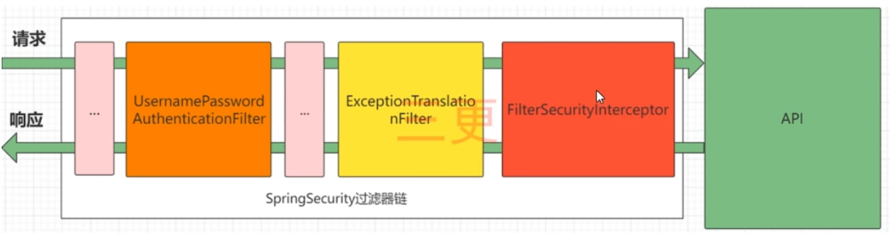
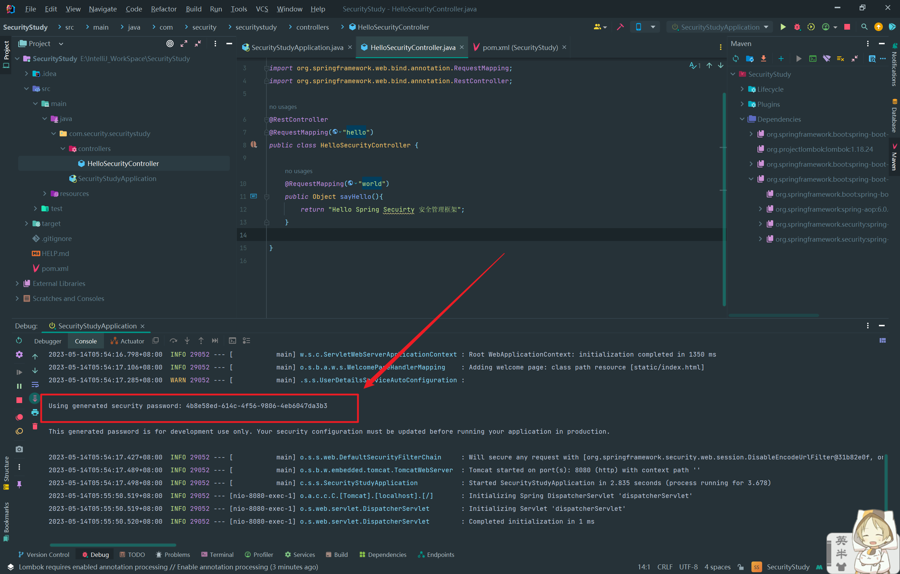
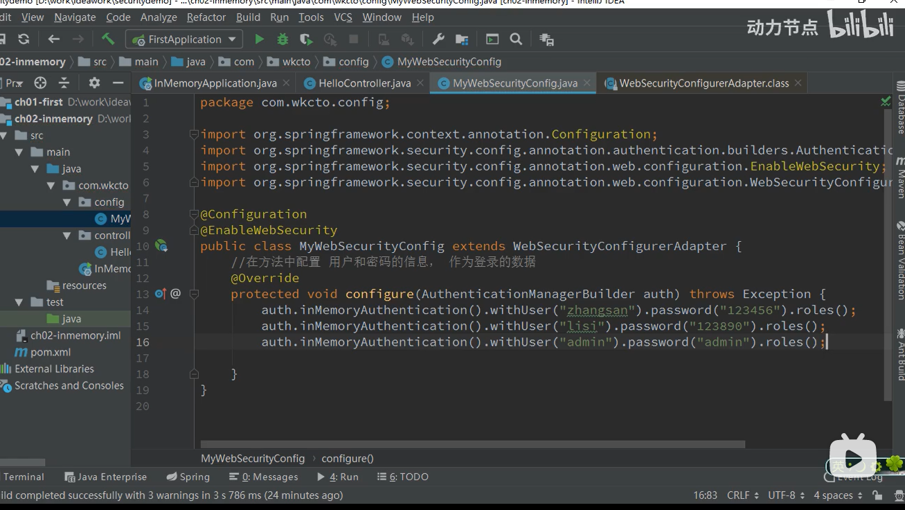
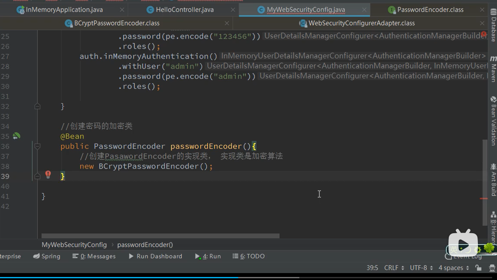
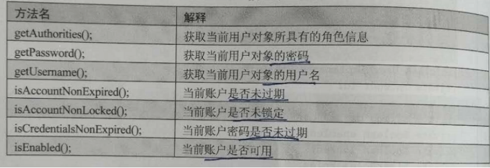
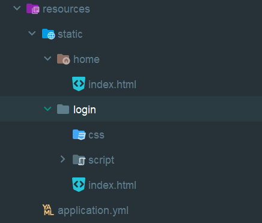

#  Spring Security框架

---

## 第一章了解Spring Security

---

Spring Security是基于Spring的安全框架。它提供全面的安全性解决方案，同时在Web请求和方法调用级处理身份确认和授权。在Spring Framework基础上，Spring Security充分利用了依赖注入（DI）和面向切面编程（AOP）功能，为应用系统提供声明式的安全访问控制功能，减少了为企业系统安全控制编写大量重复代码的工作。是一个轻量级的安全框架。他与SpringMVC有很好地集成。

### 1.1Spring Security 核心功能

（1）认证（你是谁，用户/设备/系统）

（2）验证（你能干什么，也叫权限控制/授权，允许执行的操作）

### 1.2Spring Security 原理

基于 Filter，Servlet，AOP实现身份认证和权限验证


## 第二章 实例驱动学习

---

### 导入依赖：

```xml
        <dependency>
            <groupId>org.springframework.boot</groupId>
            <artifactId>spring-boot-starter-security</artifactId>
        </dependency>
```

### SpringSecurity完整流程

SpringSecurity的原理其实就是一个过滤链，内部包含了提供各种功能的过滤器。这里我们可以看看入门案例中的过滤器。

### 

图中只展示了核心过滤器，其他的非核心过滤器并没有在图中展示。

UsernamePasswordAuthenticationFilter：负责处理我们登录页面填写了用户名密码后的登录请求。入门案例的认证工作主要有它负责。

ExceptionTranslationFilter：处理过滤器中抛出的任何AccessDeniedException和AuthenticationException。

FilterSecurityInterceptor：负责权限的过滤器。

=

### 初始默认密码登录

在初次导入框架使用的时候，Security会默认生成一个密码：



这个密码在默认访问任意接口的时候都需要你进行登录操作，登录时账号就为：user，密码就是上面生成的随机密码。


### 修改默认密码

修改默认密码后就不会再随机生成密码了，并且也不会展示，修改密码需要在application配置文件里面设置：

```yaml
spring:
  security:
    user:
      name: cbq  #账号
      password: cbq  #密码
```


### 关闭验证

关闭验证只需要在SpringBoot启动类注解里面添加排除项即可：

```java
//排除Security的配置，让他不启用
@SpringBootApplication(exclude = {SecurityAutoConfiguration.class})
public class SecurityStudyApplication {

    public static void main(String[] args) {
        SpringApplication.run(SecurityStudyApplication.class, args);
    }

}

```


### 使用内存中的用户信息

这里一定要注意！！！！

> 在**Spring Security 5.7.0-M2**，我们弃用了 `WebSecurityConfigurerAdapter` ，因为我们鼓励用户转向使用基于组件的安全配置。

如果是使用了5.7以下的那么就按照以下方法来！！！


使用：WebSecurityConfigurerAdapter控制安全管理的内容。

需要做的使用：继承WebSecurityConfigurerAdapter，重新方法。实现自定义的认证信息。

注解：

1、@Configuration：表示当前类是一个配置类（相当于是Spring的xml配置文件），在这个类方法的返回值是Java对象，这些对象放入到Spring容器中。

2、@EnableWebSecurity：表示启动Spring Security安全框架的功能。

3/@Bean：把方法返回值的对象，放入到Spring容器中。

这里注意Security5中密码必须要加密，不然报错。

> ```java
> java.lang.IllegalArgumentException: There is no PasswordEncoder mapped foor the id "null"
> ```
>
> 





如果使用了新版Security那么：

```java
@Configuration
public class SecurityConfiguration {
       @Bean
    public UserDetailsService userDetailsService(){
        UserDetails user1 = User.builder().
                username("cbq1").
                password("123456")
                .roles("student")
                .build();

        UserDetails user2 = User.builder()
                .username("cbq2")
                .password("123456")
                .roles("teacher")
                .build();
        InMemoryUserDetailsManager memoryUserDetailsManager = new InMemoryUserDetailsManager();
        memoryUserDetailsManager.createUser(user1);
        memoryUserDetailsManager.createUser(user2);
        return memoryUserDetailsManager;
    }
}

```

**注意**：在这些例子中，我们为了可读性使用了`User.withDefaultPasswordEncoder()`。这不适合生产项目，我们建议在生产项目中使用散列密码。请按照[参考文档](https://docs.spring.io/spring-security/reference/features/authentication/password-storage.html#authentication-password-storage-boot-cli)所说的用Spring Boot命令行工具来做。


### 基于角色Role的身份认证，同一个用户可以有不同的角色。同时可以开启对方法级别的认证。

以下是WebSecurity.java配置文件：

```java
import org.springframework.context.annotation.Bean;
import org.springframework.context.annotation.Configuration;
import org.springframework.security.config.annotation.method.configuration.EnableMethodSecurity;
import org.springframework.security.config.annotation.web.configuration.EnableWebSecurity;
import org.springframework.security.core.userdetails.User;
import org.springframework.security.core.userdetails.UserDetails;
import org.springframework.security.provisioning.InMemoryUserDetailsManager;

@Configuration
@EnableWebSecurity
@EnableMethodSecurity(prePostEnabled = true) //这个作用是用于开启基于角色访问，不然的话无效
public class MyWebSecurityConfig {

    //在方法中配置 用户和密码的信息，作为登录的数据
    @Bean
    public InMemoryUserDetailsManager userDetailsManager(){

        UserDetails user1 = User.withDefaultPasswordEncoder()
                .username("cbq")
                .password("cbq")
                .roles("normal")
                .build();
        UserDetails user2 = User.withDefaultPasswordEncoder()
                .username("cbq1")
                .password("cbq1")
                .roles("normal")
                .build();
        UserDetails user3 = User.withDefaultPasswordEncoder()
                .username("cbq2")
                .password("cbq2")
                .roles("normal","admin")
                .build();

        return new InMemoryUserDetailsManager(user1,user2,user3);
    }


}
```

这里开了三个用户，一共两个角色，一个normal，一个admin。一个用户可以拥有多个角色。基于角色的访问需要配合@PreAuthorize注解使用，详细如下，这里@PreAuthorize注解标注了哪个接口只能哪几个角色能访问。

```java
import org.springframework.security.access.prepost.PreAuthorize;
import org.springframework.web.bind.annotation.RequestMapping;
import org.springframework.web.bind.annotation.RestController;

@RestController
@RequestMapping("hello")
public class HelloSecurityController {

    @RequestMapping("world")
    @PreAuthorize(value = "hasAnyRole('admin','normal')")
    public Object sayHello(){
        return "拥有admin和normal";
    }

    @RequestMapping("hhh")
    @PreAuthorize(value = "hasAnyRole('admin')")
    public Object hhh(){
        return "admin角色才可以访问";
    }

}
```


### 关于authorities设置权限与roles设置角色的坑

> 在实验中发现，如果同时使用roles设置用户的角色，用authoritites设置用户的权限，谁写在最后那么就用谁作为最终的权限标志。比如以下例子：

```java

    @Bean
    public UserDetailsService userDetailsService(){
        UserDetails user1 = User.builder().
                username("cbq1").
                password(passwordBCryptEncoder().encode("123456"))
                .roles("student")
                .authorities("student:add","student:delete")
                .build();

        UserDetails user2 = User.builder()
                .username("cbq2")
                .password(passwordBCryptEncoder().encode("123456"))
            	.authorities("student:add","student:delete")
                .roles("teacher")
                .build();
        InMemoryUserDetailsManager memoryUserDetailsManager = new InMemoryUserDetailsManager();
        memoryUserDetailsManager.createUser(user1);
        memoryUserDetailsManager.createUser(user2);
        return memoryUserDetailsManager;
    }
```

在上述代码中，user1角色的权限最终为student:add与student:delete。user2角色的权限最终为ROLE_teacher角色标志。


### 基于JDBC的用户认证

从数据库Mysql中获取用户的身份信息（用户名称，密码，角色）

在Spring Security框架对象用户信息的表示类是UserDetails.

UserDetails是一个接口，高度抽象的用户信息类(相当于项目中的User类)


User类：是UserDetails接口的实现类，构造方法有三个参数：

username，password，authorities


需要向Spring Security提供User对象，这个对象的数据来自数据库中的查询。

实现UserDetailsService接口，重写UserDetails loadUserByUsername(String var1)在方法中获取数据库中的用户信息，也就是执行数据库的查询，条件是用户名称。

### 密码加密存储

实际项目中我们不会把密码明文存储在数据库表中。

在SpringSecurity中明文加密为：NoOpPasswordEncoder.getInstance();

默认使用的PasswordEncoder要求数据库中的密码格式为：{id}password。它会根据id去判断密码的加密方式。但是我们一般不会采用这种方式。所以就需要替换PordEncoder。

我们一般使用SpringSecurity为我们提供的BCryptPasswordEncoder。

我们只需要使用把BCryptPasswordEncoder对象注入Spring容器中，SpringSecurity就会使用该PasswordEncoder来进行密码校验。

我们可以定义一个SpringSecurity的配置类，SpringSecurity要求这个配置类要继承WebSecurityConfigurerAdapter。


## 第三章 权限控制

---

### 基于访问路径进行访问权限控制
> 拦截相应没有访问权限访问页面的用户，注意authorizeRequests与authorizeHttpRequests不能混用，不然报错。

```java
import jakarta.annotation.Resource;
import org.springframework.context.annotation.Bean;
import org.springframework.context.annotation.Configuration;
import org.springframework.security.config.annotation.method.configuration.EnableMethodSecurity;
import org.springframework.security.config.annotation.web.builders.HttpSecurity;
import org.springframework.security.config.annotation.web.configuration.EnableWebSecurity;
import org.springframework.security.core.userdetails.UserDetailsService;
import org.springframework.security.web.SecurityFilterChain;

@Configuration
@EnableWebSecurity
@EnableMethodSecurity(prePostEnabled = true)
public class MyWebSecurityConfig {
    @Resource
    private UserDetailsService userDetailsService;

    @Bean
    SecurityFilterChain securityFilterChain(HttpSecurity httpSecurity) throws Exception {
        //配置web授权访问,"/login","/register","/upLogin"这些统统无需权限
        httpSecurity.authorizeHttpRequests().requestMatchers("/login","register","/upLogin").permitAll()
                //成功的链接,也就是后续访问的链接放在这个里,我这里是成功页需要USER权限才能访问
                .requestMatchers("/success").hasAnyRole("USER").and()
        /**
         * 自定义登陆页面是loginSelf.html页(这里看你模板引擎怎么配),表单提交的处理链接是"/upLogin"
         * 就是<form action="/upLogin"></form>这样,这个"/upLogin"不需要自己处理,就自己决定
         * usernameParameter和passwordParameter,就是表单提交所带的参数,
         * 这里我是"username"和"password";
         */
                .formLogin().loginPage("/loginSelf").loginProcessingUrl("upLogin")
                .usernameParameter("username").passwordParameter("password");
        return httpSecurity.build();
    }


}
```

以下为新版本

```java

import org.springframework.context.annotation.Configuration;
import org.springframework.security.config.annotation.web.builders.HttpSecurity;
import org.springframework.security.config.annotation.web.configuration.WebSecurityConfigurerAdapter;

@Configuration
public class WebSecurityConfig extends WebSecurityConfigurerAdapter {
    @Override
    protected void configure(HttpSecurity http) throws Exception {
//        http.authorizeRequests() //授权请求
//                .anyRequest()//任何请求
//                .denyAll();//拒绝

        http.authorizeRequests()
                //.regexMatchers("/student/**") //这种匹配方式可以不用学
                //.antMatchers("/student/**")  //这种匹配方式可以不用学
                .mvcMatchers("/student/**") //匹配这个url
                //.hasRole("") //是否有单个角色
                //.hasAnyRole("") //是否有任意角色
                //.access("hasAuthority('student:query') or hasRole('admin')") //另外一种权限设置
                .hasAnyAuthority("student:add") //拥有这个权限的用户可以访问这个/student/** ,是否其中至少一个权限

                .mvcMatchers("/teacher/**") //匹配url
                .hasAuthority("ROLE_teacher") //拥有这个权限的用户可以访问/teacher/**
                .anyRequest() //任何请求
                .authenticated(); //都需要登录 ,注意，没有配置mvc的只要登录成功就可以访问

        http.formLogin().permitAll(); //允许表单登录
    }

}

```

匹配路径url的写法有三种，判断权限有五种。


### 基于方法来进行访问权限控制

> 基于方法粒度的权限校验一定要记得在Security配置类中加上@EnableGlobalMethodSecurity注解设置prePostEnabled=true参数，否则直接使用注解配置权限将会无效！！！

```java

import org.springframework.context.annotation.Bean;
import org.springframework.security.config.annotation.method.configuration.EnableGlobalMethodSecurity;
import org.springframework.security.core.userdetails.User;
import org.springframework.security.core.userdetails.UserDetails;
import org.springframework.security.core.userdetails.UserDetailsService;
import org.springframework.security.crypto.bcrypt.BCryptPasswordEncoder;
import org.springframework.security.crypto.password.PasswordEncoder;
import org.springframework.security.provisioning.InMemoryUserDetailsManager;

//@Configuration 这里不需要加Configuration是因为下面这个注解已经带有Config注解了
@EnableGlobalMethodSecurity(prePostEnabled = true) //开启全局方法安全
public class SecurityUserConfig {

    @Bean
    public UserDetailsService userDetailsService(){
        UserDetails u1 = User.builder()
                .username("cbq1")
                .password(passwordEncoder().encode("123456"))
                .roles("student")
                .build();

        UserDetails u2 = User.builder()
                .username("cbq2")
                .password(passwordEncoder().encode("123456"))
                .authorities("teacher:update","teacher:query")
                .build();

        InMemoryUserDetailsManager inMemoryUserDetailsManager = new InMemoryUserDetailsManager();
        inMemoryUserDetailsManager.createUser(u1);
        inMemoryUserDetailsManager.createUser(u2);
        return inMemoryUserDetailsManager;
    }
    @Bean
    public PasswordEncoder passwordEncoder(){
        return new BCryptPasswordEncoder();
    }
}

```

配置完之后即可使用了：

```java

import org.springframework.security.access.prepost.PreAuthorize;
import org.springframework.web.bind.annotation.GetMapping;
import org.springframework.web.bind.annotation.RequestMapping;
import org.springframework.web.bind.annotation.RestController;

@RestController
@RequestMapping("teacher")
public class TeacherController {

    @GetMapping("add")
    @PreAuthorize("hasRole('teacher')") //预授权
    public Object add(){
        return "添加成功";
    }

    @GetMapping("delete")
    @PreAuthorize("hasRole('teacher')")
    public Object delete(){
        return "删除成功";
    }

    @GetMapping("update")
    @PreAuthorize("hasRole('teacher') or hasAuthority('teacher:update')")
    public Object update(){
        return "更新成功";
    }

}

```


## 第四章 利用处理器返回JSON

### 设置登录成功返回json

> 设置登录成功返回json创建一个类并且实现AuthenticationSuccessHandler接口，

```java

import com.example.springsecuritystudy3.vo.HttpResult;
import com.fasterxml.jackson.databind.ObjectMapper;
import lombok.extern.slf4j.Slf4j;
import org.springframework.security.core.Authentication;
import org.springframework.security.web.authentication.AuthenticationSuccessHandler;
import org.springframework.stereotype.Component;

import javax.annotation.Resource;
import javax.servlet.ServletException;
import javax.servlet.http.HttpServletRequest;
import javax.servlet.http.HttpServletResponse;
import java.io.IOException;
import java.io.PrintWriter;

/**
 * @description: 只要认证成功那么久返回json
 * @author 长白崎
 * @date 2023/7/17 5:11
 * @version 1.0
 */
@Slf4j
@Component
public class AppAuthenticationSuccessHandler implements AuthenticationSuccessHandler {

    @Resource
    private ObjectMapper objectMapper;

    @Override
    public void onAuthenticationSuccess(HttpServletRequest request, HttpServletResponse response, Authentication authentication) throws IOException, ServletException {
        HttpResult httpResult = HttpResult.builder()
                .code(1)
                .msg("登录成功")
                .build();

        String responseJson = objectMapper.writeValueAsString(httpResult);

        response.setCharacterEncoding("UTF-8");
        response.setContentType("application/json;charset=utf-8");
        PrintWriter writer = response.getWriter();
        writer.println(responseJson);
        writer.flush();
    }
}

```

实现接口之后只需要Security配置类当中配置好即可。

```java

import lombok.extern.slf4j.Slf4j;
import org.springframework.context.annotation.Configuration;
import org.springframework.security.config.annotation.web.builders.HttpSecurity;
import org.springframework.security.config.annotation.web.configuration.WebSecurityConfigurerAdapter;

import javax.annotation.Resource;

@Configuration
@Slf4j
public class WebSecurityConfig extends WebSecurityConfigurerAdapter {

    @Resource
    AppAuthenticationSuccessHandler appAuthenticationSuccessHandler;

    @Resource
    AppAuthenticationFailureHandler appAuthenticationFailureHandler;

    @Override
    protected void configure(HttpSecurity http) throws Exception {
        http.authorizeRequests()
                .anyRequest()
                .authenticated();

        //设置登录成功处理器
        http.formLogin()
                .successHandler(appAuthenticationSuccessHandler) //配置登录成功事件
                .failureHandler(appAuthenticationFailureHandler) //配置登录失败事件
                .permitAll();
    }
}

```

### 设置退出登录成功返回json

> 设置退出登录成功返回json创建一个类并且实现LogoutSuccessHandler接口，

```java

import com.example.springsecuritystudy3.vo.HttpResult;
import com.fasterxml.jackson.databind.ObjectMapper;
import org.springframework.security.core.Authentication;
import org.springframework.security.web.authentication.logout.LogoutSuccessHandler;
import org.springframework.stereotype.Component;

import javax.annotation.Resource;
import javax.servlet.ServletException;
import javax.servlet.http.HttpServletRequest;
import javax.servlet.http.HttpServletResponse;
import java.io.IOException;
import java.io.PrintWriter;

/**
 * @description: 退出登录成功
 * @author 长白崎
 * @date 2023/7/17 5:41
 * @version 1.0
 */
@Component
public class AppLogoutSuccessHandler implements LogoutSuccessHandler {
    @Resource
    ObjectMapper objectMapper;

    @Override
    public void onLogoutSuccess(HttpServletRequest request, HttpServletResponse response, Authentication authentication) throws IOException, ServletException {

        HttpResult httpResult = HttpResult.builder()
                .code(0)
                .msg("退出登录成功")
                .build();

        String json = objectMapper.writeValueAsString(httpResult);
        response.setCharacterEncoding("UTF-8");
        response.setContentType("application/json;charset=utf-8");
        PrintWriter printWriter = response.getWriter();
        printWriter.println(json);
        printWriter.flush();
    }
}

```

### 设置登录失败返回json

> 设置登录失败返回json创建一个类并且实现AuthenticationSuccessHandler接口，

```java

import com.example.springsecuritystudy3.vo.HttpResult;
import com.fasterxml.jackson.databind.ObjectMapper;
import lombok.extern.slf4j.Slf4j;
import org.springframework.security.core.AuthenticationException;
import org.springframework.security.web.authentication.AuthenticationFailureHandler;
import org.springframework.stereotype.Component;

import javax.annotation.Resource;
import javax.servlet.ServletException;
import javax.servlet.http.HttpServletRequest;
import javax.servlet.http.HttpServletResponse;
import java.io.IOException;
import java.io.PrintWriter;

@Slf4j
@Component
public class AppAuthenticationFailureHandler implements AuthenticationFailureHandler {

    @Resource
    ObjectMapper objectMapper;

    @Override
    public void onAuthenticationFailure(HttpServletRequest request, HttpServletResponse response, AuthenticationException exception) throws IOException, ServletException {

        HttpResult httpResult = HttpResult.builder()
                .code(0)
                .msg("登录失败")
                .build();

        String json = objectMapper.writeValueAsString(httpResult);
        response.setCharacterEncoding("UTF-8");
        response.setContentType("application/json;charset=utf-8");
        PrintWriter printWriter = response.getWriter();
        printWriter.println(json);
        printWriter.flush();

    }
}
```

### 设置访问拒绝返回json

> 设置访问拒绝返回json创建一个类并且实现AuthenticationSuccessHandler接口，

```java

import com.example.springsecuritystudy3.vo.HttpResult;
import com.fasterxml.jackson.databind.ObjectMapper;
import org.springframework.security.access.AccessDeniedException;
import org.springframework.security.web.access.AccessDeniedHandler;
import org.springframework.stereotype.Component;

import javax.annotation.Resource;
import javax.servlet.ServletException;
import javax.servlet.http.HttpServletRequest;
import javax.servlet.http.HttpServletResponse;
import java.io.IOException;
import java.io.PrintWriter;

/**
 * @description: 访问拒绝处理
 * @author 长白崎
 * @date 2023/7/17 5:40
 * @version 1.0
 */
@Component
public class AppAccessDenyHandler implements AccessDeniedHandler {
    @Resource
    ObjectMapper objectMapper;

    @Override
    public void handle(HttpServletRequest request, HttpServletResponse response, AccessDeniedException accessDeniedException) throws IOException, ServletException {

        HttpResult httpResult = HttpResult.builder()
                .code(2)
                .msg("您没有权限访问")
                .build();

        String json = objectMapper.writeValueAsString(httpResult);
        response.setCharacterEncoding("UTF-8");
        response.setContentType("application/json;charset=utf-8");
        PrintWriter printWriter = response.getWriter();
        printWriter.println(json);
        printWriter.flush();
    }
}

```

### 实现接口之后只需要Security配置类当中配置好即可。

```java

import lombok.extern.slf4j.Slf4j;
import org.springframework.context.annotation.Configuration;
import org.springframework.security.config.annotation.web.builders.HttpSecurity;
import org.springframework.security.config.annotation.web.configuration.WebSecurityConfigurerAdapter;

import javax.annotation.Resource;

@Configuration
@Slf4j
public class WebSecurityConfig extends WebSecurityConfigurerAdapter {


    @Resource
    AppAuthenticationSuccessHandler appAuthenticationSuccessHandler;

    @Resource
    AppAuthenticationFailureHandler appAuthenticationFailureHandler;

    @Resource
    AppLogoutSuccessHandler appLogoutSuccessHandler;

    @Resource
    AppAccessDenyHandler appAccessDenyHandler;

    @Override
    protected void configure(HttpSecurity http) throws Exception {
        http.authorizeRequests()
                .anyRequest()
                .authenticated();

        //设置登录成功处理器
        http.formLogin()
                .successHandler(appAuthenticationSuccessHandler) //配置登录成功处理器
                .failureHandler(appAuthenticationFailureHandler) //配置登录失败处理器
                .permitAll();

        http.logout().logoutSuccessHandler(appLogoutSuccessHandler); //配置退出成功处理器
        http.exceptionHandling().accessDeniedHandler(appAccessDenyHandler); //配置访问拒绝处理器
    }
}
```

### 通过实现UserDetails接口来定义用户



```java

import com.example.springsecuritystudy4.entity.User;
import org.springframework.security.core.GrantedAuthority;
import org.springframework.security.core.authority.SimpleGrantedAuthority;
import org.springframework.security.core.userdetails.UserDetails;

import java.util.Collection;
import java.util.List;

public class SecurityUser implements UserDetails {

    private final User user;

    private List<SimpleGrantedAuthority> authorityList;

    public SecurityUser(User user) {
        this.user = user;
    }

    @Override
    public Collection<? extends GrantedAuthority> getAuthorities() {
        return authorityList;
    }

    public void setAuthorityList(List<SimpleGrantedAuthority> authorityList) {
        this.authorityList = authorityList;
    }

    @Override
    public String getPassword() {
        String pwd = user.getPassword();
        user.setPassword(null);
        return pwd;
    }

    @Override
    public String getUsername() {
        return user.getUsername();
    }

    @Override
    public boolean isAccountNonExpired() {
        return user.getAccountNoExpired().equals(1);
    }

    @Override
    public boolean isAccountNonLocked() {
        return user.getAccountNoLocked().equals(1);
    }

    @Override
    public boolean isCredentialsNonExpired() {
        return user.getCredentialsNoExpired().equals(1);
    }

    @Override
    public boolean isEnabled() {
        return true;
    }
}
```


## 第五章 基于数据库的认证

---

### 1、第一步则是先要实现UserDetails接口

> 主要用于定制化将数据库数据对接Security框架。

```java

import com.example.springsecuritystudy4.entity.User;
import org.springframework.security.core.GrantedAuthority;
import org.springframework.security.core.authority.SimpleGrantedAuthority;
import org.springframework.security.core.userdetails.UserDetails;

import java.util.Collection;
import java.util.List;

public class SecurityUser implements UserDetails {

    private final User user;

    private List<SimpleGrantedAuthority> authorityList;

    public SecurityUser(User user) {
        this.user = user;
    }

    @Override
    public Collection<? extends GrantedAuthority> getAuthorities() {
        return authorityList;
    }

    public void setAuthorityList(List<SimpleGrantedAuthority> authorityList) {
        this.authorityList = authorityList;
    }

    @Override
    public String getPassword() {
        String pwd = user.getPassword();
        user.setPassword(null);
        return pwd;
    }

    @Override
    public String getUsername() {
        return user.getUsername();
    }

    /*代表账号是否已经过期（true账号没有过期，false账号已经过期）*/
    @Override
    public boolean isAccountNonExpired() {
        return user.getAccountNoExpired().equals(1);
    }
    
    /*代表账号是否被锁定(true没有锁定，false锁定）*/
    @Override
    public boolean isAccountNonLocked() {
        return user.getAccountNoLocked().equals(1);
    }
 /*代表凭证是否已经过期（true账号没有过期，false账号已经过期）*/
    @Override
    public boolean isCredentialsNonExpired() {
        return user.getCredentialsNoExpired().equals(1);
    }
 /*代表账号是否可用*/
    @Override
    public boolean isEnabled() {
        return true;
    }
}
```

### 2、实现UserDetailsService接口

> 实现UserDetailService接口的作用主要就是定制化用户登录时的数据获取方式以及对比方式等。

```java

import com.example.springsecuritystudy4.entity.User;
import com.example.springsecuritystudy4.service.RoleMenuService;
import com.example.springsecuritystudy4.service.UserService;
import com.example.springsecuritystudy4.vo.SecurityUser;
import org.springframework.security.core.authority.SimpleGrantedAuthority;
import org.springframework.security.core.userdetails.UserDetails;
import org.springframework.security.core.userdetails.UserDetailsService;
import org.springframework.security.core.userdetails.UsernameNotFoundException;
import org.springframework.stereotype.Service;

import javax.annotation.Resource;
import java.util.ArrayList;
import java.util.List;

@Service
public class SecurityUserDetailServiceImpl implements UserDetailsService {

    @Resource
    private UserService userService;
    @Resource
    private RoleMenuService roleMenuService;


    @Override
    public UserDetails loadUserByUsername(String username) throws UsernameNotFoundException {
        User byUserName = userService.getByUserName(username);

        if(byUserName==null)
            throw new UsernameNotFoundException("该用户不存在");

        List<String> queryPermissionsByUserId = roleMenuService.queryPermissionsByUserId(byUserName.getUid());

        SecurityUser securityUser = new SecurityUser(byUserName);
        List<SimpleGrantedAuthority> authorityList = new ArrayList<>();
        queryPermissionsByUserId.stream().forEach((value)-> authorityList.add(new SimpleGrantedAuthority(value)));
        securityUser.setAuthorityList(authorityList);
        return securityUser;
    }
}

```


## 第六章 WebSecurity配置中关于其中登录页面等其他页面定制化

---

```java

import lombok.extern.slf4j.Slf4j;
import org.springframework.context.annotation.Bean;
import org.springframework.context.annotation.Configuration;
import org.springframework.security.config.annotation.method.configuration.EnableGlobalMethodSecurity;
import org.springframework.security.config.annotation.web.builders.HttpSecurity;
import org.springframework.security.config.annotation.web.configuration.WebSecurityConfigurerAdapter;
import org.springframework.security.crypto.bcrypt.BCryptPasswordEncoder;
import org.springframework.security.crypto.password.PasswordEncoder;

@Slf4j
@Configuration
@EnableGlobalMethodSecurity(prePostEnabled = true)
public class WebSecurityConfig extends WebSecurityConfigurerAdapter {

    @Bean
    public PasswordEncoder passwordEncoder(){
        return new BCryptPasswordEncoder();
    }

    @Override
    protected void configure(HttpSecurity http) throws Exception {
        http.authorizeRequests()
                .anyRequest()
                .authenticated();

        http.formLogin()
                .loginPage("/toLogin") // 配置登录页面
                .usernameParameter("uname") // 用户名参数
                .passwordParameter("pwd") // 密码参数
                .loginProcessingUrl("/login/doLogin")  //单击登录后进入url
                .failureForwardUrl("/toLogin") // 登录失败
                .successForwardUrl("/toIndex") //登录成功
                .permitAll();  //配置登录

        http.logout().logoutSuccessUrl("/toLogin");  //配置退出成功登录页面
        http.csrf().disable(); //关闭跨域请求保护
    }
}

```


## 第七章 验证码整合

---

>  验证码生成工具可以使用hutool依赖库进行。

### 验证码生成接口代码

```java

import cn.hutool.captcha.CaptchaUtil;
import cn.hutool.captcha.CircleCaptcha;
import cn.hutool.captcha.generator.MathGenerator;
import lombok.extern.slf4j.Slf4j;
import org.springframework.stereotype.Controller;
import org.springframework.web.bind.annotation.GetMapping;

import javax.imageio.ImageIO;
import javax.servlet.http.HttpServletRequest;
import javax.servlet.http.HttpServletResponse;
import java.io.IOException;

@Slf4j
@Controller
public class CaptchaController {

    @GetMapping(value = "code/getCaptchaCode")
    public void getCaptchaCode(HttpServletRequest httpServletRequest,
                               HttpServletResponse httpServletResponse) throws IOException {
        //ShearCaptcha shearCaptcha = CaptchaUtil.createShearCaptcha(200, 100, 4, 5);
        CircleCaptcha circleCaptcha = CaptchaUtil.createCircleCaptcha(200, 100, 4, 1000);
        circleCaptcha.setGenerator(new MathGenerator());
        String code = circleCaptcha.getCode();
        log.info("生成的图片验证码为：{}",code);
        //将验证码存储到session中
        httpServletRequest.getSession().setAttribute("CAPTCHA CODE",code);
        httpServletResponse.setContentType("image/png");
        //将图片写到响应流里
        ImageIO.write(circleCaptcha.getImage(),"PNG",httpServletResponse.getOutputStream());
    }
}

```

写好验证码之后即可在WebSecurity实现配置类中将验证码接口放开：

```java

import com.example.springsecuritystudy4.filter.ValidateCodeFilter;
import lombok.extern.slf4j.Slf4j;
import org.springframework.context.annotation.Bean;
import org.springframework.context.annotation.Configuration;
import org.springframework.security.config.annotation.method.configuration.EnableGlobalMethodSecurity;
import org.springframework.security.config.annotation.web.builders.HttpSecurity;
import org.springframework.security.config.annotation.web.configuration.WebSecurityConfigurerAdapter;
import org.springframework.security.crypto.bcrypt.BCryptPasswordEncoder;
import org.springframework.security.crypto.password.PasswordEncoder;
import org.springframework.security.web.authentication.UsernamePasswordAuthenticationFilter;

import javax.annotation.Resource;

@Slf4j
@Configuration
@EnableGlobalMethodSecurity(prePostEnabled = true)
public class WebSecurityConfig extends WebSecurityConfigurerAdapter {

    @Bean
    public PasswordEncoder passwordEncoder(){
        return new BCryptPasswordEncoder();
    }

    @Override
    protected void configure(HttpSecurity http) throws Exception {
        http.authorizeRequests()
                .mvcMatchers("/code/getCaptchaCode") //将验证码接口放开
                .permitAll()
                .anyRequest()
                .authenticated();

        http.formLogin()
                .loginPage("/toLogin") // 配置登录页面
                .usernameParameter("uname") // 用户名参数
                .passwordParameter("pwd") // 密码参数
                .loginProcessingUrl("/login/doLogin")  //单击登录后进入url
                .failureForwardUrl("/toLogin") // 登录失败
                .successForwardUrl("/toIndex") //登录成功
                .permitAll();  //放开

        http.logout().logoutSuccessUrl("/toLogin");  //配置退出成功登录页面
        http.csrf().disable(); //关闭跨域请求保护
    }
}

```


### 利用过滤器来验证验证码

> 过滤器需要继承实现OncePerRequestFilter接口。以下为实现例子

```java
import lombok.extern.slf4j.Slf4j;
import org.springframework.stereotype.Component;
import org.springframework.util.StringUtils;
import org.springframework.web.filter.OncePerRequestFilter;

import javax.servlet.FilterChain;
import javax.servlet.ServletException;
import javax.servlet.http.HttpServletRequest;
import javax.servlet.http.HttpServletResponse;
import java.io.IOException;

@Slf4j
@Component
public class ValidateCodeFilter extends OncePerRequestFilter {

    @Override
    protected void doFilterInternal(HttpServletRequest request, HttpServletResponse response, FilterChain filterChain) throws ServletException, IOException {
        // TODO 判断路径 是否是/login/doLogin
        String requestURL = request.getRequestURI();
        if(!requestURL.equals("/login/doLogin")){ //不是登录请求，直接放行
            doFilter(request,response,filterChain);
        }

    }

    private void validateCode(HttpServletRequest request,HttpServletResponse response,FilterChain filterChain) throws ServletException, IOException {
        //TODO 1、从前端获取验证码
        String code = request.getParameter("code");
        //TODO 2、从session中获取验证码
        String captchaCode = (String) request.getSession().getAttribute("CAPTCHA_CODE");
        //TODO 3、判断二者是否相等
        if(StringUtils.isEmpty(code)){
            request.getSession().setAttribute("captcha_code_error","请输入验证码");
            return;
        }
        if(StringUtils.isEmpty(captchaCode)){
            request.getSession().setAttribute("captcha_code_error","验证码错误");
        }
        request.getSession().setAttribute("CAPTCHA_CODE","");
        this.doFilter(request,response,filterChain);
    }
}
```

写好过滤器后即可在配置类里面使用过滤器：

 ```java
import com.example.springsecuritystudy4.filter.ValidateCodeFilter;
import lombok.extern.slf4j.Slf4j;
import org.springframework.context.annotation.Bean;
import org.springframework.context.annotation.Configuration;
import org.springframework.security.config.annotation.method.configuration.EnableGlobalMethodSecurity;
import org.springframework.security.config.annotation.web.builders.HttpSecurity;
import org.springframework.security.config.annotation.web.configuration.WebSecurityConfigurerAdapter;
import org.springframework.security.crypto.bcrypt.BCryptPasswordEncoder;
import org.springframework.security.crypto.password.PasswordEncoder;
import org.springframework.security.web.authentication.UsernamePasswordAuthenticationFilter;

import javax.annotation.Resource;

@Slf4j
@Configuration
@EnableGlobalMethodSecurity(prePostEnabled = true)
public class WebSecurityConfig extends WebSecurityConfigurerAdapter {

    @Resource
    ValidateCodeFilter validateCodeFilter;

    @Bean
    public PasswordEncoder passwordEncoder(){
        return new BCryptPasswordEncoder();
    }

    @Override
    protected void configure(HttpSecurity http) throws Exception {
        //在用户名密码认证过滤器前添加验证码过滤器
        http.addFilterBefore(validateCodeFilter, UsernamePasswordAuthenticationFilter.class);

        http.authorizeRequests()
                .mvcMatchers("/code/getCaptchaCode")
                .permitAll()
                .anyRequest()
                .authenticated();

        http.formLogin()
                .loginPage("/toLogin") // 配置登录页面
                .usernameParameter("uname") // 用户名参数
                .passwordParameter("pwd") // 密码参数
                .loginProcessingUrl("/login/doLogin")  //单击登录后进入url
                .failureForwardUrl("/toLogin") // 登录失败
                .successForwardUrl("/toIndex") //登录成功
                .permitAll();  //放开

        http.logout().logoutSuccessUrl("/toLogin");  //配置退出成功登录页面
        http.csrf().disable(); //关闭跨域请求保护
    }
}

 ```


## 第八章 SpringSecurity+JWT实现前后端分离

***

> 这里JWT相关的工具类代码就不多展示了。这边可以在网上找到很多的JWTUtils模板。

### 静态文件展示：

> 对于前端我们写一个用于测试的几个页面。

#### 1、登录页面：

```html
<!DOCTYPE html>
<html lang="en">
    <head>
        <meta charset="UTF-8">
        <meta name="viewport" content="width=device-width, initial-scale=1.0">
        <title>登录</title>
        <script src="./script/jquery-3.7.1.min.js"></script>
    </head>
    <body>
        <table>
            <tr>
                <td><input id="act" type="text"></td>
            </tr>
            <tr>
                <td><input id="psd" type="password"></td>
            </tr>
            <td><button id="login">登录</button><button>注册</button></td>
        </table>

    </body>
    <script>
    var act = document.getElementById("act");
    var psw = document.getElementById("psd");
        $("#login").click(function(){
            var act = $('#act').val();
            var psw = $('#psd').val();
            $.ajax('login',{
                method: 'POST',
                contentType: 'application/json',
                dataType: 'json',
                data: JSON.stringify({uid: act,password: psw}),
                success:function (result){
                    alert(JSON.stringify(result))
                    console.log(result)
                },
                error:function (result){
                    alert(result.data)
                }
            })
        });
</script>
</html>
```

#### 2、主页：

```html
<!DOCTYPE html>
<html lang="en">
<head>
    <meta charset="UTF-8">
    <meta name="viewport" content="width=device-width, initial-scale=1.0">
    <title>管理页面</title>
</head>
<body>
    <table>
        <tr>
            <td>测试成功</td>
            <td>测试成功</td>
            <td>测试成功</td>
        </tr>
        <tr>
            <td>测试成功</td>
            <td>测试成功</td>
            <td>测试成功</td>
        </tr>
        <tr>
            <td>测试成功</td>
            <td>测试成功</td>
            <td>测试成功</td>
        </tr>
    </table>
</body>
</html>
```

文件目录展示：



### 配置SpringSecurity：

#### 1.1、得到UserDetails方式（实现UserDetailsService接口的方式）：

```java
import com.cbq.springsecuritystudy6.entity.User;
import com.cbq.springsecuritystudy6.service.RoleService;
import com.cbq.springsecuritystudy6.service.UserService;
import com.cbq.springsecuritystudy6.vo.SecurityUser;
import org.springframework.security.core.authority.SimpleGrantedAuthority;
import org.springframework.security.core.userdetails.UserDetails;
import org.springframework.security.core.userdetails.UserDetailsService;
import org.springframework.security.core.userdetails.UsernameNotFoundException;
import org.springframework.stereotype.Service;

import javax.annotation.Resource;
import java.util.ArrayList;
import java.util.List;

/**
 * @description: 定制化用户登录数据获取方式
 * @author 长白崎
 * @date 2023/9/19 11:28
 * @version 1.0
 */
@Service
public class SecurityUserDetailServiceImpl implements UserDetailsService {
    @Resource
    UserService userService;

    @Resource
    private RoleService roleService;

    @Override
    public UserDetails loadUserByUsername(String username) throws UsernameNotFoundException {
        User userFromUid = userService.getUserFromUid(username);
        if(userFromUid==null){
            throw new UsernameNotFoundException("该用户不存在");
        }

        List<String> rolePermission = roleService.queryPermissionsByUserUid(username);

        SecurityUser securityUser = new SecurityUser(userFromUid);

        ArrayList<SimpleGrantedAuthority> authorityArrayList = new ArrayList<>();
        rolePermission.stream().forEach((v)-> authorityArrayList.add(new SimpleGrantedAuthority(v)));
        securityUser.setAuthorityList(authorityArrayList);

        return securityUser;
    }
}
```

#### 1.2、得到UserDetails方式（实现UserDetails接口的方式）（推荐）：

```java

import com.cbq.springsecuritystudy6.entity.User;
import org.springframework.security.core.GrantedAuthority;
import org.springframework.security.core.authority.SimpleGrantedAuthority;
import org.springframework.security.core.userdetails.UserDetails;

import java.util.Collection;
import java.util.List;

public class SecurityUser implements UserDetails {

    private final User user;
    private List<SimpleGrantedAuthority> authorityList;

    /**
     * 利用构造方法来注入User
     * @param user
     */
    public SecurityUser(User user) {
        this.user = user;
    }

    /**
     * 获取权限列表
     * @return
     */
    @Override
    public Collection<? extends GrantedAuthority> getAuthorities() {
        return authorityList;
    }

    /**
     * 设置权限列表
     * @param authorityList
     */
    public void setAuthorityList(List<SimpleGrantedAuthority> authorityList) {
        this.authorityList = authorityList;
    }

    public User getUser() {
        return user;
    }

    @Override
    public String getPassword() {
        String pws = user.getPassword();
        user.setPassword(null);
        return pws;
    }

    @Override
    public String getUsername() {
        return user.getUid();
    }

    /**
     * 账号是否未过期
     * @return
     */
    @Override
    public boolean isAccountNonExpired() {
        return true;
    }


    /**
     * 账号是否未锁定
     * @return
     */
    @Override
    public boolean isAccountNonLocked() {
        return true;
    }

    /**
     * 账号是否未过期
     * @return
     */
    @Override
    public boolean isCredentialsNonExpired() {
        return true;
    }

    /**
     * 账号是否可用
     * @return
     */
    @Override
    public boolean isEnabled() {
        return true;
    }
}

```

#### 2、通过拦截器接口实现JWT的拦截认证：

> 这里就用Map来模拟Redis了。

```java
import com.auth0.jwt.JWT;
import com.auth0.jwt.interfaces.Claim;
import com.auth0.jwt.interfaces.DecodedJWT;
import com.cbq.springsecuritystudy6.utils.JWTUtils;
import com.cbq.springsecuritystudy6.vo.SecurityUser;
import lombok.extern.slf4j.Slf4j;
import org.springframework.security.authentication.UsernamePasswordAuthenticationToken;
import org.springframework.security.core.context.SecurityContextHolder;
import org.springframework.stereotype.Component;
import org.springframework.util.StringUtils;
import org.springframework.web.filter.OncePerRequestFilter;

import javax.servlet.FilterChain;
import javax.servlet.ServletException;
import javax.servlet.http.HttpServletRequest;
import javax.servlet.http.HttpServletResponse;
import java.io.IOException;
import java.util.HashMap;
import java.util.Map;
import java.util.Objects;

@Slf4j
@Component
public class JwtCheckFilter extends OncePerRequestFilter {
    //模拟Redis
    public static Map<String,Object> redis = new HashMap<>();
    @Override
    protected void doFilterInternal(HttpServletRequest request, HttpServletResponse response, FilterChain filterChain) throws ServletException, IOException {

        //获取token
        String authorization = request.getHeader("Authorization");
        //如果token不存在可能是其他白名单的请求，这里直接放行
        if(!StringUtils.hasText(authorization)){
            //放行
            filterChain.doFilter(request,response);
            return;
        }

        DecodedJWT token = JWTUtils.getToken(authorization);
        //获取uid
        Claim uid = token.getClaim("uid");

        System.out.println(uid.asString());

        //判断是否为非法token
        if(!JWTUtils.verify(authorization) && JWTUtils.isExpired(authorization)){
            try {
                throw new RuntimeException("非法Token");
            }catch (Exception e){
            }
        }

        String redisKey = "login:"+uid.asString();
        //从redis里面获取对象
        SecurityUser securityUser =(SecurityUser) redis.get(redisKey);
        //如果redis里面没有相应的token，那么说明token非法
        if(Objects.isNull(securityUser)){
            throw new RuntimeException("您未登录");
        }

        //TODO 获取权限信息封装到Authentication中
        UsernamePasswordAuthenticationToken usernamePasswordAuthenticationToken = new UsernamePasswordAuthenticationToken(securityUser,null,securityUser.getAuthorities());
        SecurityContextHolder.getContext().setAuthentication(usernamePasswordAuthenticationToken);
        //放行
        filterChain.doFilter(request,response);
    }
}
```


#### 3、实现WebSecurityConfigurerAdapter接口对Security进行配置：

```java

import com.cbq.springsecuritystudy6.filter.JwtCheckFilter;
import lombok.extern.slf4j.Slf4j;
import org.springframework.context.annotation.Bean;
import org.springframework.context.annotation.Configuration;
import org.springframework.security.authentication.AuthenticationManager;
import org.springframework.security.config.annotation.method.configuration.EnableGlobalMethodSecurity;
import org.springframework.security.config.annotation.web.builders.HttpSecurity;
import org.springframework.security.config.annotation.web.configuration.WebSecurityConfigurerAdapter;
import org.springframework.security.config.http.SessionCreationPolicy;
import org.springframework.security.crypto.bcrypt.BCryptPasswordEncoder;
import org.springframework.security.crypto.password.PasswordEncoder;
import org.springframework.security.web.authentication.UsernamePasswordAuthenticationFilter;

import javax.annotation.Resource;

@Slf4j
@Configuration
@EnableGlobalMethodSecurity(prePostEnabled = true)
public class WebSecurityConfig extends WebSecurityConfigurerAdapter {


    @Resource
    MyAuthenticationSuccessHandler myAuthenticationSuccessHandler;

    @Resource
    JwtCheckFilter jwtCheckFilter;

    @Bean
    public PasswordEncoder passwordEncoder() {
        return new BCryptPasswordEncoder();
    }


    @Bean
    @Override
    public AuthenticationManager authenticationManagerBean() throws Exception {
        return super.authenticationManagerBean();
    }

    @Override
    protected void configure(HttpSecurity http) throws Exception {

        //关闭csrf
        http.csrf().disable();

        //这里是将之前自定义实现拦截器的接口解将其放到用户账号密码认证拦截器的前面
        http.addFilterBefore(jwtCheckFilter, UsernamePasswordAuthenticationFilter.class);

        //这里因为是基于JWT的前后端分离项目了，所以没必要用SESSION进行认证之类的，所以直接取消掉
        http.sessionManagement().sessionCreationPolicy(SessionCreationPolicy.STATELESS);

        http.authorizeRequests()
                .antMatchers("/**/**.html").denyAll()//这里配置主要是用于阻止用户直接通过url访问html静态资源，提高安全性。
                .antMatchers("/login/**").permitAll()//这里是将login登录接口相关的全部放开
                .anyRequest()
                .authenticated();

        http.formLogin()
                .loginPage("/login/index.html")//这里配置登录页面
                .permitAll();

    }
}
```

> 好了，到这所有的Security配置基本完成了。现在就是相关的访问接口的实现和对接。


### 实现登录的相关API接口等：

#### Controller层

>  LoginController

```java
import com.cbq.springsecuritystudy6.entity.User;
import com.cbq.springsecuritystudy6.service.LoginService;
import org.springframework.web.bind.annotation.PostMapping;
import org.springframework.web.bind.annotation.RequestBody;
import org.springframework.web.bind.annotation.RequestMapping;
import org.springframework.web.bind.annotation.RestController;

import javax.annotation.Resource;

@RestController
@RequestMapping("login")
public class LoginController {

    @Resource
    private LoginService loginService;

    @PostMapping("login")
    public Object login(@RequestBody User user){
        return loginService.toLogin(user.getUid(),user.getPassword());
    }
}
```
> UserController

```java
import org.springframework.security.access.prepost.PreAuthorize;
import org.springframework.stereotype.Controller;
import org.springframework.web.bind.annotation.GetMapping;
import org.springframework.web.bind.annotation.RequestMapping;
import org.springframework.web.bind.annotation.ResponseBody;
@Controller
@RequestMapping("user")
public class UserController {


    @ResponseBody
    @GetMapping("query")
    @PreAuthorize("hasAuthority('root:query') or hasRole('ROOT')")
    public Object query(){
        System.out.println("成功访问查询页面");
        return "成功访问查询页面";
    }

    @ResponseBody
    @GetMapping("delete")
    @PreAuthorize("hasRole('ROOT')")
    public Object delete(){
        return "删除成功";
    }

    @GetMapping("index")
    public Object toIndex(){
        return "forward:/home/index.html";
    }
}
```


#### Service层

> LoginService

```java
import com.cbq.springsecuritystudy6.entity.User;
import com.cbq.springsecuritystudy6.filter.JwtCheckFilter;
import com.cbq.springsecuritystudy6.mapper.UserMapper;
import com.cbq.springsecuritystudy6.service.LoginService;
import com.cbq.springsecuritystudy6.service.RoleService;
import com.cbq.springsecuritystudy6.utils.JWTUtils;
import com.cbq.springsecuritystudy6.vo.SecurityUser;
import com.fasterxml.jackson.databind.ObjectMapper;
import org.springframework.security.core.authority.SimpleGrantedAuthority;
import org.springframework.stereotype.Service;

import javax.annotation.Resource;
import java.util.*;

@Service
public class LoginServiceImpl implements LoginService {
    @Resource
    UserMapper userMapper;

    @Resource
    RoleService roleService;

    @Resource
    ObjectMapper objectMapper;


    @Override
    public Object toLogin(String uid, String password) {
        Map<String, Object> result = new HashMap<>();
        //通过Security生成Token
        List<String> strings = roleService.queryPermissionsByUserUid(uid);
        SecurityUser securityUser = new SecurityUser(User.builder().build());
        List<SimpleGrantedAuthority> authorityList = new ArrayList<>();
        strings.forEach((v)->{authorityList.add(new SimpleGrantedAuthority(v));});
        securityUser.setAuthorityList(authorityList);

        //装置至Redis
        JwtCheckFilter.redis.put("login:"+uid,securityUser);
        //TODO 成功
        Map<String, String> tokenMap = new HashMap<>();
        tokenMap.put("uid", uid);
        String token = JWTUtils.createToken(tokenMap);
        result.put("code", 200);
        result.put("msg", "登录成功");
        result.put("token", token);

        return result;
    }
}
```

> UserService

```java
import com.cbq.springsecuritystudy6.entity.User;
import com.cbq.springsecuritystudy6.mapper.UserMapper;
import com.cbq.springsecuritystudy6.service.UserService;
import org.springframework.stereotype.Service;

import javax.annotation.Resource;

@Service
public class UserServiceImpl implements UserService {
    @Resource
    UserMapper userMapper;

    @Override
    public User getUserFromUid(String uid) {
        User user = userMapper.getUserByUid(uid);
        return user;
    }

    @Override
    public User userLogin(String uid, String password) {
        User user = userMapper.getUser(uid, password);
        return user;
    }
}
```

> RoleService

```java
import com.cbq.springsecuritystudy6.mapper.RoleMapper;
import com.cbq.springsecuritystudy6.service.RoleService;
import org.springframework.stereotype.Service;

import javax.annotation.Resource;
import java.util.List;

@Service
public class RoleServiceImpl implements RoleService {

    @Resource
    private RoleMapper roleMapper;

    @Override
    public List<String> queryPermissionsByUserUid(String uid) {
        List<String> strings = roleMapper.queryRolePermissionsByUserId(uid);
        return strings;
    }
}
```


#### Mapper

> UserMapper

```java
import org.apache.ibatis.annotations.Param;
import org.apache.ibatis.annotations.Select;

import java.util.List;

public interface RoleMapper {

    /**
     * 通过UID查询对应的用户权限的详细权限列表
     * @param uid
     * @return
     */
    @Select("select role_menu.code from user,role,role_menu where user.role_uid=role.uid and role.uid=role_menu.role_uid AND user.uid=#{uid}")
    public List<String> queryRolePermissionsByUserId(@Param("uid") String uid);
}
```

> RoleMapper

```java
import com.cbq.springsecuritystudy6.entity.User;
import org.apache.ibatis.annotations.Param;
import org.apache.ibatis.annotations.Select;

public interface UserMapper {

    /**
     * 通过账号和密码查询账号实体
     * @param uid
     * @param password
     * @return
     */
    @Select("select * from user where uid=#{uid} and password=#{password}")
    public User getUser(@Param("uid")String uid,@Param("password")String password);
    /**
     * 通过账号查询账号实体
     * @param uid
     * @return
     */
    @Select("select * from user where uid=#{uid}")
    public User getUserByUid(@Param("uid")String uid);
}
```
