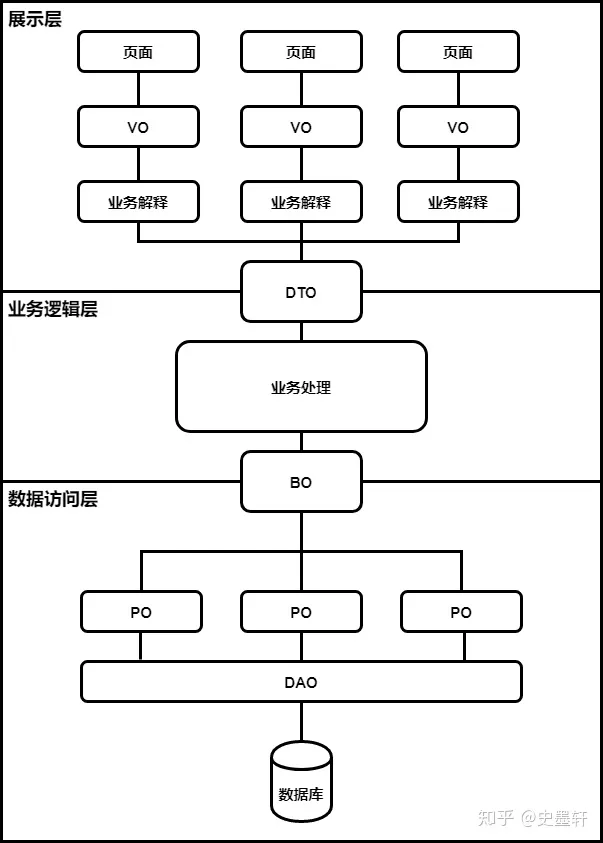

# 项目中的实体类分类的区别和作用

---

在一个Java的SpringBoot中，一般我们需要用到许多的实体类

一般在一个大型项目中，又会把实体类分成不同阶段使用的类

## PO层

POJO全称为：Plain Ordinary Java Object，即简单普通的java对象。一般用在数据层映射到数据库表的类，类的属性与表字段一一对应。

PO全称为：Persistant Object，即持久化对象。可以理解为数据库中的一条数据，也可以理解为POJO经过持久化后的对象。

DO（Domain Object）：领域对象，就是从现实世界中抽象出来的有形或无形的业务实体，一般也和数据库对应

## BO层

全称为：Business Object，即业务对象。一般用在业务层，当业务比较复杂，用到比较多的业务对象时，可用BO类组合封装所有的对象一并传递。
一般是处理多个对象的工具类或者service

## VO层

全称为：Value Object，有的也称为View Object，即值对象或页面对象。一般用于web层向view层封装并提供需要展现的数据

## DTO层

全称为：Data Transfer Object，即数据传输对象。一般用于向数据层外围提供仅需的数据，如查询一个表有50个字段，界面或服务只需要用到其中的某些字段，DTO就包装出去的对象。可用于隐藏数据层字段定义，也可以提高系统性能，减少不必要字段的传输损耗。

## 总结
VO，BO，PO，DTO这样分层还是很有意义的。尤其在团队成员较多的情况下，结构更加一目了然，同时也能很大程度避免多端系统数据所需不一致时，有人修改属性影响其他页面。但也完全没有必要教条主义，把这些全部用上，需要根据所开发的业务复杂度来取舍，如果本身业务逻辑不负责，照搬全上反而让开发变的更复杂。

命名规范
• 数据对象：xxxPO，xxx即为数据表名。(也可DO)
• 数据传输对象：xxxDTO，xxx为业务领域相关的名称。
• 展示对象：xxxVO，xxx一般为网页名称。
• 业务对象：xxxBO，xxx是业务名称。

## 分层使用和转换
### controller层
接受前端的VO,DTO
接受service层BO
向前端发送VO,DTO

### service层

接受controller层VO,DTO,BO,PO
接受dao层的PO
向controller层返回BO,PO

### DAO层

接受service层的VO,DTO,BO,PO
从数据库查询PO
向service层返回PO