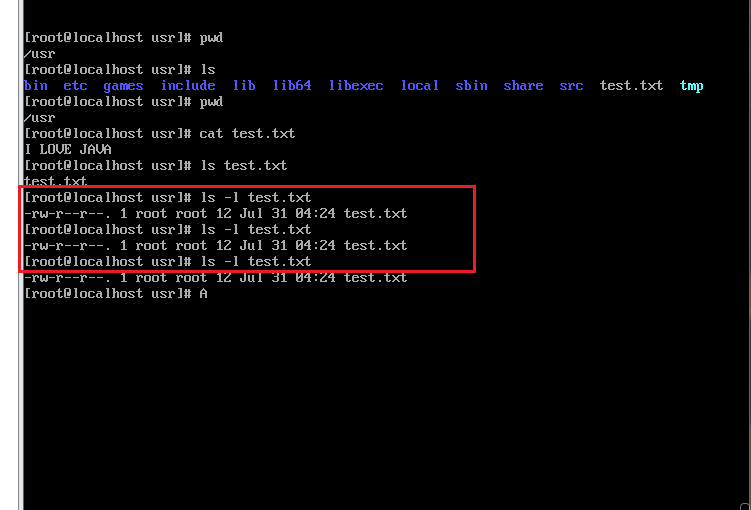

# Linux学习

---

## 目录作用

>/	根目录
>
>/bin	存放必要的指令
>
>/boot	存放内核以及启动所需的文件
>
>/dev	存放设备文件
>
>/etc	存放系统配置文件
>
>/home	普通用户的宿主目录，用户数据存放在其主目录中
>
>/lib	存放必要的运行库
>
>/mnt	存放临时的映射文件系统，通常用来挂载使用。
>
>/proc	存放存储进程和系统信息
>
>/root	超级用户的主目录
>
>/sbin	存放系统管理程序
>
>/tmp	存放临时文件
>
>/usr	存放应用程序，命令程序文件、程序库、手册和其它文档、
>
>/var	系统默认日志存放目录


## Linux常用命令

---

​		默认进入系统，我们会看到这样的字符：[root@localhost~]#，其中#代表当前是root用户登录，如果是$表示当前为普通用户。

​		我们了解Linux由很多目录文件构成，那我们来学习第一个Linux命令：

​		cd 命令，cd	/home；解析：进入/home目录

​		cd /root 进入/root目录；cd ../返回上一级目录；cd ./当前目录；（.和..可以理解为相对路径：例如：cd /home/test ，cd加完整的路径，可以理解为绝对路径）

更多的指令：

> ls ./		查看当前目录所有的文件和目录。

> ls -a 查看所有的文件，包括隐藏文件以.开头的文件。

​		

> pwd	显示当前所在的目录。

> mkdir	创建目录，用法 mkdir test，命令后接目录的名称。

> rmdir	删除空目录

> rm	删除文件或者目录，用法	rm -rf test.txt（-r表示递归，-f表示强制）。

> cp 拷贝文件，用法，cp old.txt	/tmp/new.txt，常用来备份；如果拷贝目录需	要加-r参数。


> mv	重命名或者移动文件或者目录，用法，mv old.txt new.txt

> touch	创建文件，用法，touch test.txt，如果文件存在，则表示修改当前文			件时间。

> Useradd	创建用户，用法 useradd wugk，userdel删除用户。

> Groupadd	创建组，用法groupadd wugk1，groupdel删除组。

> find [目录下开始查找] -name "test.txt"

> cat test.txt		打开文件（Linux默认的文本编辑器）

> vi	修改某个文件，vi有三种模式：（ESC退出编辑）
>
> 命令行模式、文本输入模式、末行模式。
>
> :w为保存的意思，:wq为保存退出
>
> 默认vi打开一个文件，首先是命令行模式，然后按i进入文本输入模式，可以在文件里写入字符等信息。
>
> 写完后，按ESC进入命令行模式，然后输入:进入末行模式，例如输入:wq表示保存退出。
>
> 如果想直接退出，不保存，可以执行:q!，q!感叹号表示强制退出。

> cat	查看文件内容，分页查看，cat是全部查看，如果篇幅很多，只能看到最后的篇幅。可以使用cat和more同时使用，例如：cat test.txt |more 分页显示text内容，|符号是管道符，用于把|前的输出作为后面命令的输入。

> echo	回显，用法 echo ok，会显示ok，输入什么就打印什么。
>
> echo ok > test.txt；把ok字符覆盖test.txt内容，>表示追加并覆盖的意思。
>
> \>>两个大于符号，表示追加，echo ok >> test.txt，表示向test.txt文件追加OK字符。不覆盖原文件里的内容。

初学者常见的命令就如上所示，当然还有很多深入的命令需要学习。

> 
>
> ls -l [文件名]	查看文件属性
>
> \- rw- r-- r-- 1 root root12 Jul 31 04:24 test.txt
>
> 第一位表示文件类型，-表示文件，d表示目录；后面每三位为一组。
>
> 第一组：2-4位表示文件所有者的权限，即用户user权限，简称u
>
> 第二组：5-7位表示文件所有者所属组成员的权限，group权限，简称g
>
> 第三组：8-10位表示所有者所属之外的用户的权限，other权限，简称o
>
> 从上面这个文件，我们可以看出test.txt文件对应的权限为：
>
> root哟怒具有读和写的权限，root组具有读的权限，其他人具有读的权限。
>
> 为了能更简单快捷的使用和熟悉权限，rwx权限可以用数字来表示，分别表示r（4）、w（2）、x（1）。
>
> test.txt权限可以表示为：644

> chmod [组]+[权限] [文件]	修改文件权限的指令
>
> 比如：chmod o+w test.txt
>
> ​		chmod o-w test.txt
>
> ​		chmod u=rwx,g=rw,o=r test.txt
>
> ​		chomod 644 test.txt

> chown -R abc:abc test.txt
>
> 修改权限组为abc abc
>
> -rw-r--r-- a abc abc .......................

### 将最近的后台任务调到前台：

> fg

### 命令进程号码N的命令进程放到前台执行

> fg N

### 将命令进程号码为N的命令进程放到后台执行

> bg N

### 查看当前在后台执行的命令，可查看命令进程号码

> jobs

### 压缩命令

> ```sh
> tar -zcvf 压缩文件名称 .tar.gz #被压缩文件名
> ```
>
> ```shell
> zip -r mydata.zip mydata #压缩mydata目录
> ```
>
> 注意unzip指令cnetos不自带需要先安装unzip才行
>
> unzip安装：
>
> ```shell
> yum install zip unzip
> ```

### 解压缩命令

> ```sh
> tar -zxvf 压缩文件名.tar.gz
> ```
>
> ```shell
> unzip 文件夹名称.zip
> ```
>
> 注意unzip指令cnetos不自带需要先安装unzip才行
>
> unzip安装：
>
> ```shell
> yum install zip unzip
> ```
>
> 

### 查看防火墙状态

> ```shell
> systemctl status firewalld.service
> ```
>
> 运行上述命令后，如果看到有绿色字样标注的“active（running）”，说明防火墙是开启状态。

### 开启防火墙

> ```shell
> systemctl start firewalld.service
> ```

### 关闭防火墙

> ```shell
> systemctl stop firewalld.service
> ```
>
> 关闭后，可查看防火墙状态，当显示disavtive（dead）的字样，说明CentOS 7防火墙已经关闭。
> 但要注意的是，上面的命令只是临时关闭了CentOS 7防火墙，当重启操作系统后，防火墙服务还是会再次启动。如果想要永久关闭防火墙则还需要禁用防火墙服务。

### 禁用防火墙服务

> ```shell
> systemctl disable firewalld.service
> ```

### 查看防火墙规则

> ```shell
> firewall-cmd –list-all
> ```

### 查看开放端口

> ```shell
> firewall-cmd --list-ports
> ```
>
> 

### 查询端口是否开放

> ```shell
> firewall-cmd –query-port=8080/tcp
> ```
>
> 这里的8080指的就是需要查看的指定端口

### 重启防火墙

> ```shell
> firewall-cmd –reload
> ```

### 开放指定端口

> ```shell
> firewall-cmd –permanent –add-port=8080/tcp
> ```
>
> 以上例子为开放端口8080
>
> (修改配置后需要重启防火墙)
>
> 参数解释：
> firewall-cmd: 是Linux提供的操作firewall的一个工具；
> –permanent：表示设置为持久；
> –add-port：表示添加的端口。

### 移除某个防火墙开启的端口

> ```shell
> firewall-cmd –permanent –remove-port=8080/tcp
> ```
>
> (修改配置后需要重启防火墙)

### 查看防火墙帮助

> ```shell
> firewall-cmd --help
> ```

### 查看 root 用户登录成功的IP及次数

> ```shell
> grep "Accepted password for root" /var/log/secure | awk '{print $11}' | sort | uniq -c | sort -nr | more
> 
> ```
>
> 看看是否有不熟悉的IP地址

### 查看尝试暴力破解 root 账户的IP及次数

> ```shell
>  grep "Failed password for root" /var/log/secure | awk '{print $11}' | sort | uniq -c | sort -nr | more
> 
> ```

### 查看尝试暴力破解用户名的IP及次数

> ```shell
> grep "Failed password for invalid user" /var/log/secure | awk '{print $13}' | sort | uniq -c | sort -nr | more
> 
> ```


### 图像转边命令行

> ```shell
> systemctl set-default multi-user.target
> ```
>
> 输入之后再输入reboot重启即可。

### 命令行转变图形

> ```shell
> systemctl set-default graphical.target
> ```
>
> 输入之后再输入reboot重启即可。


### 添加环境变量

1、打开终端，使用root用户或者具有sudo权限的用户登录到系统中。

2、编辑/etc/profile文件，例如使用vim编辑器：

```shell
sudo vim /etc/profile
```

3、在文件末尾添加你需要设置的环境变量，例如添加JAVA_HOME环境变量：

```shell
export JAVA_HOME=/usr/local/jdk1.8.0_281
export PATH=$JAVA_HOME/bin:$PATH
```

4、保存并退出文件，然后配置生效：

```shell
source /etc/profile
```

```shell
source /etc/environment #使配置立即生效。
```

5、验证环境变量是否设置成功：

```shell
echo $JAVA_HOME
```


### 修改文件名称

```shell
mv a.txt a1.txt
```


## vim操作

---

全部删除：按esc键后，先按gg（到达顶部），然后dG
全部复制：按esc键后，先按gg，然后ggyG
全选高亮显示：按esc键后，先按gg，然后ggvG或者ggVG

单行复制：按esc键后, 然后yy
单行删除：按esc键后, 然后dd
粘贴：按esc键后, 然后p
