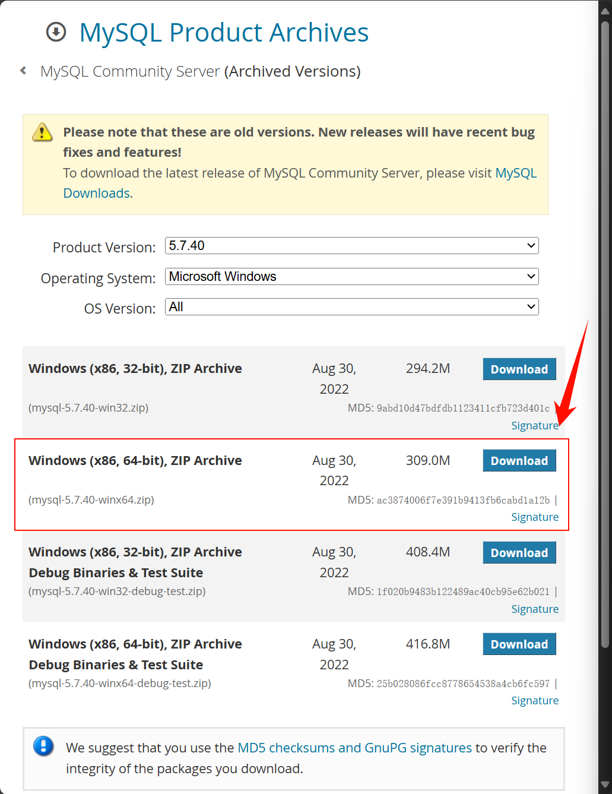
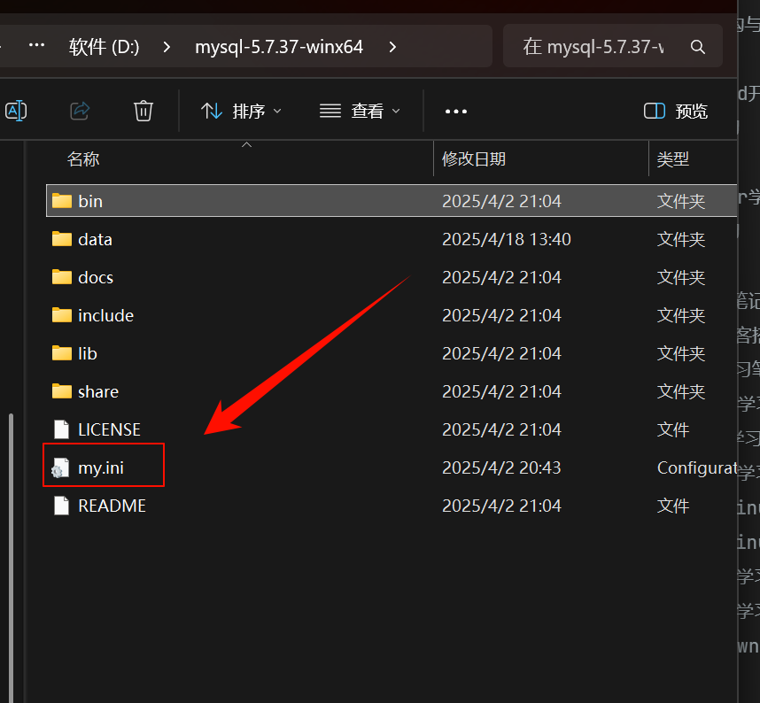
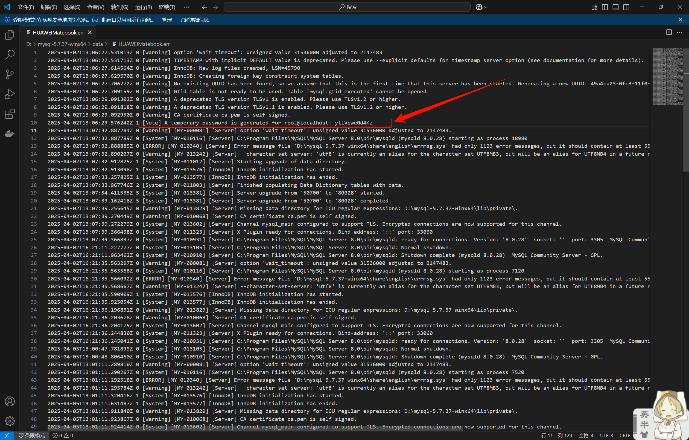
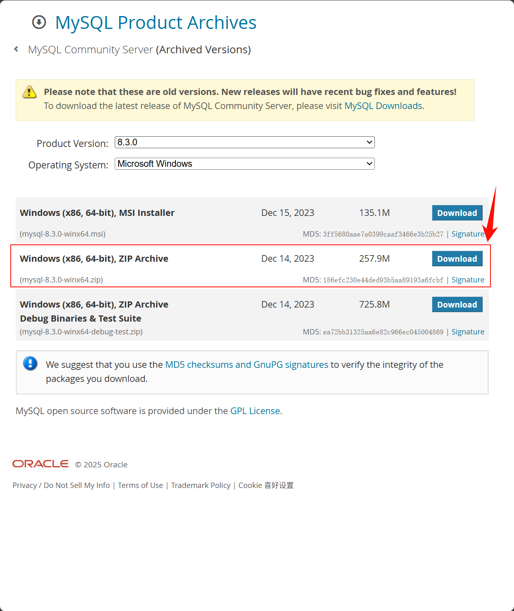

# MySQL同时安装多个版本

## Windows系统安装

### 一、下载对应MySQL5版本的压缩包

MySQL不同版本下载页：`https://downloads.mysql.com/archives/community/`，进去下载不同版本zip包即可。

比如选择下载MySQL 5.7.40版本：



下载好之后解压到自己想要的目录。

### 二、安装MySQL5

#### 1、定制配置文件

在数据库对应根目录文件创建`my.ini`



`my.ini文件内容`

```ini
[mysql]
# 设置mysql客户端默认字符集
default-character-set=utf8
[mysqld]
# 设置3305端口,多个数据库并存的时候记得端口别TM一样的
port = 3305
# 设置mysql的安装目录
basedir=D:\\mysql-5.7.37-winx64
# 设置mysql数据库的数据的存放目录（自动生成，不然可能报错）
datadir=D:\\mysql-5.7.37-winx64\\data
# 允许最大连接数
max_connections=10000
# 允许最大连接人数
max_user_connections=1000
# 服务端使用的字符集默认为8比特编码的latin1字符集
character-set-server=utf8
# 创建新表时将使用的默认存储引擎
default-storage-engine=INNODB
 
# 连接时间一年
wait_timeout=31536000
interactive_timeout=31536000
```


之后利用`管理员权限的CMD`cd到指定目录，`注意`，如果cd没有反应则需要再打一遍盘符，比如我想cd到`D:\mysql-5.7.37-winx64\bin`，如果没有反应，则再输入一次`d:`就行。

#### 2、初始化数据库

```cmd
mysqld --initialize
```

#### 3、安装MySQL服务

注意这里的`MYSQL5`主要的作用就是给安装的服务进行自定义名称，因为不加`MYSQL5`的话MySQL默认安装的服务名称为`MYSQL`，这里自定义名称的作用就是为了防止其他MYSQL服务名称相撞。

```cmd
mysqld --install MYSQL5
```

#### 4、启动MySQL服务

```cmd
net start MYSQL5
```

#### 5、连接数据库

输入指令之后会让你输入数据库密码，而初始数据库初次创建可能会自动生成一个数据库密码，密码可以在`data`中的`err`结尾后缀文件里面查看。

```cmd
mysql -P 3305 -u root -p
```




### 三、下载对应MySQL8版本的压缩包

MySQL不同版本下载页：`https://downloads.mysql.com/archives/community/`，进去下载不同版本zip包即可。

比如选择下载MySQL 8.3.0版本：



下载好之后解压到自己想要的目录。

### 二、安装MySQL8

#### 1、定制配置文件

在数据库对应根目录文件创建`my.ini`


`my.ini文件内容`

```ini
[mysql]
# 设置mysql客户端默认字符集
default-character-set=utf8
[mysqld]
# 设置3306端口,多个数据库并存的时候记得端口别TM一样的
port = 3306
# 设置mysql的安装目录
basedir=D:\\mysql-8.3.0-winx64
# 设置mysql数据库的数据的存放目录（自动生成，不然可能报错）
datadir=D:\\mysql-8.3.0-winx64\\data
# 允许最大连接数
max_connections=10000
# 允许最大连接人数
max_user_connections=1000
# 服务端使用的字符集默认为8比特编码的latin1字符集
character-set-server=utf8
# 创建新表时将使用的默认存储引擎
default-storage-engine=INNODB
 
# 连接时间一年
wait_timeout=31536000
interactive_timeout=31536000
```


之后利用`管理员权限的CMD`cd到指定目录，`注意`，如果cd没有反应则需要再打一遍盘符，比如我想cd到`D:\mysql-8.3.0-winx64\bin`，如果没有反应，则再输入一次`d:`就行。

#### 2、初始化数据库

```cmd
mysqld --initialize
```

#### 3、安装MySQL服务

注意这里的`MYSQL8`主要的作用就是给安装的服务进行自定义名称，因为不加`MYSQL8`的话MySQL默认安装的服务名称为`MYSQL`，这里自定义名称的作用就是为了防止其他MYSQL服务名称相撞。

```cmd
mysqld --install MYSQL8
```

#### 4、启动MySQL服务

```cmd
net start MYSQL8
```

#### 5、连接数据库

输入指令之后会让你输入数据库密码，而初始数据库初次创建可能会自动生成一个数据库密码，密码可以在`data`中的`err`结尾后缀文件里面查看。

```cmd
mysql -P 3306 -u root -p
```

