# Vue

---


## 创建Vue项目的命令：

```node
npm init vue@latest
```


## 文件结构

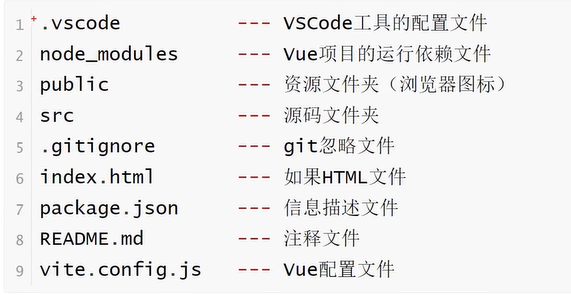

src:

> 这个文件夹就是我们主要进行写代码的文件夹。

page.json:

> 这个文件包括了项目版本运行，以及依赖导入版本等，这个文件有点像maven的配置文件一样。

vite.config.js:

> 这个是Vue的配置文件，这里会进行一些额外的配置，比如跨域请求的设置，以及一些打包的配置等。


Vue使用一种基于HTML的模板语法，使我们能够声明式地将其组件实例的数据绑定到呈现的DOM上。所有的Vue模板都是语法层面合法的HTML，可以被符合规范的浏览器和HTML解析器解析。


文本插值：

> 最基本的数据绑定形式是文本插值，它使用的是“Mustache”语法（即双大括号）：
>
> 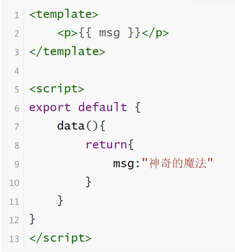

## v-text：

```vue
<div id="app">
    <h2 v-text="message"/>
    <h2>深圳{{message}}</h2>
</div>

<script>
var app = new Vue({
    el:"#app",
    data:{
        message:"Test",
    }
})
        </script>
```


## v-html：

```vue
<div id="app">
    <p v-html="content"></p>
</div>
<sctipt>
var app = new Vue({
    el:"#app",
    data:{
    content:"<a href='#'>Test</a>"
    }
    })
</sctipt>
```


## v-on：

作用：为元素绑定事件

```vue
<div id="app">
    <input type="button" value="事件绑定" v-on:事件名称="方法">
    点击事件：<input type="button" value="事件绑定" v-on:click="方法">
    双击事件：<input type="button" value="事件绑定" v-on:dblclick="方法">
    可以将v-on替换成@：<input type="buttion" value="事件绑定" @事件名称="方法">
</div>

<script>
    var app = new Vue({
        el:"#app",
        methods:{
            方法:function(){
                //逻辑
            }
        }
    })
</script>
```

传递自定义参数，事件修饰符

```vue
<div id="app">
    <input type="button" @click="dolt(p1,p2)"/>
    <input type="text" @keyup.enter="sayHi">
</div>

<script>
    var app = new Vue({
        el:"#app",
        methods:{
            dolt:function(p1,p2){},
            sayHi:function(){
                //因为上面是@keyup.enter所以只有在回车键的时候才会触发这个逻辑
                //修饰符不止这一个，更多的可以参考地址：https://cn.vuejs.org/v2/api/#v-on
            }
        }
    })
</script>
```


## v-if：

作用：根据表达值的真假，切换元素的显示和隐藏（操控dom元素）

```vue
<div id="app">
    <p v-if="true">我是一个p标签</p>
    <p v-if="isShow">我是一个p标签</p>
    <p v-if="表达式">我是一个p标签</p>
</div>

<script>
    var app = new Vue({
        el:"#app",
        data:{
            isShow:false
        }
    })
</script>
```


## v-bind：

作用：设置元素的属性（比如：src，title，class）

单向绑定。数据只能从data流向界面。

```vue
<div id="app">
    
    
    
    
</div>

<script>
    var app = new Vue({
        el:"#app",
        data:{
            imgSrc:"图片地址",
            imgTitle:"黑马程序员",
            isActive:false
        }
    })
</script>
```


## v-show:

作用：根据表达值的真假，切换元素的显示和隐藏

```vue
<div id="app">
    
</div>

<scritp>
    el:"app",
    data:{
    isShow:true
    }
</script>
```

## v-for

作用：根据数据生成列表结构

```vue
<div id="app">
    <ul>
        <li v-for="item in arr" :title="item">{{item}}{{item}}</li>
    </ul>
</div>


<script>
    var app=new Vue({
        el:"#app",
        data:{
            arr:[1,2,3,4,5]
        }
    })
</script>
```

```vue
<div id="app">
    <ul>
        <li v-for="(item,index) in objArr">
        {{item.name}}
        </li>
        <li v-for="(item,index) in objArr">
        {{item.name}}
        </li>
    </ul>
</div>

<script>
    var app = new Vue({
        el:"#app",
        data:{
            objArr:[
                {name:"jack"},
            	{name:"rose"}
                ]
            }
        }
    })
</script>
```


## v-model：

说明：获取和设置表单元素的值（双向数据绑定）

有双向绑定效果数据同步。只能应用在表单类元素（输入类元素）上。

model默认找的value属性，所以可以写成v-model=“”

v-model指令的作用是便捷的设置和获取表单元素的值

绑定的数据会和表单元素值相关联

```vue
<div id="app">
    <input type="text"/>
</div>

<script>
    var app = new Vue({
        el:"#app",
        data:{
            message:"黑马程序员"
        }
    })
</script>
```

## axios

说明：功能强大的网络请求库

* axios必须先导入才可以使用
* 使用get或者post方法即可发送对应的请求
* then方法中的回调函数会在请求成功或失败时触发
* 通过回调函数的形参可以获取响应内容，或错误信息

```vue
<script src="https://unpkg.com/axios/dist/axios.min.js"></script>

axios.get(地址?key=value&key2=value2).then(function(response){},function(err){})
axios.post(地址,{key:value,key2:value2}).then(function(response){},function(err){})
```


> 随机获取笑话的接口

> * 请求地址：https://autumnfish.cn/api/joke/list
> * 请求方法：get
> * 请求参数：num
>
> | 参数名 | 参数说明 | 备注       |
> | ------ | -------- | ---------- |
> | num    | 笑话条数 | 类型为数字 |
>
> * 响应内容：随机笑话

> 用户注册接口1
>
> * 请求地址：https://autumnfish.cn/api/user/reg
> * 请求方式：post
> * 请求参数：username
>
> | 参数名   | 参数说明 | 备注     |
> | -------- | -------- | -------- |
> | username | 用户名   | 不能为空 |
>
> 

## axios+vue

```vue
<script>
    var app = new Vue({
        el:"#app",
        data:{
            joke:"搞笑的笑话"
        },
        methods:{
            getJokes:function(){
                //this.joke?
                aixos.get("地址").then(function(response){
                    //this.joke?
                },function(err){});
            }
        }
    })
</script>
```


MVVM模型：

1. M：模型（Model）：对应data中的数据
2. V：视图（View）：模板
3. VM：视图模型（ViewModel）：Vue实例对象


[Vue实例].$mount('#id');：获取相应组件。


# Vue - 组件（Component）

---

## 一、什么是组件（Component）？

组件（Component）是Vue.js最强大的功能之一。组件可以扩展HTML元素，封装可以重用的代码。在较高层面上，组件是自定义元素，Vue.js的编译器为它添加特殊功能。在有些情况下，组件也可以表现为用`is`特性进行了扩展的原生HTML元素。

所有Vue组件同事也都是Vue实例，所以可以接受相同的选项对象（除了一些根级特有的选项）并且提供相同的生命周期钩子。

## 二、使用组件

1.全局组件

我们知道，创建一个Vue实例可以：


```css
new Vue({
  el: '#some-element',
  // 选项
})
```

全局注册组件，可以使用`Vue.component(tagName, options)`。 比如：


```csharp
Vue.component('my-component', {
  // 选项
})
```

> 请注意，对于自定义标签的命名 Vue.js 不强制遵循 [W3C 规则](https://www.w3.org/TR/custom-elements/#concepts) (小写，并且包含一个短杠)，尽管这被认为是最佳实践。

组件在注册之后，便可以作为自定义元素：`<my-component></my-component>`使用了。
 注意确保在初始化根实例之前注册组件：

`在初始化根实例之前注册组件`这句话就是指的是：


```csharp
Vue.component('my-component', {
  template: '<div>A custom component!</div>'
})

var vm = new Vue({
  el: '#box'
})
```

这样的顺序是对的，而


```csharp
var vm = new Vue({
  el: '#box'
})

Vue.component('my-component', {
  template: '<div>A custom component!</div>'
})
```

这样是错的。


```xml
<div id="example">
  <my-component></my-component>
</div>
```


```csharp
// 注册
Vue.component('my-component', {
  template: '<div>A custom component!</div>'
})

// 创建根实例
new Vue({
  el: '#example'
})
```

我们要注意，一般选项中需要添加`template`，就是HTML的构造。

渲染为：


```xml
<div id="example">
  <div>A custom component!</div>
</div>
```

2.局部注册

不必把每个组件都注册到全局。你可以通过某个 Vue 实例/组件的实例选项 `components` 注册仅在其作用域中可用的组件：


```csharp
var Child = {
  template: '<div>A custom component!</div>'
}

var vm = new Vue({
  el: '#box',
  components: {
    'my-component': Child
  }
})

var vm = new Vue({
  el: '#box2'
})
```


```xml
<div id="box">
  <my-component></my-component>

</div>

<div id="box2">
  <my-component></my-component>
</div>
```

> Vue组件的全局注册，可以在多个Vue实例中使用，如果是在Vue构造器中局部注册，那么只能在此Vue实例中使用。

那么在`<div id="box">`下面的`<my-component></my-component>`将不会渲染出来。

这种封装也适用于其它可注册的 Vue 功能，比如指令。

3.DOM模板解析注意事项

当使用 DOM 作为模板的时候（例如，使用 `el` 选项来把 Vue 实例挂载到一个已有内容的元素上），你会受到 HTML 本身的一些限制，因为 Vue 只有在浏览器解析，规范化之后才能获取其内容。尤其要注意，像 `<ul>` `<ol>`, `<table>`，`<select>` 这样的元素里面允许包含的元素有限制，而另外一些像 `<option>` 这样的元素只能出现在某些特定元素的内部。

在自定义组件中使用这些受限制元素时候会导致一些问题，比如：


```xml
<table>
  <my-row>...</my-row>
</table>
```

自定义组件 `<my-row>` 会被当成无效的内容，因此会导致错误的渲染结果。变通方式是使用特殊的 `is` 特性：


```xml
<table>
  <tr is="my-row"></tr>
</table>
```

应当注意，如果使用来自以下来源之一的字符串模板，则没有这些限制：


```xml
<script type="text/x-template">
JavaScript 内联模板字符串
.vue 组件
```

因此，请尽可能使用字符串模板。

1. `data`必须是函数

构造 Vue 实例时传入的各种选项大多数都可以在组件里使用。只有一个例外：data 必须是函数。实际上，如果你这么做：


```kotlin
Vue.component('my-component', {
  template: '<span>{{ message }}</span>',
  data: {
    message: 'hello'
  }
})
```

那么 Vue 会停止运行，并在控制台发出警告，告诉你在组件实例中 data 必须是一个函数。但理解这种规则为何存在也是很有益处的，所以让我们先作个弊：


```xml
<div id="example-2">
  <simple-counter></simple-counter>
  <simple-counter></simple-counter>
  <simple-counter></simple-counter>
</div>
```

data参数中，一般是返回的js对象。比如:


```jsx
data: function () {
    return {
        text: 'text',
        name: 'Hello'
    }
}
```


```php
var data = { counter: 0 }

Vue.component('simple-counter', {
  template: '<button v-on:click="counter += 1">{{ counter }}</button>',   # 注意：这里是 += 不是 +
  // 技术上 data 的确是一个函数了，因此 Vue 不会警告，
  // 但是我们却给每个组件实例返回了同一个对象的引用
  data: function () {
    return data
  }
})

new Vue({
  el: '#example-2'
})
```

由于这三个组件实例共享了同一个 data 对象，因此递增一个 counter 会影响所有组件！这就错了。我们可以通过为每个组件返回全新的数据对象来修复这个问题：


```jsx
data: function () {
  return {
    counter: 0
  }
}
```

现在每个 counter 都有它自己内部的状态了。

5.组件组合

组件设计初衷就是要配合使用的，最常见的就是形成父子组件的关系：组件 A 在它的模板中使用了组件 B。它们之间必然需要相互通信：父组件可能要给子组件下发数据，子组件则可能要将它内部发生的事情告知父组件。然而，通过一个良好定义的接口来尽可能将父子组件解耦也是很重要的。这保证了每个组件的代码可以在相对隔离的环境中书写和理解，从而提高了其可维护性和复用性。

在 Vue 中，父子组件的关系可以总结为 prop 向下传递，事件向上传递。父组件通过 prop 给子组件下发数据，子组件通过事件给父组件发送消息。看看它们是怎么工作的。


图片.png

## 三、Prop

1.使用Prop传值
 组件实例的作用域是孤立的。这意味着不能 (也不应该) 在子组件的模板内直接引用父组件的数据。父组件的数据需要通过 prop 才能下发到子组件中。

子组件要显式地用 [`props` 选项](https://vuejs.bootcss.com/v2/api/#props)声明它预期的数据：


```csharp
Vue.component('child', {
  // 声明 props
  props: ['message'],
  // 就像 data 一样，prop 也可以在模板中使用
  // 同样也可以在 vm 实例中通过 this.message 来使用
  template: '<span>{{ message }}</span>'
})
```


```xml
<div id="box">
  <child message="hellow"></child>
  <child message="hellow"></child>
  <child message="123"></child>
</div>
```

2.驼峰法 vs 短横线分隔法

HTML 特性是不区分大小写的。所以，当使用的不是字符串模板时，camelCase (驼峰式命名) 的 prop 需要转换为相对应的 kebab-case (短横线分隔式命名)：

Vue.js中是区分大小写的。


```csharp
Vue.component('child', {
  // 在 JavaScript 中使用 camelCase
  props: ['myMessage'],
  template: '<span>{{ myMessage }}</span>'
})
```


```xml
<!-- 在 HTML 中使用 kebab-case -->
<child my-message="hello!"></child>
```

注意是自动转换为的，我们需要在使用模板的时候`<child my-message="hello!"></child>`，注意到需要使用短横线分隔符号。

3.动态Prop

与绑定到任何普通的 HTML 特性类似，我们可以使用 `v-bind` 来动态地将prop绑定到父组件的数据。
 每当父组件的数据变化时，该变化也会传导给子组件：


```xml
<div>
  <input v-model="parentMsg">
  <br>
  <child v-bind:my-message="parentMsg"></child>
</div>
```

你也可以使用 v-bind 的缩写语法：


```ruby
<child :my-message="parentMsg"></child>
```

如果你想把一个对象的所有属性作为 prop 进行传递，可以使用不带任何参数的 v-bind (即用 v-bind 而不是 v-bind:prop-name)。例如，已知一个 todo 对象：


```csharp
var vm = new Vue({
  el: '#box',
  data: {
    todo: {
      text: 'Learn Vue',
      isComplete: false
    }
  }
})
```


```xml
<todo-item v-bind="todo"></todo-item>
```

等价于：


```xml
<todo-item
  v-bind:text="todo.text"
  v-bind:is-complete="todo.isComplete"
></todo-item>
```

eg：


```xml
<div id="box">
  <child v-bind="todo"></child>
</div>
```


```csharp
Vue.component('child', {
  props: ['text', 'is-complete'],
  template: '<span>{{ text }}</span>'
})

var vm = new Vue({
  el: '#box',
  data: {
    todo: {
      text: 'Learn Vue',
      isComplete: false
    }
  }
})
```

或者直接传递一个对象：


```xml
<body>

<div id="box">
  <child v-bind:todo="todo"></child>
</div>
```


```csharp
Vue.component('child', {
  props: ['todo'],
  template: '<span>{{ todo.text }} {{ todo.isComplete }} </span>'
})

var vm = new Vue({
  el: '#box',
  data: {
    todo: {
      text: 'Learn Vue',
      isComplete: false
    }
  }
})
```

从上面可以看出，一般我们还是这样传递最好：


```xml
<child v-bind:todo="todo"></child>
```

不要`v-bind="todo"`，这样不是很方便样。

4.字面量语法  vs 动态语法

字面量语法，就是直接传递字符串这样：
 初学者常犯的一个错误是使用字面量语法传递数值：


```xml
<!-- 传递了一个字符串 "1" -->
<comp some-prop="1"></comp>
```

因为它是一个字面量 prop，它的值是字符串 "1" 而不是一个数值。如果想传递一个真正的 JavaScript 数值，则需要使用 v-bind，从而让它的值被当作 JavaScript 表达式计算：
 下面才是正确的：


```xml
<!-- 传递真正的数值 -->
<comp v-bind:some-prop="1"></comp>
```

5.单向数据流

Prop 是单向绑定的：当父组件的属性变化时，将传导给子组件，但是反过来不会。这是为了防止子组件无意间修改了父组件的状态，来避免应用的数据流变得难以理解。

另外，每次父组件更新时，子组件的所有 prop 都会更新为最新值。这意味着你不应该在子组件内部改变 prop。如果你这么做了，Vue 会在控制台给出警告。

在两种情况下，我们很容易忍不住想去修改 prop 中数据：


```undefined
1）Prop 作为初始值传入后，子组件想把它当作局部数据来用；
2）Prop 作为原始数据传入，由子组件处理成其它数据输出。
```

正确的应对方式是：
 1）定义一个局部变量，并且使用prop的值初始化它：


```jsx
Vue.component('child', {
  props: ['todo'],
  template: '<span>{{ todo }} </span>',
  data: function () {
    return {
      com_todo: this.todo + " ok"
    }
  }
})
```

> 注意：外部传入了`todo`进来，那么现在又返回的有一个`com_todo`，现在组件中可以使用的数据就有两个了：`todo`和`com_todo`。
>  在组件的template中，
>  可以这样写：


```xml
  template: '<span>{{ todo }} </span>'
  template: '<span>{{ this.todo }} </span>',
  template: '<span>{{ com_todo }} </span>',
  template: '<span>{{ this.com_todo }} </span>',
```

2）定义一个计算属性（`computed`），来处理prop的值并且返回：


```xml
<div id="box">
  <child v-bind:todo="123"></child>
</div>
```


```kotlin
Vue.component('child', {
  props: ['todo'],
  template: '<span>{{ computed_todo }} </span>',
  data: function () {
    return {
      com_todo: this.todo + " ok"
    }
  },
  computed: {
    computed_todo: function () {
      return this.todo + "2"    # 注意这里不能 return todo + "2"
    }
  }
})
```

> 注意在 JavaScript 中对象和数组是引用类型，指向同一个内存空间，如果 prop 是一个对象或数组，在子组件内部改变它会影响父组件的状态。

1. Prop验证

我们可以为组件的 prop 指定验证规则。如果传入的数据不符合要求，`Vue` 会发出警告。这对于开发给他人使用的组件非常有用。

要指定验证规则，需要用对象的形式来定义 prop，而不能用字符串数组：
 （我们之前的`字符串数组`形式是这样的：`props:['todo', 'doit']`)

对象形式是：


```tsx
Vue.component('example', {
  props: {
    // 基础类型检测 (`null` 指允许任何类型)
    propA: Number,
    // 可能是多种类型
    propB: [String, Number],
    // 必传且是字符串
    propC: {
      type: String,
      required: true
    },
    // 数值且有默认值
    propD: {
      type: Number,
      default: 100
    },
    // 数组/对象的默认值应当由一个工厂函数返回
    propE: {
      type: Object,
      default: function () {
        return { message: 'hello' }
      }
    },
    // 自定义验证函数
    propF: {
      validator: function (value) {
        return value > 10
      }
    }
  }
})
```

`type` 可以是下面原生构造器：


```jsx
String
Number
Boolean
Function
Object
Array
Symbol
```

## 四、 非Prop特性

所谓非 prop 特性，就是指它可以直接传入组件，而不需要定义相应的 prop。

尽管为组件定义明确的 prop 是推荐的传参方式，组件的作者却并不总能预见到组件被使用的场景。所以，组件可以接收任意传入的特性，这些特性都会被添加到组件的根元素上。

例如，假设我们使用了第三方组件 bs-date-input，它包含一个 Bootstrap 插件，该插件需要在 input 上添加 data-3d-date-picker 这个特性。这时可以把特性直接添加到组件上 (不需要事先定义 prop)：


```xml
<bs-date-input data-3d-date-picker="true"></bs-date-input>
```

添加属性 data-3d-date-picker="true" 之后，它会被自动添加到 bs-date-input 的根元素上。

## 五、自定义事件

我们知道，父组件使用 prop 传递数据给子组件。但子组件怎么跟父组件通信呢？这个时候 Vue 的自定义事件系统就派得上用场了。

1. 使用 `v-on` 绑定自定义事件
    每个Vue实例都实现了事件接口，即：


```bash
使用 $on(eventName) 监听事件  (也叫绑定事件)
使用 $emit(eventName) 触发事件
```

> Vue 的事件系统与浏览器的 [EventTarget API](https://developer.mozilla.org/en-US/docs/Web/API/EventTarget) 有所不同。尽管它们的运行起来类似，但是 `$on` 和 `$emit` **并不是**`addEventListener` 和 `dispatchEvent` 的别名。

另外，父组件可以在使用子组件的地方直接用 v-on 来监听子组件触发的事件。

> 不能用 $on 监听子组件释放的事件，而必须在模板里直接用 v-on 绑定，参见下面的例子。

下面是一个例子：
 （父组件在使用子组件的地方使用`v-on`监听子组件触发的事件）


```xml
<div id="counter-event-example">
  <p>{{ total }}</p>
  <button-counter v-on:increment="incrementTotal"></button-counter>
  <button-counter v-on:increment="incrementTotal"></button-counter>
</div>
```


```jsx
Vue.component('button-counter', {
  template: '<button v-on:click="incrementCounter">{{ counter }}</button>',
  data: function () {
    return {
      counter: 0
    }
  },
  methods: {
    incrementCounter: function () {
      this.counter += 1
      this.$emit('increment')
    }
  },
})

new Vue({
  el: '#counter-event-example',
  data: {
    total: 0
  },
  methods: {
    incrementTotal: function () {
      this.total += 1
    }
  }
})
```

我们可以看到，这里有两个`v-on:click=`事件绑定，注意这个`increment`就是自定义事件：
 是使用`this.$emit('increment')`触发这个事件的。


```csharp
<button v-on:click="incrementCounter">{{ counter }}</button>  # 子级（自己）
<button-counter v-on:increment="incrementTotal"></button-counter>  # 父级
```

子组件已经和它外部完全解耦了。它所做的只是报告自己的内部事件，因为父组件可能会关心这些事件。请注意这一点很重要。

2.给组件绑定原生事件

有时候，你可能想在某个组件的根元素上监听一个原生事件。可以使用 v-on 的修饰符 .native。例如：


```xml
<my-component v-on:click.native="doTheThing"></my-component>
```

3.`.sync`修饰符

在一些情况下，我们可能会需要对一个 prop 进行“双向绑定”。事实上，这正是 Vue 1.x 中的 .sync 修饰符所提供的功能。当一个子组件改变了一个带 .sync 的 prop 的值时，这个变化也会同步到父组件中所绑定的值。这很方便，但也会导致问题，因为它破坏了单向数据流。由于子组件改变 prop 的代码和普通的状态改动代码毫无区别，当光看子组件的代码时，你完全不知道它何时悄悄地改变了父组件的状态。这在 debug 复杂结构的应用时会带来很高的维护成本。
 上面所说的正是我们在 2.0 中移除 .sync 的理由。但是在 2.0 发布之后的实际应用中，我们发现 .sync 还是有其适用之处，比如在开发可复用的组件库时。我们需要做的只是让子组件改变父组件状态的代码更容易被区分。
 从 2.3.0 起我们重新引入了 .sync 修饰符，但是这次它只是作为一个编译时的语法糖存在。它会被扩展为一个自动更新父组件属性的 v-on 监听器。

eg：


```xml
<comp :foo.sync="bar"></comp>
```

会被扩展为：


```ruby
<comp :foo="bar" @update:foo="val => bar = val"></comp>
```

当子组件需要更新 foo 的值时，它需要显式地触发一个更新事件：


```kotlin
this.$emit('update:foo', newValue)
```

4.使用自定义事件的表单输入组件

自定义事件可以用来创建自定义的表单输入组件，使用 v-model 来进行数据双向绑定。要牢记：


```xml
<input v-model="something">
```

这不过是以下示例的语法糖：


```csharp
<input
  v-bind:value="something"
  v-on:input="something = $event.target.value">
```

1. 


```ruby
components: {
      'm-header':MHeader
}
```

与


```undefined
components: {
      MHeader
}
```

是一样的，只是省略掉了默认的那个。

6.Vue的父组件与子组件之间的交互（数据和事件）：
 https://blog.csdn.net/qq_16559905/article/details/78761956

注意：子组件和父组件 函数的传递，是不需要写在props中的。
 子组件：


```csharp
this.$emit('function', params)
```

父组件：


```xml
<sub-component @function="function_in_parent" ></sub-component>
```

这里的`function_in_parent`是在父组件中实现。


# 基于脚手架开发（Vue-Cli）

创建项目指令：

```
vue cteate [项目名称]
```

利用脚手架来运行项目指令：

```
npm run serve
```

打包指令：

```
npm run build
```

ctrl+C停止运行

main.js

```javascript
//导入Vue
import Vue from 'vue'
//导入App.vue组件
import App from './App.vue'

//关闭生产提示
Vue.config.productionTip = false

//创建Vue实例
new Vue({
    render: h=> h(App),
}).$mount('#app')  //通过$mount方法，指定挂在的容器
```


## 如果出现下载缓慢配置npm淘宝镜像：

npm config set registry

https://registry.npm.taobao.org


## Vue脚手架隐藏了所有webpack相关的配置，若想查看具体的webpack配置，请执行：vue inspect > output.js

这里就可以把脚手架默认的配置全都整理成js文件


## 关于不同版本的Vue：

1.vue.sj与vue.runtime.xx.js的区别：

(1).vue.js是完整版的Vue，包含：核心功能+模板解析器。

(2).vue.runtime.xxx.js没有模板解析器，所以不能使用template配置项，需要使用render函数接收到的createElement函数区指定具体内容。


## Vue-cli脚手架配置覆写

直接在与package.json同级的目录下覆写vue.config.js文件即可

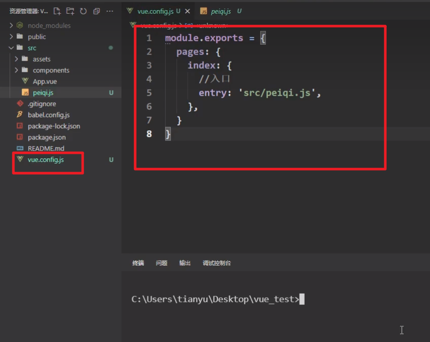


## 脚手架文件结构

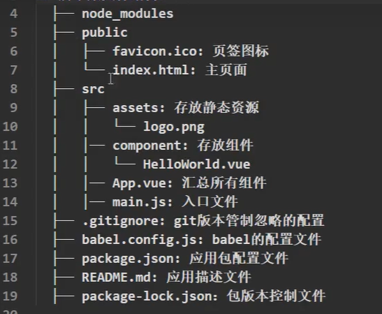


## 关于不同版本的vue：

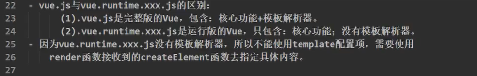


## vue.config.js配置文件

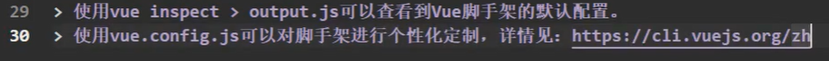


## 组件自定义事件

### 事件解绑：

```vue
//解绑一个自定义事件
this.$off('这里就是自定义绑定事件的标签名称');
//所有的自定义事件全都解绑
this.$off();
```

### 销毁当前组件实例

```Vue
this.$destroy(); //销毁当前组件的实例（注意，只是销毁组件实例，但是真实渲染的dom还在的，但是里面所绑定的一些vue的一些属性和事件全都不生效了）
```

```vue
<School @自定义事件的标签名称="触发这个事件后所调用的函数"
```

### 使用ref的方式写自定义事件：

```vue
<template>
<Student ref="student"></Student>
</template>
<script>
    export default{
        ...,
        mounted(){
            //this.$refs.student.$on('自定义事件的标签名称',这里填写触发时调用的自定义函数) //绑定自定义事件
            this.$refs.student.$on('自定义事件的标签名称',(name,...params)=>{
                console.log('App收到了学生名：'name,params)
                console.log(this)
            }) //绑定自定义事件
        }
    }
</script>
```


## Vue生命周期图

---

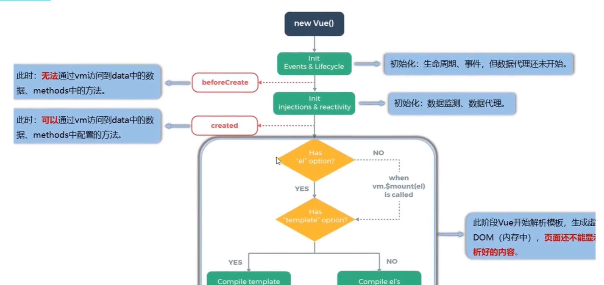


##  全局事件总线

---

1.一种组件间通讯的方式，适用于任意组件间通讯。

全局事件总线可以忽略其子父级组件关系所有事件的触发全由一个代理来通知：

以下为未简化版本的写法：

```vue
import Vue from 'vue'
import App from './App.vue'

Vue.config.productionTip = false
const Demo = Vue.extend({})
const d = new Demo()

Vue.prototype.$bus = d

new Vue({
  render: h => h(App)
}).$mount('#app')

```

以下为简化版本：

```vue
import Vue from 'vue'
import App from './App.vue'

Vue.config.productionTip = false


new Vue({
  render: h => h(App),
  beforeCreate(){
    Vue.prototype.$bus = this  //安装全局事件总线，$bus就是当前应用的vm
  }
}).$mount('#app')

```

这里的\$bus是随便的 一个变量名，但是为了标准写\$bus最好

使用事件总线：

1.接收数据：A组件想接收数据，则在A组件中给\$bus绑定自定义事件，事件的**回调留在A组件自身**。

```vue
methods(){
	demo(data){
		...
	}
......
mounted(){
	this.$bus.$on('xxxx',this.demo)
}
}
```

提供数据：this.\$bus.\$emit('xxxx',数据)

最好在beforeDestroy钩子中，用\$off去绑定 **当前组件所用到的**事件。

注意：要根据实际情况来用全局事件总线，有些比如父传子那么用props就行了，没必要用事件总线。


## 消息订阅与发布

---

报纸订阅与发布：

​	1.订阅报纸：住址

​	2.邮递员送报纸：报纸

注意：消息订阅与发布只是一种理念，想要落到实处要通过实际的代码来体现，这里推荐使用pubsub-js库

在Vue中：

​	1.订阅信息：消息名（手机号）

​	2.发布消息：消息内容


引入pubsub-js库

```node
npm i pubsub-js
```

使用：

首先要在需要使用的vue组件先引入才行

```js
import pubsub from 'pubsub-js'

export default{
	mounted(){
		pubsub.subscribe('订阅信息名称',/*回调函数*/function(){ //订阅信息
			console.log('有人发布了hello消息，hello消息的回调执行了')
		})
	},
	methods:{
		sendStudentName(){
			pubsub.publish('发布消息名称(对应订阅消息名称)',/*发布的消息*/666)
	}
},

}
```

这个库的设计有点像定时器，如果要取消订阅不能通过pubsub.unsubscribe('订阅信息名称')的方式去取消订阅，而pubsub.subscribe订阅函数每次生成都会有唯一的id，所以要这样进行销毁：

```js
mounted(){
	this.pubId = pubsub.subscribe('hello',function(msgName,data){ console.log('有人发布了hello消息')})
},
beforeDestroy(){
	pubsub.unsubscribe(this.pubId)
}

```


## $nextTick

---

语法：this.\$nextTick(回调函数)

作用：在下一次DOM更新结束后执行其指定的回调。

什么时候用：当改变数据后，要基于更新后的新DOM进行某些操作时，要在nextTick所指定的回调函数中执行。

他的意思是指下一轮，他可以去指定一个回调，他所指定的回调函数会在dom节点更新完毕之后执行。

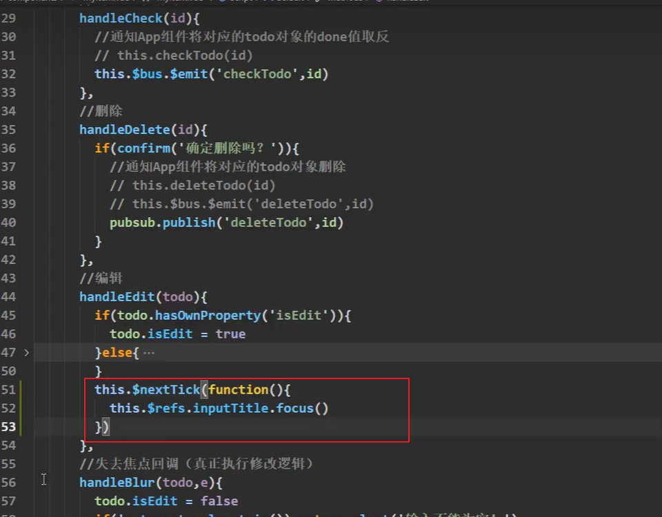


## Vue封装的过度与动画

---

作用：在插入、更新或移除DOM元素时，在合适的时候给元素添加样式类名。

图示：

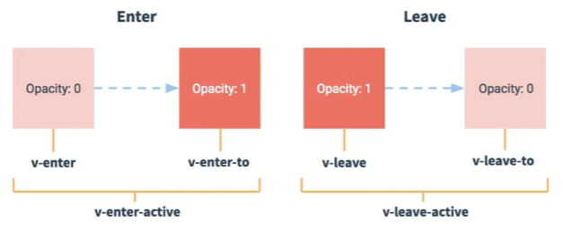

Vue还可以定义组件初始化显示入场和出场的动画。

```vue
<template>
	<div>
   		<transition name="hello">
            <h1 v-show></h1>
    	</transition>
    </div>
</template>

<script>
</script>

<style scoped>
    .hello-enter-active{
        animation: atguigu 0.5s linear;
    }
    .hello-leave-active{
        animation: atguigu 0.5s reverse;
    }
    @keyframes atguigu{
        from{
            
        }
        to{
            
        }
    }
</style>
```

在这里，hello对应动画的.xxxx-enter-active及.xxxx-leave-active这些，动画可以自己定义。

如果没有定义动画的name属性那么默认就是.v-enter-active及.v-leave-active


设置默认显示：

```vue
<template>
	<div>
   		<transition name="hello" appear>
            <h1 v-show></h1>
    	</transition>
    </div>
</template>

<script>
</script>

<style scoped>
    .hello-enter-active{
        animation: atguigu 0.5s linear;
    }
    .hello-leave-active{
        animation: atguigu 0.5s reverse;
    }
    @keyframes atguigu{
        from{
            
        }
        to{
            
        }
    }
</style>
```

这里的transition里面多了个appear属性，加了这个就表示默认是显示状态，相当于初始化就是加载显示的动画。这种写法是:appear="true"的简写方式


另一种写法：

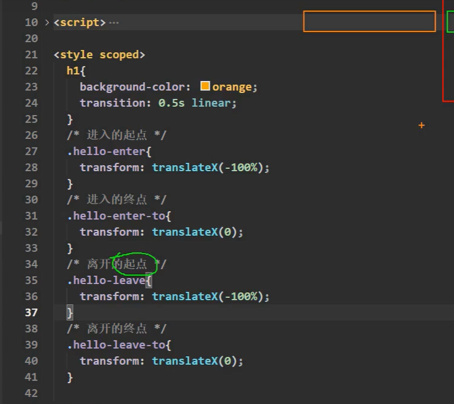

另外一种动画执行时间的写法

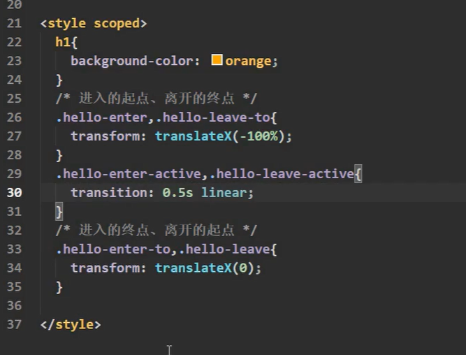

transition只能包裹一个元素，如果要包裹多个元素要使用transition-group：

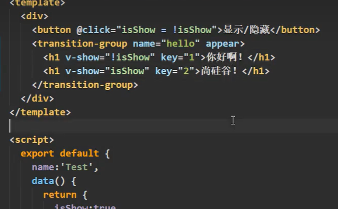

可以集成使用第三方的动画库

比如animate.css

使用npm安装：

```npm
npm install animate.css
```

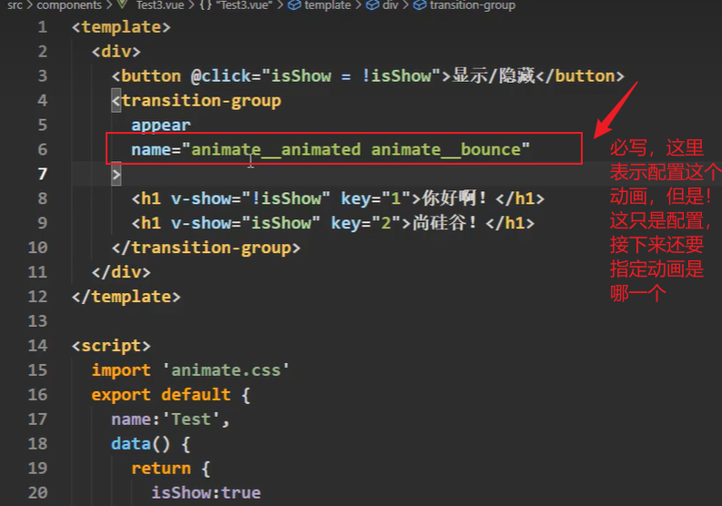

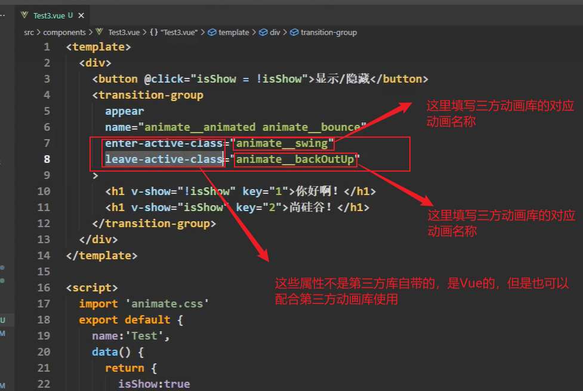


## 配置代理

---

axios下载：

```npm
npm i axios
```

解决跨域问题：

1.配置cors

2.jsonp ，但是只能解决get请求

3.代理服务器

利用Vue-cli开启代理服务器：

### 开启方式一：

```js
const { defineConfig } = require('@vue/cli-service')
module.exports = defineConfig({
  transpileDependencies: true,
    lintOnSave: false,//关闭语法检测
  publicPath: process.env.NODE_ENV === 'production'? '././':'/',
    //开启代理服务器，这里的代理连接是目标API服务器
    devServer:{
    proxy: 'http://localhost:4000'
  }
})

```

这里的代理会现在本地查询是否有自己想要访问的网址资源，如果没有才会走代理，否则会直接返回本地的资源。


### 开启方式二：

这种方式可以配置多个代理服务器

```js
const { defineConfig } = require('@vue/cli-service')
module.exports = defineConfig({
  transpileDependencies: true,
    lintOnSave: false,
  publicPath: process.env.NODE_ENV === 'production'? '././':'/',
  devServer:{
    proxy:{
      '/api':{
        target: '<url>'/*填写代理访问的api服务器，比如http:22.213.53.11:8089*/,
        ws: true, //用于支持WebSocket，默认为true
        changeOrigin: true //用于是否让代理服务器告诉目标api服务器真相地址和端口，如果false，则表示告诉。true则表示不告诉（谎称自己和api服务器是同源请求），默认为true。
      },
      '/foo':{
        target: '<other_url>'
      }
    }
  }
})

```

**注意**：这里如果单纯这么配置书写，如果直接请求的话会携带对应首个请求路径字段：

> 比如请求：http:localhost:8080/api/test，那么他最后代理服务器转发后也是http:22.213.53.11:8089/api/test


#### 如果要剔除掉对应代理字段然后转发请求的话，需要配置pathRewrite配置：

```js
const { defineConfig } = require('@vue/cli-service')
module.exports = defineConfig({
  transpileDependencies: true,
    lintOnSave: false,
  publicPath: process.env.NODE_ENV === 'production'? '././':'/',
  devServer:{
    proxy:{
      '/api':{
        target: '<url>',
        pathRewrite:{'^/api': ''}
        // ws: true,
        // changeOrigin: true
      },
      '/foo':{
        target: '<other_url>'
      }
    }
  }
})

```

这里^/api使用的正则匹配/api，然后将其替换成空字符串。

1.xhr

2.jquery

3.axios

4.vue-resource

官方更推荐axios来作为请求框架。


## 插槽

---


## VueX是什么？

概念：专门在Vue中实现几种式状态管理（数据）管理的一个Vue插件，对Vue应用中多个组件的共享状态进行集中式的管理（读/写），也是一种组件间通讯的方式，且适用于任意组件间通信。


## 什么时候使用VueX

1.多个组件依赖于同一状态

2.来自不同组件的行为需要变更同一状态

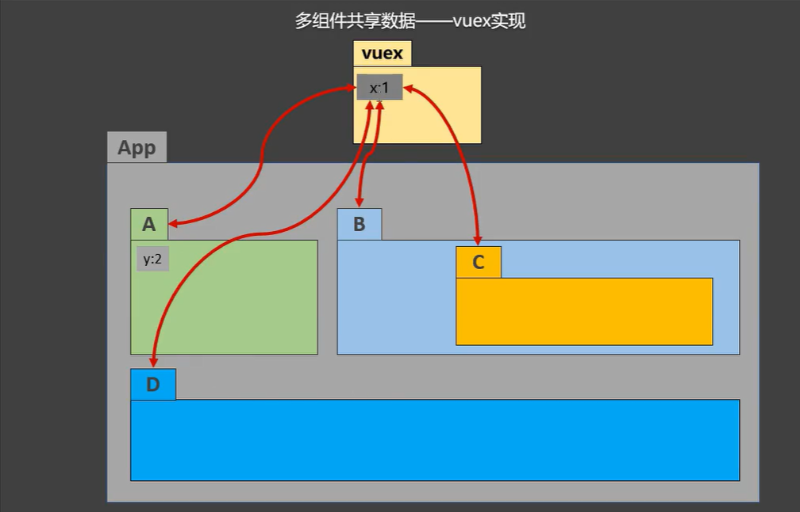

VueX原理图：

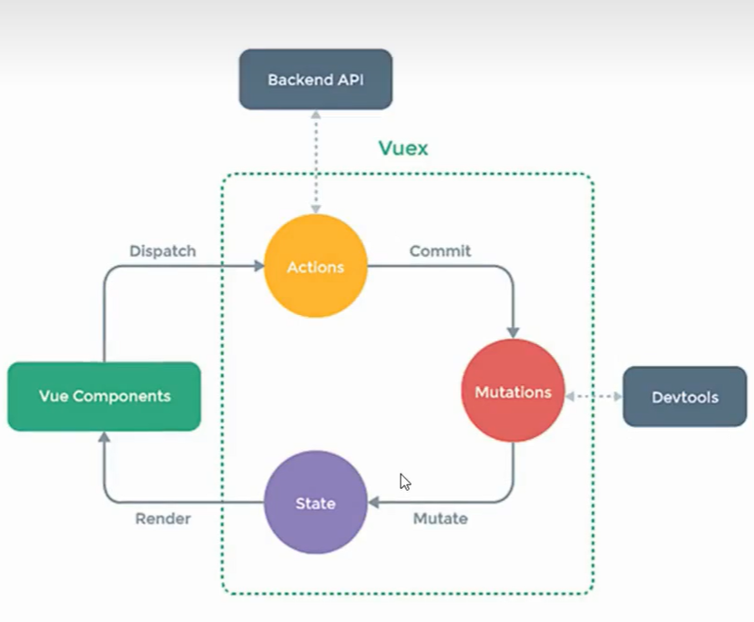


## VueX的安装

---

如果直接使用指令：

```
npm i vuex
```

这样使用就会有问题，因为现在Vue默认会使用Vue3版本的VueX，所以直接下载的话会下载vueX的最新版本VueX4版本。因为我们现在是Vue2所以要下载VueX3版本。

所以要用指令指定版本：

```
npm i vuex@3
```

然后再main.js引入vuex：

```js
mport Vue from 'vue';
import App from './App.vue';
import Vuex from 'vuex';

//使用插件
Vue.use(Vuex)

new Vue({
  render: h => h(App),
}).$mount('#app')

```


### 搭建VueX环境

---

1.创建文件：src/store/index.js

```js
//引入Vue核心库
import Vue from 'vue'
//引入VueX
import Vuex fom 'vuex'
//应用Vuex插件
Vue.use(Vuex)

//准备actions对象——响应组件中用户的动作
const actions={}
//准备mutations对象——修改state中的数据
const mutations={}
//准备state对象——保存具体的数据
const state={}

//创建并暴露store
export default new Vuex.Store({
    actions,
    mutations,
    state
})
```

main.js引入：

```js
import store from './store'
new Vue({
    el:'#app',
    render: h=>(App),
    store
})
```


### 基本使用

初始化数据、配置actions、配置mutations、操作文件store.js

```js
import Vue from 'vue'
import Vuex from 'vuex'

Vue.use(Vuex)
const actions = {
        //响应组件中加的动作
        jia(context,value){
            //console.log('actions中的jia被调用了',miniStore,value)
            context,commit("JIA",value)
        },
    }
 
const mutations = {
    //执行加
    JIA(state,value){
        //console.log('mutations中的JIA被调用了',miniStore,value)
        state.sum += value
    }
}

//初始化数据
const state = {
    sum: 0
}

//创建并暴露store
export default new Vuex.Store(
    actions,
    mutations,
    state,
)
```

组件中读取vuex中的数据：\$store.state.sum

组件中修改vuex中的数据：\$store.dispatch('action中的方法名',数据)或\$srore.commit('mutations中的方法名',数据)

备注：若没有网络请求或其他业务逻辑，组件中也可以越过actions，即不写dispatch，直接编写commit


## 路由（vue-router）

---

### vue-router的理解

> vue的一个插件库，专门用来实现SPA应用

### 对SPA应用的理解

> 1.单页Web应用(single page web application, SPA)。
>
> 2.整个应用只有一个完整的页面。
>
> 3.点击页面中的导航链接**不会刷新**页面，只会做页面的**局部更新**。
>
> 4.数据需要通过ajax请求获取。

理解：一个路由(route)就是一组映射关系（key-value），多个路由需要路由器（router）进行管理。

前端路由：key是路径，value是组件。

### 基本使用

只有vue-router3才能使用 在vue2版本，所以使用安装：

```npm
npm i vue-router@3
```


应用插件：Vue.use(VueRouter)

编写router配置项：

```js
引入VueRouter
import VueRouter from 'vue-router'
//引入Luyou 组件
import About from '../components/About.vue'
import Home from '../components/Home.vue'

//创建router实例对象，去管理一组一组的路由规则
export default new VueRouter({
    routes:[
        {
            path:'/about',
            component:About
        },
        {
            path: '/home',
            component:Home
        }
    ]
})


```

实现切换（active-class可配置高亮样式）

```html
<routeer-link active-class="active" to="/about">About</routeer-link>
```

指定展示位置

```html
<router-view></router-view>
```

### 多级路由（多级路由）

1.配置路由规则，使用children配置项：

```js
routes:[
    {
        path:'/about',
        component: About,
    },
    {
        path: '/home',
        component: Home,
        children:[//通过children配置子级路由
            {
                path: 'news', //此处一定不要写：/news
            	component:News
            },
            {
                path: 'message',//此处一定不要写，/message
                component: Message
            }
        ]
    }
]
```

2.跳转（要写完整路径）：

```html
<router-link to="/home/news">News</router-link>
```


### 跳转并通过query参数进行传参

```html
<router-link :to="`/home/message/detail?id=${m.id}&title=${m.title}`">{{m.title}}</router-link>
```

另一种写法（推荐）：

```html
<router-link :to="{
                  	path: '/home/message/detail',
                  	query:{
                  		id: m.id,
                  		title: m.title
                  	}
                  }
">{{m.title}}</router-link>
```

### 接收参数：

```js
$route.query.id
$route.query.title
```


### 命名路由

作用：可以简化路由的跳转

在路由中加上name属性就行：

```js
引入VueRouter
import VueRouter from 'vue-router'
//引入Luyou 组件
import About from '../components/About.vue'
import Home from '../components/Home.vue'

//创建router实例对象，去管理一组一组的路由规则
export default new VueRouter({
    routes:[
        {
            name: 'guanyu'	//给路由起名
            path:'/about',
            component:About
        },
        {
            name: 'jia'
            path: '/home',
            component:Home
        }
    ]
})
```

使用：

```html
<router-link :to="{
                  	name: 'guanyu',
                  	query:{
                  		id: m.id,
                  		title: m.title
                  	}
                  }
">{{m.title}}</router-link>
```


### 使用占位符申明接收params参数

```js
routes:[
    {
        path:'/about',
        component: About,
    },
    {
        path: '/home',
        component: Home,
        children:[//通过children配置子级路由
            {
                path: 'news', //此处一定不要写：/news
            	component:News
            },
            {
                path: 'message',//此处一定不要写，/message
                component: Message
                children:[
                	{
                		name: 'xiangqing',
                		path: 'detail/:id/:title',	//使用占位符申明接收params参数
            		}
                ]
            }
        ]
    }
]
```

传递参数：

```html
<!-- 跳转携带params参数，to的字符串写法-->
<router-link :to="/home/message/detail/666/你好">跳转</router-link>

<router-link :to="{
                  	name: 'xiangqing',
                  	params:{
                  		id: 666,
                  		title: '你好'
                  	}
                  }
">{{m.title}}</router-link>
```

**特别注意：**路由携带params参数时，若使用to的对象写法，则不能使用path配置项，必须使用name配置！

接收参数：

```js
$route.params.id
$route.params.title
```


### 路由组件props配置

```js
routes:[
    {
        path:'/about',
        component: About,
    },
    {
        path: '/home',
        component: Home,
        children:[//通过children配置子级路由
            {
                path: 'news', //此处一定不要写：/news
            	component:News
            },
            {
                path: 'message',//此处一定不要写，/message
                component: Message
                children:[
                	{
                		name: 'xiangqing',
                		path: 'detail/:id/:title',	//使用占位符申明接收params参数
                		component: Detail,
                		//第一种写法：props值为对象，该对象中所有的key-value的组合最终都会通过props传给Detail组件
                		// props:{a:900}
                		//第二种写法：props值为布尔值，布尔值为true，则把路由收到的所有params参数通过props传给Detail组件
                		// props:true
                
                		//第三种写法：props值为函数，该函数返回的对象中每一组key-value都会通过props传给Detail组件，这种写法是最强大的
                		props(route){
            				return{
            					id:route.query.id,
            					title:route.query.title
            				}
            			}
            		}
                ]
            }
        ]
    }
]
```


### \<reuter-link\>的replace属性

1.作用：控制路由跳转时操作浏览器历史记录的模式

2.浏览器的历史记录有两种写入方式：分别为push和replace，push是追加历史记录，replace是替换当前记录。路由跳转时候默认为push。

3.如何开启replace模式：

```html
<router-link replace .......>News<router-link>
```


### 编程式路由导航

```js
//$router的两个API
this.$router.push({
    name: 'xiangqing',
    params:{
        id:xxx,
        title:xxx
    }
})

this.$router.replace({
    name: 'xiangqing',
    params:{
        id:xxx,
        title:xxx
    }
})

this.$router.forward() //前进
this.$routeer.back() //后退
this.$router.go(3)	//可前进可后退，且可以指定前进后退的次数，负数为后退，正数为前进
```


### 缓存路由组件

```html
<keep-alive include="这里写组件名称">
    <router-view></router-view>
</keep-alive>
```

如果不写include那么只要是被keep-alive包裹的组件都会被缓存下来。

缓存多个组件：

```html
<keep-alive :include="['News','Mesa']">
    <router-view></router-view>
</keep-alive>
```


激活和不激活状态（可以理解成组件切换状态使用吧）:

```js
activated(){//路由组件被激活时触发
    ......
},
deactivated(){//路由组件失活时触发。
    ......
}
```


### 路由守卫

#### 全局前置路由守卫

```js
//全局前置路由守卫——初始化的时候被调用、每次路由切换之前被调用
router.beforEach((to/*要去的路由信息*/,from/*从哪去的路由信息*/,next)=>{
    
    next()  //这个就是放行，路由守卫有点像拦截器，他会拦截所有的路由跳转，如果要通过的话必须要调用next函数进行放行
})
```

例如：

```js
router.beforeEach((to,from,next)=>{
    if(to.path==='/home/news' || to.path === '/home/message'){
        if(localStorage.getItem('school') === 'atguigu'){
            next()
        }else{
            alert('学校名称不对，无权限查看！')
        }
    }else{
        next()
    }
})
```


#### meta路由信息

```js
const router = new VueRouter({
    routes:{
        name: 'guanyu',
        path: '/about',
        component: About,
        meta: {title: '关于',isAuth: false}
    }
})
```


#### 全局后置路由守卫

```js
//全局后置路由守卫——初始化的时候被调用、每次路由切换之后被调用
router.afterEach((to,from)=>{
    
})
```


#### 独享路由守卫

```js
const router = new VueRouter({
    routes:{
        name: 'guanyu',
        path: '/about',
        component: About,
        meta: {title: '关于',isAuth: false},
        beforeEnter: (to,from,next)=>{
            //...
        }
    }
})
```


#### 组件内路由守卫

```vue
<template>

</template>

<script>
    export default{
        name: 'About',
        mounted(){
            
        },
        //通过路由规则，进入该组件时被调用
        beforeRouteEnter(to,from,next){
            // ...
            next() //放行
        },
        //通过路由规则，离开该组件时被调用
        beforeRouteLeave(to,from,next){
            // ...
            next() //放行
        }
    }
</script>

```


### history模式与hash模式

```js
const router = new VueRouter({
    mode: 'history' // 默认是hash模式
    routes:{
        name: 'guanyu',
        path: '/about',
        component: About,
        meta: {title: '关于',isAuth: false},
        beforeEnter: (to,from,next)=>{
            //...
        }
    }
})
```

hash模式兼容性好但是带有#号不美观。

history模式没有#号，但是兼容性略差。


### 几个注意点

1.路由组件通常存放在pages文件夹，一般组件通常存放在components文件夹。

2.通过切换，“隐藏”了的路由组件，默认是被销毁的，需要的时候再去挂载。

3.每个组件都有自己的$route属性，里面存储着自己的路由信息。

4.整个应用只有一个router，可以通过组件的$router属性获取到。


## Vue UI组件库

---

### 移动端常用UI组件库

> Vant：https://youzan.github.io/vant
>
> Cube UI：https://didi.github.io/cube-ui
>
> Mint UI：http://mint-ui.github.io

PC端常用UI组件库

> Element UI：https://element.eleme.cn
>
> IView UI：https://www.iviewui.com


