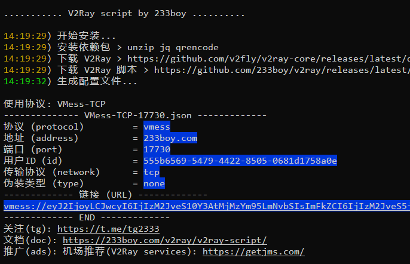
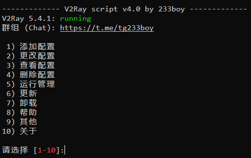

# v2ray搭建教程

---

第一步，首先就是先租一台国外节点的服务器，这个自己解决，常见的国外服务器提供商有[Vultr](https://www.vultr.com/)、[搬瓦工](http://bwg.dzqsy1.top/)等


## 傻瓜式搭建版

### 安装

---

系统支持：Ubuntu，Debian，CentOS，推荐使用 Ubuntu 22，谨慎使用 CentOS，脚本可能无法正常运行！

执行如下指令：

```shell
bash <(wget -qO- -o- https://git.io/v2ray.sh)
```

如果使用的是Centos那么并且防火墙啥的都关了可能存在SELinux的问题，只需要把SELinux关了就行

centos关闭SELinux指令：

```shell
sed -i s#SELINUX=enforcing#SELINUX=disabled# /etc/selinux/config
```



脚本特意弄了一个时间显示，给反馈用来检测安装时间的…

理论上，绝大多数情况下 15 秒内会安装完成，条件允许的情况下仅需一秒即可完成安装！

超过 15 秒的你应该考虑换 VPS 了，推荐使用 [搬瓦工 VPS](https://on.affpass.com/go/bwg)

为方便你快速使用，脚本在安装完成后会自动创建一个 VMess-TCP 配置。

此时你可以复制 URL 到相关软件 (例如 v2rayN) 去测试一下是否正常使用。

如果无法正常使用，请尝试使用 `v2ray add ss` 添加一个 SS 来再测试一下


### 恢复旧配置

---

如果你之前已经安装过本人的 V2Ray 脚本，请在安装完成后，断开 SSH，重新登录 SSH，然后输入 `v2ray`

之后会有旧配置恢复之类的提示，可完美的把之前的旧配置恢复过来。

```
是否恢复旧配置:
1) 删除旧配置
2) 恢复: VLESS_WebSocket_TLS
请选择 [1-2]:
```

但是你必须做出选择，要么恢复旧配置，要么删除旧配置

```
是否删除旧配置? [y]:
```

如果旧配置无法恢复，那么只有删除旧配置选项

其他提醒，如果之前使用的协议为 *TLS，并且使用了 Caddy 自动化完成 TLS，恢复旧配置的时候会连同升级 Caddy 版本到最新版本，并且备份了 `/etc/caddy/Caddyfile` 文件和 `/etc/caddy/sites` 目录

备份名为：`/etc/caddy/Caddyfile.233.bak` 文件和 `/etc/caddy/sites.233.bak` 目录

此备份是为了避免 Caddy 版本过旧，造成配置文件出错，无法启动

如果你曾在 `/etc/caddy/sites` 目录放过自己另外的网站配置，请在恢复旧配置之后，再手动检查 `sites.233.bak` 目录配置的兼容性，然后重新放到 `sites` 目录，之后重启 Caddy 即可，可以使用 `v2ray restart caddy` 重启 Caddy


### 管理面板

---

安装完成后，输入 `v2ray` 就能看到管理面板，如下图片所示



提示，如果你不想执行任何功能，直接按 Enter 回车退出即可。


### 快速入门

---

V2Ray 脚本简化了很多流程，例如我们常用的是 (添加、更改、查看、删除) 配置，以下内容让你可以快速掌握使用

添加配置：

- `v2ray add` -> 添加配置
- `v2ray add ss` -> 添加一个 Shadowsocks 配置
- `v2ray add tcp` -> 添加一个 VMess-TCP 配置
- `v2ray add kcpd` -> 添加一个 VMess-mKCP-dynamic-port 动态端口配置

备注，使用 `v2ray add` 添加配置的时候，仅 *TLS 相关协议配置必须提供域名，其他均可自动化处理。

如需查看更多 add 参数用法，请查看下面的 add 说明

–

更改配置：

- `v2ray change` -> 更改配置
- `v2ray change tcp` -> 更改 TCP 相关配置
- `v2ray change tcp port auto` -> 更改 TCP 相关配置的端口，端口使用自动创建，也可以使用 `v2ray port tcp auto`
- `v2ray change kcp id auto` -> 更改 mKCP 相关配置的 UUID，UUID 使用自动创建，也可以使用 `v2ray id tcp auto`

如需查看更多 change 参数用法，请查看下面的 change 说明

–

查看配置：

- `v2ray info` -> 查看配置
- `v2ray info tcp` -> 查看 TCP 相关配置
- `v2ray info kcp` -> 查看 kcp 相关配置

–

删除配置：

- `v2ray del` -> 删除配置
- `v2ray del kcp` -> 删除 KCP 相关配置
- `v2ray del tcp` -> 删除 TCP 相关配置

**提醒，谨慎使用 del 参数**

–

非常棒！你已经掌握最常用的功能 (添加、更改、查看、删除)

add / change / info / del ： 添加、更改、查看、删除

对于绝大多数用户来说

使用 `v2ray add` 添加配置，使用 `v2ray change` `v2ray info` `v2ray del` 来 (更改、查看、删除) 配置即可。

> 提醒，如果只匹配到一个配置时则自动选择该配置，否则将显示匹配到的配置列表，要求选择其中一个配置

#### add

---

add 参数是用来添加配置的

备注：可选参数中使用 `auto` 代替即是让脚本自动化处理相关参数

用法：`v2ray add [protocol] [args... | auto]`

举例：

- `v2ray add`

- `v2ray add h2`

- `v2ray add ws`

- `v2ray add ss`

- `v2ray add tcp`

- `v2ray add kcpd`

  

提醒，当 `可选参数` 不存在时，即默认为 auto，仅 *TLS 协议配置的域名无法自动处理。

例如，`v2ray add tcp` 等于 `v2ray add tcp auto auto auto`

–

可选参数详细说明如下：

添加一个 Shadowsocks 配置
可选参数：端口，密码，加密方式
用法：`v2ray add ss [port] [password] [method]`
举例：

- `v2ray add ss`
- `v2ray add ss 233 233boy aes-128-gcm` -> 端口使用 233，密码使用 233boy.com，加密方式使用 aes-128-gcm

–

添加一个 Socks 配置
可选参数：端口，密码，加密方式
用法：`v2ray add socks [port] [username] [password]`
举例：

- `v2ray add socks`
- `v2ray add socks 233 233boy 233boy.com` -> 端口使用 233，用户名使用 233boy，密码使用 233boy.com

–

添加一个 VMess-(TCP/mKCP/QUIC) 配置
可选参数：端口，UUID，伪装类型
用法：`v2ray add [tcp | kcp | quic] [port] [uuid] [type]`
举例：

- `v2ray add tcp` -> 添加一个 VMess-TCP 配置
- `v2ray add kcp` -> 添加一个 VMess-mKCP 配置
- `v2ray add quic` -> 添加一个 VMess-QUIC 配置
- `v2ray add tcp 233 auto http` -> 端口使用 233，伪装类型使用 http
- `v2ray add kcp 234 auto dtls` -> 端口使用 234，伪装类型使用 dtls
- `v2ray add quic 235 auto wechat-video` -> 端口使用 235，伪装类型使用 wechat-video

–

添加一个 VMess-(TCP/mKCP/QUIC) 动态端口配置
可选参数：端口，UUID，伪装类型，动态开始端口，动态结束端口
用法：`v2ray add [tcpd | kcpd | quicd] [port] [uuid] [type] [start] [end]`
举例：

- `v2ray add tcpd` -> 添加一个 VMess-TCP 动态端口配置
- `v2ray add kcpd` -> 添加一个 VMess-mKCP 动态端口配置
- `v2ray add quicd` -> 添加一个 VMess-QUIC 动态端口配置
- `v2ray add tcpd 223 auto http 2333 3333` -> 端口使用 233，伪装类型使用 http，动态端口使用 2333-3333
- `v2ray add kcpd auto auto dtls 2333 2444` -> 伪装类型使用 dtls，动态端口 2333-2444
- `v2ray add quicd 456 auto dtls 4567 5678` -> 端口使用 456，伪装类型使用 dtls，动态端口使用 4567-5678

–

添加一个 VMess-(WS/H2/gRPC)-TLS 配置
可选参数：域名，UUID，路径
用法: `v2ray add [ws | h2 | grpc] [host] [uuid] [path]`
举例:

- `v2ray add ws` -> 添加一个 VMess-WS-TLS 配置
- `v2ray add h2` -> 添加一个 VMess-H2-TLS 配置
- `v2ray add grpc` -> 添加一个 VMess-gRPC-TLS 配置
- `v2ray add ws 233boy.com` -> 域名使用 233boy.com
- `v2ray add h2 233boy.com auto /h2` -> 域名使用 233boy.com，路径使用 /h2
- `v2ray add grpc 233boy.com auto /grpc` -> 域名使用 233boy.com，路径使用 /grpc

–

添加一个 VLESS-(WS/H2/gRPC)-TLS 配置
可选参数：域名，UUID，路径
用法: `v2ray add [vws | vh2 | vgrpc] [host] [uuid] [path]`
举例:

- `v2ray add vws` -> 添加一个 VLESS-WS-TLS 配置
- `v2ray add vh2` -> 添加一个 VLESS-H2-TLS 配置
- `v2ray add vgrpc` -> 添加一个 VLESS-gRPC-TLS 配置
- `v2ray add vws 233boy.com` -> 域名使用 233boy.com
- `v2ray add vh2 233boy.com auto /h2` -> 域名使用 233boy.com，路径使用 /h2
- `v2ray add vgrpc 233boy.com auto /grpc` -> 域名使用 233boy.com，路径使用 /grpc

–

添加一个 Trojan-(WS/H2/gRPC)-TLS 配置
可选参数：域名，UUID，路径
用法: `v2ray add [tws | th2 | tgrpc] [host] [uuid] [path]`
举例:

- `v2ray add tws` -> 添加一个 Trojan-WS-TLS 配置
- `v2ray add th2` -> 添加一个 Trojan-H2-TLS 配置
- `v2ray add tgrpc` -> 添加一个 Trojan-gRPC-TLS 配置
- `v2ray add tws 233boy.com` -> 域名使用 233boy.com
- `v2ray add th2 233boy.com auto /h2` -> 域名使用 233boy.com，路径使用 /h2
- `v2ray add tgrpc 233boy.com auto /grpc` -> 域名使用 233boy.com，路径使用 /grpc

–

提醒，`v2ray add [protocol]` 的 `protocol` 也可以换完整的协议名称，名称看上面的支持协议列表

举例，`v2ray add Shadowsocks` 跟 `v2ray add ss` 是一样的，但当然还是用简化的名称吧，简单好记。

再说一遍，当可选参数不存在时默认是自动化处理的 (除了 *TLS 的配置必须提供域名)，如非必要，可以省去使用可选参数的。

所以，绝大多数情况下，只要加上协议即可，举例： `v2ray add tcp`，`v2ray add kcp`，`v2ray add kcpd`

#### no-auto-tls

---

no-auto-tls 参数跟 add 参数用法一样，但禁止自动配置 TLS, 可用于 *TLS 相关协议

用法：`v2ray no-auto-tls [protocol] [args... | auto]`

举例：

- `v2ray no-auto-tls`

- `v2ray no-auto-tls ws`

- `v2ray no-auto-tls vh2 233boy.com`

- `v2ray no-auto-tls tgrpc 233boy.com`

  

提醒，如果你想要手动配置 TLS，请使用此选项，例如你想要用 NGINX 实现 TLS

帮助说明：[V2Ray 脚本 no-auto-tls 参数帮助说明](https://233boy.com/v2ray/no-auto-tls/)

#### [name]

---

试想一虾，如果你当前有 233 个 VMess-TCP 配置的时候，如何快速选择其中一个配置呢

当你有多个配置时，你可以使用 `[name]` 关键词用来匹配相关配置，以便于快速执行 `更改，查看，删除` 等操作

推荐使用 `端口` 或者 `域名` 来匹配，这样更加容易筛选相关配置。

请往下查看会使用到 `[name]` 的举例

> 提醒，如果只匹配到一个配置时则自动选择该配置，否则将显示匹配到的配置列表，要求选择其中一个配置

#### change

---

change 参数是用来更改配置

用法: `v2ray change [name] [option] [args... | auto]`

提醒：不同的配置可提供更改的相关选项是不同的

[option] 名称及选项说明参数如下：

| 名称            | 可选参数      | 用途           | auto |
| --------------- | ------------- | -------------- | ---- |
| dp, dynamicport | [start] [end] | 更改动态端口   | 是   |
| full            | […]           | 更改多个参数   | 其他 |
| id              | [uuid]        | 更改 UUID      | 是   |
| host            | [domain]      | 更改域名       | -    |
| port            | [port]        | 更改端口       | 是   |
| path            | [path]        | 更改路径       | 是   |
| passwd          | [passowrd]    | 更改密码       | 是   |
| type            | [type]        | 更改伪装类型   | 是   |
| method          | [method]      | 更改加密方式   | 是   |
| seed            | [seed]        | 更改 mKCP seed | 是   |
| new             | […]           | 更改协议       | 其他 |
| web             | [domain]      | 更改伪装网站   | -    |

备注，支持 auto 的即是可以将可选参数设置为 auto，以执行自动更改相关参数

如果 auto 为其他，可选参数请参考 add 参数用法，full 类似于 `v2ray add 当前协议 [...]`，new 类似于 `v2ray add [...]`

举例:

- `v2ray change` -> 更改配置
- `v2ray change tcp` -> 更改一个 tcp 相关的配置
- `v2ray change tcp port 233` -> 更改一个 TCP 配置的端口为 233
- `v2ray change tcp port auto` -> 更改一个 TCP 配置的端口，并且端口自动创建
- `v2ray change kcp id auto` -> 更改一个 mKCP 配置的 UUID，并且 UUID 自动创建
- `v2ray change kcp dp auto` -> 更改一个 mKCP 配置的动态端口，并且动态端口自动创建
- `v2ray change kcp dp 233 332` -> 更改一个 mKCP 配置的动态端口为 233-332
- `v2ray change tls host 233boy.com` -> 更改一个 tls 配置的域名为 233boy.com
- `v2ray change tls web example.com` -> 更改一个 tls 配置的伪装网站为 example.com

提醒， [option] 名称也支持直接使用

用法：`v2ray [option] [name] [...]`

举例：

- `v2ray id` -> 更改 UUID
- `v2ray port` -> 更改 端口
- `v2ray port tcp 233` -> 更改一个 tcp 配置的端口为 233
- `v2ray id tcp` -> 更改一个 tcp 配置的 UUID
- `v2ray id tcp auto` -> 更改一个 tcp 配置的 UUID，并且 UUID 自动创建
- `v2ray dp kcp auto` -> 更改一个 mKCP 配置的动态端口，并且动态端口自动创建
- `v2ray dp kcp 233 332` -> 更改一个 mKCP 配置的动态端口为 233-332
- `v2ray host tls 233boy.com` -> 更改一个 tls 配置的域名为 233boy.com
- `v2ray web tls example.com` -> 更改一个 tls 配置的伪装网站为 example.com

> 更改配置的选项较多，就不一个一个举例了，绝大多数情况下使用 `v2ray change` 即可

#### info

---

info 参数是用来查看配置的

用法: `v2ray info [name]`

举例:

- `v2ray info` -> 查看配置
- `v2ray info tcp` -> 查看一个 tcp 配置
- `v2ray info kcp` -> 查看一个 kcp 配置
- `v2ray info tls` -> 查看一个 tls 配置

#### url

---

url 参数是用来生成配置的 URL 链接的

用法: `v2ray url [name]`

举例:

- `v2ray url` -> 查看配置的 URL 链接
- `v2ray url tcp` -> 查看一个 tcp 配置的 URL 链接
- `v2ray url kcp` -> 查看一个 kcp 配置的 URL 链接
- `v2ray url tls` -> 查看一个 tls 配置的 URL 链接

备注，使用 `v2ray info` 也同样会有生成 URL 链接信息的

#### qr

---

qr 参数是用来生成配置的二维码信息的

用法: `v2ray qr [name]`

举例:

- `v2ray qr` -> 查看配置的二维码信息
- `v2ray qr tcp` -> 查看一个 tcp 配置的二维码信息
- `v2ray qr kcp` -> 查看一个 kcp 配置的二维码信息
- `v2ray qr tls` -> 查看一个 tls 配置的二维码信息

#### del

---

del 参数是用来删除配置的

用法: `v2ray del [name]`

举例:

- `v2ray del` -> 删除配置
- `v2ray del tcp` -> 删除一个 tcp 配置
- `v2ray del kcp` -> 删除一个 kcp 配置
- `v2ray del tls` -> 删除一个 tls 配置

> 谨慎使用此选项

#### ddel

---

ddel 参数是用来删除多个配置的

用法: `v2ray ddel [name...]`

举例:

- `v2ray ddel` -> 删除配置
- `v2ray ddel tcp kcp` -> 同时删除一个 tcp，一个 kcp 配置

提醒，此处的 `[name]` 只有匹配到相关配置是唯一时，才会执行删除

例如，假设你当前有两个 tcp 配置，使用 `v2ray ddel tcp` 是不会删除任何文件的

> 谨慎使用此选项

#### gen

---

gen 参数跟 add 参数用法一样，但是 gen 参数只返回 JSON 内容，不会创建配置，仅供测试使用

用法：`v2ray gen [protocol] [args... | auto]`

举例：

- `v2ray gen ss`

- `v2ray gen tcp`

- `v2ray gen kcpd`

- `v2ray gen ws 233boy.com`

  

#### genc

---

genc 参数是用来查看适用客户端 outbounds JSON 的，仅供测试使用

用法：`v2ray genc [name]`

举例：

- `v2ray gen`

- `v2ray gen tcp`

  

提醒，你也可以使用 `v2ray client` ，跟 genc 作用是一样的。

#### bbr

---

bbr 参数是启用 BBR 优化的

使用: `v2ray bbr`

#### bin

---

bin 参数是直接调用 V2Ray 核心运行相关命令，此参数可完全兼容所有 V2Ray 命令

用法：`v2ray bin [...]`

举例：`v2ray bin help`

默认兼容的命令：api, convert, tls, run, uuid

举例：`v2ray uuid`

#### xapi

---

xapi 参数类似 v2ray api, 但 API 后端使用当前运行的 V2Ray 服务

用法：`v2ray xapi [...]`

举例：`v2ray xapi stats`

#### fix-config.json

---

fix-config.json 参数是用来修复 config.json 文件的

使用: `v2ray fix-config.json`

#### update

---

update 参数是用来更新的

用法：`v2ray update [core | sh | caddy] [ver]`

举例:

- `v2ray update` -> 更新核心

- `v2ray update core` -> 更新核心

- `v2ray update core v5.4.1` -> 更新核心，使用 v5.4.1 版本

- `v2ray update sh` -> 更新脚本

- `v2ray update caddy` -> 更新 Caddy

  

#### log

---

log 参数是用来查看 V2Ray 运行的实时日志

使用：`v2ray log`

#### status

---

status 参数是用来查看运行状态的

使用：`v2ray status`

#### start, stop, restart

---

start, stop, restart 参数是用来管理 V2Ray 启动，停止，重启 的

用法：`v2ray [start | stop | restart] [caddy]`

举例：

- `v2ray restart` -> 重启 V2Ray

- `v2ray restart caddy` -> 重启 Caddy

  

#### reinstall

---

reinstall 参数是用来重装脚本的

使用: `v2ray reinstall`

#### uninstall

---

uninstall 参数是用来卸载脚本的

使用：`v2ray uninstall`

### 中转

---

如果你需要使用 A 机器转发流量到 B 机器

那么请看：[V2Ray 脚本中转教程](https://233boy.com/v2ray/v2ray-dokodemo-door/)

### 帮助

---

哎呀，不想写了，其他的一些参数用法，请查看帮助

使用：`v2ray help`

### 目录

---

V2Ray 脚本全部身家保存在 /etc/v2ray

脚本：/etc/v2ray/sh
核心：/etc/v2ray/bin
配置：/etc/v2ray/conf

不要为什么不符合 XXX 规则，因为我更想符合一键删除理念。

### 友情提醒

---

如果你添加了 *TLS 协议的配置，请务必设置伪装网站，使用 `v2ray web tls` 快速设置伪装网站

### 伪装网站

---

伪装网站是一个反代，指的是打开自己域名的时候显示来自伪装网站的内容

### 自动 TLS 说明

---

[V2Ray 脚本自动 TLS 帮助说明](https://233boy.com/v2ray/caddy-auto-tls/)

### 备份脚本


考虑到可能会有不可描述的事情发生，你可以将 V2Ray 脚本备份一下以防止万一。

Github 地址：https://github.com/233boy/v2ray

你可以 Fork 一份，如果本人一键删库跑路了，你也可以照样正常安装使用

安装命令如下：

```
wget https://github.com/233boy/v2ray/archive/master.tar.gz -O v2ray-master.tar.gz;tar -zxvf v2ray-master.tar.gz;cd v2ray-master;chmod +x i*;./i* -l
```


记得要把安装命令中的 `233boy` 更改成你的 Github 用户名


## 带有可视化控制web版本

---

