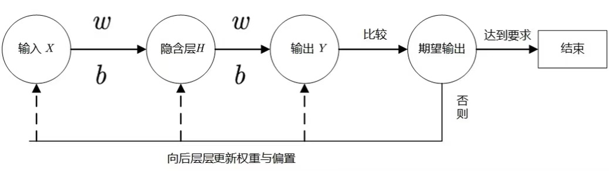
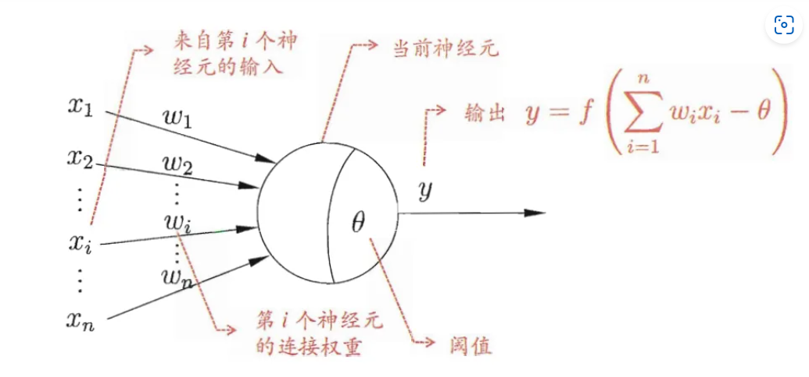
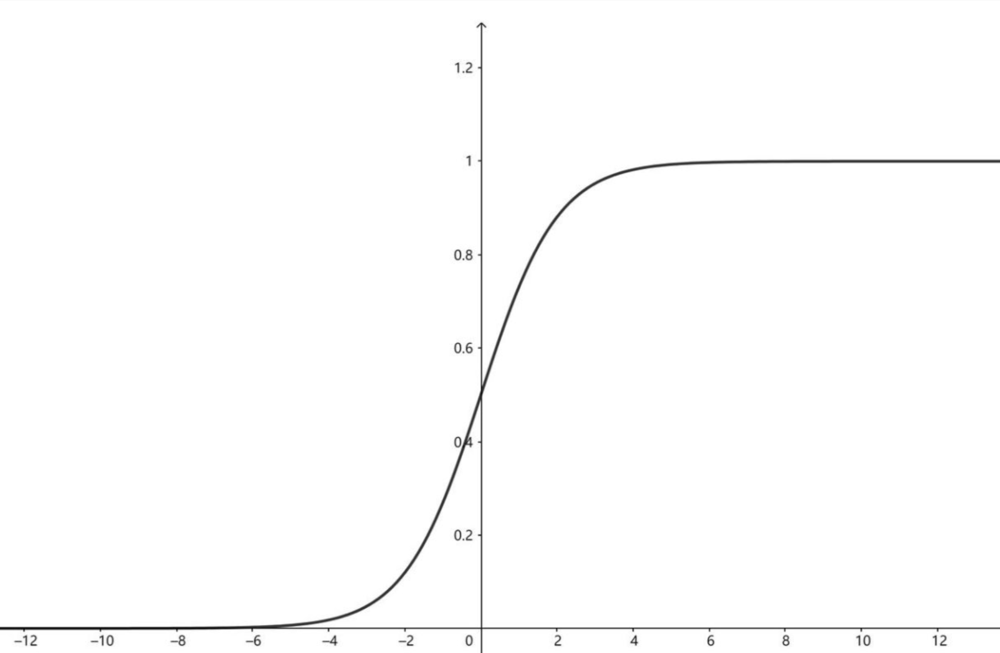
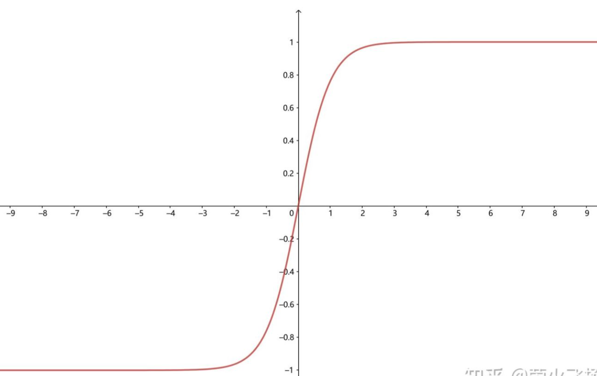
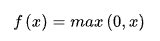
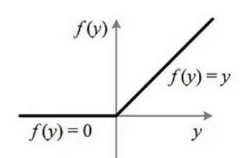
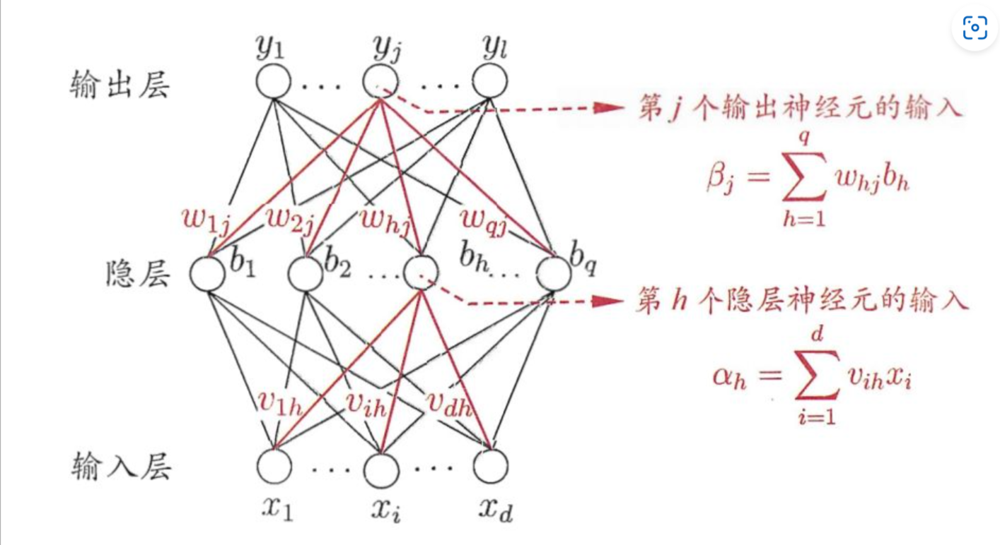

# FCNN神经网络算法

---

## 1 BP神经网络概念

---

首先从名称中可以看出，Bp神经网络可以分为两个部分，bp和神经网络。bp是 Back Propagation 的简写 ，意思是反向传播。

BP网络能学习和存贮大量的输入-输出模式映射关系，而无需事前揭示描述这种映射关系的数学方程。**它的学习规则是使用最速下降法，通过反向传播来不断调整网络的权值和阈值，使网络的误差平方和最小**。

其主要的特点是：**信号是正向传播的，而误差是反向传播的。**

举一个例子，某厂商生产一种产品，投放到市场之后得到了消费者的反馈，根据消费者的反馈，厂商对产品进一步升级，优化，一直循环往复，直到实现最终目的——生产出让消费者更满意的产品。产品投放就是“信号前向传播”，消费者的反馈就是“误差反向传播”。**这就是BP神经网络的核心**。

## 2 算法流程图

---

## 3 神经元模型

---

每个神经元都接受来自其它神经元的输入信号，每个信号都通过一个带有权重的连接传递，神经元把这些信号加起来得到一个总输入值，然后将总输入值与神经元的阈值进行对比（模拟阈值电位），然后通过一个“**激活函数**”处理得到最终的输出（模拟细胞的激活），这个输出又会作为之后神经元的输入一层一层传递下去。

## 4 激活函数

---

引入激活函数的**目的**是在模型中引入非线性。如果没有激活函数（其实相当于激励函数是f(x) = x），那么无论你的神经网络有多少层，最终都是一个线性映射，那么网络的逼近能力就相当有限，单纯的线性映射无法解决线性不可分问题。正因为上面的原因，我们决定引入非线性函数作为激励函数，这样深层神经网络表达能力就更加强大。

### **BP神经网络算法常用的激活函数：**

---

**1）Sigmoid（logistic）**，也称为S型生长曲线，函数在用于分类器时，效果更好。

**2）Tanh函数（双曲正切函数）**，解决了logistic中心不为0的缺点，但依旧有梯度易消失的缺点。

**3）relu函数**是一个通用的激活函数，针对Sigmoid函数和tanh的缺点进行改进的，**目前在大多数情况下使用**。

## 5 神经网络基础架构

---

BP网络由输入层、隐藏层、输出层组成。

输入层：信息的输入端，是读入你输入的数据的

隐藏层：信息的处理端，可以设置这个隐藏层的层数（在这里一层隐藏层，q个神经元）

输出层：信息的输出端，也就是我们要的结果

v，w分别的输入层到隐藏层，隐藏层到输出层的是权重

对于上图的只含一个隐层的神经网络模型：BP神经网络的过程主要分为两个阶段，第一阶段是信号的正向传播，从输入层经过隐含层，最后到达输出层；第二阶段是误差的反向传播，从输出层到隐含层，最后到输入层，依次调节隐含层到输出层的权重和偏置，输入层到隐含层的权重和偏置。

## 6 如何确定隐含层中的神经元个数

---

因为对于隐层的神经元个数的确定目前还没有什么比较完美的解决方案，所以对此经过自己查阅书籍和上网查阅资料，有以下的几种经验方式来确定隐层的神经元的个数，方式分别如下所示：

1. 一般取(输入+输出)/2
2. 隐层一般小于输入层
3. （输入层+1）/2
4. log(输入层)
5. log(输入层)+10

实验得到以第五种的方式得到的测试结果相对较高。

