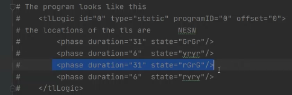

---

---

# SUMO与Python脚本

---


## 一、利用Python启动SUMO

```python
def train():
    # 启动SUMO
    sumo_cmd = ["sumo-gui", "-c", "E:/SUMOProject/study1.sumocfg", "--start"] #这里注意替换为对应你的SUMO项目sumocfg文件路径
    traci.start(sumo_cmd)
    
    traci.close() #关闭仿真，这里close内部可以选填参数，如果为false则是强制关闭，不然会等系统响应完毕后才会关闭
```


## 二、仿真交互


### 控制红绿灯相位

 

```python
traci.trafficlight.setPhase("0",2) #选择相位，也就是选择红绿灯策略，注意是从0开始的
```


### 获取仿真是否有车辆

```python
traci.simulation.getMinExpectedNumber()
```

比如：

```python
def run():
    	traci.trafficlight.setPhase("0",2)
        # while循环，如果没有车辆才结束
        while traci.simulation.getMinExpectedNumber() > 0:
            traci.simulationStep();
        traci.close()
        sys.stdout.flush()
```

