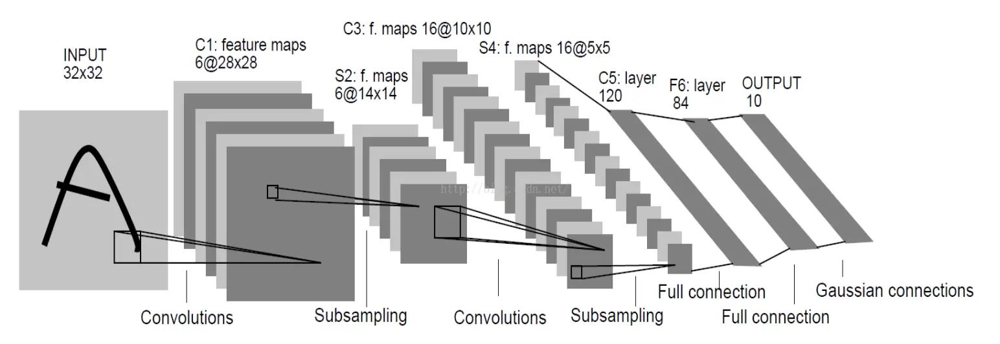
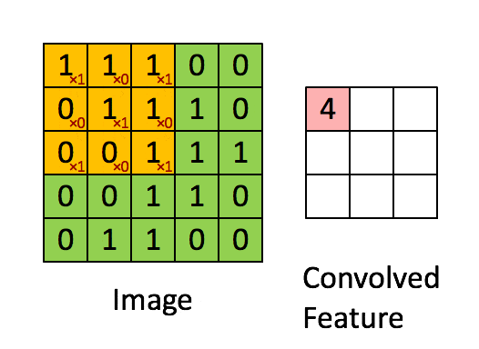
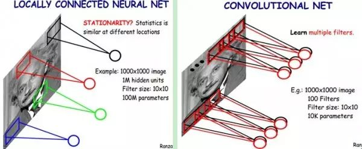
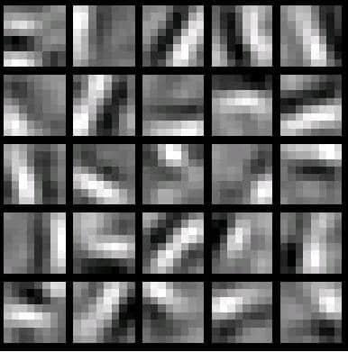

# 卷积神经网络算法

---

## 1、卷积神经网络-CNN 的基本原理

>  卷积神经网络(Convolutional Neural Networks, CNNs)是一种深度学习算法，特别适用于图像处理和分析。其设计灵感来源于生物学中视觉皮层的机制，是一种强大的特征提取和分类工具。

### 1.1、Layers

> 整个CNN是由若干层不同类型的网络连接构成的的。例如下图，首先经过一次卷积滤波处理，得到了C1（卷积层 Feature map），然后又经过了一次下采样（池化）处理得到了S2（下采样层），之后又是一次卷积滤波得到C3卷积层，依次处理至途中的C5位全连接层，至此卷积的过程结束，被抽象的特征输入至传统的全连接神经网络。

#### 1.1.1 输入层（Input Layer）

>  这是网络的最初层，负责接收原始像素数据。每个像素的值都被视为原始特征。

#### 1.1.2 卷积层（Convolutional Layer）

> 在卷积层中，一组可学习的滤波器（卷积核）在输入数据上进行滑动操作以生成特征图（Feature Maps，也就是下图的Convolved Feature）。卷积操作允许网络学习到输入数据的局部特征。此外，由于滤波器（卷积核）的权重在图像的不同部分是共享的，卷积层可以显著减少模型的参数数量，从而减轻过拟合的风险。
>
> 怎么理解权重共享呢？我们可以这100个参数（也就是卷积操作）看成是提取特征的方式，该方式与位置无关。这其中隐含的原理则是：图像的一部分的统计特性与其他部分是一样的。这也意味着我们在这一部分学习的特征也能用在另一部分上，所以对于这个图像上的所有位置，我们都能使用同样的学习特征。

>  卷积层的运算过程如下图，用一个卷积核扫完整张图片：

> ==注：==黄色部分框选部分的下标红色数字代表的是卷积核内的值。

> 这个过程我们可以理解为我们使用一个过滤器（卷积核）来过滤图像的各个小区域，从而得到这些小区域的特征值。
>
> 在具体应用中，往往有多个卷积核，可以认为，每个卷积核代表了一种图像模式，如果某个图像块与此卷积核卷积出的值大，则认为此图像块十分接近于此卷积核。如果我们设计了6个卷积核，可以理解：我们认为这个图像上有6种底层纹理模式，也就是我们用6种基础模式就能描绘出一副图像。

> 以下就是25种不同的卷积核的示例：

#### 1.1.3 ReLU层（Rectified Linear Unit Layer）

> 这是非线性操作层，通常紧跟在卷积层之后。其目的是通过应用非线性函数如ReLU（max(0, x)）来增加网络的非线性特性。

#### 1.1.4 池化层（Pooling Layer）

> 也称作下采样层，其主要功能是降低特征图的空间尺寸，从而降低模型的计算复杂性，并在一定程度上提供模型的平移不变性。常见的池化操作有最大池化(Max Pooling)和平均池化(Average Pooling)。
>
> 当图像太大时，池化层部分将减少参数的数量。空间池化也称为子采样或下采样，可在保留重要信息的同时降低数据维度，可以具有不同的类型，如最大值池化(Max Pooling)，平均池化(Average Pooling)，加和池化(Sum Pooling)。
>
> 最常见的是最大值池化，其将输入的图像划分为若干个矩形区域，对每个子区域输出最大值。这种机制能够有效地原因在于，在发现一个特征之后，它的精确位置远不及它和其他特征的相对位置的关系重要。池化层会不断地减小数据的空间大小，能够在一定程度上控制过拟合。通常来说，CNN的卷积层之间都会周期性地插入池化层。

#### 1.1.5 全连接层（Fully Connected Layer）

> 在一系列的卷积层和池化层之后，全连接层被用于对之前提取的特征进行高级别的推理。在这一层中，所有的输入都被连接到每个神经元，这与传统的神经网络类似。这个部分就是最后一步了，经过卷积层和池化层处理过的数据输入到全连接层，得到最终想要的结果。经过卷积层和池化层降维过的数据，全连接层才能”跑得动”，不然数据量太大，计算成本高，效率低下。

#### 1.1.6 输出层（Output Layer）

> 最后，输出层通常使用softmax激活函数进行多类分类，或使用sigmoid激活函数进行二分类。

### 1.2 反向传播算法推导（Backpropagation）

#### 1.2.1 回顾DNN的反向传播算法

> 我们首先回顾DNN的反向传播算法。在DNN中，我们是首先计算出输出层的$\delta^L$:$$\delta^L = \frac{\partial J(W,b)}{\partial z^L} = \frac{\partial J(W,b)}{\partial a^L}\odot \sigma{'}(zL)$$
>
> 　　利用数学归纳法，用$\delta^l+1$的值一步步的向前求出第l层的$\delta^l$，表达式为：$$\delta^{l} = (\frac{\partial z^{l+1}}{\partial z{l}})T\delta^{l+1} = (W{l+1})T\delta^{l+1}\odot \sigma{'}(zl)$$
>
> 　　有了$\delta ^l$的表达式，从而求出$W,b$的梯度表达式：$$\frac{\partial J(W,b)}{\partial W^l} = \delta{l}(a)^T\frac{\partial J(W,b,x,y)}{\partial b^l} = = \delta^{l}$$
>
> 　　有了$W,b$梯度表达式，就可以用梯度下降法来优化$W,b$,求出最终的所有$W,b$的值。
>
> 　　现在我们想把同样的思想用到CNN中，很明显，CNN有些不同的地方，不能直接去套用DNN的反向传播算法的公式。

#### 1.2.2 CNN的反向传播算法思想

> 要套用DNN的反向传播算法到CNN，有几个问题需要解决：
>
> 　　1）池化层没有激活函数，这个问题倒比较好解决，我们可以令池化层的激活函数为$\sigma(z)=z$，即激活后就是自己本身。这样池化层激活函数的导数为1.
>
> 　　2）池化层在前向传播的时候，对输入进行了压缩，那么我们现在需要向前反向推导$\delta ^{l−1}$，这个推导方法和DNN完全不同。
>
>       3）卷积层是通过张量卷积，或者说若干个矩阵卷积求和而得的当前层的输出，这和DNN很不相同，DNN的全连接层是直接进行矩阵乘法得到当前层的输出。这样在卷积层反向传播的时候，上一层的$\delta  ^{l−1}$递推计算方法肯定有所不同。
>
> 　　4）对于卷积层，由于$W$使用的运算是卷积，那么从$\delta ^l$推导出该层的所有卷积核的$W,b$的方式也不同。
>
> 　　从上面可以看出，问题1比较好解决，但是问题2,3,4就需要好好的动一番脑筋了，而问题2,3,4也是解决CNN反向传播算法的关键所在。另外大家要注意到的是，DNN中的$a_l,c_l$都只是一个向量，而我们CNN中的$a_l,z_l$都是一个张量，这个张量是三维的，即由若干个输入的子矩阵组成。
>
> 　　下面我们就针对问题2,3,4来一步步研究CNN的反向传播算法。
>
> 　　在研究过程中，需要注意的是，由于卷积层可以有多个卷积核，各个卷积核的处理方法是完全相同且独立的，为了简化算法公式的复杂度，我们下面提到卷积核都是卷积层中若干卷积核中的一个。

#### 1.2.3 已知池化层的$\delta ^l$，推导上一隐藏层的$\delta ^{l-1}$

> 我们首先解决上面的问题2，如果已知池化层的$\delta ^l$，推导出上一隐藏层的$\delta ^{l−1}$。
>
> 　　在前向传播算法时，池化层一般我们会用MAX或者Average对输入进行池化，池化的区域大小已知。现在我们反过来，要从缩小后的误差$\delta ^l$，还原前一次较大区域对应的误差。
>
> 　　在反向传播时，我们首先会把$\delta ^l$的所有子矩阵矩阵大小还原成池化之前的大小，然后如果是MAX，则把$\delta ^l$的所有子矩阵的各个池化局域的值放在之前做前向传播算法得到最大值的位置。如果是Average，则把$\delta ^l$的所有子矩阵的各个池化局域的值取平均后放在还原后的子矩阵位置。这个过程一般叫做upsample。
>
> 　　用一个例子可以很方便的表示：假设我们的池化区域大小是2x2。$\delta ^l$的第k个子矩阵为:
>
> $\delta ^l _k = \begin{pmatrix} 2&8 \\ 4&6\end{pmatrix}$
>
> 由于池化区域为2x2，我们先讲$\delta ^l _k$做还原，即变成：
>
> $\begin{pmatrix} 0&0&0&0 \\ 0&2&8&0 \\ 0&4&6&0 \\ 0&0&0&0 \end{pmatrix}$
>
> 如果是MAX，假设我们之前在前向传播时记录的最大值位置分别是左上，右下，右上，左下，则转换后的矩阵为：
>
> $\begin{pmatrix} 2&0&0&0 \\ 0&0&0&8 \\ 0 &4&0&0 \\ 0&0&6&0 \end{pmatrix}$
>
> 如果是Average，则进行平均：转换后的矩阵为：
>
> $\begin{pmatrix} 0.5&0.5&2&2 \\ 0.5&0.5&2&2 \\ 1&1&1.5&1.5 \\ 1&1&1.5&1.5 \end{pmatrix}$
>
> 这样我们就得到了上一层 $\frac{\partial J(W,b)}{\partial a_k^{l-1}} 的值，要得到\delta_k^{l-1}：\delta_k^{l-1}=({\partial a^{l-1} _k \over \partial z ^{l-1} _k})^T{\partial J(W,b) \over \partial a^{l-1} _k} = upsample(\delta^l _k) \bigodot \sigma^{'} (z^{l-1} _k)$
>
> 其中，upsample函数完成了池化误差矩阵放大与误差重新分配的逻辑。
>
> 我们概括下，对于张量$\delta ^{l−1}$，我们有：$\delta^{l-1} = upsample(\delta^l) \odot \sigma{'}(z)$

#### 1.2.4 已知卷积层的$\delta ^l$，推导上一隐藏层的$\delta ^{l-1}$

> 对于卷积层的反向传播，我们首先回忆下卷积层的前向传播公式：$ a^l= \sigma(z^l) = \sigma(a^{l-1}*W^l +b^l) $
>
> 　　其中$n\_in$为上一隐藏层的输入子矩阵个数。
>
> 　　在DNN中，我们知道$\delta ^{l-1}$和$\delta ^l$的递推关系为：$\delta^{l} = \frac{\partial J(W,b)}{\partial z^l} =(\frac{\partial z^{l+1}}{\partial z{l}})T \frac{\partial J(W,b)}{\partial z^{l+1}} =(\frac{\partial z^{l+1}}{\partial z{l}})T\delta^{l+1}$
>
> 　　因此要推导出$\delta ^{l-1}$和$\delta ^l$的递推关系，必须计算${\partial z^l \over \partial z^{l-1}}$的梯度表达式。
>
> 　　注意到$z^l$和$z^{l-1}$的关系为：$z^l = a{l-1}*Wl +b^l =\sigma(z^{l-1})*W^l +b^l $
>
> 　　因此我们有：$\delta^{l-1} = (\frac{\partial z^{l}}{\partial z{l-1}})T\delta^{l} = \delta^{l}*rot180(W) \odot \sigma{'}(z) $
>
> 　　这里的式子其实和DNN的类似，区别在于对于含有卷积的式子求导时，卷积核被旋转了180度。即式子中的$rot180()$，翻转180度的意思是上下翻转一次，接着左右翻转一次。在DNN中这里只是矩阵的转置。那么为什么呢？由于这里都是张量，直接推演参数太多了。我们以一个简单的例子说明为啥这里求导后卷积核要翻转。
>
> 　　假设我们$l−1$层的输出$a^{l−1}$是一个3x3矩阵，第$l$层的卷积核$W^l$是一个2x2矩阵，采用1像素的步幅，则输出$z^l$是一个2x2的矩阵。我们简化$b^l$都是0,则有$a^{l-1}*W^l = z^{l}$
>
> 　　我们列出$a,W,z$的矩阵表达式如下：
>
> $\begin{pmatrix} a_{11} & a_{12} & a_{13} \\ a_{21} & a_{22} & a_{23} \\ a_{31}&a_{32}&a_{33} \end{pmatrix} * \begin{pmatrix} w_{11}&w_{12} \\ w_{21}&w_{22}\end{pmatrix}= \begin{pmatrix}  z_{11}&z_{12} \\ z_{21}&z_{22}\end{pmatrix}$
>
> 　利用卷积的定义，很容易得出：
>
> $z_{11}=a_{11}w_{11}+a_{12}w_{12}+a_{21}w_{21}+a_{22}w_{22} \\  z_{12}=a_{12}w_{11}+a_{13}w_{12}+a_{22}w_{21}+a_{23}w_{22} \\ z_{22}=a_{22}w_{11}+a_{23}w_{12}+a_{32}w_{21}+a_{33}w_{22}$
>
> 接着我们模拟反向求导：$\nabla a^{l-1} = \frac{\partial J(W,b)}{\partial a^{l-1}} = ( \frac{\partial z^{l}}{\partial a^{l-1}})T\frac{\partial J(W,b)}{\partial z^{l}} =(\frac{\partial z^{l}}{\partial a^{l-1}})T \delta^{l} $
>
> 　　从上式可以看出，对于$a^{l−1}$的梯度误差$∇a^{l−1}$，等于第$l$层的梯度误差乘以${\partial z^l \over \partial a^{l-1}}$,而${\partial z^l \over \partial  a^{l−1}}$对应上面的例子中相关联的$w$的值。假设我们的$z$矩阵对应的反向传播误差是$\delta _{11},\delta _{12},\delta _{21},\delta _{22}$组成的2x2矩阵，则利用上面梯度的式子和4个等式，我们可以分别写出$∇a^{l−1}$的9个标量的梯度。
>
> 　　比如对于$a_{11}$的梯度，由于在4个等式中$a_{12}$只和$z_{11}$有乘积关系，从而我们有：
>
> ​		$\nabla a_{12} = \delta_{11}w_{12} + \delta_{12}w_{11}$
>
>    同样的道理我们得到：
>
> $\nabla a_{13} = \delta_{12}w_{12} \\ \nabla a_{21} = \delta_{11}w_{21} + \delta_{21}w_{11} \\ \nabla a_{22} = \delta_{11}w_{22} + \delta_{12}w_{21} + \delta_{21}w_{12} + \delta_{22}w_{11} \\ \nabla a_{23} = \delta_{12}w_{22} + \delta_{22}w_{12} \\ \nabla a_{31} = \delta_{21}w_{21} \\ \nabla a_{32} = \delta_{21}w_{22} + \delta_{22}w_{21} \\ \nabla a_{33} = \delta_{22}w_{22}$
>
>    这上面9个式子其实可以用一个矩阵卷积的形式表示，即：
>
> $\left( \begin{array}{ccc} 0&0&0&0 \\ 0&\delta_{11}& \delta_{12}&0 \\ 0&\delta_{21}&\delta_{22}&0 \\ 0&0&0&0 \end{array} \right) * \left( \begin{array}{ccc} w_{22}&w_{21}\\ w_{12}&w_{11}\end{array}\right)  = \left( \begin{array}{ccc}\nabla a_{11}&\nabla a_{12}&\nabla a_{13} \\ \nabla a_{21}& \nabla a_{22}&\nabla a_{23} \\ \nabla a_{31}&\nabla a_{32}&\nabla a_{33} \end{array} \right)$
>
>  为了符合梯度计算，我们在误差矩阵周围填充了一圈0，此时我们将卷积核翻转后和反向传播的梯度误差进行卷积，就得到了前一次的梯度误差。这个例子直观的介绍了为什么对含有卷积的式子反向传播时，卷积核要翻转180度的原因。

#### 1.2.5. 已知卷积层的$\delta ^l$，推导该层的$W,b$的梯度

> 　好了，我们现在已经可以递推出每一层的梯度误差$\delta ^l$了，对于全连接层，可以按DNN的反向传播算法求该层$W,b$的梯度，而池化层并没有$W,b$,也不用求$W,b$的梯度。只有卷积层的$W,b$需要求出。
>
> 　　注意到卷积层$z$和$W,b$的关系为：$z^l = a^{l-1}*W^l +b$
>
> 　　因此我们有：$\frac{\partial J(W,b)}{\partial W^{l}}=a *\delta^l$
>
> 　　注意到此时卷积核并没有反转，主要是此时是层内的求导，而不是反向传播到上一层的求导。具体过程我们可以分析一下。
>
> 　　和第4节一样的一个简化的例子，这里输入是矩阵，不是张量，那么对于第l层，某个个卷积核矩阵W的导数可以表示如下：$\frac{\partial J(W,b)}{\partial W_{pq}^{l}} = \sum\limits_i\sum\limits_j(\delta_{ij} ^la_{i+p-1,j+q-1})$
>
> 　　假设我们输入$a$是4x4的矩阵，卷积核$W$是3x3的矩阵，输出$z$是2x2的矩阵,那么反向传播的$z$的梯度误差$\delta$也是2x2的矩阵。
>
> 　　那么根据上面的式子，我们有：
>
> $\frac{\partial J(W,b)}{\partial W_{11}^{l}} = a_{11}\delta_{11} + a_{12}\delta_{12} + a_{21}\delta_{21} + a_{22}\delta_{22}$
>
> $\frac{\partial J(W,b)}{\partial W_{12}^{l}} = a_{12}\delta_{11} + a_{13}\delta_{12} + a_{22}\delta_{21} + a_{23}\delta_{22}$
>
> $\frac{\partial J(W,b)}{\partial W_{13}^{l}} = a_{13}\delta_{11} + a_{14}\delta_{12} + a_{23}\delta_{21} + a_{24}\delta_{22}$
>
> $\frac{\partial J(W,b)}{\partial W_{21}^{l}} = a_{21}\delta_{11} + a_{22}\delta_{12} + a_{31}\delta_{21} + a_{32}\delta_{22}$
>
> 最终我们可以一共得到9个式子。整理成矩阵形式后可得：
>
> $\frac{\partial J(W,b)}{\partial W^{l}} =\left( \begin{array}{ccc} a_{11}&a_{12}&a_{13}&a_{14} \\ a_{21}&a_{22}&a_{23}&a_{24} \\ a_{31}&a_{32}&a_{33}&a_{34} \\
> a_{41}&a_{42}&a_{43}&a_{44} \end{array} \right) * \left( \begin{array}{ccc}
> \delta_{11}& \delta_{12} \\ \delta_{21}&\delta_{22} \end{array} \right)$
>
> 从而可以清楚的看到这次我们为什么没有反转的原因。
>
> 　　而对于b,则稍微有些特殊，因为$\delta ^l$是高维张量，而$b$只是一个向量，不能像DNN那样直接和$\delta ^l$相等。通常的做法是将$\delta ^l$的各个子矩阵的项分别求和，得到一个误差向量，即为$b$的梯度：
>
> $\frac{\partial J(W,b)}{\partial b^{l}} = \sum\limits_{u,v}(\delta^l)_{u,v}$

> 参考文档： [C++ 手搓 CNN 卷积神经网络 - 缙云山车神 - 博客园 (cnblogs.com)](https://www.cnblogs.com/xoslh/p/17421847.html)
