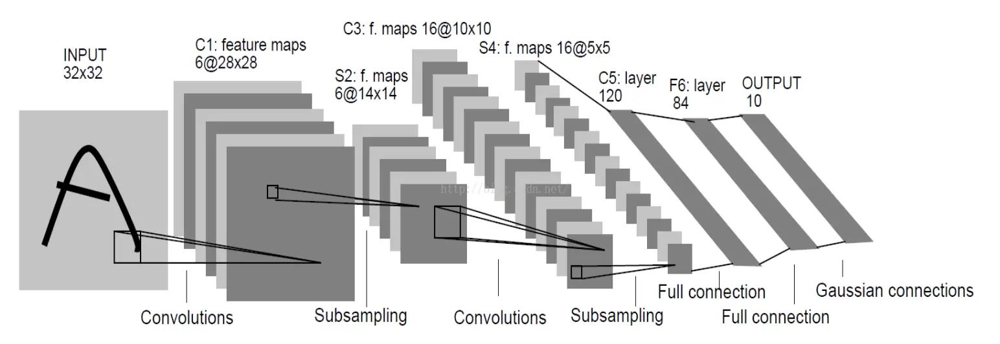
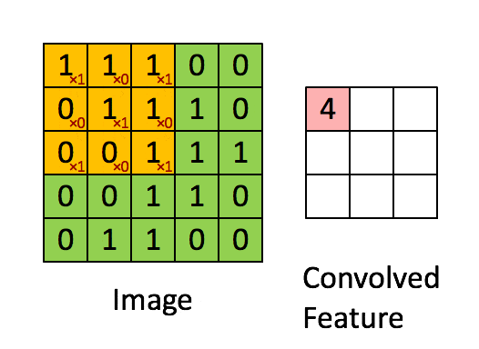

# 卷积神经网络算法

---

## 1、卷积神经网络-CNN 的基本原理

>  卷积神经网络(Convolutional Neural Networks, CNNs)是一种深度学习算法，特别适用于图像处理和分析。其设计灵感来源于生物学中视觉皮层的机制，是一种强大的特征提取和分类工具。

### 1.1、Layers

> 整个CNN是由若干层不同类型的网络连接构成的的。例如下图，首先经过一次卷积滤波处理，得到了C1（卷积层 Feature map），然后又经过了一次下采样（池化）处理得到了S2（下采样层），之后又是一次卷积滤波得到C3卷积层，依次处理至途中的C5位全连接层，至此卷积的过程结束，被抽象的特征输入至传统的全连接神经网络。

#### 1.1.1 输入层（Input Layer）

>  这是网络的最初层，负责接收原始像素数据。每个像素的值都被视为原始特征。

#### 1.1.2 卷积层（Convolutional Layer）

> 在卷积层中，一组可学习的滤波器（卷积核）在输入数据上进行滑动操作以生成特征图（Feature Maps，也就是下图的Convolved Feature）。卷积操作允许网络学习到输入数据的局部特征。此外，由于滤波器（卷积核）的权重在图像的不同部分是共享的，卷积层可以显著减少模型的参数数量，从而减轻过拟合的风险。
>
> 怎么理解权重共享呢？我们可以这100个参数（也就是卷积操作）看成是提取特征的方式，该方式与位置无关。这其中隐含的原理则是：图像的一部分的统计特性与其他部分是一样的。这也意味着我们在这一部分学习的特征也能用在另一部分上，所以对于这个图像上的所有位置，我们都能使用同样的学习特征。

>  卷积层的运算过程如下图，用一个卷积核扫完整张图片：

> ==注：==黄色部分框选部分的下标红色数字代表的是卷积核内的值。