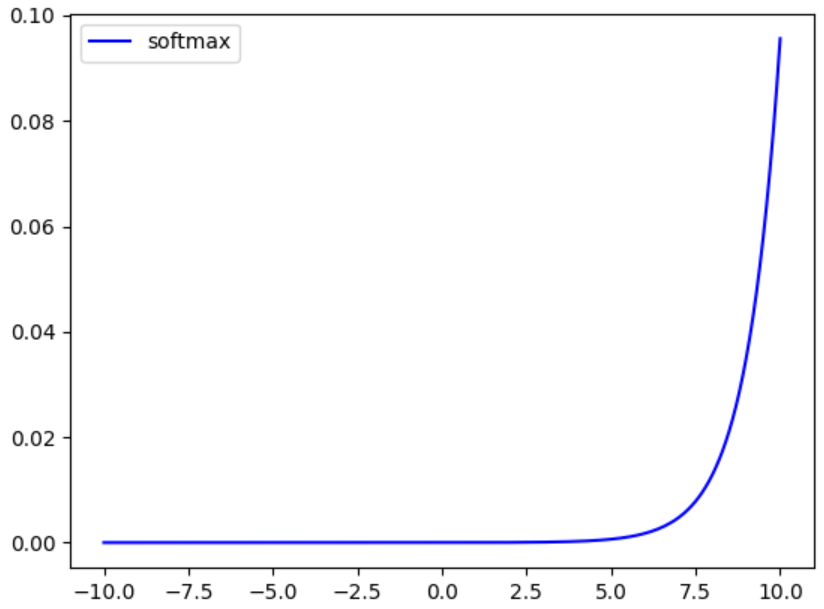
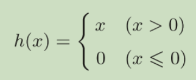
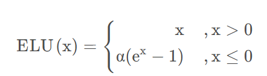

# 常见激活函数

---



> sigmoid: $$\sigma (x) =  {1 \over 1+ e^{-x}}$$





> $$Softmax(z_i) = {e^{z_j} \over {\sum_{j}e^{z_j}} }$$





> tanh: $$tanh(x)={sinh x \over cosh x} = {{e^x-e^{-x}} \over {e^x + e^{-x}}}$$
>
> 





> ReLu: $$max(0,x)$$
>
> 





> Leaky ReLu: $$max(0.1x,x)$$





> Maxout: $$max(w^T_1 x + b1, w^T _2 x + b2)$$



> ELU: 
>
> 说明：ELU不会有`梯度消失`的困扰
>
> 与 `Leaky-ReLU` 和 `PReLU` 类似，与 `ReLU` 不同的是，`ELU` 没有神经元死亡的问题(ReLU Dying 问题是指当出现异常输入时，在反向传播中会产生大的梯度，这种大的梯度会导致神经元死亡和梯度消失)。 它已被证明优于 ReLU 及其变体，如 Leaky-ReLU(LReLU) 和 Parameterized-ReLU(PReLU)。 与 ReLU 及其变体相比，使用 ELU 可在神经网络中缩短训练时间并提高准确度。
>
> 