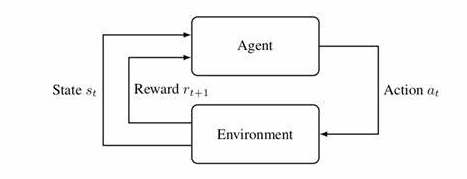
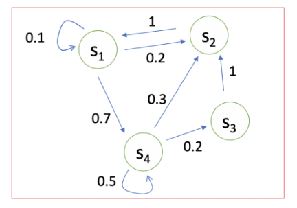
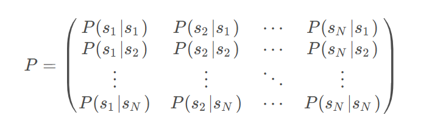
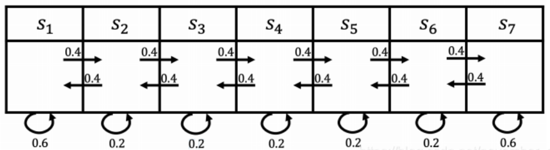

# 强化学习-马尔科夫决策过程（MDP）

---

1、强化学习介绍

* 强化学习任务通常使用马尔科夫决策过程（Markov Decision Process，简称MDP）来描述，具体而言：机器处在一个环境中，每个状态为机器对当前环境的感知；机器只能通过动作来影响环境，当机器执行一个动作后，会使得环境按某种概率转移到另一个状态；同时，环境会根据潜在的奖励函数反馈给机器一个奖赏。综合而言，强化学习主要包含四个要素：状态、动作、转移概率以及奖赏函数。

根据上图，agent（智能体）在进行某个任务时，首先与environment进行交互，产生新的状态state，同时环境给出奖励reward，如此循环下去，agent和environment不断交互产生更多新的数据。强化学习算法就是通过一系列动作策略与环境交互，产生新的数据，再利用新的数据去修改自身的动作策略，经过数次迭代后，agent就会学习到完成任务所需要的动作策略。

2、马尔科夫决策过程（Markov Process）

 **马尔可夫性**当前状态包含了对未来预测所需要的有用信息，过去信息对未来预测不重要，该就满足了马尔科夫性，严格来说，就是某一状态信息包含了所有相关的历史，只要当前状态可知，所有的历史信息都不再需要，当前状态就可以决定未来，则认为该状态具有马尔科夫性。用公式描述为：

$$P(S_{t+1}|S_t)=p(S_{t+1}|S_1,S_2,···,S_t)$$

**马尔科夫过程**又叫做马尔科夫链`（Markov Chain）`,它是一个无记忆的随机过程，可以用一个元组`<S, P>`表示，其中

* S 是有限数量的状态集$S={s_1,s_2,s_3,\cdots,s_t}$
* P 是状态转移概率矩阵$p(S_{t+1}=s'|s_t=s)$其中$s'$表示下一时刻的状态，s表示当前状态如下所示：对于状态$s_1$来说，有0.1的概率保持不变，有0.2的概率转移到$s_2$状态，有0.7的概率转移到$s_4$状态。

可以使用矩阵来表示：

3、马尔科夫奖励过程（Markov Reward Process）

3.1、概念介绍

**马尔科夫奖励过程**是在马尔科夫过程基础上增加了奖励函数R和衰减系数$\gamma$，用$< S,R,P,\gamma >$表示

* R：表示S状态下某一时刻的状态$S_t$在下一个时刻(t+1)能获得的奖励的期望

$R_s = E[R_{t+1}|S_t =s]$

* $G_t$： **收获**$G_t$为在一个马尔科夫奖励链上从t时刻开始往后所有的奖励的衰减收益总和

$G_t = R_{t+1}+\gamma R_{t+2}+ \gamma ^2 R_{t+3} + ···+\gamma ^{T-t-1}R_T$

* $\gamma$：折扣因子$（Discount factory \gamma \in [0,1]）$
 * 1、为了避免出现状态循环的情况
 * 2、系统对于将来的预测并不一定都是准确的，所以要打折扣
 * 很显然$\gamma$越靠近1，考虑的利益越长远。
* $V(s)$:**状态价值函数（state value function**表示从改状态开始的马尔科夫链收获$G_t$的期望

$v(s)=E[G_t|S_t =s]$

例子：对于如下状态，设定进入$S_1$状态奖励为5，进入$S_7$状态奖励为10，其余状态奖励为0。则R可以如下表示：$R=[5,0,0,0,0,0,10]$,折扣引子$\gamma$为0.5。则对于下面两个马尔科夫过程获得的奖励为：

* $S_4,S_5,S_6,S_7: 0+0.5*0+0.5*0+0.125*10=1.25$
* $S_4,S_3,S_2,S_1: 0+0.5*0+0.25*0+0.125*5=0.625$

3.2、Bellman Equation 贝尔曼方程

$v(s) = E[G_t|S_t=s]$

$= E[R_{t+1}+ \gamma R_{t+2}+\gamma ^2 R_{t+3}+···|S_t=s]$

$= E[R_{t+1}+ \gamma (R_{t+2} + \gamma R_{t+3}+···)|S_t=s]$

$= E[R_{t+1}+ \gamma v(S_{t+1})|S_t=s]$

$=E[R_{t+1}|S_t=s]+ \gamma E[v(S_{t+1})|S_t=s]$

其中$E[R_{t+1}|S_t=s]]$代表的当前奖励函数，$\gamma E[v(S_{t+1})|S_t=s$为下一时刻状态的价值期望

使用贝尔曼方程状态价值V可以表示为：

$V(s)= R(s) + \gamma \sum _{s' \in S}P(s'|s)V(s')$

其中$R(s)为Immediate reward，\gamma \sum _{s' \in S}P(s'|s)V(s')为Discounted sum of future reward$

> S 表示下一时刻的所有状态， $s'$表示下一时刻可能的状态

通过贝尔曼方程，可以看到价值函数$v(s)$