# Hadoop使用

---

## Hadoop介绍

* 狭义上Hadoop指的是Apache软件基金会的一款开源软件。

  用Java语言实现，开源

  允许用户使用简单的编程模型实现跨机器集群对海量数据进行分布式计算处理

* Hadoop核心组件

  Hadoop HDFS（分布式文件存储系统）：解决海量数据存储

  Hadoop YARN（集群资源管理和人物调度框架）：解决资源任务调度

  Hadoop MapReduce（分布式计算框架）：解决海量数据计算

* 广义上Hadoop指的是围绕Hadoop打造的大数据生态圈。

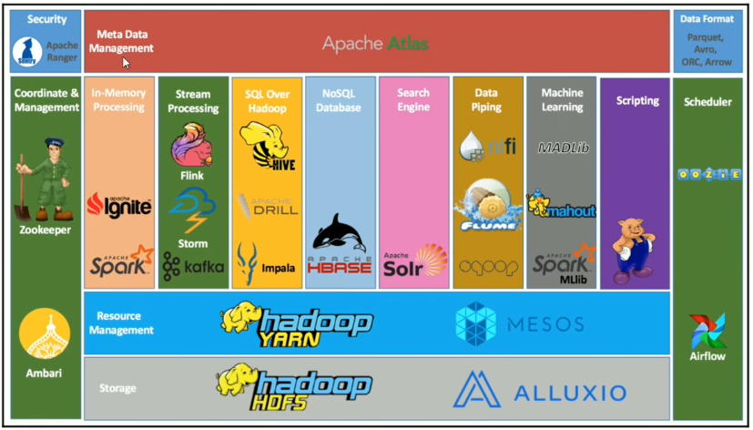

## Hadoop发展史

* Hadoop之父：Doug Cutting

* Hadoop起源于Apache Lucene子项目：Nutch

  Nutch的设计目标是构建一个大型的全网搜索引擎。

  遇到瓶颈：如何解决数十亿网页的存储和索引问题

* Google三篇论文

  《The Google file system》：谷歌分布式文件系统GFS

  《MAPReduce：Simplified Data Processing on Large Clusters》：谷歌分布式计算框架MapReduce

  《Bigtable：A Distributed Storage System for Structured Data》：谷歌结构化数据存储系统

## Hadoop现状

* HDFS作为分布式文件存储系统，处在生态圈的底层与核心地位；
* YARN作为分布式通用的集群资源管理系统和任务调度平台，支撑各种计算引擎计算引擎运行，保证了Hadoop地位；
* MapReduce作为大数据生态圈第一代分布式计算引擎，由于自身设计的模型所产生的弊端，导致企业一线几乎不再直接使用MapReduce进行编程处理，但是很多软件的底层依然在使用MapReduce引擎来处理数据。

* 狭义上Hadoop指软件，广义上Hadoop指生态圈


## Hadoop特性优点

* 扩容能力：Hadoop实在可用的计算机集群间分配数据并完成计算任务的，这些集群可方便灵活的方式扩展到数以千计的节点。
* 低成本：Hadoop集群允许通过部署普通廉价的机器组成集群来处理大数据，以至于成本很低。看重的是集群整体能力。
* 高效率：通过高并发数据，hadoop可以在节点间动态并行的移动数据，使得速度非常快。
* 可靠性：能自动维护数据的多份复制，并且在任务失败后能自动地重新部署（redeploy）计算任务。所以Hadoop的按位存储和处理数据的能力值得人们信赖。


## Hadoop国内应用

* 百度

  用户搜索表征的需求数据、阿拉丁爬虫数据存储数据分析和挖掘 竞价排名

* 阿里巴巴

  为啥电子商务网络平台提供底层的基础计算和存储服务交易数据、信用数据

* 腾讯

  用户关系数据

  基于Hadoop、Hive构建TDW（腾讯分布式数据仓库）

* 华为

  对Hadoop的HA方案，以及HBase领域有深入研究


## Hadoop发行版本

* 开源社区版：Apache开源社区发行也是`官方发行版本`

  优点：更新迭代快

  缺点：兼容稳定性不周

* 商业发行版：

  商业公司发行基于Apache开源协议，某些服务需要收费

  优点：稳定兼容好

  缺点：收费 版本更新慢

* Apache开源社区版本

  http://hadoop.apache.org/

* 商业发行版本

  Cloudera：https://www.cloudera.com/products/open-source/apache-hadoop.html

  Hortonworks：https://www.cloudera.com/products/hdp.html

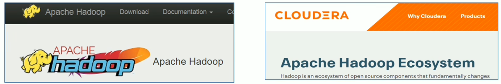


## Hadoop架构变迁（1.0-2.0变迁）

* Hadoop 1.0

  HDFS（分布式文件存储）

  MapReduce（资源管理和分布式数据处理）

* Hadoop 2.0

  HDFS（分布式文件存储）

  MapReduce（分布式数据处理）

  YARN（集群资源管理、任务调度）

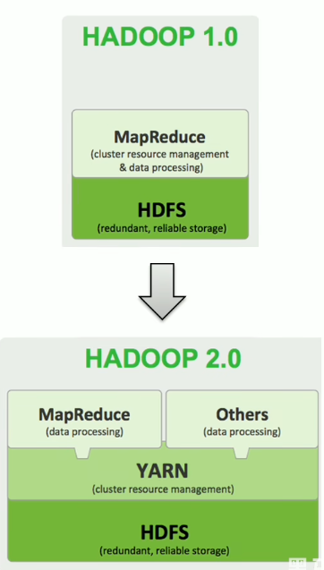

## Hadoop架构变迁（3.0新版本）

Hadoop3.0架构组件和Hadoop 2.0类似，3.0着重于性能优化。

* 通用方面

  精简内核、类路径隔离、shell脚本重构

* Hadoop HDFS

  EC纠删码、多NameNode支持

* Hadoop MapReduce

  任务本地化优化、内存参数自动推断

* Hadoop YARN

  Timeline Service V2、队列配置

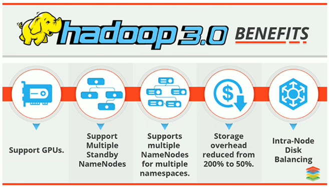

## Hadoop集群整体概述

* Hadoop集群包括两个集群：HDFS集群、YARN集群

* 两个集群`逻辑上分离、通常物理上在一起`

* 两个集群都是标准的`主从架构`集群

* HDFS集群（分布式存储）：

  主角色：NameNode

  从角色：DataNode

  主角色辅助角色：SecondaryNameNode

* YARN集群（资源管理、调度）：

  主角色：ResourceManager

  从角色：NodeManager

* 逻辑上分离

  两个集群互相之间没有依赖、互不影响

* 物理上在一起

  某些角色进程往往部署在同一台物理服务器上

* MapReduce集群呢？

  MapReduce是计算框架、代码层面的组件 没有集群之说

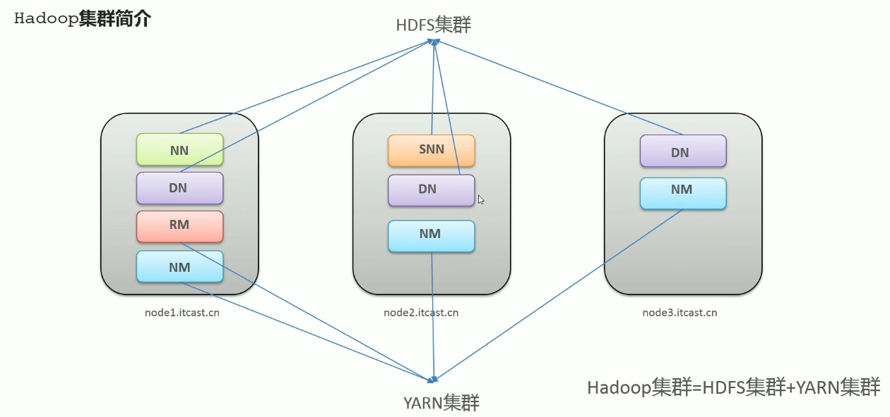

## Hadoop安装包目录结构

* `bin`：Hadoop最基本的管理脚本和使用脚本的目录，这些脚本是sbin目录下管理脚本的基础实现，用户可以直接使用这些脚本管理和使用Hadoop
* `etc`：Hadoop配置文件所在的目录
* include：对外提供的编程库头文件（具体动态库和静态库在lib目录中），这些头文件均是用C++定义的，通常用于C++程序访问HDFS或者编写MapReduce程序。
* lib：改目录包含了Hadoop对外提供的编程动态库和静态库，与include目录中的头文件结合使用。
* libexec：各个服务对用的shell配置文件所在的目录，可用于配置日志输出、启动参数（比如JVM参数）等基本信息。
* `sbin`：Hadoop管理脚本所在的目录，主要包含HDFS和YARN中各类服务的`启动/关闭脚本`。
* `share`：Hadoop各个模块编译后的`jar包所在`的目录，`官方自带示例`。


## 配置文件概述

* 官方文档：https://hadoop.apache.org/docs/r3.3.0/

* 第一类1个：hadoop-env.sh

* 第二类4个：

  xxxx-site.xml，site表示的是用户自定义的配置，会覆盖default中的默认配置。

  core-site.xml，核心模块配置

  hdfs-site.xml，hdfs文件系统模块配置

  mapred-site.xml，MapReduce模块配置

  yarn-site.xml，yarn模块配置

* 第三类1个：workers

* 所有的配置文件目录：/export/server/hadoop-3.3.0/etc/hadoop

* 修改配置文件（配置文件路径hadoop-3.3.0/etc/hadoop）

  * hadoop-env.sh

    ```shell
    export JAVA_HOME=/export/server/jdk1.8.0.241 #配置Java环境在哪
    export HDFS_NAMENODE_USER=root #NAMENODE使用的用户，以下配置意思以此类推
    export HDFS_DATANODE_USER=root 
    export HDFS_SECONDARYNAMENODE_USER=root
    export YARN_RESOURCEMANAGER_USER=root
    export YARN_NODEMANAGER_USER=root
    ```

  * core-site.xml

    ```xml
    <!--设置默认使用的文件系统Hadoop支撑file、HDFS、GFS、ali|Amazon云等文件系统-->
    <property>
        <name>fs.defaultFS</name>
        <value>hdfs://node1:8020</value>
    </property>
    <!--设置Hadoop本地保存数据路径-->
    <property>
        <name>hadoop.tmp.dir</name>
        <value>/export/data/hadoop-3.3.0</value>
    </property>
    <!--设置HDFS web UI用户身份-->
    <property>
        <name>hadoop.http.staticuser.user</name>
        <value>root</value>
    </property>
    <!--整合hive用户代理设置-->
    <property>
        <name>hadoop.proxyuser.root.hosts</name>
        <value>*</value>
    </property>
    
    <property>
        <name>hadoop.proxyuser.root.groups</name>
        <value>*</value>
    </property>
    
    <!--文件系统垃圾桶保存时间-->
    <property>
        <name>fs.trash.interval</name>
        <value>1440</value>
    </property>
    
    ```

  * hdfs-site.xml

    ```xml
    <!-- 设置SNN进程运行机器位置信息 -->
    <property>
        <name>dfs.namenode.secondary.http-address</name>
        <value>node2:9868</value>
    </property>
    ```

  * mapred-site.xml

    ```xml
    <!-- 设置MR程序默认运行模式：yarn集群模式 local本地模式-->
    <property>
        <name>mapreduce.framework.name</name>
        <value>yarn</value>
    </property>
    
    <!-- MR程序历史服务地址 -->
    <property>
        <name>mapreduce.jobhistory.address</name>
        <value>node1.10020</value>
    </property>
    
    <!-- MR程序历史服务器web端地址 -->
    <property>
        <name>mapreduce.jobhistory.webapp.address</name>
        <value>node1:19888</value>
    </property>
    
    <property>
        <name>yarn.app.mapreduce.am.env</name>
        <value>HADOOP_MAPRED_HOME=${HADOOP_HOME}</value>
    </property>
    
    <property>
        <name>mapreduce.reduce.env</name>
        <value>HADOOP_MAPRED_HOME=${HADOOP_HOME}</value>
    </property>
    ```

  * yarn-site.xml

    ```xml
    <!-- 设置YARN集群主角色运行机器位置 -->
    <property>
        <name>yarn.resourcemanager.hostname</name>
        <value>node1</value>
    </property>
    
    <property>
        <name>yarn.nodemanager.aux-services</name>
        <value>mapreduce_shuffle</value>
    </property>
    
    <!-- 是否将对容器实施物理内存限制-->
    <property>
        <name>yarn.nodemanager.pmem-check-enabled</name>
        <value>false</value>
    </property>
    
    <!-- 是否将对容器实施虚拟内存限制 -->
    <property>
        <name>yarn.nodemanager.vmem-check-enabled</name>
        <value>false</value>
    </property>
    
    <!--开启日志聚集-->
    <property>
        <name>yarn.log-aggregation-enable</name>
        <value>true</value>
    </property>
    
    <!-- 设置yarn历史服务器地址 -->
    <property>
        <name>yarn.log.server.url</name>
        <value>http://node1:19888/jobhistory/logs</value>
    </property>
    
    <!-- 历史日志保存的时间 7天 -->
    <property>
        <name>yarn.log-aggregation.retain-seconds</name>
        <value>604800</value>
    </property>
    ```

  * workers

    ```
    node1.itcast.cn
    node2.itcast.cn
    node3.itcast.cn
    ```

* 分发同步hadoop安装包

  ```sh
  cd /export/server
  
  scp -r hadoop-3.3.0 root@node2:$PWD
  scp -r hadoop-3.3.0 root@node3:$PWD
  ```

* 将hadoop添加到环境变量（3台机器）

  ```shell
  vim /etc/profile
  
  export HADOOP_HOME=/export/server/hadoop-3.3.0
  export PATH=$PATH:$HADOOP_HOME/bin:$HADOOP_HOME/sbin
  ```


## 集群启动准备工作

step1：集群规划：

* 角色规划的准则

  根据软件工作特征和服务器硬件资源情况合理分配

  比如依赖内存工作的NameNode是不是部署在大内存机器上？

* 角色规划注意事项

  资源上有抢夺冲突的，尽量不要部署在一起

  工作上个需要互相配合。尽量部署在一起

  | 服务器          | 运行角色                                      |
  | --------------- | --------------------------------------------- |
  | node1.itcast.cn | namenode datanode resourcemanager nodemanager |
  | node2.itcast.cn | secondarynamenode datanode nodemanager        |
  | node3.itcast.cn | node3.itcast.cn nodemanager                   |

step2：服务器基础环境准备

* 集群时间同步（3台机器）

  yum -y install ntpdate

  ntpdate ntp4.aliyun.com

  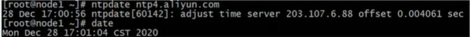

* 创建统一工作目录（3台机器）

  mkdir -p /export/server/ #软件安装路径

  mkdir -p /export/data #数据存储路径

  mkdir -p /export/software/ #安装包存放路径

  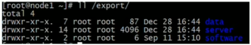

step3：上传安装包、解压安装包

* JDK1.8安装（3台机器）

  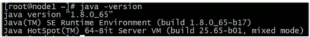

* 上传、解压Hadoop安装包（node1）

  

step5：编辑Hadoop配置文件（1）

* hadoop-env.sh

  


step8：NameNode format（格式化操作）(`注意！！！！！千万不要执行多次，只需要搭建好初始化的时候执行一次就行，以后都不用执行`)

* 首次启动HDFS时，必须对其进行格式化操作。

* format本质上是初始化工作，进行HDFS清理和准备工作

* 命令：

  hdfs namenode -format

  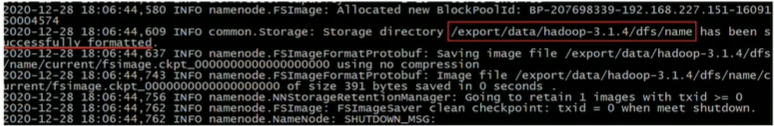

  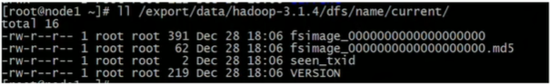

手动逐个进程启停

* 每台机器上每次手动启动关闭一个角色进程，可以进准控制每个进程启停，避免群起群停。

* HDFS集群

  ```shell
  #hadoop2.x版本命令
  hadoop-daemon.sh start|stop namenode|datanode|secondarynamenode
  #hadoop3.x版本命令
  hdfs --daemon start|stop namenoddatanodsecondarynamenode
  ```

* YARN集群

  ```shell
  #hadoop2.x版本命令
  yarn-daemon.sh starstop resourcemanager|nodemanager
  #hadoop3.x版本命令
  yarn --daemon start|stop resourcemanager|nodemanager
  ```

shell脚本一键启停

* 在node1上，使用软件自带的shell脚本一键启动。`前提：`配置好机器之间的ssh免密登录和workers文件。

* HDFS集群

  start-dfs.sh

  stop-dfs.sh

* YARN集群

  start-yarn.sh

  stop-yarn.sh

* Hadoop集群

  start-all.sh

  stop-all.sh

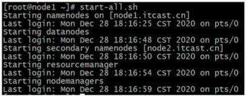

进程状态、日志查看

* 启动完毕之后可以使用jps命令查看进程是否启动成功

  ```shell
  jps #j代表Java，ps代表进程
  ```

  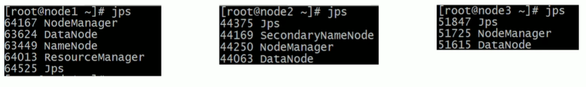

* Hadoop启动日志路径：/export/server/hadoop-3.3.0/logs/

  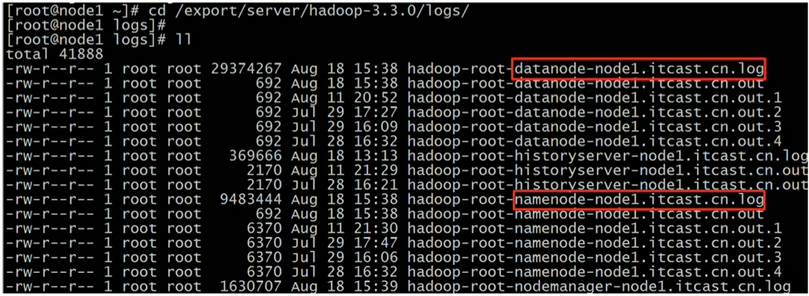

HDFS集群

* 地址：http://namenode_host:9870

  其中namenode_host是namenode运行所在机器的主机名或者ip

  如果使用主机名访问，别忘了在Windows配置hosts

  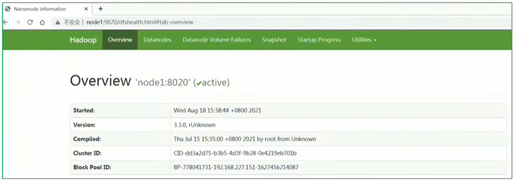
  
  