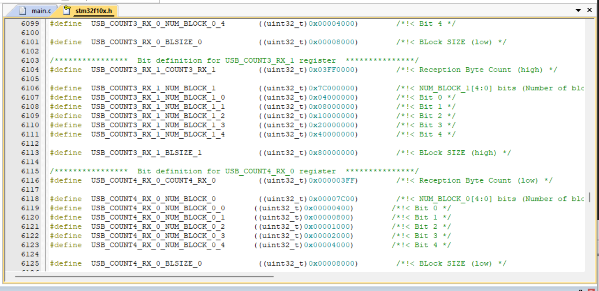
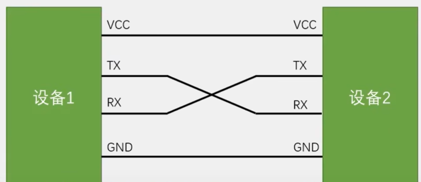
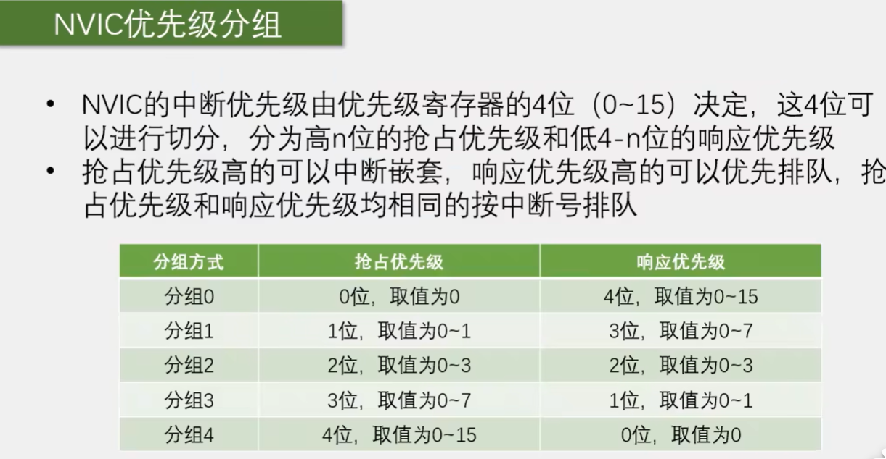

# STM32 学习

---


## 工程架构：


## ST建议是如果是想自己写中断的话，是写在这个位置；


## 直接操作寄存器可以查看stm32f10x.h：



stm32f10x.adc.c封装了寄存器的操作，提供了更加人性化的操作。


## GPIO介绍

* GPIO(General Purpose Input Output)通用输入输出口
* 可配置为8种输入输出模式
* 引脚电平：0V~3.3V，部分引脚可容忍5V
* 输出模式下可控制端口输出高低电平，用以驱动LED、控制蜂鸣器、模拟通讯协议输出时序等
* 输入模式下课读取端口的高低电平或电压，用于读取按键输入、外接模块电平信号输入、ADC电压采集、模拟通讯协议接收数据等


### GPIO的基本结构


### GPIO位结构


### 通过配置GPIO的端口配置寄存器，端口可以配置成以下8种模式


### 浮空/上拉/下拉输入


## LED和蜂鸣器介绍

* LED：发光二极管，正向通电点亮，反向通电不亮
* 有源蜂鸣器：内部自带震荡源，将正负极接上直流电压即可持续发声，频率固定
* 无源蜂鸣器：内部不带震荡源，需要控制器提供震荡脉冲才可发声，调整提供震荡脉冲的频率，可发出不同频率的声音


### 对应硬件电路


### 电灯代码：

```c
#include "stm32f10x.h"

int main(void){
	//RCC->APB2ENR = 0x00000010;
	//GPIOC->CRH = 0x00300000;
	//GPIOC->ODR = 0x00002000;
	RCC_APB2PeriphClockCmd(RCC_APB2Periph_GPIOA,ENABLE);
	GPIO_InitTypeDef GPIO_InitStructure;
	GPIO_InitStructure.GPIO_Mode = GPIO_Mode_Out_PP;
	GPIO_InitStructure.GPIO_Pin = GPIO_Pin_0;
	GPIO_InitStructure.GPIO_Speed = GPIO_Speed_50MHz;
	GPIO_Init(GPIOA, &GPIO_InitStructure);
	GPIO_ResetBits(GPIOA,GPIO_Pin_0);		
	while(1){
	}
	//return 0;
}
```


## 按键介绍：

* 按键：常见的输入设备，按下导通，松手断开
* 按键抖动：由于按键内部使用的是机械式弹簧片来进行通断的，所以在按下和松手的瞬间会伴随有一连串的抖动


### 按钮控制代码：

```c
#include "stm32f10x.h"
#include "Delay.h"

void Key_Init(void){
	RCC_APB2PeriphClockCmd(RCC_APB2Periph_GPIOB, ENABLE);
	
	GPIO_InitTypeDef GPIO_InitStructure;
	GPIO_InitStructure.GPIO_Mode = GPIO_Mode_IPU; //上拉输入
	GPIO_InitStructure.GPIO_Pin = GPIO_Pin_4|GPIO_Pin_12;
	GPIO_InitStructure.GPIO_Speed = GPIO_Speed_50MHz;
	GPIO_Init(GPIOB,&GPIO_InitStructure);
}

int Key_GetNum(uint16_t btnID){
	
	int KeyNum = 0;
	if(GPIO_ReadInputDataBit(GPIOB,btnID) ==0){
		Delay_ms(20);
		while(GPIO_ReadInputDataBit(GPIOB,btnID)==0);
		Delay_ms(20);
		KeyNum = 1;
	}
	return KeyNum;
}
```


### 按键与传感器的接法

* 上面两种解法是按下为高电平，松开是低电平。下面两种解法反之。（一般常用上面两种接法）


## 传感器模块介绍：

* 传感器模块：传感器元件（光敏电阻/热敏电阻/红外接收管等)的电阻会随外接模拟量的变化而变化，通过与定值电阻分压即可得到模拟电压输出，再通过电压比较器进行二值化即可得到数字电压输出


## C语言数据类型：


* 在51单片机中int是占16位的，而在STM32中int是占32位的，如果要用16位的数据，要用short来表示


## OLED驱动函数


## I2C通讯

* I2C总线（Inter IC BUS）是由Philips公司开发的一种通用数据总线
* 两根通讯线：SCL（Serial Clock）、SDA（Serial Data）
* 同步，半双工
* 带数据应答
* 支持总线挂载多设备（一主多从、多主多从）


### 硬件电路：

* 简单双向串口通信由两根通信线（发送端TX和接收端RX）
* TX与RX要交叉连接
* 当只需单向的数据传输时，可以只接一根通信线
* 当电平标准不一致时，需要加电平转换芯片




## MPU6050：

* MPU6050是一个六轴姿态传感器，可以测量芯片自身X、Y，Z轴的加速度、角速度参数，通过数据融合，可以进一步得到姿态角，常应用于平衡车、飞行器等需要检测自身姿态的场景
* 3轴加速度计（Accelerometer）：测量X、Y，Z轴的加速度
* 3轴陀螺仪传感器（Gyroscope）：测量X，Y，Z轴的角速度


## EXTI介绍

* EXTI(Extern Interrupt)外部中断
* EXTI可以检测指定GPIO口的电平信号，当其指定的GPIO产生电平变化时，EXTI将立即向NVIC发出中断申请，经过NVIC裁决后即可中断CPU主程序，使CPU执行EXTI对应的中断程序
* 支撑的触发方式：上升沿/下降沿/双边沿/软件触发
* 支撑的GPIO口：所有GPIO口，但相同的Pin不能同时触发中断
* 通道数：16个GPIO_Pin，外加PVD输出、RTC闹钟、USB唤醒、以太网唤醒
* 触发响应方式：中断响应/事件响应


### 中断系统

* 中断：在主程序运行过程中，出现了特定的中断触发条件（中断源），使得CPU暂停当前正在运行的程序，转而去处理中断程序，处理完成后又返回原来被暂停的位置继续运行
* 中断优先级：当有多个中断源同时申请中断时，CPU会根据中断源的轻重缓急进行裁决，优先响应更加紧急的中断源
* 中断嵌套：当一个中断程序正在运行时，又有新的更高优先级的中断源申请中断，CPU再次暂停当前的中断程序，转而去处理新的中断程序，处理完成后一次进行返回

### 中断执行流程；


### STM32中断


### NVIC基本结构


### NVIC优先级分组




### AFIO复用IO口

* AFIO主要用于引脚复用功能的学则和重定义
* 在STM32中，AFIO主要完成两个任务：复用功能引脚重映射、中断引脚选择


### EXTI框图


## 旋转编码器介绍

* 旋转编码器：用来测量位置、速度或者旋转方向的装置，当其旋转轴旋转时，其输出端可以输出与旋转速度和方向对应的方波信号，读取方波信号的频率和相位信息即可得知旋转轴的速度和方向

* 类型：机械触点式/霍尔传感器式/光柵式


### 旋转编码器硬件电路


注意：

* 中断函数里，最好不要执行耗时过长的代码，中断函数要简短快速，别刚进中断就执行一个Delay多少毫秒这样的代码，因为中断是处理突发的事情，如果你为了一个突发的事情待着中断不出来了，那么主程序就会受到堵塞，另外就是，最好不要在中断函数和主函数调用相同的函数或者操作同一个硬件，尤其是硬件相关的函数，比如OLED显示函数，如果你既在主程序里调用OLED，又在中断里调用OLED，OLED就会显示错误。
