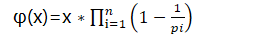

# 互质

---

## 什么是互质：

> 互质是公约数只有1的两个整数，叫做互质整数。[公约数](https://baike.baidu.com/item/公约数/1063409?fromModule=lemma_inlink)只有1的两个[自然数](https://baike.baidu.com/item/自然数/385394?fromModule=lemma_inlink)，叫做互质自然数，后者是前者的特殊情形。

在考虑两个区间互质的情况之前我们先考虑它的一个子问题，一个数x与一个区间[l,r]的互质问题。

处理这个问题，最简单的方法肯定是遍历区间，复杂度为O(n)，n为区间长度，显然太慢。

这时我们可以逆向思维，转换问题，我们可以考虑求不互质的个数，然后再用全部个数减去不互质的个数。

不互质也就是说，有公共的因子，如果把问题转换成求同有某个因子的数量，那就好处理， 比如如果计算都有因子2，设区间为[l,r]，那我们只要计算1~r的个数减去1~l-1的个数，也非常好算，只要r/2-(l-1)/2 就可以计算出区间[l,r]中有因子2的数字的数量(这里的除法若无特殊说明都为整数除法，即向下取整)。

这样我们就可以把数x进行因数分解，然后对每一个因数去计算区间中有几个数同时有这个因数，累加到sum\[i\](i为当前这个因数中有几个质因子)，这样我们就把区间中的数分类到了，几个集合中，数sun[i]，就表示区间中与x共有i个质因子的数的数量，当然这些集合并不是区间的一个划分，因为这几个集合是有共有部分的，这时我们就用到我们上面推出的公式了。

假设区间中一个数y与x的共有质因子数量为1，那在sum[1]中会对他算一次，sum[2]中会对它算0次.

如果共有质因子的数量为2，那sun[1]中会对它算2次（比如y有质因子(2,3),x有质因子（2，3，5）,这时取2，计算了一次，取3又计算了一次，所以是两次），sum[2]对他计算1次。

同样，如果共有质因子的数量为2，那sun[1]中会对它算3次，sum[2]对他计算3次(3个中选2个)，sum[3]是一次，sum[4]零次。

### 欧拉函数

其中p1,p2…pi…pn为x的**所有质因数**，x是一个正整数

## 互质和质因数的关系

> 互质（也称为互素）和质因数是数论中两个相关但不同的概念。
>
> 1. **互质（互素）**：两个或多个整数中，如果它们的最大公因数（最大公约数）为1，则称这些整数是互质的。换句话说，两个数互质意味着它们之间没有共同的因数（除了1以外）。例如，3和8是互质的，因为它们的最大公因数是1，而6和9不是互质的，因为它们有公因数3。
>
> 2. **质因数**：一个数的质因数是指能整除该数且是质数的因数。质数是只能被1和自身整除的正整数。例如，12的质因数包括2和3，因为12能被2和3整除，并且2和3都是质数。
>
> 这两个概念之间的关系在于，如果两个整数是互质的，那么它们之间没有共同的因数，也就是说，它们的质因数集合没有交集。因此，两个数互质的充分必要条件是它们的质因数集合没有共同的元素。
