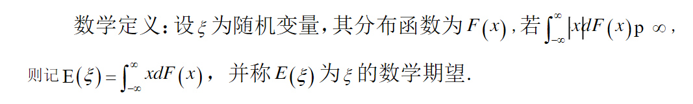
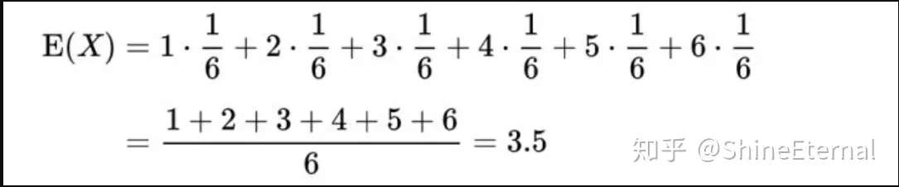

# 期望

---

## 前言：

---

数学期望当前在OI中是一个类似于数论方面门槛的知识，在竞赛中有考察。本文将详细的讲解此内容，但也不是只纠缠于简单的概念，而会解决一些题目.可能这样介绍的知识对于大佬来说还是比较基础，但对像我这样的萌新来说通俗易懂，所以请各位口下留情。

## 什么是期望

---

日常生活中，我们每做一件事，都有对它的期望，这里的期望不仅仅只结果的胜负之类，也可以与状态有关。但在OI中，一般指的就是达到结果的期望，最朴素的计算是**每次可能结果的概率乘以其结果的总和**

这是最基本的数学特征。

广义下的定义：一次随机抽样中所期望的某随机变量的取值。

数学定义：

## 2、期望的小性质：

- 设X是随机变量，C是常数，则 𝐸(𝐶𝑋)=𝐶×𝐸(𝑋)

简单证明一下：

设x 的多个随机变量为

$𝐶𝑎_1,𝐶𝑎_2,𝐶𝑎_3...𝐶𝑎_𝑛$

对应的出现概率为

$𝑝_1,𝑝_2,𝑝_3...𝑝_𝑛$

那么对应的求期望的式子

$𝐸(𝐶𝑋)=𝐶\sum^n_{i=1}=(a_i×p_i)$

(C提出来)

由于：

$𝐸(𝑋)=\sum^n_{i=1}=(a_i×p_i)$

所以

$E(CX)=C\times E(X)$

### 另一些简单的性质：

- 设X，Y是任意两个随机变量，则有 $𝐸(𝑋+𝑌)=𝐸(𝑋)+𝐸(𝑌) $。
- 设X，Y是相互独立的随机变量，则有$ 𝐸(𝑋𝑌)=𝐸(𝑋)×𝐸(𝑌)$ 。
- 设C为常数，则$ 𝐸(𝐶)=𝐶 $。

## 3.期望与均值？

期望与均值是两个十分相近的概念，但又可以说是截然不同。

- 均值往往是在实验中简单的对数据进行平均。
- 而期望就好像在上帝视角的人。

举个掷骰子的例子：

我们的均值怎么算呢？

显然要掷上一定多的次数来求平均数。

比如，掷了6次，分别为$ 1,5,5,6,3,3 $，那么均值为 ${1+5+5+6+3+3 \over 6} =3.8333333...$

可是期望呢？

我们不用掷骰子就能计算出来：

可以看出，两个值是有明显差别的，而且还时刻不同。

但是为什么容易弄混呢？

因为在将多个均值求均值后，两者就无限接近了。

## 定义

---

设$P(x)$是一个离散概率分布函数，自变量的取值范围为$\{x_1,x_2,...,x_n\}$。其期望呗定义为：

$E(x)=\sum_{k=1}^nx_kP(x_k)$

设p(x)是一个连续概率密度函数。其期望为：

$E(x)=\int^{+\infty}_{-\infty}xp(x)dx$

## 性质

1、线性运算规则

期望服从线性性质（可以很容易从期望的定义公式中导出）。因此线性运算的期望等于期望的线性运算

$E(ax+by+c)=aE(x)+bE(y)=c$

这个性质可以推广到任意一般情况：

$E(\sum^n_{k=1}a_ix_i+c)=\sum^n_{k=1}a_iE(x_i)+c$

2、函数的期望

设$f(x)$为x的函数，则$f( x )$的期望为：

离散：

$E(f(x))=\sum^n_{k=1}f(x_k)P(x_k)$

连续：

$E(f(x))=\int^{+\infty}_{-\infty}f(x)p(x)dx$

一定要注意，**函数的期望不等于期望的函数**，即$E(f(x))/=f(E(x))!$。

3、乘积的期望

一般来说，**乘积的期望不等于期望的乘积**，除非变量相互独立。因此，如果x和y相互独立，则$E(xy)=E(x)E(y)$。

期望的运算构成了统计量的运算基础，因为**方差、协方差等统计量本质上是一种特殊的期望**。

