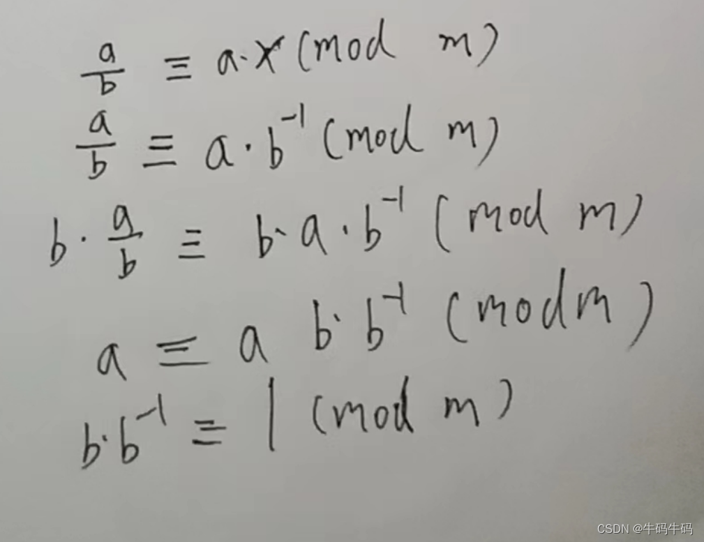

# 逆元

---

## ≡符号的意思

> 在数学中，符号≡表示模同余的关系。当我们写$a \equiv b \pmod{m}$时，意思是a与b在模m下同余，也就是说它们除以m后得到相同的余数。换句话说，a和b的差是m的倍数。例如，$17 \equiv 3 \pmod{7}$表示17和3在模7下同余，因为它们相减得到的结果是7的倍数，即$17 - 3 = 14 = 2 \times 7$。

## 逆元的本质：

> 逆元的定义： 假设 a 除
> b，且a和b都是整数，非浮点数，那么我们希望不做除法，因为取余数的话除法很麻烦，所以我们希望把除法变成乘法，希望找到一个数，使得a/b的余数 == ax%m。 即对于某一个b，我们能够找到一个数x，使得a/b和ax模m的余数相同的话， 则把x记作b的模m的逆元，记作b的-1次方； 即b的逆元， b的-1次方，是一个整数，是一个标记。即我们可以把所有a/b的情况转化为a*b的逆元的情况下 % M；即把除法变成了整数。
>
> 


## C++模板：

```c++
#include <iostream>
#include <cstring>
#include <algorithm>

using namespace std;
typedef long long LL;

int quick_power(int a, int b, int p)
{
    int res = 1;
    while (b)
    {
        if (b&1) res = (LL)res * a % p;
        a = (LL)a*a % p;
        b >>= 1;
    }
    return res % p;
}

int main()
{
    int n;
    cin >> n;
    
    while (n -- )
    {
        int a, p;
        cin >> a >> p;
        
        int x = quick_power(a, p-2, p); //直接求出逆元的值！
        if (a%p) cout << x << endl;
        else puts("impossible");
    }
    return 0;
}
```

