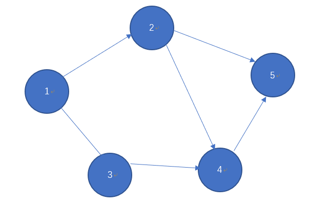
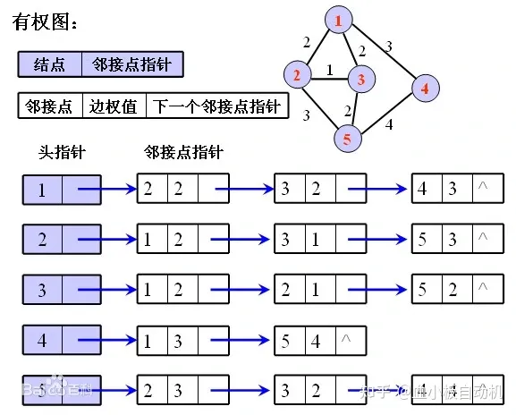

# 链式向前星

---

## 说明：

> 如果说邻接表是不好写但效率好，邻接矩阵是好写但效率低的话，前向星就是一个相对中庸的数据结构。前向星固然好写，但效率并不高。而在优化为链式前向星后，效率也得到了较大的提升。虽然说，世界上对链式前向星的使用并不是很广泛，但在不愿意写复杂的邻接表的情况下，链式前向星也是一个很优秀的数据结构。 
>
> 我们先展示代码再做具体讲解，链式向前星的结构模板代码如下：
>
> ```c++
> struct Edge{    //表示边
>     int w;
> int to;
>     int next;
> }edge[10005];
>   
> int cnt=0;      //用以控制并统计边的数量
>   
> int head[10005];    //表示来源的边序号
> ```
>
> 具体的解释为：
>
> * Edge表示边，这个结构体数组将逐步记录边信息，其中包含有三个元素
>
> * w为权重即边之间的权值，下图中为默认的1，不演示
>
> * to表示为第i条边指向哪一个结点
>
> * edge[i].next表示第i条边的下一条边的序号
>
> * cnt表示边的数量，在输入时利用他逐个+1
>
> * head表示第x个结点所需要访问的边
>
> 同样的我们以这个结构的图为例，链式向前星中需要存储如下内容：
>
> 
>
> 上图可以得到一个这样的运算表格（不唯一）
>
> | Edge[0].to | 2    | Edge[0].next | -1   | Head[1] | 0    |
> | ---------- | ---- | ------------ | ---- | ------- | ---- |
> | Edge[1].to | 3    | Edge[1].next | 0    | Head[1] | 1    |
> | Edge[2].to | 4    | Edge[2].next | -1   | Head[2] | 2    |
> | Edge[3].to | 5    | Edge[3].next | 2    | Head[2] | 3    |
> | Edge[4].to | 4    | Edge[4].next | -1   | Head[3] | 4    |
> | Edge[5].to | 5    | Edge[5].next | -1   | Head[4] | 5    |
>
> 可以见的，比如我们访问与1相互联通的所有结点，我们首先访问head[1]的内容，head的下标表示1结点，其内容表示我们应该访问边的标号，此时我们得到了数据1，表明我们需要访问边1，此时我们找到edge[1]并获取第一个to的内容，表示1结点与3结点相连通，接下来访问next的内容，在edge[1].next中获得了下一条边的标号0，因此接下来访问edge[0]的内容，得到了新得信息，edge[0].to=2，表示1结点与2结点相互联通，在访问next的内容为-1时表示没有下一条了，结束向下访问，自此，我们获得了与1相互联通的所有结点的信息。
>
> 因此可以得到如下的信息表：
>
> | 结点1 | -1   | 2    | 3    |
> | ----- | ---- | ---- | ---- |
> | 结点2 | 1    | 4    | 5    |
> | 结点3 | -1   | 4    |      |
> | 结点4 | -1   | 5    |      |
> | 结点5 | -1   |      |      |
>
> 添加边信息时使用以下代码:
>
> ```c++
> void add_edge(int from, int to, int w) {
>     edge[cnt].to = to;
>     edge[cnt].w = w;
>     edge[cnt].next = head[from];
>     head[from] = cnt++;
> }
> ```
>
> 注意，我们需要对全体数组进行赋-1的初值，这对于出错和检验错误都是很有帮助的，因为-1正是本算法的判定边界点，当然，这个边界点也可以由自己定位任意一个负数。
>
> 

###  C++模板：

```c++
#include<iostream>

#define MAX 5

using namespace std;


int n,m,cnt;//点数量，边数量，cnt

struct Edge{
    int to;
    int w;
    int next;
} edge[MAX];

int head[MAX];

/**
 * 初始化
 */
void init(){
    for(int i =0;i<=n;++i) head[i]=-1;
    cnt=0;
}

/**
 * 添加边
 * @param u 边起点
 * @param v 边终点
 * @param w 边权值
 */
void add_Edge(int u,int v,int w){
    edge[cnt].to=v; //设置终点值
    edge[cnt].w=w; //设置权值
    edge[cnt].next=head[u]; //设置以u为起点的上一条边的编号
    head[u]=cnt++; //更新以u为起点的上一条边的编号
}

int main(){
    setbuf(stdout,0);

    cin >>n>>m;//n个点，m条边

    init(); //初始化

    int u,v,w;
    for(int i =0 ;i <m;++i){//输入m条边
        cin >> u>>v>>w;
        add_Edge(u,v,w);
    }

    for(int i=1;i<=n;++i){//n个起点
        cout<<"以"<<i<<"为起点的边:"<<endl;
        for(int j = head[i]; j!=-1;j=edge[j].next){
            cout<<i<<"-->"<<edge[j].to<<endl;
        }
        cout <<endl;
    }


    return 0;
}
```


### Java模板：

```java

import java.util.Arrays;
import java.util.Scanner;


public class 链式向前星 {
	public static void main(String[] args) {
		Scanner sc = new Scanner(System.in);
		int n = sc.nextInt(); //有多少个点
		int m = sc.nextInt(); //有多少条边
		
		Edge[] edge = new Edge[m]; //存储边
		int head[] = new int[n+1]; //以i为开头的最近填加的边的编号
		Arrays.fill(head, -1);//初始化，-1代表没有
		
		for(int i=0 ;i< m;++i) {
			int u = sc.nextInt();
			int v = sc.nextInt();
			int w = sc.nextInt();
			addEdge(edge, head, i, u, v, w);
		}
		
		for(int i= 1; i<= n;++i) {
			System.out.println("以"+i+"为开头的边：");
			for(int j = head[i];j!=-1;j=edge[j].next) {
				System.out.println(i+"-->"+edge[j].to);
			}
		}
		
	}
	
	/**
	 * 添加边
	 * @param edge 存储边的数组
	 * @param head 存储以i为起点，其内容为结束点的最近一个录入边
	 * @param ei 边的编号
	 * @param u 起点
	 * @param v 终点
	 * @param w 权值
	 */
	static void addEdge(Edge[] edge,int head[],int ei,int u,int v,int w) {
		Edge e = new Edge();
		e.to=v;e.w=w;e.next=head[u];head[u]=ei;
		edge[ei]=e;
	}
	
	static class Edge{
		int to;
		int w;
		int next;
	}

}
```

