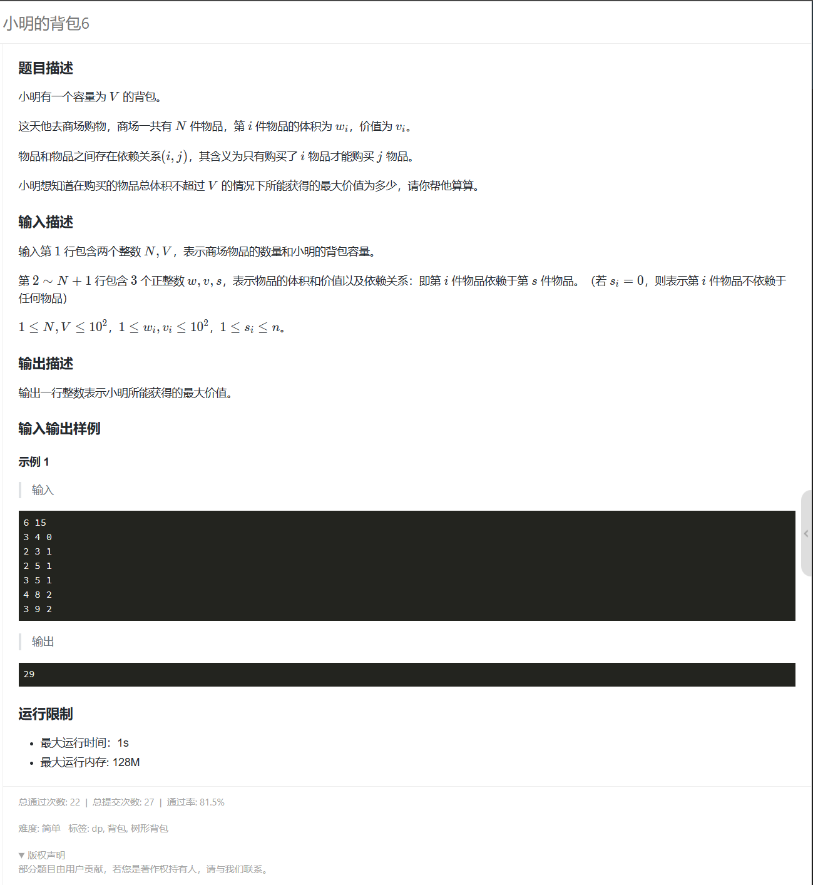
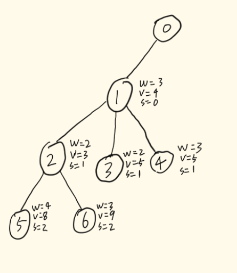

# 树形DP的讨论

---

### 讨论：

> 关于树形DP。树形DP比较适合解决一些有相互关系和依赖的的题型，比较典型的有[没有上司的舞会](https://www.luogu.com.cn/problem/P1352)、[金明的预算方案](https://www.luogu.com.cn/problem/P1064)、这一类题目。
>
> 首先我先说一下关于树形DP，顾名思义其含义就是在树这种数据结构上进行DP算法的运算。

## 树上背包DP

---

### 讨论：

> 树上背包DP这类是比较典型的树形DP题目。其中主要写题步骤为这几点：
>
> 首先找到我们需要DP的容量。也就是我们常说的背包容积大小，然后就是找到我们的需要DP的物品，常规的树上DP题主要关键数据就这两个。这里我就拿比较典型的一道题来说一下。
>
> (以下题目为蓝桥官方的VIP题，我看比较典型就把它截下来了)

由图可知，我们的背包容量为V。商场一共有N件物品。第i件物品的体积为$$w_i$$，价值为$$v_i$$，其中依赖的主物件为$$s_i$$。

这里我们定义从第二行输入的数据作为下标为1的物品，以此类推。在构建树的时候我们就以0作为根节点，1意思为第一件物品，2为第二件物品依次类推。

从这我们就可以下手，我们从测试数据作为例子进行引入。以下为我依据 测试数据画的树形DP的树形图：

这里圈里面的数字代表的是物品的编号，编号为0可以忽略他只作为根节点。其附近的w、v、s分别代表对应编号物品的体积、价值、依赖的父物品。

