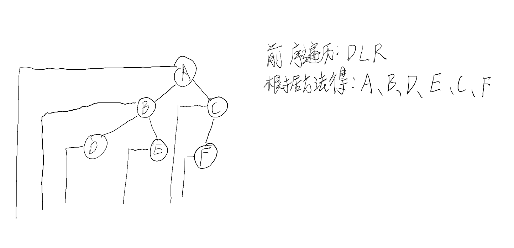
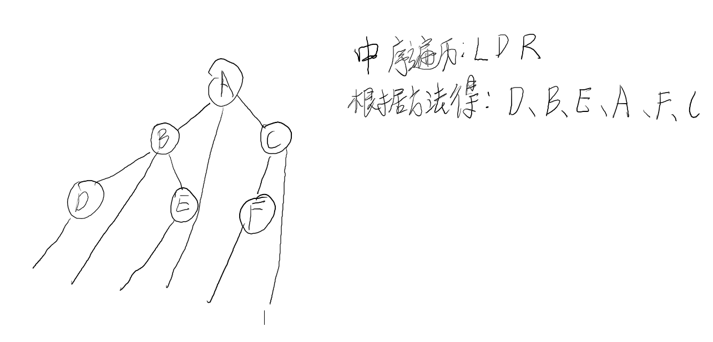
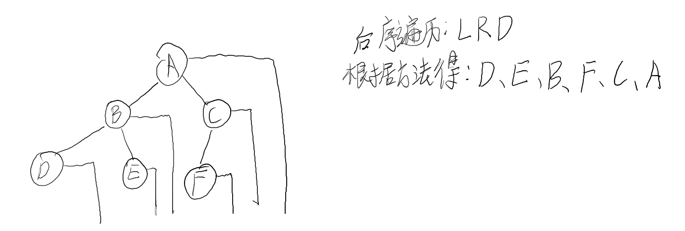

# 考研数据结构与算法

---

## 常见四类基本结构

> 集合
>
> 线性结构
>
> 树形结构
>
> 网状结构

## 树

---

### 二叉树

#### 二叉树的常见遍历方式：

> 先根序遍历
>
> 中根序遍历
>
> 后根序遍历
>
> ==注:==这里的根指的是相对子树的根

#### 先根序遍历巧妙方法：

> 技巧：从每个结点引出一条线来，画的方式为从左画线再向下画线。让从左往右数出相应的结果即可。
>
> ==注:==所画线条不能交叉。

#### 中根序遍历巧妙方法：

> 技巧：从每个结点引出一条线来，画的方式为直接画斜直线，数出相应的结果即可。
>
> ==注:==所画线条不能交叉。

#### 后根序遍历巧妙方法：

> 技巧：从每个结点引出一条线来，画的方式为从右画线再向下画线。让从左往右数出相应的结果即可。
>
> ==注:==所画线条不能交叉。

