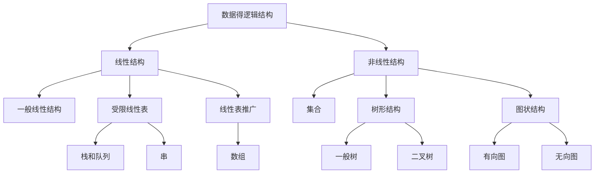
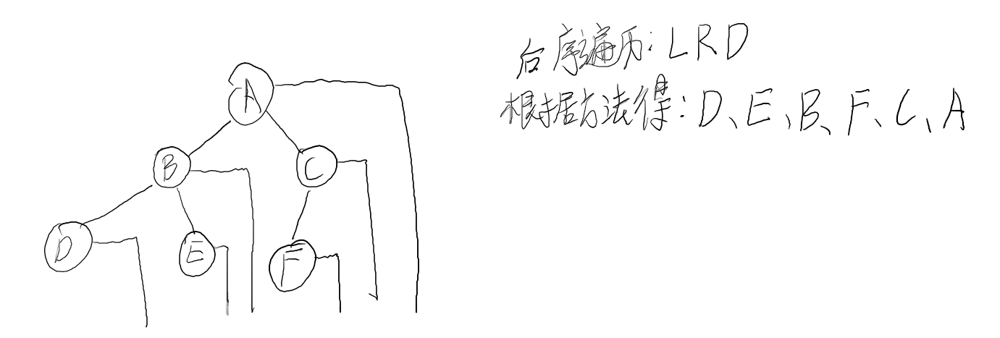

# 考研数据结构与算法

---

## 常见四类基本结构

> 集合
>
> 线性结构
>
> 树形结构
>
> 网状结构

## 树

---

### 二叉树

#### 二叉树的常见遍历方式：

> 先根序遍历
>
> 中根序遍历
>
> 后根序遍历
>
> ==注:==这里的根指的是相对子树的根

#### 先根序遍历巧妙方法：

> 技巧：从每个结点引出一条线来，画的方式为从左画线再向下画线。让从左往右数出相应的结果即可。
>
> ==注:==所画线条不能交叉。

#### 中根序遍历巧妙方法：

> 技巧：从每个结点引出一条线来，画的方式为直接画斜直线，数出相应的结果即可。
>
> ==注:==所画线条不能交叉。

#### 后根序遍历巧妙方法：

> 技巧：从每个结点引出一条线来，画的方式为从右画线再向下画线。让从左往右数出相应的结果即可。
>
> ==注:==所画线条不能交叉。

## 哈夫曼树

### 哈夫曼实际用途：

> 压缩，其中压缩分为有损压缩和无损压缩，其中哈夫曼为无损压缩

### 如何构建哈夫曼树：

1、把所有节点看成一棵树

2、找权值最小的两个树的节点，组成一颗新的树

例如以下：

> 假如有权集w={5,7,2,3,6,8,9}。
>
> 对应字符     A,B,C,D,E,F,G
>
> (2).png)
>
> 从一到七这几个步骤可以得知，其实就是对于其元素进行优先队列的出队和入队，然后对所出队的元素组成一棵树，其树根为其权值总和，如此往复，直至合并成一棵树。

WPL：带权路径长度。
