# TCP/IP知识

---

## 关于TCP/IP

* TCP/IP（Transmission Control Protocol/Internet Protocol，传输控制协议/网际协议）是指能够在多个不同网络间实现信息传输的协议簇。TCP/IP协议不仅仅指的是TCP 和IP两个协议，而是指一个由FTP、SMTP、TCP、UDP、IP等协议构成的协议簇， 只是因为在TCP/IP协议中TCP协议和IP协议最具代表性，所以被称为TCP/IP协议。 比如：TCP，UDP，IP，FTP，HTTP，ICMP，SMTP 等都属于 TCP/IP 族内的协议。注意：TCP/IP协议不是TCP和IP这两个协议的合称，而是指因特网整个TCP/IP协议族 (也就是整个框架协议)。

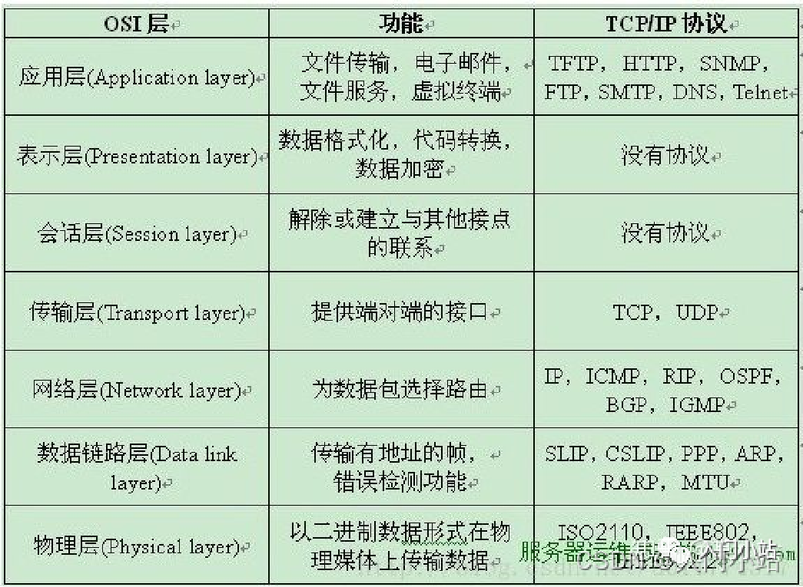

IP：

IP所提供的服务通常被认为是无连接的和不可靠的，它将差错控制和流量控制之类的服务授权给了其他的各层协议，这正是TCP/IP 能够高效率工作的一个重要保证。网络层的功能主要由IP来提供，除了提供端到端的分组分发功能外，IP还提供很多扩充功能。例如，为了克服数据链路层对帧大小的限制，网络层提供了数据分块和重组功能，这使得很大的IP数据包能以较小的分组在网络上传输。

ARP：

ARP(Address Resolution Protocol，地址解析协议)用于动态地完成IP地址向物理地址的转换。物理地址通常是指计算机的网卡地址，也称为MAC(Medai Access Control，媒体访问控制)地址，每块网卡都有唯一的地址。

RARP：

RARP(Reverse Address Resolution Protocol，反向地址解析协议)用于动态完成物理地址向IP地址的转换。

ICMP：

ICMP(Internet Control Message Protocol，网际控制报文协议)是一个专门用于发送差错报文的协议，由于IP协议是一种尽力传送的通信协议，即传送的数据可能丢失、重复、延迟或乱序传递，所以需要一种尽量避免差错并能在发生差错时报告的机制，这就是ICMP的功能。

IGMP：

IGMP(Internet Group Management Protocol，网际组管理协议)允许Internet中的计算机参加多播，是计算机用做向相邻多目路由器报告多组成员的协议。多目路由器是支持组播的路由器，它向本地网络发送IGMP查询，计算机通过发送IGMP报告来应答查询。多目路由器负责将组播包转发到网络中所有组播成员。

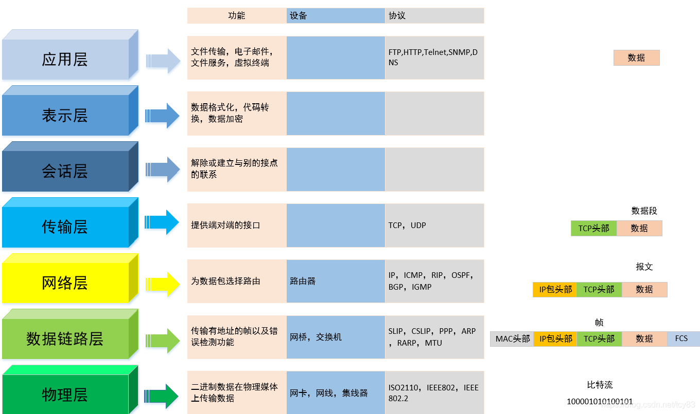

1、物理层

   物理层是OSI模型的第一层，主要功能是：利用传输介质为数据链路层提供物理连接，实现比特流的透明传输。它负责管理电脑通信设备和网络媒体之间的互通。该层传递是比特流，主要的设备有包括了针脚、集线器、中继器、网卡、主机接口卡等。

2、数据链路层

  数据链路层主要功能：在物理层提供比特流服务的基础上，建立相邻结点之间的数据链路，通过差错控制提供数据帧(Frame)在信道上无差错的传输。

在计算机网络中由于各种干扰的存在，物理链路是不可靠的，因此，通过差错控制、流量控制方法，使有差错的物理线路变为无差错的数据链路，即提供可靠的通过物理介质传输数据的方法。

数据链路层将比特组合成字节进而组合成帧(frame),通过MAC地址进行寻址，访问介质。

我们常用的接入交换机(二层交换机)就是工作在这层，交互机连接的设备在同一个广播域，如果想抓某个设备的网络包，就可以使用交换机将电脑和设备互联。

3、网络层

​    网络层是七层模型中复杂的，茫茫机海中，两台计算机顺利的牵手就靠网络层，比如我们访问百度，将数据链路层提供的帧转化成数据包(packets)，该数据包包含IP头。通过路径选择、分段组合、顺序、进/出路由等控制，将我们机器的访问信息从我们的机器传送到百度的服务器，这中间经过很多通信子网，也有N个路径可以选择，如何选择一条最优路径，是该层重要的功能。

在数据链路层，在一个广播域的内部采用的是MAC寻址；在网络层，实现不同的子网平面间采用的IP寻址。所以和IP相关的都是三层，比如我们ping 一个ip地址看通不通，就是看网络层是否连通。

这层的主要设备就是路由器，熟知的是家庭路由器(现在都被称为wifi)。

4、传输层

  传输层起到承上启下的作用，一方面向高层屏蔽下层数据通信的细节，即向用户透明地传送报文，另一方面将数据传递到网络层，并确保数据能正确无误地传送到网络层。因此，传输层提供建立、维护和拆除传输连接的功能，跟踪数据单元碎片、乱序到达的 数据包和其它在传输过程中可能发生的危险，保证报文的正确传输。

我们通常说的检查下443,80端口通不通，就是指的是传输层端口，今天要讲的TCP/UDP协议就是该层的协议，另外大名鼎鼎的负载LVS也是工作在四层上。

5、会话层

  会话层是用户应用程序和网络之间的接口，主要任务是：向两个实体的表示层提供建立和使用连接的方法。将不同实体之间的表示层的连接称为会话。因此会话层的任务就是组织和协调两个会话进程之间的通信，并对数据交换进行管理。会话控制和远程过程调用均属于这一层的功能。

6、表示层

   表示层对来自应用层的命令和数据进行解释，对各种语法赋予相应的含义，并按照一定的格式传送给会话层。其主要功能是“处理用户信息的表示问题，如编码、数据格式转换和加密解密”等。

数据的压缩和解压缩， 加密和解密等工作都由表示层负责。

7、应用层

应用层是计算机用户，以及各种应用程序和网络之间的接口，其功能是直接向用户提供服务，完成用户希望在网络上完成的各种工作。应用层为用户提供的服务和协议，比如http，ftp，telnet等。

在日常工作中，将传输层以上统称为应用层，划分TCP/IP五层模型。

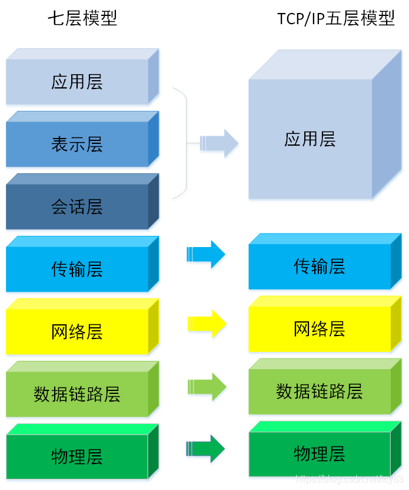

## 关与路由转发分组

---

TCP/IP的[体系结构](https://so.csdn.net/so/search?q=体系结构&spm=1001.2101.3001.7020)比较简单，它只有四层。**路由器在转发分组时最高只用到网络层**而没有用到运输层和应用层。如下图所示（==注：==`网络接口层就是数据链路层和物理层一起。网际层就是网络层。运输层就是传输层。TCP/IP四层模型中可能会将运输层划分到应用层当中`）：

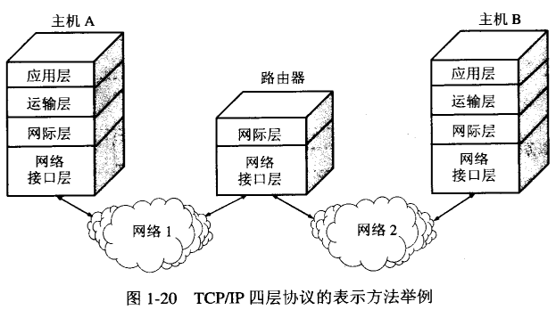

还有一种方法，就是分层次画出具体的协议来表示TCP/IP协议族，应用层和网络接口层都有多种协议，上层的各种协议都向下汇聚到一个IP协议中。这表明，TCP/IP协议可以为各式各样的应用提供服务（everything over IP），同时TCP/IP协议也允许IP协议在各式各样的网络构成的互联网上运行（IP over everything），如下图所示，不难看出IP协议在因特网中的核心作用： 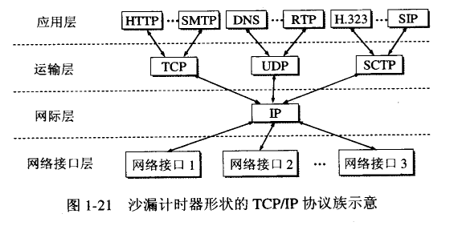

​    通过下图，利用协议栈的概念来说明在因特网中客户服务器（B/S）的工作方式。

​    主机A和B都有各自的协议栈。主机A中的应用进程（即客户进程）向主机B应用层的服务进程发出请求，请求建立连接。然后，***\*主机\**B的服务器进程接收A的客户进程发来的请求，然后建立连接。所有的这些通信，都必须使用下面各层所提供的服务**，若仅仅考虑客户进程和服务进程的交互，则如图顶部虚线所示。

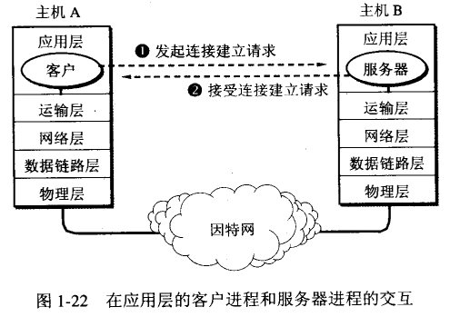 

## ICMP协议

> ICMP：Internet控制报文协议，通常被认为是IP层的一个组成部分。传递差错报文以及其他需要注意的信息。ICMP报文通常被IP层或更高协议（TCP/[UDP](https://so.csdn.net/so/search?q=UDP&spm=1001.2101.3001.7020)）使用。ICMP报文是在IP数据报内被传输的。这里注意**ICMP的功能是检错而不是纠错**.

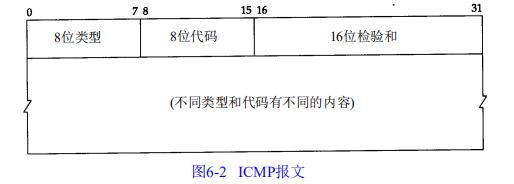

### ICMP报文类型

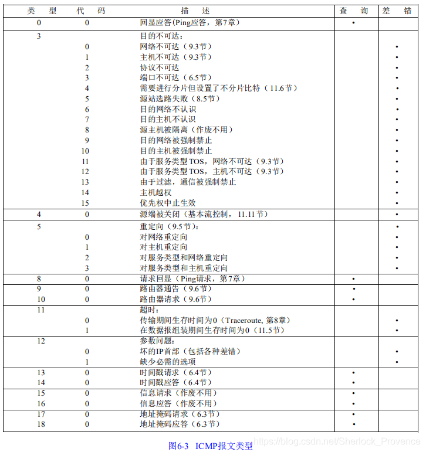

图中为各种类型的ICMP报文对应类型，不同类型由报文中的类型字段和代码字段共同决定。
最后两列则显示此ICMP报文为查询报文还是差错报文，因为ICMP差错报文有时需要做特殊处理，因此我们需要对它们进行区分。
当发送一份ICMP差错报文时，报文始终包含IP的首部和产生ICMP差错报文的IP数据报的前8个字节。这样，接收ICMP差错报文的模块就会把它与某个特定的协议和用户进行联系起来。

### ICMP地址掩码请求与应答
ICMP地址掩码请求用于无盘系统在引导过程中获取自己的子网掩码。系统广播它的ICMP请求报文。无盘系统获取子网掩码的另一个方法时BOOTP协议。ICMP地址掩码请求和应答报文的格式如下：

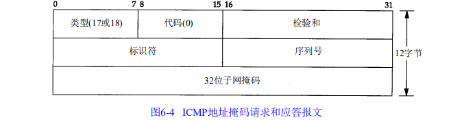

ICMP报文中的标识符和序列号字段由发送端任意选择设定，这些值在应答中将被返回。

### ICMP时间戳请求与应答

> ICMP时间戳请求允许向另一个系统查询当前时间。返回的建议值时自午夜开始计算的毫秒数，协调的统一时间，由于返回的时间是从午夜开始算的，因此调用者必须通过其他方法获取当时的日期，这是它的缺陷。

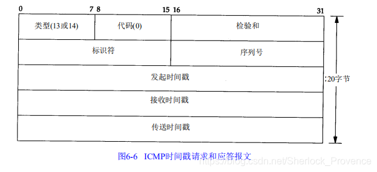

请求端填写发起时间戳，发送报文，应答系统收到请求报文时填写接收时间戳，在发送时填写发送时间戳，但是，实际上，大多数的实现把后面两个字段都设置成相同的值。

### ICMP不可达差错
ICMP差错报文，即端口不可达报文，它是ICMP目的不可到达报文中的一种。

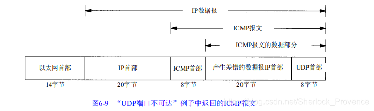

ICMP的一个规则是，ICMP差错报文必须包括生成该差错报文的数据报IP首部，还必须至少包括跟在该IP首部后面的前8个字节

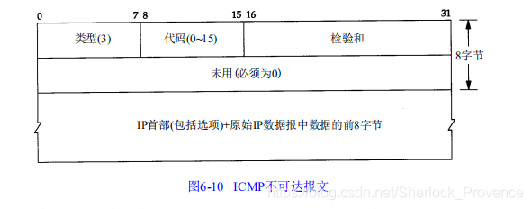

## TCP协议

---

### TCP介绍：

TCP协议，**传输控制协议**（英语：Transmission Control Protocol，缩写为：TCP）是一种**面向连接的、可靠的、基于字节流的**通信协议

TCP把连接作为最基本的抽象单元，每条TCP连接有两个端点，**TCP连接的端点即套接字**。
[套接字](https://so.csdn.net/so/search?q=套接字&spm=1001.2101.3001.7020)socket = （IP地址+端口号）
TCP连接={socket1，socket2}={（IP1:port1），（IP2,port2）}
TCP提供全双工通信。

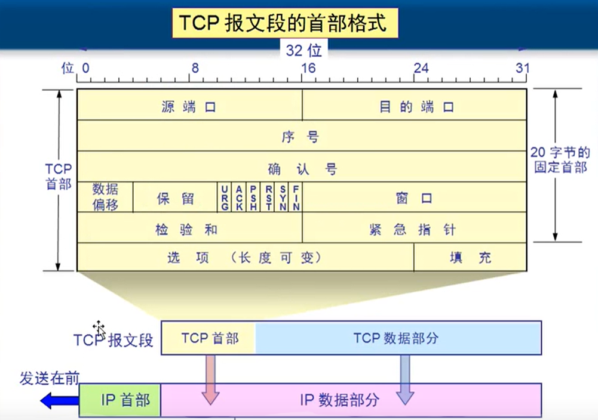

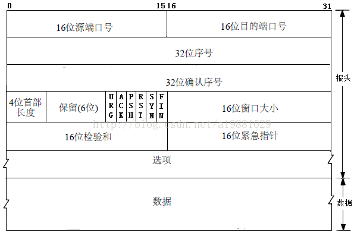

* **源端口号**：本次`TCP`连接中，发起连接的主机使用的端口号；
* **目的端口号**：本次`TCP`连接主，接受连接的主机使用的端口号；
* **序号**：通过TCP传输的每一个数据段，都有一个序号，作用是为了确认此数据段的顺序。网络中允许传输的数据长度是有限制的，所以当我们要通过`TCP`传输一个较大的数据时，`TCP`会将数据切割成很多小的数据段进行传输。而将这些小的数据段发送到目的主机时（发送方会同时发送多个数据），并不能保证它们是按顺序到达目的地，所以对于每一个数据段，都要有一个序号，来标识它们是属于总数据的哪一部分，以保证在目的主机中能将他们重新拼接。
* **确认序号**：接收方若接收到一个数据段，会发送一个确认报文给发送方，告诉发送方已经接收到这个数据段，而确认序号的作用就是告诉发送方接收到了哪条数据段。若接收方接收到了序号为`n`的报文段，则确认序号将是`n+1`，表示它已经接收了`n`，下一条想要接收`n+1`；
* **首部长度**：`TCP`报文的首部+选项的字节数；
* **ACK**：只有`1 bit`的标志位，若为`1`，表示这个数据段中的确认序号是有效的，即这个数据报是对之前接收到的某个报文的确认（一个`TCP`报文可以同时作为确认报文和传递数据报文）。
* **RST**：只有`1 bit`的标志位，若客户端向服务器的一个端口请求建立`TCP`连接，但是服务器的那个端口并不允许建立连接（比如没开启此端口），则服务器会回送一个`TCP`报文，将`RST`位置为1，告诉客户端不要再向这个端口发起连接；
* **SYN**：只有`1 bit`的标志位，若为`1`，表示这是一条建立连接的`TCP`报文段；
* **FIN**：只有`1 bit`的标志位，若为`1`，表示这是一条断开连接的`TCP`报文段；

对于`TCP`报文格式，就先介绍这么多，其余的部分虽然也很重要，但是并没有作用于`TCP`连接的建立与断开，所以就不在这里叙述了。

**不要将确认序号Ack与标志位中的ACK搞混**

**窗口**：表示发送/接收缓存窗口大小。如下图：

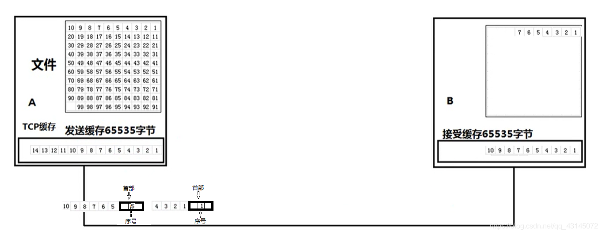

### TCP连接建立与断开

为了保证客户端和服务器端的可靠连接，TCP建立连接时**必须**要进行三次会话，也叫TCP三次握手，**进行三次握手的目的是为了确认双方的接收能力和发送能力是否正常。**

举个栗子
公安局长王哥 和 陈某打电话

公安局：你好！陈某，听得到吗？（一次会话）
陈某：听到了，王哥，你能听到吗 （二次会话）
公安局：听到了，你过来自首吧 （开始会话）（三次会话）

通过这个例子我们可以知道三次会话的目的就是为了确保双方的连接正常，同理，TCP三次握手也是这个过程。

`TCP`建立连接的过程中需要发送三次报文，所以`TCP`建立连接也被称为**三次握手**，接下来我就来讲讲这三次握手的过程，假设客户端向服务器发起`TCP`连接：

- **第一步**：客户端的`TCP`程序首先向服务器的`TCP`程序发送一个`TCP`报文。这个报文不包含数据，且它的`SYN`标志位被置为`1`，表示这是一条建立连接的`TCP`报文段，因此这个报文段也被称为**SYN报文段**。客户端的`TCP`程序随机选择一个序号作为客户端报文的初始序号（假设序号为`client_isn`），放入这个报文段的序号部分。这个报文段由运输层传递到网络层后，被封装在一个`IP`数据报中发往服务器；
- **第二步**：包含`SYN`报文段的`IP`数据报被服务器接收，服务器的网络层将`SYN`数据报抽取出来，交给运输层，同时服务器为该`TCP`连接分配资源（包括发送缓存、接收缓存和变量等），并向客户发送允许连接的`TCP`报文段。这条允许连接的报文段不包含数据，`SYN`标志位也被置为`1`，同时它的`ACK`标志位也被置为1，表示它是`SYN`报文段的确认报文，所以这条允许连接的报文段也被称为**SYNACK报文段**。服务器随机选择一个序号，作为服务器报文段的初始序号（假设称为`server_isn`），并将其放入`SYNACK`报文段的序号部分，同时确认号字段被设置为`client_isn + 1`（`SYN`报文段的序号+1）。这个报文段可以解释为服务器向客户端说：“我收到了你的连接请求，我允许你连接，我的初始序号是`server_isn`”。
- **第三步**：当客户端接收到`SYNACK`报文段后，它也将为`TCP`连接分配资源（缓存和变量），同时生成一条`SYNACK`报文段的确认报文，并发送给服务器。由于经过上面两个步骤，已经算是建立了连接，所以这次的`SYN`标志位将被置为`0`，而不是`1`（`ACK`标志位是`1`）。同时，这条报文段的序号被设置为`client_isn + 1`（第一条客户报文的序号是`client_isn`，而这是它的下一条，所以`+1`），而确认序号被设置为`server_isn + 1`（第一条服务器报文的序号是`server_isn`，客户端成功接收，所以期望服务器下一次发送`server_isn + 1`）。和上面两条报文不同，第三条报文可以携带数据，比如`HTTP`的请求就是在`TCP`的第三次握手报文中发送到服务器的。

  经过上面这三个步骤，`TCP`连接就算正式建立完毕，客户端和服务器可以相互发送数据了。下面是这个过程的图片形式：

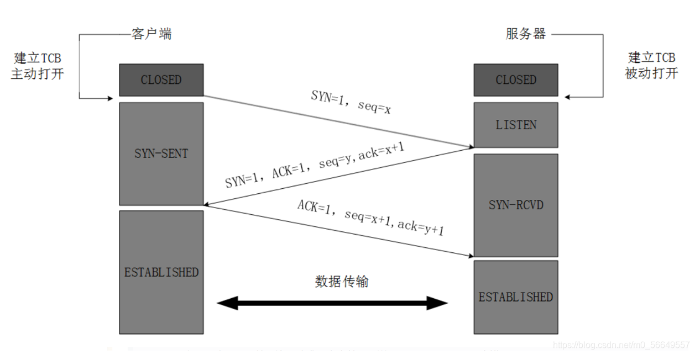

### 为什么是三次握手而不是两次

  首先我们要明确，两次握手是必要的。第一次握手，客户端将`SYN`报文发送到服务器，服务器接收到报文后，即可确认客户端到服务器是可达的；而服务器向客户端发送响应的`SYNACK`报文，客户端接收到后，即可确认服务器到客户端也是可达的。至此，连接已经算是建立，那为什么还要有第三次握手呢？

  客户端和服务器的握手过程，不仅仅是确认互相可达的过程，更重要的是一个**同步**的过程，`SYN`就是同步（Synchronize）的缩写。对于`TCP`报文段来说，**序号**是一个至关重要的部分，它保证了`TCP`传输数据的完整性。而我们上面也说过，`TCP`报文的初始序号不是从`0`开始的，而是一个随机的序号，**而所谓的同步，就是`TCP`客户端和服务器互相同步初始序号的过程**。第一次握手，客户端发送`SYN`报文，将自己的初始序号发送到了服务器，服务器接收到后，向客户端发送`SYNACK`报文段，告诉客户端已经收到了它的初始序号，同时在这个报文段中带上了自己的初始序号。这个时候，第三次握手的作用就出来了：**第三次握手实际上就是客户端在告诉服务器，自己已经收到了它的初始序号，完成了同步，可以开始相互传输数据了**。若没有第三次握手，服务器将无法保证客户端接收到了自己的`SYNACK`报文段，若此时`SYNACK`报文段丢失，客户端不知道服务器的初始序号，将无法处理之后到达客户端的数据。

  在很多书籍和网上的博客中还流传另外一种说法。若仅仅是两次握手，将产生以下问题：客户端向服务器发送`SYN`报文段请求建立连接，但是没有在指定时间内收到`SYNACK`报文段，所以客户端认为`SYN`报文段在网络中丢失，则再次发送`SYN`报文段，并成功接收到了`SYNACK`报文段，但是客户端在很短的时间内就断开了`TCP`连接。然而，最初的`SYN`报文并没有丢失，只是传输时延太长，过了许久才到达。等它到达服务器时，其实客户端已经与服务器建立过`TCP`连接，并且已经断开了。此时服务器接收到这条`SYN`报文段，以为客户端又想建立一条新的连接，于是向客户端回送`ACK`报文，并为连接分配了资源。由于没有第三次握手，服务器将不知道这其实是上一次连接的报文，于是将它创建一个新的`TCP`连接并维持，直至因为太久没有接收到数据而释放。这种情况非常浪费资源，所以为了防止这种情况的发生，才需要客户端的再一次确认。

  实际上，上面所述的第一点才是`TCP`三次握手的原因，第二个只能算是顺带的好处吧，从建立连接的报文被称为`SYN`（同步）就可以看出这点。

### TCP四次挥手的过程

  说完了三次握手，下面来说说四次挥手的过程。`TCP`在断开连接时，客户端与服务器之间要交换四次报文，所以，`TCP`的断开连接也叫四次挥手。

- **第一步**：客户端进程发出断开连接指令，这将导致客户端的`TCP`程序创建一个特殊的`TCP`报文段，发送到服务器。这个报文段的`FIN`字段被置为1，表示这是一条断开连接的报文；
- **第二步**：服务器接收到客户端发来的断开连接报文，向客户端回送这个报文的确认报文（`ACK`字段为`1`），告诉服务器已经接收到`FIN`报文，并允许断开连接；
- **第三步**：服务器发送完确认报文后，服务器的`TCP`程序创建一条自己的断开连接报文，此报文的`FIN`字段被置为`1`，然后发往客户端；
- **第四步**：客户端接收到服务器发来的`FIN`报文段，则产生一条确认报文（`ACK`为`1`），发送给服务器，告知服务器已经接收到了它的断开报文。服务器接收到这条`ACK`报文段后，释放`TCP`连接相关的资源（缓存和变量），而**客户端等待一段时间后**（半分钟、一分钟或两分钟），也释放处于客户端的缓存和变量；

  以上就是四次挥手的过程，相对建立连接来说要简单一些。以上是以客户端请求断开连接来举例，但其实也可以由服务器断开连接。

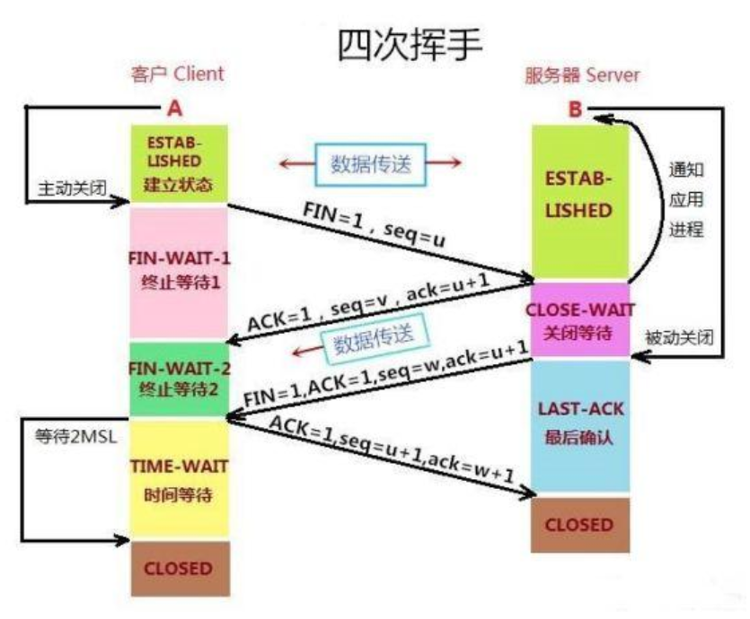

### 客户端为什么要等待一段时间再释放资源

看完上面四次挥手的过程，可能有的人会有疑问，四次挥手之后，连接不是已经断开了吗，为什么客户端还要等待一段时间再释放资源呢？原因有两个：

- **原因一**：客户端接收到服务器发送的`FIN`报文后（第三次挥手），会回送一条确认报文（第四次挥手），但是，客户端并不知道这条确认报文是否可以顺利到达服务器。若这条确认报文在传送到服务器的过程中损坏、丢失或超时，将引起服务器重新发送`FIN`报文，客户端接收到后，将需要再次发送一条确认报文，直到服务器正确接收。但是，客户端发送确认报文后，立刻释放资源，将导致无法处理重传的`FIN`报文，所以客户端需要等待一段时间，直到确认没有出现上述情况出现再释放资源。
- **原因二**：`TCP`四次挥手完成后，理论上已经断开了连接，但是这不代表之前通过这条连接发送的所有数据都处理完毕了，有些可能还在网络中传输。若在四次挥手后，立即释放客户端的资源，然后客户端立即以同一个源端口，向服务器的同一个目的端口再次建立一个`TCP`连接，这个连接和上一个的 源端口+源`IP`+目的端口+目的`IP` 都一模一样，此时将会产生问题。若上一次连接遗留在网络中的报文此时到达，将会被当做新连接传输的数据处理，于是可能会产生一些不可预估的错误。所以，客户端在断开连接后，需要等待一段时间，直到网络中遗留的数据都死掉，才释放资源，而在资源没有被释放前，是不允许建立一个 源端口+源`IP`+目的端口+目的`IP` 都一模一样的`TCP`连接的（因为`TCP`套接字由这四部分标识）。

### 断开连接为什么需要四次挥手

  有的人可能也会想，断开连接为什么是四次挥手，不能是两次呢？其中一方请求断开连接，另一方确认即可，为什么这个过程需要两边各发起一次？原因就是：**TCP连接是全双工的**。什么是全双工，即`A`与`B`建立连接，则`A`可以向`B`发送数据，而`B`也可以向`A`发送数据。

  我们知道断开连接的请求什么时候发起？当然就是在不再有数据需要发送时。我们依旧以客户端向服务器断开连接为例。假设客户端和服务器建立了一个`TCP`连接，在客户端需要向服务器发送的数据都发送完后，客户端就可以向服务器发送一个`FIN`报文段，请求断开连接；服务器接收到后，将会回送一个`ACK`报文，告诉客户端，自己已经收到了它断开连接的请求。若只有两次挥手，这个时候连接就算是断开了。但是这样真的合理吗？答案当然是否定的。

  客户端发送完数据后，告诉服务器，我没有数据了，可以和你断开，但是不代表服务器没有数据需要发送到客户端了呀。`TCP`是一个全双工的连接，代表服务器也有可能有数据需要发送到客户端。所以，只有当两端的数据都发送完毕，连接才能安全的断开。因此，服务器接收到了客户端的`FIN`报文段，他会等到自己所有的数据发送完，然后也向客户端发送一个`FIN`报文，告诉客户端我也没数据了，这时候连接才能真正断开，两端各自释放资源。

### 关与Wireshark抓包显示的“三次握手问题”

> 为什么抓到的 TCP 挥手是三次，而不是书上说的四次？

因为服务器端收到客户端的 `FIN` 后，服务器端同时也要关闭连接，这样就可以把 `ACK` 和 `FIN` 合并到一起发送，节省了一个包，变成了“三次挥手”。

而通常情况下，服务器端收到客户端的 `FIN` 后，很可能还没发送完数据，所以就会先回复客户端一个 `ACK` 包，稍等一会儿，完成所有数据包的发送后，才会发送 `FIN` 包，这也就是四次挥手了。

如下图，就是四次挥手的过程：

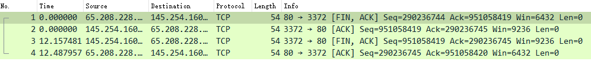

## UDP协议

---

### UDP协议工作原理

UDP（User Datagram Protocol，用户数据报协议）是一种无连接的传输层协议，具有简单、高效的特点，适用于一些对数据可靠性要求不高的应用场景。UDP协议通过将数据分割成小的数据包进行传输，每个数据包都包含源端口号和目标端口号信息，以便接收方能够正确地将数据包交给相应的应用程序。

UDP协议的工作原理如下：

发送端：当UDP想要传送数据时，它会抓取来自应用程序的数据，并尽可能快地将其发送到网络上。在这个过程中，UDP不会建立连接，因此无需等待接收方的响应，其传输速度仅受应用程序生成数据的速度、计算机能力和传输带宽的限制。
数据包：UDP协议将数据分割成小的数据包，每个数据包都包含源端口号和目标端口号，以及长度和校验和等字段。其中，校验和用于检测数据的完整性，以确保数据在传输过程中没有被损坏。
接收端：在接收端，UDP将每个消息段放在队列中，应用程序每次从队列中读取一个消息段进行处理。由于UDP不保证数据的可靠传输，因此接收方需要自行处理可能的数据丢失或乱序问题。

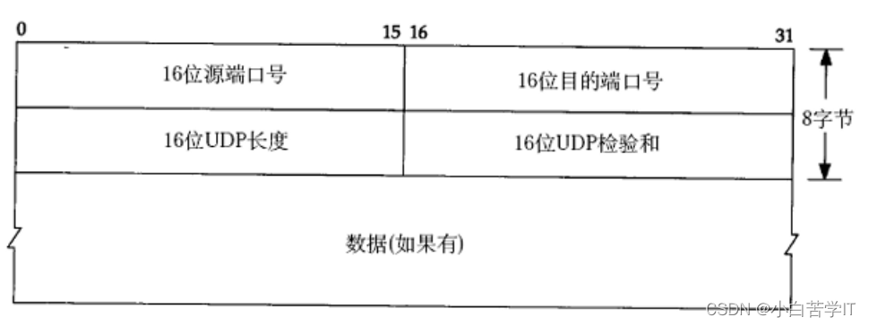

- 16位UDP长度, 表示整个数据报(UDP首部+UDP数据)的最大长度;
- 如果校验和出错, 就会直接丢弃;

## TCP和UDP的区别

---

| 区别     | udp                                                  | tcp                                  |
| -------- | ---------------------------------------------------- | ------------------------------------ |
| 面向连接 | 面向非连接                                           | 面向连接                             |
| 传输速度 | 快                                                   | 慢                                   |
| 可靠性   | 不可靠                                               | 可靠                                 |
| 应用场景 | 数据量小，对可靠性要求不很高的场景。比如：qq发送消息 | 数据量相对较大，对可靠性要求高的场景 |

 

## Http协议

---

（1）首先，http、tcp、udp并不是在一个层（osi七层模型）中，http在应用层，tcp和udp在传输层。

（2）http是基于tcp的，因为发送http请求时，会先进行tcp三次握手的连接。

（3）http的长连接与短连接，其实就是tcp的长连接与短连接。http1.1开始默认使用长连接，也就是 connection 默认使用 keep-alive关键字。长连接就是只需要在第一次连接时进行tcp三次握手，接下来就不需要了，可以一直使用这个连接，不会立即关闭，与短连接不同。短连接是，每次client和server进行http操作就建立一个连接，请求结束就中断连接。虽然http1.0支持长连接，但是默认的还是短连接。

### HTTP/1.0

是无状态、无连接的应用层协议。

* 无连接：每次请求都要建立连接，需要使用 keep-alive 参数建立[长连接](https://so.csdn.net/so/search?q=长连接&spm=1001.2101.3001.7020)、HTTP1.1默认长连接keep-alive
* 无法复用连接，每次发送请求都要进行TCP连接，TCP的连接释放都比较费事，会导致网络利用率低

### HTTP/1.1

> 

#### 特点

1. 简单
   HTTP 基本的报文格式就是 header + body，头部信息也是 key-value 简单文本的形式，易于理解
2. 灵活、易扩展
   各类请求方法、URL、状态码，等每个组成都没有固定死，开发者可以自定义与扩充
   HTTP在应用层其下层可以灵活变化（https就是HTTP与TCP之间增加SSL/TSL安全传输协议）
3. 应用广泛、支持跨平台

#### 优缺点

1. 无状态
   好处：服务器不用额外资源记录，减轻服务器负担，提高CPU内存利用效率
   坏处：每次都要确认验证信息；一般通过Cookie解决（Cookie 通过在请求和响应报文中写入 Cookie 信息来控制客户端的状态。）
2. 明文传输： 传输过程中信息可以抓包直接获取，信息暴露、安全性差
3. 不安全：
   通信使用明文传输、信息泄露
   不验证通信双方身份、有可能进入伪装网站
   无法证明报文完整性都导致不安全的问题

解决方式：可以用 HTTPS 的方式解决，也就是通过引入 SSL/TLS 层，使得更安全。

### HTTP协议层次结构图

现在主流浏览器大部分使用的都是HTTP/1.1协议，也有部分支持HTTP/2.0；绝大部分网站都升级为HTTPS更保证安全性

## 参考：

---

1. 《计算机网络——自顶向下方法（原书第七版）》
2. ### 多篇博客