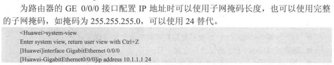
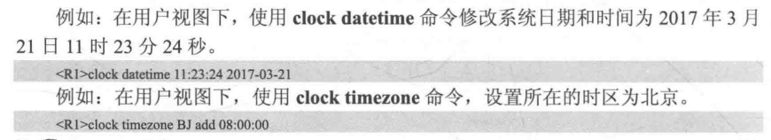

# eNSP使用

---

## 1. 基本概念
> 1.VRP概念：通用路由平台，华为公司数据通信产品的通用网络操作系统平台，拥有一致的网络界面、用户界面和管理界面。
>
> 2.VRP作用：通过命令行对设备下发各种命令实现对设备的配置和日常维护操作。
>
> 3.命令行接口（CLI）：用户登录到路由器后出现命令行提示符，是用户与路由器进行交互的常用工具。


什么是**WAN**口：

> 广域网接口，连接猫或光猫、入户光纤宽带等外部网络；

什么事**LAN**口：

> 本地网接口，连接台式电脑、笔记本，电视机、交换机等内部网络，将一根网线一端连接任意一个LAN口，一端连接自己家里需要联网的设备；


## 为什么需要VLAN

早期以太网是一种基于CSMA/CD（Carrier Sense Multiple Access/Collision Detection）的共享通讯介质的数据网络通讯技术。当主机数目较多时会导致冲突严重、广播泛滥、性能显著下降甚至造成网络不可用等问题。通过二层设备实现LAN互连虽然可以解决冲突严重的问题，但仍然不能隔离广播报文和提升网络质量。

在这种情况下出现了VLAN技术。这种技术可以把一个LAN划分成多个逻辑的VLAN，每个VLAN是一个广播域，VLAN内的主机间通信就和在一个LAN内一样，而VLAN间则不能直接互通，广播报文就被限制在一个VLAN内。如下图所示。


因此，VLAN具备以下优点：

- **限制广播域**：广播域被限制在一个VLAN内，节省了带宽，提高了网络处理能力。
- **增强局域网的安全性**：不同VLAN内的报文在传输时相互隔离，即一个VLAN内的用户不能和其它VLAN内的用户直接通信。
- **提高了网络的健壮性**：故障被限制在一个VLAN内，本VLAN内的故障不会影响其他VLAN的正常工作。
- **灵活构建虚拟工作组**：用VLAN可以划分不同的用户到不同的工作组，同一工作组的用户也不必局限于某一固定的物理范围，网络构建和维护更方便灵活。

## 常用指令

进入用户视图<Huawei>

```sh
system-view
```


命令视图[Hwawei]下——sysname命令——修改路由器名称。

```sh
sysname R1
```

命令视图 [ Huawei ]——interface——进入接口视图——配置——return——直接回到用户视图

接口视图功能：使用ip address 命令配置接口IP地址、子网掩码



1.clock datetime命令：设置当前时间和日期（用户视图）
2.clock timezone命令：设置所在时区（命令视图）
【注意：一般先配置时区，再配置时间和日期】



关闭烦人的提示信息：

```
un in en //关闭烦人的提示信息
```


路由配置IP地址：

```
int g 0/0/0
ip add 192.168.1.1 24
```

配置PC的春地址与网关：

```
ip add 192.168.1.2 24
gateway 192.168.1.254
```


创建VLAN

```
vlan 10 //这个意思是创建一个vlan 10组别
```

```
vlan batch 10 20 30 //
```


进入对应接口并进行管理

```
int g 0/0/1 //意思是进入001号接口
```

配置接口类型为access类型

```
port link-type access //配置端口类型
```

配置当前端口为指定vlan放行

```
port default vlan 10 //这里就是指定放行或者说接入vlan10
```


配置接口类型为trunk类型

```
port link-type trunk //配置端口类型
```

```
port trunk allow-pass vlan all  //这个意思就是设置trunk为放行所有的vlan
```


关于accss和truck端口的区别：

> 1、端口用途不同：truck端口为与其它交换机端口相连的VLAN汇聚口，access端口为交换机与VLAN域中主机相连的端口；
>
> 2、trunk一般是打tag标记的，一般只允许打了该tag标记的vlan通过，所以该端口可以允许多个打tag标记的vlan通过，而accss端口一般是untag不大标记的端口，而且一个access vlan端口只允许一个access vlan 通过。
>
> Access类型端口：只能属于1个VLAN，一般用于连接计算机端口；
>
> Trunk类型端口：可以允许多个VLAN通过,可以接收和发送多个VLAN 报文,
>
> 一般用于交换机与交换机相关的接口。
>
> Hybrid类型端口：可以允许多个VLAN通过，可以接收和发送多个VLAN 报文，
>
> 可以用于交换机的间连接也可以用于连接用户计算机。


配置当前接口所属VLAN

```
port default vlan 10  //配置接口的所属vlan
```

```
dis vlan   //查看vlan配置
```


开启DHCP功能

```
dhcp enable
```

创建IP地址池

```
ip pool aa
```

给IP地址池添加IP地址网段

```
network 10.1.1.0 mask 24
```

给ip地址配置网关

```
gateway-list 10.1.1.1
```

配置DNS

```
dns-list 1.1.1.1
```

选择DHCP配置方式

```
dhcp select global
```

查看所有对应端口配置

````
dis port vlan //
````

查看跳表

```
tracert xxx.xxx.xxx.xxx 
```

创建链路聚合

```
in eth 1 //创建链路聚合，标签为1
```

进入链路聚合标签

```
in eth1 //进入链路聚合标签1
```

将当前接口添加到指定标签的链路聚合里面

```
eth 1 //把当前接口加入到标签名称为1的链路聚合里面，记住此指令必须要先进入需要加入的接口才能使用
```

设定acl

```
acl 2000 //这里2000-2999指的是基本acl
acl 3000-3999  //这里是高级acl，功能指定更多
```

详细参考：

[华为-ACL-访问控制列表（基础理论与配置实验详解）_ensp设置acl自动排序-CSDN博客](https://blog.csdn.net/BIGmustang/article/details/107662274)

设定rule

```
rule 1 premit source 172.16.1.0 0.0.0.255
//这里意思是允许所有172.16.1.x网段的ip给过
```

**这里一定要注意，默认情况下，是所有流量都给直接通过，所以要拦截的时候一定要注意设定好deny any**


## 如何配置虚拟用户终端？

---

1、进入虚拟用户终点接口

```
uer-interface vty 0 4 //进入虚拟用户终端接口,这里0 4代表可以同时有5个用户登录
authentication-mode password  //设置认证模式为密码认证
set authentication password cipher huawei //设置密码为密文格式的“huawei”
user privilege level 3 //设置用户权限等级为3，登录权限范围为0-15，其中0-2只具备用户视图权限，3-15具备系统视图权限（相当于最高权限）
```


## aaa模式认证

---

> AAA提供的安全服务具体是指：
>
> - 认证（Authentication）：是对用户的身份进行验证，判断其是否为合法用户。
> - 授权（Authorization）：是对通过认证的用户，授权其可以使用哪些服务。
> - 计费（Accounting）：是记录用户使用网络服务的资源情况，这些信息将作为计费的依据。

>  配置aaa模式，设置账户为 admin 密码为123456（只是为了认证，才是简单密码），并设置用户等级为3
>
> ```
> aaa
> user
> local-user admin password cipher 123456 privilege level 3
> local-user admin service-type telnet //配置该用户的接类型为telnet
> ```
>
>  进入VTY界面，将认证模式修改为aaa


## 如何设置直接进入控制台就需要密码？

> 设置密码：
>
> ```
> user-interface console 0 //进入控制台
> set authentication password cipher nihao mima
> authenticcation-mode password 开启mima
> idle-timeout 1 //设置时间
> ```
>
> 取消密码：
>
> ```
> user-interface console 0 //进入控制台
> undo authenticcation-mode //取消掉密码
> ```
>


## 路由如何和交换机通讯（ping通）

> 注意！！！ 交换机对应路由相连接的接口一定要配置access，并且一定要绑定一个vlan，这个vlan也必须要有地址。不能使用trunk，不然无效！！！！！！！！！！！！！


## 三步设置NAT：

### 第一步：建立nat地址访问表（就是从这里出去访问外网的时候，用什么地址）

> ```
> nat address-group 1 64.1.1.4 64.1.1.4       //这个意思使用64.1.1.4到64.1.1.4这个区间的地址去访问
> ```


不同Vlan之间通讯

```
//交换机可以子接口划分，直接进入子接口0.10，建议与vlan一致
[R1]int g0/0/0.10
//配置vlan封装结构，（dot1q为IEEE802.1q协议，该子接口属于vlan10）
[R1-GigabitEthernet0/0/0.10]dot1q termination vid 10
//为该子接口添加ip地址（即vlan10下面所属主机的网关地址）
[R1-GigabitEthernet0/0/0.10]ip address 192.168.10.1 24
//开启向下arp广播请求功能
[R1-GigabitEthernet0/0/0.10]arp broadcast enable 
//进入子接口0.10，建议与对应的vlan一致
[R1-GigabitEthernet0/0/0.10]int g0/0/0.20
//配置vlan封装结构，同上
[R1-GigabitEthernet0/0/0.20]dot1q termination vid 20
//为该子接口添加ip地址，同上
[R1-GigabitEthernet0/0/0.20]ip address 192.168.20.1 24
//开启广播请求功能，同上
[R1-GigabitEthernet0/0/0.20]arp broadcast enable 
```


终结vlan

```
dot1q termination vid 10                    //配置子接口的终结VLAN ID
```

开启子接口的ARP广播功能

```
arp broadcast enable
```

