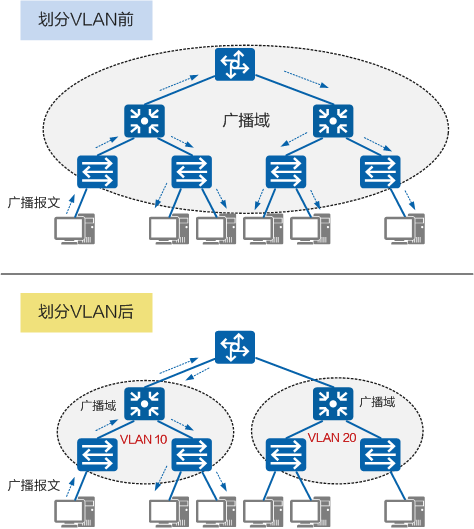
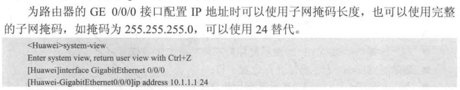
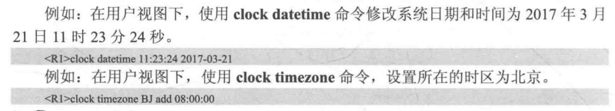

# eNSP使用

---

## 1. 基本概念
> 1.VRP概念：通用路由平台，华为公司数据通信产品的通用网络操作系统平台，拥有一致的网络界面、用户界面和管理界面。
>
> 2.VRP作用：通过命令行对设备下发各种命令实现对设备的配置和日常维护操作。
>
> 3.命令行接口（CLI）：用户登录到路由器后出现命令行提示符，是用户与路由器进行交互的常用工具。


什么是**WAN**口：

> 广域网接口，连接猫或光猫、入户光纤宽带等外部网络；

什么事**LAN**口：

> 本地网接口，连接台式电脑、笔记本，电视机、交换机等内部网络，将一根网线一端连接任意一个LAN口，一端连接自己家里需要联网的设备；


## 为什么需要VLAN

早期以太网是一种基于CSMA/CD（Carrier Sense Multiple Access/Collision Detection）的共享通讯介质的数据网络通讯技术。当主机数目较多时会导致冲突严重、广播泛滥、性能显著下降甚至造成网络不可用等问题。通过二层设备实现LAN互连虽然可以解决冲突严重的问题，但仍然不能隔离广播报文和提升网络质量。

在这种情况下出现了VLAN技术。这种技术可以把一个LAN划分成多个逻辑的VLAN，每个VLAN是一个广播域，VLAN内的主机间通信就和在一个LAN内一样，而VLAN间则不能直接互通，广播报文就被限制在一个VLAN内。如下图所示。




因此，VLAN具备以下优点：

- **限制广播域**：广播域被限制在一个VLAN内，节省了带宽，提高了网络处理能力。
- **增强局域网的安全性**：不同VLAN内的报文在传输时相互隔离，即一个VLAN内的用户不能和其它VLAN内的用户直接通信。
- **提高了网络的健壮性**：故障被限制在一个VLAN内，本VLAN内的故障不会影响其他VLAN的正常工作。
- **灵活构建虚拟工作组**：用VLAN可以划分不同的用户到不同的工作组，同一工作组的用户也不必局限于某一固定的物理范围，网络构建和维护更方便灵活。

## 常用指令

进入用户视图<Huawei>

```sh
system-view
```


命令视图[Hwawei]下——sysname命令——修改路由器名称。

```sh
sysname R1
```

命令视图 [ Huawei ]——interface——进入接口视图——配置——return——直接回到用户视图

接口视图功能：使用ip address 命令配置接口IP地址、子网掩码



1.clock datetime命令：设置当前时间和日期（用户视图）
2.clock timezone命令：设置所在时区（命令视图）
【注意：一般先配置时区，再配置时间和日期】



路由配置IP地址：

```
int g 0/0/0
ip add 192.168.1.1 24
```

配置PC的春地址与网关：

```
ip add 192.168.1.2 24
gateway 192.168.1.254
```

