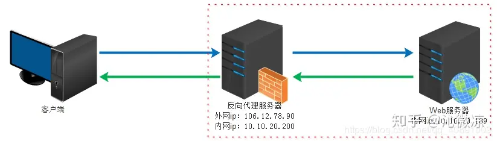
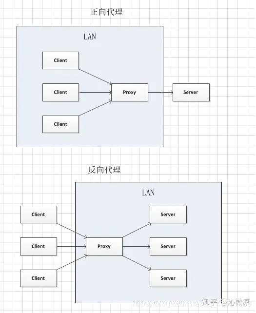

# 正向代理和反向代理

## 一、代理

---

代理就相当于中间商,本来A和B是可以直接连接的,但是此时添加了一个C在中间,A跟B不直接连接,而是通过C作为中介进行连接。最常见的例子就是二手东,其实很多我们租房子时签约的人不是房子的真正房东,而是房东委托的中介,房东不想管事或者房子太多,只靠自己无法进行管理,所以才会通过中介(代理)进行处理,像蛋壳、自如这样的租房软件其实也是中介的一种,真正的房东是直接将房子委托给这样的第三方中介进行出租。

一个完整的请求是由: client(客户端) -> proxy(代理) -> server(服务端) 组成。

## 二、正向代理

---

正向代理: 顺着请求的方向进行的代理，即代理服务器它是由你配置为你服务，去请求目标服务器地址。

举例一: 如我们现在想要访问谷歌,但是由于某些原因,无法直接访问到谷歌,我们可以通过连接一台代理服务器,代理服务将我们的请求提交到谷歌,然后再将谷歌的响应反馈给我们,对于谷歌而言,它只知道有一个请求过来,但是它并不会知道我们是无法直接访问它的。

正向代理的作用:

1. 访问原来无法访问的资源，如google
2. 可以做缓存，加速访问资源
3. 对客户端访问授权，上网进行认证
4. 代理可以记录用户访问记录（上网行为管理），对外隐藏用户信息

## 三、反向代理

---

反向代理: 跟正向代理相反,它是为目标服务器进行服务的,但是请求的流程还是: clieng -> proxy -> server。

举例: 比如我们访问百度网站，百度的代理服务器对外的域名为 [https://www.baidu.com](https://link.zhihu.com/?target=https%3A//www.baidu.com) 。具体内部的服务器节点我们不知道。现实中我们通过访问百度的代理服务器后，代理服务器给我们转发请求到他们N多的服务器节点中的一个给我们进行搜索后将结果返回,此时,代理服务器对我们客户端来说就充当了提供响应的服务器,但是对于目标服务器来说,它只是进行了一个请求和转发的功能。

反向代理的作用:

1. 保证内网的安全，阻止web攻击，大型网站，通常将反向代理作为公网访问地址，Web服务器是内网。
2. 负载均衡，通过反向代理服务器来优化网站的负载。

## 四、两者的区别与联系

---

正向代理即是客户端代理, 代理客户端, 服务端不知道实际发起请求的客户端.

反向代理即是服务端代理, 代理服务端, 客户端不知道实际提供服务的服务端.

联系:

1、正向代理中，proxy和client同属一个LAN，对server透明；

2、反向代理中，proxy和server同属一个LAN，对client透明。

## 五、总结

---

事实上,正向代理和反向代理的作用都是进行请求和转发,但是为了区别正向代理,所以后出现的就成为反向代理。

生活中最常见的例子:

1、正向代理: 卖票的黄牛

2、反向代理: 出租房的二手东

文章截自：[一文帮你梳理清楚「正向代理和反向代理的区别与联系」 - 知乎 (zhihu.com)](https://zhuanlan.zhihu.com/p/163948996)

