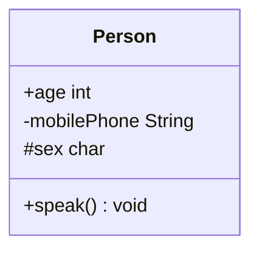

# UML类图

---

一、UML基础知识扫盲

1、概念 ： UML这三个字母的全称是Unified Modeling Language，直接翻译就是**统一建模语言**，简单地说就是一种有特殊用途的语言。

2、作用 ：UML可帮助我们做软件需求分析和软件设计的工作，是系统分析和设计阶段的重要产物，也是系统编码和测试的重要模型依据。

3、分类
1） **静态图** ：主要描绘了类、对象和数据结构及其存在于他们之间的关系。 **类图就是其中一种**。
2）动态图 : 主要描绘执行流程、实体改变状态的方式。例如 ： 流程图
3）物理图 ： 描绘库文件、字节文件和数据文件等以及存在于他们之间的关系

二、如何用**类图**表示一个类

类图: 用于描述系统中所包含的类以及它们之间的相互关系，帮助人们简化对系统的理解，它是系统分析和设计阶段的重要产物，也是系统编码和测试的重要模型依据。



对应Java如下代码：

```java
public class Person {

    public int age;

    private String mobilePhone;

    protected char sex;

    public static void speak(){

    }

}
```

1、- 是[private](https://so.csdn.net/so/search?q=private&spm=1001.2101.3001.7020) 的意思，对应私有成员(变量、方法)

2、+ 是public 的意思，公开给外部访问的成员(变量、方法)

3、# 是[protected](https://so.csdn.net/so/search?q=protected&spm=1001.2101.3001.7020)的意思，只能在本类或子类访问成员(变量、方法)

4、UML 规定的属性(Attribute)表达式

>    可见性 名称:类型 [ = 缺省值 ]
>
> 其中 :
>
> 1> 可见性 :表示该属性对于类外的元素而言是否可见，
>          包括公有(public)、私有(private)和受保护(protected)三种，
>          在类图中分别用符号+、-和#表示
>
> 2> 名称  :表示属性名，用一个字符串表示
>
> 3> 类型  :表示属性的数据类型，可以是基本数据类型，也可以是用户自定义类型
>
> 4> 缺省值 :是一个可选项，即属性的初始值。

5、UML方法(Operation)表达式

> 可见性 名称(参数列表) [ : 返回类型]
>
> 其中 :
>
> 1> 可见性   :  定义与属性的可见性定义相同
>
> 2> 名称     : 即方法名，用一个字符串表示
>
> 3> 参数列表 : 表示方法的参数，其语法与属性的定义相似，参数个数是任意的，多个参数之间用逗号“，”隔开
>
> 4> 返回类型 : 是一个可选项，表示方法的返回值类型，
>              依赖于具体的编程语言，可以是基本数据类型，
>              也可以是用户自定义类型，还可以是空类型(void)，
>              如果是构造方法，则无返回类型。

6、内部类的表示

