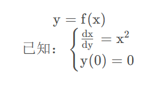

# 一元微分

---

## 常考题型

* 导数和微分的概念
* 微分法和导数的计算
* 切线问题
* 凹凸函数的性质与判断
* 求函数在定义域上的单调区间与极值点，凹凸区间与拐点
* 求渐进现金的问题。

> 求极限时，当分子抽象为函数，考虑用导数定义求解试试
>
> 导数的定义：设函数$y=f(x)在x_0 的某临域有定义，若极限\lim\limits_{△x \to 0}{x_0+△x \over △x}$
>
> ==注：== 这里三个△x必须都要一样

 曲线上任意一点处的切线斜率等于该点的横坐标的平方，且曲线过坐标的原点，求曲线的方程

微分方程的定义：含有未知函数其导数或微分的方程，称之为微分方程

微分方程通过积分来求解

方程的阶：含有未知函数导数方程中其导数的最高阶数

