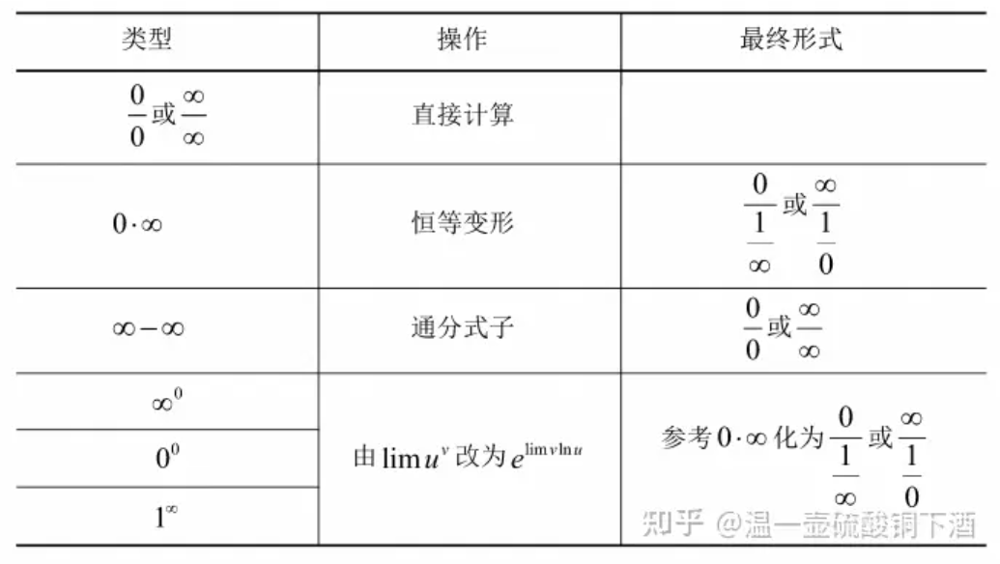

# 函数求极限

---

## 常用的求极限方法（8种）

> 方法1 利用基本极限求极限
>
> 方法2 利用等价无穷小代换求极限
>
> 方法3 利用有理运算法则求极限
>
> 方法4 利用洛必达法则求极限
>
> 方法5 利用泰勒公式求极限
>
> 方法6 利用夹逼原理求极限
>
> 方法7 利用单调有界准则求极限
>
> 方法8 利用定积分定义求极限

### 方法1 利用基本极限求极限

1）常用的基本极限   

> $\lim\limits_{x\rarr0} \frac{sin x}{x} = 1$
>
> $\lim\limits_{x\rarr0}(1+x)^\frac{1}{x} = e$ 
>
> $\lim\limits_{x\rarr\infty}(1+\frac{1}{x})^x=e$ （这里注意一下，比如$\lim\limits_{x\to \infty}(1+{(\pm)a \over x})^x = e^{(\pm)a}$）
>
> $\lim\limits_{x\rarr0}\frac{a^x-1}{x} = \ln a$
>
> $\lim\limits_{n\to \infty}{\sqrt[n]{n}} = 1$
>
> $\lim\limits_{n\to \infty}\sqrt[n]{a} =1,(a>0)$
>
> $\lim\limits_{x\to \infty}{a_n x^n+a_{n-1} x^{n-1}+...+a_1x+a_0 \over b_mx^m + b_{m-1} x^{m-1}+...+b_1x+b_0} = \begin{cases}{a_n \over b_m},n=m,\\ 0,n<m,\\ \infty, n>m.\end{cases}$
>
> $\lim\limits_{x \to \infty}x^n = \begin{cases} 0,|x|<1,\\ \infty, |x|>1, \\ 1,x=1, \\ 不存在, x=-1.\end{cases}$
>
> $\lim\limits_{n\to \infty} e^{nx} = \begin{cases} 0,x<0,\\ +\infty,x>0, \\ 1, x=0.\end{cases}$

2）"$1^{\infty}$" 型极限常用结论

> 若$\lim{\alpha(x)}=0, \lim{\beta{(x)}=\infty}，且\lim{\alpha(x)\beta(x) = A}$
>
> 则$\lim{(1+\alpha(x))^{\beta(x)}}=e^A$
>
> 可以归纳为以下三步： 
>
> 1）写标准形式	原式=$\lim{[1+\alpha(x)]^{\beta(x)}};$
>
> 2）求极限	$\lim{\alpha(x)\beta(x)} =A;$
>
> 3）写结果	原式$=e^A.$

### 方法2 利用等价无穷小代换求极限

（1）代换原则：

> a）乘除关系可以换
>
> $若{\alpha}等价于\alpha_1 , \beta 等价于 \beta_1,则$
>
> $\lim{\alpha \over \beta} = \lim{\alpha_1 \over \beta} = lim{\alpha \over \beta_1}$
>
> b）加减关系在一定条件下可以换
>
> $若\alpha \sim \alpha_1 , \beta \sim \beta_1 , 且\lim{\alpha_1 \over \beta_1} = A  \neq 1 则 \alpha-\beta \sim \alpha_1 - \beta_1.$
>
> $若\alpha \sim \alpha_1, \beta \sim \beta_1,且 lim{\alpha \over \beta_1} = A \neq -1, \alpha + \beta \sim \alpha_1 + \beta_1.$

（2）常用的等价无穷小：当$x\to 0$时

> $x \sim sinx \sim tanx \sim arcsinx \sim arctanx \sim ln(1+x) \sim e^x-1;$
>
> $a^x-1 \sim xlna, ~~~~~~~~~~(1+x)^{\alpha}-1 \sim \alpha x,~~~~~~~~~~ 1-cos^{\alpha}x \sim {\alpha \over 2}x^2$
>
> $x-sinx \sim {1 \over 6}x^3 ~~~~~~~~~~tanx-x \sim {1 \over 3}x^3$
>
> $arcsinx -x \sim {1 \over 6}x^3 ~~~~~~~~~~ x-arctanx \sim {1 \over 3}x^3$

> $x-ln(1+x) \sim \frac{1}{2}x^2$

特殊例题注意：

（2006年2）求极限$\lim_\limits{x \to  0} {1 \over x^3}[({2+cosx \over 3})^x-1]$

> 解2：原式=$\lim_\limits{x \to  0} {1 \over x^3}[(1+{cosx-1 \over 3})^x-1]$
>
> ==**注：**==当$x \to 0 时,(1+x)^{\alpha} -1 \sim \alpha x . 这个结论推广可得:$
>
> 若$\alpha(x) \to 0 , \alpha(x) \beta(x) \to 0,$
>
> 则$(1+\alpha(x))^{\beta (x)}-1 \sim \alpha (x) \beta (x)$

 

### 方法3 利用有理运算法则求极限

有理运算法则

> $若\lim f(x)=A, \lim g(x)=B,那么(注意两者都是存在极限的意思)：$
>
> $\lim(f(x) \pm g(x))= \lim f(x) \pm \lim g(x)$
>
> $\lim(f(x)·g(x)) = \lim f(x) · \lim g(x)$
>
> $\lim({f(x) \over g(x)}) = {\lim f(x) \over \lim g(x)} (B \neq 0)$
>
> ==**注：**==
>
> 1）$存在 \pm 不存在 = 不存在；$
>
> 2）$不存在 \pm 不存在 = 不一定.$
>
> 3）$存在 \times \div 不存在 =不一定；$
>
> 4）$不存在 \times \div 不存在 = 不一定.$

### 方法4 利用洛必达法则求极限

洛必达法则

> 若 1）$\lim_\limits{x \to x_0}{f(x)} = \lim_\limits{x \to x_0}{g(x)} = 0 (\infty);$
>
> 2）$f(x)和 g(x)在x_0的某去心领域内可导，且g'(x) \neq 0;$
>
> 3）$\lim_\limits{x \to x_0}{f'(x) \over g'(x)}存在(或 \infty);$
>
> $则\lim_\limits{x \to x_0}{f(x) \over g(x)} = \lim_\limits{x \to x_0}{f'(x) \over g'(x)}.$
>
> ==注:==$ln|x|求导仍然是{1 \over x}$

> ==**注：**==
>
> 1）适用类型$~~~~~~~~~~{0 \over 0};{\infty \over \infty};0·\infty;\infty-\infty; 1^{\infty}; \infty ^0 ; 0^0$
>
> 2）解题思路$~~~~~~~~~~ {0\over 0} ·{\infty \over \infty} \Larr {\begin{cases}0·\infty {\Larr \begin{cases} 1^{\infty} \\ {\infty}^0 \\ 0^0 \end{cases}} \\ \infty - \infty \end{cases}}$

### 方法5 利用泰勒公式求极限

> $定义（泰勒公式）设f(x)在x=x_0处n阶可导，则$
>
> $f(x)=f(x_0)+f'(x_0)(x-x_0)+···+{f^{(x)}(x_0) \over n!}(x-x_0)^n+o(x-x_0)^n$
>
> 几个常用的泰勒公式
>
> $(1) e^x=1+x+{x^2 \over 2!}+···+{x^n \over n!}+ o(x^n)$
>
> $(2)sinx =x-{x^3 \over 3!}+···+(-1)^{n-1}{x^{2n-1} \over (2n-1)!} + o(x^{2n})$
>
> $(3) cosx= 1-{x^2 \over 2!}+···+(-1)^n{x^{2n} \over (2n)!}+ o(x^{2n})$
>
> $(4) ln(1+x)=x-{x^2 \over 2}+···+(-1)^{n-1}{x^n \over n}+o(x^n)$
>
> $(5) (1+x)^{\alpha}=1+\alpha x + {\alpha (\alpha -1) \over 2!}x^2+··· + {\alpha (\alpha -1)···(\alpha -n +1) \over n!}x^n+o(x^n)$

### 方法6 利用夹逼原理求极限

### 方法7 利用单调有界准则求极限

### 方法8 利用定积分定义求极限

 
