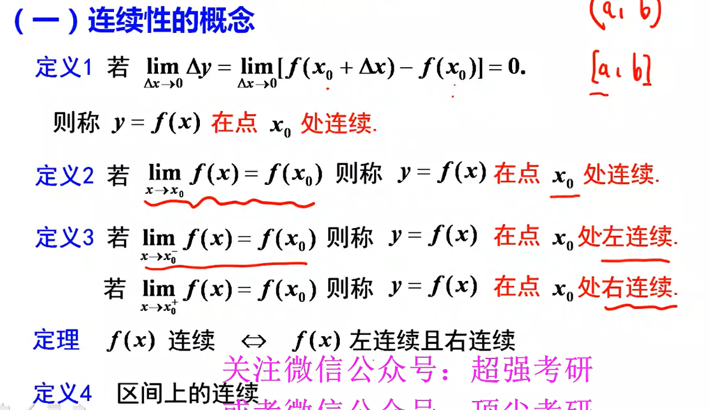
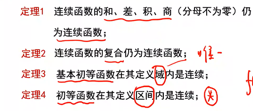
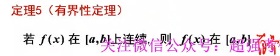

# 第三节 函数的连续性

---

## （一）连续性的概念

> 

## （二）间断点及其分类

1.间断点的定义

> 

2.间断点的分类

> 

什么叫做可去间断点：

> 给定一个函数f (x)，如果x₀是函数f (x)的间断点，并且f (x)在x₀处的左极限和右极限均存在的点称为第一类间断点。 **若f (x)在x₀处得到左、右极限均存在且相等的间断点**，称为可去间断点。

## （三）连续性的运算与性质

> 

## （四）闭区间上连续函数的性质

> 
>
> 

